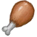

# 蜘蛛兰叶  
> 可以捣碎煮制成抗生素汤剂。  
  
<table class="table table-bordered" data-toggle="table"  data-show-header="false"><thead style="display:none"><tr ><th  style="width:50%;text-align:left;vertical-align:top;"  >title</th><th  style="width:50%;text-align:left;vertical-align:top;"  ></th></tr></thead><tr ><td  style="width:50%;text-align:left;vertical-align:top;"  >**重量：**75  **标签：**	[“喂食（草食动物）”](tag_FeedHerb.md), [“弱效食料”](tag_FeedWeak.md), [“可烹饪的”](tag_Cookable.md), [“低纤维”](tag_FibersPoor.md)</td><td  style="width:50%;text-align:left;vertical-align:top;"  >

<a href="SpiderLilyLeaves.md" style="color:black">蜘蛛兰叶</a>

这些花的叶子可以捣碎后加入到一碗开水中，来制成抗生素茶，用来治疗细菌和寄生虫感染。</td></tr></tbody></table>  
  
## 获取来源  

采集

[蜘蛛兰](SpiderLily.md)

  
  
## 动作  

<table><tr><td rowspan="2" style="width:200px;text-align:center;font-size:1.3em;font-weight:bold">

食用

15分

</td><td>[“食用蔬菜类动作(组)”](VegetarianAction.md), [“进食动作(组)”](EatingAction.md)</td></tr><tr><td><b>自身：</b>→消失</td></tr><tr><td colspan="2"><b>状态变化：</b>[

[饱食](Satiation.md)](Satiation.md)<b>+10</b>, [

[胃](Stomach.md)](Stomach.md)<b>+2</b>, [

[水分](Hydration.md)](Hydration.md)<b>+4</b>, [

[情绪](Morale.md)](Morale.md)<b>-10</b>, [

[蔬菜<nobr>厌倦度</nobr>](SaturationVegetables.md)](SaturationVegetables.md)<b>+30</b>, [

[腹泻](Diarrhoea.md)](Diarrhoea.md)<b>+150</b>, [

[细菌性发烧](BacteriaFever.md)](BacteriaFever.md)<b>-50</b>, [

[污垢](Filth.md)](Filth.md)<b>+1</b></td></tr></table>
  
  
  
## 可拖入  

<table style="margin-bottom:0px;"><tr><td style="width:40%;text-align:left; background-color:#FEFEFE"><b>拖入：</b>[“锤”](tag_Hammer.md)</td><td style="width:40%;font-size:1em;font-weight:bold;background-color:#FEFEFE">捣碎叶子 (15分) [“手部动作(组)”](HandAction.md)</td></tr><tr><td colspan="2"><b>需求：</b>[

[光亮](Light.md)](Light.md): <b>10-100</b></td></tr><tr style="background-color:#FFFFFF"><td style=""><b>使用物：</b></td><td style=""><b>自身：</b>→ [

[捣碎的蜘蛛兰](SpiderLilyGround.md)](SpiderLilyGround.md)</td></tr><tr><td colspan="2"><b>状态变化：</b>[

[药草学(技能)](Skill_Herbology.md)](Skill_Herbology.md)<b>+0.5</b>, [

[体重](Weight.md)](Weight.md)<b>-1</b>, [

[污垢](Filth.md)](Filth.md)<b>+4</b>, [

[手掌损伤](HandDamage.md)](HandDamage.md)<b>+20</b></td></tr></table>
  
  
## 可拖至  

[未栽种的农田(空)](CropPlotEmpty.md)

[羊食槽](GoatFeeder.md)

[羊食槽(空)](GoatFeederEmpty.md)

[母山羊](GoatEnclosureFemale.md)

[小羊](GoatEnclosureKid.md)

[泌乳期山羊](GoatEnclosureLactating.md)

[公山羊](GoatEnclosureMale.md)

[母山羊](GoatTiedFemale.md)

[泌乳期山羊](GoatTiedFemaleLactating.md)

[小羊](GoatTiedKid.md)

[公山羊](GoatTiedMale.md)

  
  
## 可用于转化  
<table class="table table-bordered" data-toggle="table"  ><thead style=""><tr ><th  style="text-align:left;vertical-align:top;"  >转化为</th><th  style="text-align:left;vertical-align:top;"  >容器</th></tr></thead><tr ><td  style="text-align:left;vertical-align:top;"  >[

[干燥的蜘蛛兰叶](SpiderLilyLeavesDried.md)](SpiderLilyLeavesDried.md)</td><td  style="text-align:left;vertical-align:top;"  >[

[晾晒架](DryingRack.md)](DryingRack.md)</td></tr></tbody></table>  
  
## 属性   

<table style="margin-bottom:0px;"><tr><td style="width:30%;text-align:left; background-color:#FEFEFE;font-size:1.3em;font-weight:bold;">耐久</td><td style="font-size:1em;background-color:#FEFEFE">初始：672 每15分钟-1 , 最多需要：7天</td></tr><tr style="background-color:#FFFFFF"><td colspan=2>** 到达0时： ** 自身: →消失</td></tr></table>
  

<table style="margin-bottom:0px;"><tr><td style="width:30%;text-align:left; background-color:#FEFEFE;font-size:1.3em;font-weight:bold;">进度</td><td style="font-size:1em;background-color:#FEFEFE">初始：0 , 最大：336 -</td></tr><tr style="background-color:#FFFFFF"><td colspan=2>** 到达上限时： ** 自身: → [

[干燥的蜘蛛兰叶](SpiderLilyLeavesDried.md)](SpiderLilyLeavesDried.md)</td></tr></table>
  
## 被动效果  
<table class="table table-bordered" data-toggle="table"  ><thead style=""><tr ><th  style="text-align:left;vertical-align:top;"  >名称</th><th  style="text-align:left;vertical-align:top;"  >条件</th><th  style="text-align:left;vertical-align:top;"  >变化(每15分钟)</th><th  style="text-align:left;vertical-align:top;"  data-sortable="true"  >玩家状态</th></tr></thead><tr ><td  style="text-align:left;vertical-align:top;"  >Drying</td><td  style="text-align:left;vertical-align:top;"  >** 需要存在卡牌：** [“干燥环境”](tag_EnvDry.md) ** 需要状态：** [

[降水值](RainValue.md)](RainValue.md): <b>0-0</b></td><td  style="text-align:left;vertical-align:top;"  >进度+1(0.29%)</td><td  style="text-align:left;vertical-align:top;"  ></td></tr></tbody></table>  
  

