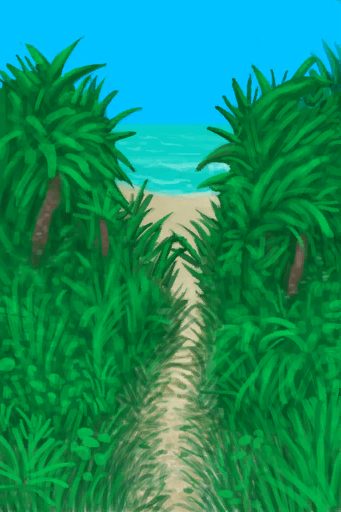
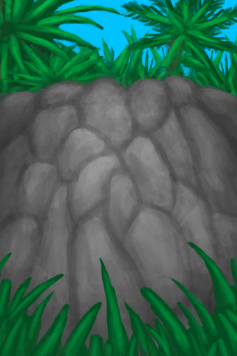
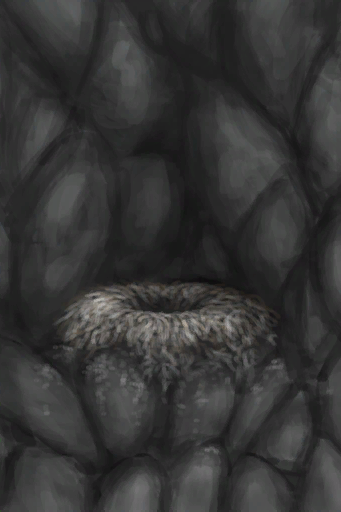

# 耐力  
> 当你干体力活儿时，你的耐力会下降，这会提升<b>卡路里消耗、食欲和体温</b>。 因此，如果你的<b>体重或口渴度</b>较低，请不要过度操劳。  要尽量避免耐力耗尽，否则你会<b>累晕</b>的。  
  

<b>基础值: </b> 32 
  

<b>变化范围: </b> 0 ~ 32 
  

<b>基础变化率: </b> +2 / 每15分钟 
  
## 阶段  

<table><tr style="height:2em;"><td style="background-color:#F0F0F0;text-align:center;width:180px;font-size:1.4em;font-weight:bold;vertical-align:middle;">
0

0%
</td><td colspan=2 style="font-size:1.1em;vertical-align:middle;background-color:#F9F9F9;">
<b>

昏厥</b>:&nbsp;&nbsp;Zzz……

</td></tr><tr><td colspan=2><b>影响：</b>[

[体重](Weight.md)](Weight.md)加成-4, [

[食欲](Appetite.md)](Appetite.md)+100</td></tr><tr><td colspan=2></td></tr><tr style="height:2em;"><td style="background-color:#F0F0F0;text-align:center;width:180px;font-size:1.4em;font-weight:bold;vertical-align:middle;">
1 ～ 15

3% ～ 46%
</td><td colspan=2 style="font-size:1.1em;vertical-align:middle;background-color:#F9F9F9;">
<b>

筋疲力尽</b>:&nbsp;&nbsp;太累了，我要休息一下。

</td></tr><tr><td colspan=2><b>影响：</b>[

[体重](Weight.md)](Weight.md)加成-4, [

[食欲](Appetite.md)](Appetite.md)+100, [

[体感温度](TemperaturePerceived.md)](TemperaturePerceived.md)+10</td></tr><tr><td colspan=2></td></tr><tr style="height:2em;"><td style="background-color:#F0F0F0;text-align:center;width:180px;font-size:1.4em;font-weight:bold;vertical-align:middle;">
16 ～ 25

50% ～ 78%
</td><td colspan=2 style="font-size:1.1em;vertical-align:middle;background-color:#F9F9F9;">
<b>

疲惫</b>:&nbsp;&nbsp;大量体力活动让我有点累了。

</td></tr><tr><td colspan=2><b>影响：</b>[

[体重](Weight.md)](Weight.md)加成-2, [

[食欲](Appetite.md)](Appetite.md)+75, [

[体感温度](TemperaturePerceived.md)](TemperaturePerceived.md)+5</td></tr><tr><td colspan=2></td></tr><tr style="height:2em;"><td style="background-color:#F0F0F0;text-align:center;width:180px;font-size:1.4em;font-weight:bold;vertical-align:middle;">
26 ～ 31

81% ～ 96%
</td><td colspan=2 style="font-size:1.1em;vertical-align:middle;background-color:#F9F9F9;">
<b>活跃</b>

</td></tr><tr><td colspan=2><b>影响：</b>[

[体重](Weight.md)](Weight.md)加成-1, [

[食欲](Appetite.md)](Appetite.md)+50, [

[体感温度](TemperaturePerceived.md)](TemperaturePerceived.md)+2</td></tr><tr><td colspan=2></td></tr><tr style="height:2em;"><td style="background-color:#F0F0F0;text-align:center;width:180px;font-size:1.4em;font-weight:bold;vertical-align:middle;">
32

100%
</td><td colspan=2 style="font-size:1.1em;vertical-align:middle;background-color:#F9F9F9;">
<b>休息中</b>

</td></tr><tr><td colspan=2></td></tr></table>
  
## 相关卡牌  
[肺部伤害](LungDamage.md)  |  [发烧](Fever.md)  |  [疟疾寄生虫](ParasiteMalaria.md)  
## 可被以下操作改变  
<table class="table table-bordered" data-toggle="table"  ><thead style=""><tr ><th  style="text-align:left;vertical-align:top;"  >来源</th><th  style="text-align:left;vertical-align:top;"  >操作</th><th  style="text-align:left;vertical-align:top;"  >值</th></tr></thead><tr ><td  style="text-align:left;vertical-align:top;"  >[

[你昏过去了(事件)](Event_FaintDizzy.md)](Event_FaintDizzy.md)</td><td  style="text-align:left;vertical-align:top;"  >继续</td><td  style="text-align:left;vertical-align:top;"  >100</td></tr><tr ><td  style="text-align:left;vertical-align:top;"  >[

[你昏过去了(事件)](Event_FaintExhaustion.md)](Event_FaintExhaustion.md)</td><td  style="text-align:left;vertical-align:top;"  >继续</td><td  style="text-align:left;vertical-align:top;"  >100</td></tr><tr ><td  style="text-align:left;vertical-align:top;"  >[

[椅子](ChairPlaced.md)](ChairPlaced.md)</td><td  style="text-align:left;vertical-align:top;"  >休息1小时</td><td  style="text-align:left;vertical-align:top;"  >40</td></tr><tr ><td  style="text-align:left;vertical-align:top;"  >[

[座椅](SeatAttached.md)](SeatAttached.md)</td><td  style="text-align:left;vertical-align:top;"  >休息1小时</td><td  style="text-align:left;vertical-align:top;"  >40</td></tr><tr ><td  style="text-align:left;vertical-align:top;"  >[

[座椅](SeatPlaced.md)](SeatPlaced.md)</td><td  style="text-align:left;vertical-align:top;"  >休息1小时</td><td  style="text-align:left;vertical-align:top;"  >40</td></tr><tr ><td  style="text-align:left;vertical-align:top;"  >[

[木床](BedWooden.md)](BedWooden.md)</td><td  style="text-align:left;vertical-align:top;"  >睡觉</td><td  style="text-align:left;vertical-align:top;"  >30</td></tr><tr ><td  style="text-align:left;vertical-align:top;"  >[

[韦斯顿(Special2e)(事件)](Event_WestonSpecial2e.md)](Event_WestonSpecial2e.md)</td><td  style="text-align:left;vertical-align:top;"  >Thanks Wes.</td><td  style="text-align:left;vertical-align:top;"  >30</td></tr><tr ><td  style="text-align:left;vertical-align:top;"  >[

[椅子](ChairPlaced.md)](ChairPlaced.md)</td><td  style="text-align:left;vertical-align:top;"  >暂候15分钟</td><td  style="text-align:left;vertical-align:top;"  >15</td></tr><tr ><td  style="text-align:left;vertical-align:top;"  >[

[座椅](SeatAttached.md)](SeatAttached.md)</td><td  style="text-align:left;vertical-align:top;"  >暂候15分钟</td><td  style="text-align:left;vertical-align:top;"  >15</td></tr><tr ><td  style="text-align:left;vertical-align:top;"  >[

[座椅](SeatPlaced.md)](SeatPlaced.md)</td><td  style="text-align:left;vertical-align:top;"  >暂候15分钟</td><td  style="text-align:left;vertical-align:top;"  >15</td></tr><tr ><td  style="text-align:left;vertical-align:top;"  >[

[盛开的外星植物](AlienGrowth.md)](AlienGrowth.md)</td><td  style="text-align:left;vertical-align:top;"  >砍倒 ** 拖入：**[“斧”](tag_Axe.md)</td><td  style="text-align:left;vertical-align:top;"  >-1</td></tr><tr ><td  style="text-align:left;vertical-align:top;"  >[

[外星植物](AlienGrowthCleared.md)](AlienGrowthCleared.md)</td><td  style="text-align:left;vertical-align:top;"  >砍倒 ** 拖入：**[“斧”](tag_Axe.md)</td><td  style="text-align:left;vertical-align:top;"  >-1</td></tr><tr ><td  style="text-align:left;vertical-align:top;"  >[

[金鸡纳树](CinchonaTree.md)](CinchonaTree.md)</td><td  style="text-align:left;vertical-align:top;"  >砍树 ** 拖入：**[“斧”](tag_Axe.md)</td><td  style="text-align:left;vertical-align:top;"  >-1</td></tr><tr ><td  style="text-align:left;vertical-align:top;"  >[

[金鸡纳树](CinchonaTree.md)](CinchonaTree.md)</td><td  style="text-align:left;vertical-align:top;"  >采集树皮 ** 拖入：**[“切割工具”](tag_Cutter.md)</td><td  style="text-align:left;vertical-align:top;"  >-1</td></tr><tr ><td  style="text-align:left;vertical-align:top;"  >[

[剥净的金鸡纳树](CinchonaTreeCleared.md)](CinchonaTreeCleared.md)</td><td  style="text-align:left;vertical-align:top;"  >砍树 ** 拖入：**[“斧”](tag_Axe.md)</td><td  style="text-align:left;vertical-align:top;"  >-1</td></tr><tr ><td  style="text-align:left;vertical-align:top;"  >[

[小芒果树](MangoTreeYoung.md)](MangoTreeYoung.md)</td><td  style="text-align:left;vertical-align:top;"  >砍树 ** 拖入：**[“斧”](tag_Axe.md)</td><td  style="text-align:left;vertical-align:top;"  >-1</td></tr><tr ><td  style="text-align:left;vertical-align:top;"  >[

[环礁](Atoll.md)](Atoll.md)</td><td  style="text-align:left;vertical-align:top;"  >探索</td><td  style="text-align:left;vertical-align:top;"  >-1</td></tr><tr ><td  style="text-align:left;vertical-align:top;"  >[

[隐秘港湾(沙滩)](Cove.md)](Cove.md)</td><td  style="text-align:left;vertical-align:top;"  >探索</td><td  style="text-align:left;vertical-align:top;"  >-1</td></tr><tr ><td  style="text-align:left;vertical-align:top;"  >[

[丛林边缘](Outskirts.md)](Outskirts.md)</td><td  style="text-align:left;vertical-align:top;"  >探索</td><td  style="text-align:left;vertical-align:top;"  >-1</td></tr><tr ><td  style="text-align:left;vertical-align:top;"  >[

[幼年椰子树](PalmTreeYoung.md)](PalmTreeYoung.md)</td><td  style="text-align:left;vertical-align:top;"  >砍树 ** 拖入：**[“斧”](tag_Axe.md)</td><td  style="text-align:left;vertical-align:top;"  >-1</td></tr><tr ><td  style="text-align:left;vertical-align:top;"  >[

[小棕榈树](SmallPalm.md)](SmallPalm.md)</td><td  style="text-align:left;vertical-align:top;"  >砍树 ** 拖入：**[“斧”](tag_Axe.md)</td><td  style="text-align:left;vertical-align:top;"  >-1</td></tr><tr ><td  style="text-align:left;vertical-align:top;"  >[

[小树](SmallTree.md)](SmallTree.md)</td><td  style="text-align:left;vertical-align:top;"  >砍树 ** 拖入：**[“斧”](tag_Axe.md)</td><td  style="text-align:left;vertical-align:top;"  >-1</td></tr><tr ><td  style="text-align:left;vertical-align:top;"  >[

[小杏仁树](TropicalAlmondTreeYoung.md)](TropicalAlmondTreeYoung.md)</td><td  style="text-align:left;vertical-align:top;"  >砍树 ** 拖入：**[“斧”](tag_Axe.md)</td><td  style="text-align:left;vertical-align:top;"  >-1</td></tr><tr ><td  style="text-align:left;vertical-align:top;"  >[

[野枣丛](WildJujube.md)](WildJujube.md)</td><td  style="text-align:left;vertical-align:top;"  >砍倒 ** 拖入：**[“斧”](tag_Axe.md)</td><td  style="text-align:left;vertical-align:top;"  >-1</td></tr><tr ><td  style="text-align:left;vertical-align:top;"  >[

[摘光的野枣从](WildJujubeCleared.md)](WildJujubeCleared.md)</td><td  style="text-align:left;vertical-align:top;"  >砍倒 ** 拖入：**[“斧”](tag_Axe.md)</td><td  style="text-align:left;vertical-align:top;"  >-1</td></tr><tr ><td  style="text-align:left;vertical-align:top;"  >[

[青椰子](CoconutHusked.md)](CoconutHusked.md)</td><td  style="text-align:left;vertical-align:top;"  >剥 ** 拖入：**[“切割工具”](tag_Cutter.md) , [“一级矛”](tag_Spear.md)</td><td  style="text-align:left;vertical-align:top;"  >-2</td></tr><tr ><td  style="text-align:left;vertical-align:top;"  >[

[青椰子](CoconutHusked.md)](CoconutHusked.md)</td><td  style="text-align:left;vertical-align:top;"  >剥 ** 拖入：**[“斧”](tag_Axe.md)</td><td  style="text-align:left;vertical-align:top;"  >-2</td></tr><tr ><td  style="text-align:left;vertical-align:top;"  >[

[稻秆](RiceStalks.md)](RiceStalks.md)</td><td  style="text-align:left;vertical-align:top;"  >打谷</td><td  style="text-align:left;vertical-align:top;"  >-2</td></tr><tr ><td  style="text-align:left;vertical-align:top;"  >[

[海湾](Bay.md)](Bay.md)</td><td  style="text-align:left;vertical-align:top;"  >随便逛逛</td><td  style="text-align:left;vertical-align:top;"  >-2</td></tr><tr ><td  style="text-align:left;vertical-align:top;"  >[

[沙滩](Beach.md)](Beach.md)</td><td  style="text-align:left;vertical-align:top;"  >随便逛逛</td><td  style="text-align:left;vertical-align:top;"  >-2</td></tr><tr ><td  style="text-align:left;vertical-align:top;"  >[

[前往丛林边缘(沙滩)](Path_BeachToOutskirts.md)](Path_BeachToOutskirts.md)</td><td  style="text-align:left;vertical-align:top;"  >前往</td><td  style="text-align:left;vertical-align:top;"  >-2</td></tr><tr ><td  style="text-align:left;vertical-align:top;"  >[

[前往岩滩(沙滩)](Path_BeachToRocks.md)](Path_BeachToRocks.md)</td><td  style="text-align:left;vertical-align:top;"  >前往</td><td  style="text-align:left;vertical-align:top;"  >-2</td></tr><tr ><td  style="text-align:left;vertical-align:top;"  >[

[鼓(事件)](Event_DrumMenu.md)](Event_DrumMenu.md)</td><td  style="text-align:left;vertical-align:top;"  >跃动的节奏</td><td  style="text-align:left;vertical-align:top;"  >-2.5 / 每15分钟</td></tr><tr ><td  style="text-align:left;vertical-align:top;"  >[

[鼓](Drum.md)](Drum.md)</td><td  style="text-align:left;vertical-align:top;"  >跃动的节奏</td><td  style="text-align:left;vertical-align:top;"  >-2.5 / 每15分钟</td></tr><tr ><td  style="text-align:left;vertical-align:top;"  >[

[鼓](Drum.md)](Drum.md)</td><td  style="text-align:left;vertical-align:top;"  >入迷击鼓</td><td  style="text-align:left;vertical-align:top;"  >-2.5 / 每15分钟</td></tr><tr ><td  style="text-align:left;vertical-align:top;"  >[

[蜥蜴皮手鼓](LizardDrum.md)](LizardDrum.md)</td><td  style="text-align:left;vertical-align:top;"  >跃动的节奏</td><td  style="text-align:left;vertical-align:top;"  >-2.5 / 每15分钟</td></tr><tr ><td  style="text-align:left;vertical-align:top;"  >[

[蜥蜴皮手鼓](LizardDrum.md)](LizardDrum.md)</td><td  style="text-align:left;vertical-align:top;"  >入迷击鼓</td><td  style="text-align:left;vertical-align:top;"  >-2.5 / 每15分钟</td></tr><tr ><td  style="text-align:left;vertical-align:top;"  >[

[鼓(事件)](Event_DrumMenu.md)](Event_DrumMenu.md)</td><td  style="text-align:left;vertical-align:top;"  >练习</td><td  style="text-align:left;vertical-align:top;"  >-3 / 每15分钟</td></tr><tr ><td  style="text-align:left;vertical-align:top;"  >[

[鼓](Drum.md)](Drum.md)</td><td  style="text-align:left;vertical-align:top;"  >练习</td><td  style="text-align:left;vertical-align:top;"  >-3 / 每15分钟</td></tr><tr ><td  style="text-align:left;vertical-align:top;"  >[

[蜥蜴皮手鼓](LizardDrum.md)](LizardDrum.md)</td><td  style="text-align:left;vertical-align:top;"  >练习</td><td  style="text-align:left;vertical-align:top;"  >-3 / 每15分钟</td></tr><tr ><td  style="text-align:left;vertical-align:top;"  >[

[椰子树](PalmTreeNew.md)](PalmTreeNew.md)</td><td  style="text-align:left;vertical-align:top;"  >扔石头 ** 拖入：**[石头](Stone.md)</td><td  style="text-align:left;vertical-align:top;"  >-3</td></tr><tr ><td  style="text-align:left;vertical-align:top;"  >[

[劈开的西米树干](SagoSplitLog.md)](SagoSplitLog.md)</td><td  style="text-align:left;vertical-align:top;"  >刮取树芯 ** 拖入：**[“切割工具”](tag_Cutter.md) , [“斧”](tag_Axe.md)</td><td  style="text-align:left;vertical-align:top;"  >-3</td></tr><tr ><td  style="text-align:left;vertical-align:top;"  >[

[青椰子](CoconutHusked.md)](CoconutHusked.md)</td><td  style="text-align:left;vertical-align:top;"  >剥 ** 拖入：**[“锤”](tag_Hammer.md)</td><td  style="text-align:left;vertical-align:top;"  >-4</td></tr><tr ><td  style="text-align:left;vertical-align:top;"  >[

[水椰子](NipaFruit.md)](NipaFruit.md)</td><td  style="text-align:left;vertical-align:top;"  >取得种子 ** 拖入：**[“斧”](tag_Axe.md)</td><td  style="text-align:left;vertical-align:top;"  >-4</td></tr><tr ><td  style="text-align:left;vertical-align:top;"  >[

[鱼镖](HarpoonBone.md)](HarpoonBone.md)</td><td  style="text-align:left;vertical-align:top;"  >训练</td><td  style="text-align:left;vertical-align:top;"  >-4</td></tr><tr ><td  style="text-align:left;vertical-align:top;"  >[

[废墟(泥屋)](Debris.md)](Debris.md)</td><td  style="text-align:left;vertical-align:top;"  >清理 ** 拖入：**[“铲子”](tag_Shovel.md)</td><td  style="text-align:left;vertical-align:top;"  >-4</td></tr><tr ><td  style="text-align:left;vertical-align:top;"  >[

[酸湖(火山)](AcidLake.md)](AcidLake.md)</td><td  style="text-align:left;vertical-align:top;"  >探索</td><td  style="text-align:left;vertical-align:top;"  >-4</td></tr><tr ><td  style="text-align:left;vertical-align:top;"  >[

[鸟岩岛](BirdRock.md)](BirdRock.md)</td><td  style="text-align:left;vertical-align:top;"  >探索</td><td  style="text-align:left;vertical-align:top;"  >-4</td></tr><tr ><td  style="text-align:left;vertical-align:top;"  >[

[丛林深处](DeepJungle.md)](DeepJungle.md)</td><td  style="text-align:left;vertical-align:top;"  >探索</td><td  style="text-align:left;vertical-align:top;"  >-4</td></tr><tr ><td  style="text-align:left;vertical-align:top;"  >[

[丛林深处](DeepJungle.md)](DeepJungle.md)</td><td  style="text-align:left;vertical-align:top;"  >砍伐木材 ** 拖入：**[“高级斧”](tag_AxeAdv.md)</td><td  style="text-align:left;vertical-align:top;"  >-4</td></tr><tr ><td  style="text-align:left;vertical-align:top;"  >[

[丛林深处](DeepJungle.md)](DeepJungle.md)</td><td  style="text-align:left;vertical-align:top;"  >砍伐木材 ** 拖入：**[“斧”](tag_Axe.md)</td><td  style="text-align:left;vertical-align:top;"  >-4</td></tr><tr ><td  style="text-align:left;vertical-align:top;"  >[

[荒芜沙滩](DesolateBeach.md)](DesolateBeach.md)</td><td  style="text-align:left;vertical-align:top;"  >探索</td><td  style="text-align:left;vertical-align:top;"  >-4</td></tr><tr ><td  style="text-align:left;vertical-align:top;"  >[

[东部草原](GrasslandsE.md)](GrasslandsE.md)</td><td  style="text-align:left;vertical-align:top;"  >探索</td><td  style="text-align:left;vertical-align:top;"  >-4</td></tr><tr ><td  style="text-align:left;vertical-align:top;"  >[

[东部草原](GrasslandsE.md)](GrasslandsE.md)</td><td  style="text-align:left;vertical-align:top;"  >挖土 ** 拖入：**[“铲子”](tag_Shovel.md)</td><td  style="text-align:left;vertical-align:top;"  >-4</td></tr><tr ><td  style="text-align:left;vertical-align:top;"  >[

[西部草原](GrasslandsW.md)](GrasslandsW.md)</td><td  style="text-align:left;vertical-align:top;"  >探索</td><td  style="text-align:left;vertical-align:top;"  >-4</td></tr><tr ><td  style="text-align:left;vertical-align:top;"  >[

[西部草原](GrasslandsW.md)](GrasslandsW.md)</td><td  style="text-align:left;vertical-align:top;"  >挖土 ** 拖入：**[“铲子”](tag_Shovel.md)</td><td  style="text-align:left;vertical-align:top;"  >-4</td></tr><tr ><td  style="text-align:left;vertical-align:top;"  >[

[东部高地](HighlandsEastern.md)](HighlandsEastern.md)</td><td  style="text-align:left;vertical-align:top;"  >探索</td><td  style="text-align:left;vertical-align:top;"  >-4</td></tr><tr ><td  style="text-align:left;vertical-align:top;"  >[

[东部高地](HighlandsEastern.md)](HighlandsEastern.md)</td><td  style="text-align:left;vertical-align:top;"  >砍伐木材 ** 拖入：**[“高级斧”](tag_AxeAdv.md)</td><td  style="text-align:left;vertical-align:top;"  >-4</td></tr><tr ><td  style="text-align:left;vertical-align:top;"  >[

[东部高地](HighlandsEastern.md)](HighlandsEastern.md)</td><td  style="text-align:left;vertical-align:top;"  >砍伐木材 ** 拖入：**[“斧”](tag_Axe.md)</td><td  style="text-align:left;vertical-align:top;"  >-4</td></tr><tr ><td  style="text-align:left;vertical-align:top;"  >[

[西部高地](HighlandsWestern.md)](HighlandsWestern.md)</td><td  style="text-align:left;vertical-align:top;"  >探索</td><td  style="text-align:left;vertical-align:top;"  >-4</td></tr><tr ><td  style="text-align:left;vertical-align:top;"  >[

[西部高地](HighlandsWestern.md)](HighlandsWestern.md)</td><td  style="text-align:left;vertical-align:top;"  >砍伐木材 ** 拖入：**[“高级斧”](tag_AxeAdv.md)</td><td  style="text-align:left;vertical-align:top;"  >-4</td></tr><tr ><td  style="text-align:left;vertical-align:top;"  >[

[西部高地](HighlandsWestern.md)](HighlandsWestern.md)</td><td  style="text-align:left;vertical-align:top;"  >砍伐木材 ** 拖入：**[“斧”](tag_Axe.md)</td><td  style="text-align:left;vertical-align:top;"  >-4</td></tr><tr ><td  style="text-align:left;vertical-align:top;"  >[

[丛林](Jungle.md)](Jungle.md)</td><td  style="text-align:left;vertical-align:top;"  >探索</td><td  style="text-align:left;vertical-align:top;"  >-4</td></tr><tr ><td  style="text-align:left;vertical-align:top;"  >[

[丛林](Jungle.md)](Jungle.md)</td><td  style="text-align:left;vertical-align:top;"  >砍伐木材 ** 拖入：**[“高级斧”](tag_AxeAdv.md)</td><td  style="text-align:left;vertical-align:top;"  >-4</td></tr><tr ><td  style="text-align:left;vertical-align:top;"  >[

[丛林](Jungle.md)](Jungle.md)</td><td  style="text-align:left;vertical-align:top;"  >砍伐木材 ** 拖入：**[“斧”](tag_Axe.md)</td><td  style="text-align:left;vertical-align:top;"  >-4</td></tr><tr ><td  style="text-align:left;vertical-align:top;"  >[

[丛林高地](JungleHighlands.md)](JungleHighlands.md)</td><td  style="text-align:left;vertical-align:top;"  >探索</td><td  style="text-align:left;vertical-align:top;"  >-4</td></tr><tr ><td  style="text-align:left;vertical-align:top;"  >[

[丛林高地](JungleHighlands.md)](JungleHighlands.md)</td><td  style="text-align:left;vertical-align:top;"  >砍伐木材 ** 拖入：**[“高级斧”](tag_AxeAdv.md)</td><td  style="text-align:left;vertical-align:top;"  >-4</td></tr><tr ><td  style="text-align:left;vertical-align:top;"  >[

[丛林高地](JungleHighlands.md)](JungleHighlands.md)</td><td  style="text-align:left;vertical-align:top;"  >砍伐木材 ** 拖入：**[“斧”](tag_Axe.md)</td><td  style="text-align:left;vertical-align:top;"  >-4</td></tr><tr ><td  style="text-align:left;vertical-align:top;"  >[

[红树林](Mangroves.md)](Mangroves.md)</td><td  style="text-align:left;vertical-align:top;"  >探索</td><td  style="text-align:left;vertical-align:top;"  >-4</td></tr><tr ><td  style="text-align:left;vertical-align:top;"  >[

[红树林](Mangroves.md)](Mangroves.md)</td><td  style="text-align:left;vertical-align:top;"  >砍伐木材 ** 拖入：**[“高级斧”](tag_AxeAdv.md)</td><td  style="text-align:left;vertical-align:top;"  >-4</td></tr><tr ><td  style="text-align:left;vertical-align:top;"  >[

[红树林](Mangroves.md)](Mangroves.md)</td><td  style="text-align:left;vertical-align:top;"  >砍伐木材 ** 拖入：**[“斧”](tag_Axe.md)</td><td  style="text-align:left;vertical-align:top;"  >-4</td></tr><tr ><td  style="text-align:left;vertical-align:top;"  >[

[丛林边缘](Outskirts.md)](Outskirts.md)</td><td  style="text-align:left;vertical-align:top;"  >砍伐木材 ** 拖入：**[“高级斧”](tag_AxeAdv.md)</td><td  style="text-align:left;vertical-align:top;"  >-4</td></tr><tr ><td  style="text-align:left;vertical-align:top;"  >[

[丛林边缘](Outskirts.md)](Outskirts.md)</td><td  style="text-align:left;vertical-align:top;"  >砍伐木材 ** 拖入：**[“斧”](tag_Axe.md)</td><td  style="text-align:left;vertical-align:top;"  >-4</td></tr><tr ><td  style="text-align:left;vertical-align:top;"  >[

[岩滩](Rocks.md)](Rocks.md)</td><td  style="text-align:left;vertical-align:top;"  >探索</td><td  style="text-align:left;vertical-align:top;"  >-4</td></tr><tr ><td  style="text-align:left;vertical-align:top;"  >[

[神秘谷](SecretValley.md)](SecretValley.md)</td><td  style="text-align:left;vertical-align:top;"  >探索</td><td  style="text-align:left;vertical-align:top;"  >-4</td></tr><tr ><td  style="text-align:left;vertical-align:top;"  >[

[神秘谷](SecretValley.md)](SecretValley.md)</td><td  style="text-align:left;vertical-align:top;"  >挖土 ** 拖入：**[“铲子”](tag_Shovel.md)</td><td  style="text-align:left;vertical-align:top;"  >-4</td></tr><tr ><td  style="text-align:left;vertical-align:top;"  >[

[沉船(鸟岩岛)](Shipwreck.md)](Shipwreck.md)</td><td  style="text-align:left;vertical-align:top;"  >探索沉船</td><td  style="text-align:left;vertical-align:top;"  >-4</td></tr><tr ><td  style="text-align:left;vertical-align:top;"  >[

[火山](Volcano.md)](Volcano.md)</td><td  style="text-align:left;vertical-align:top;"  >探索</td><td  style="text-align:left;vertical-align:top;"  >-4</td></tr><tr ><td  style="text-align:left;vertical-align:top;"  >[

[湿地丛林(湿地)](Wetlands.md)](Wetlands.md)</td><td  style="text-align:left;vertical-align:top;"  >探索</td><td  style="text-align:left;vertical-align:top;"  >-4</td></tr><tr ><td  style="text-align:left;vertical-align:top;"  >[

[湿地丛林(湿地)](Wetlands.md)](Wetlands.md)</td><td  style="text-align:left;vertical-align:top;"  >砍伐木材 ** 拖入：**[“高级斧”](tag_AxeAdv.md)</td><td  style="text-align:left;vertical-align:top;"  >-4</td></tr><tr ><td  style="text-align:left;vertical-align:top;"  >[

[湿地丛林(湿地)](Wetlands.md)](Wetlands.md)</td><td  style="text-align:left;vertical-align:top;"  >砍伐木材 ** 拖入：**[“斧”](tag_Axe.md)</td><td  style="text-align:left;vertical-align:top;"  >-4</td></tr><tr ><td  style="text-align:left;vertical-align:top;"  >[

[前往火山](Path_AcidLakeToVolcano.md)](Path_AcidLakeToVolcano.md)</td><td  style="text-align:left;vertical-align:top;"  >前往</td><td  style="text-align:left;vertical-align:top;"  >-4</td></tr><tr ><td  style="text-align:left;vertical-align:top;"  >[

[前往沙滩(海湾)](Path_BayToBeach.md)](Path_BayToBeach.md)</td><td  style="text-align:left;vertical-align:top;"  >前往</td><td  style="text-align:left;vertical-align:top;"  >-4</td></tr><tr ><td  style="text-align:left;vertical-align:top;"  >[

[前往丛林小径(海湾)](Path_BayToJungle.md)](Path_BayToJungle.md)</td><td  style="text-align:left;vertical-align:top;"  >前往</td><td  style="text-align:left;vertical-align:top;"  >-4</td></tr><tr ><td  style="text-align:left;vertical-align:top;"  >[

[前往红树林](Path_BayToMangroves.md)](Path_BayToMangroves.md)</td><td  style="text-align:left;vertical-align:top;"  >前往</td><td  style="text-align:left;vertical-align:top;"  >-4</td></tr><tr ><td  style="text-align:left;vertical-align:top;"  >[

[前往海湾](Path_BeachToBay.md)](Path_BeachToBay.md)</td><td  style="text-align:left;vertical-align:top;"  >前往</td><td  style="text-align:left;vertical-align:top;"  >-4</td></tr><tr ><td  style="text-align:left;vertical-align:top;"  >[

[前往丛林高地(丛林深处)](Path_DeepJungleToJungleHighlands.md)](Path_DeepJungleToJungleHighlands.md)</td><td  style="text-align:left;vertical-align:top;"  >前往</td><td  style="text-align:left;vertical-align:top;"  >-4</td></tr><tr ><td  style="text-align:left;vertical-align:top;"  >[

[前往神秘谷(丛林深处)](Path_DeepJungleToValley.md)](Path_DeepJungleToValley.md)</td><td  style="text-align:left;vertical-align:top;"  >前往</td><td  style="text-align:left;vertical-align:top;"  >-4</td></tr><tr ><td  style="text-align:left;vertical-align:top;"  >[

[前往湿地(丛林深处)](Path_DeepJungleToWetlands.md)](Path_DeepJungleToWetlands.md)</td><td  style="text-align:left;vertical-align:top;"  >前往</td><td  style="text-align:left;vertical-align:top;"  >-4</td></tr><tr ><td  style="text-align:left;vertical-align:top;"  >[

[前往东部草原(荒芜沙滩)](Path_DesolateBeachToGrasslandsE.md)](Path_DesolateBeachToGrasslandsE.md)</td><td  style="text-align:left;vertical-align:top;"  >前往</td><td  style="text-align:left;vertical-align:top;"  >-4</td></tr><tr ><td  style="text-align:left;vertical-align:top;"  >[

[前往红树林(荒芜沙滩)](Path_DesolateBeachToMangroves.md)](Path_DesolateBeachToMangroves.md)</td><td  style="text-align:left;vertical-align:top;"  >前往</td><td  style="text-align:left;vertical-align:top;"  >-4</td></tr><tr ><td  style="text-align:left;vertical-align:top;"  >[

[前往火山(荒芜沙滩)](Path_DesolateBeachToVolcano.md)](Path_DesolateBeachToVolcano.md)</td><td  style="text-align:left;vertical-align:top;"  >前往</td><td  style="text-align:left;vertical-align:top;"  >-4</td></tr><tr ><td  style="text-align:left;vertical-align:top;"  >[

[前往荒芜沙滩(东部草原)](Path_GrasslandsEToDesolateBeach.md)](Path_GrasslandsEToDesolateBeach.md)</td><td  style="text-align:left;vertical-align:top;"  >前往</td><td  style="text-align:left;vertical-align:top;"  >-4</td></tr><tr ><td  style="text-align:left;vertical-align:top;"  >[

[前往西部草原(东部草原)](Path_GrasslandsEToGrasslandsW.md)](Path_GrasslandsEToGrasslandsW.md)</td><td  style="text-align:left;vertical-align:top;"  >前往</td><td  style="text-align:left;vertical-align:top;"  >-4</td></tr><tr ><td  style="text-align:left;vertical-align:top;"  >[

[前往东部草原(西部草原)](Path_GrasslandsWToGrasslandsE.md)](Path_GrasslandsWToGrasslandsE.md)</td><td  style="text-align:left;vertical-align:top;"  >前往</td><td  style="text-align:left;vertical-align:top;"  >-4</td></tr><tr ><td  style="text-align:left;vertical-align:top;"  >[

[前往丛林小径](Path_GrasslandsWToJungle.md)](Path_GrasslandsWToJungle.md)</td><td  style="text-align:left;vertical-align:top;"  >前往</td><td  style="text-align:left;vertical-align:top;"  >-4</td></tr><tr ><td  style="text-align:left;vertical-align:top;"  >[

[前往红树林(西部草原)](Path_GrasslandsWToMangroves.md)](Path_GrasslandsWToMangroves.md)</td><td  style="text-align:left;vertical-align:top;"  >前往</td><td  style="text-align:left;vertical-align:top;"  >-4</td></tr><tr ><td  style="text-align:left;vertical-align:top;"  >[

[前往东部草原(东部高地)](Path_HighlandsEToGrasslandsE.md)](Path_HighlandsEToGrasslandsE.md)</td><td  style="text-align:left;vertical-align:top;"  >前往</td><td  style="text-align:left;vertical-align:top;"  >-4</td></tr><tr ><td  style="text-align:left;vertical-align:top;"  >[

[前往西部高地](Path_HighlandsEToHighlandsW.md)](Path_HighlandsEToHighlandsW.md)</td><td  style="text-align:left;vertical-align:top;"  >前往</td><td  style="text-align:left;vertical-align:top;"  >-4</td></tr><tr ><td  style="text-align:left;vertical-align:top;"  >[

[前往火山(东部高地)](Path_HighlandsEToVolcano.md)](Path_HighlandsEToVolcano.md)</td><td  style="text-align:left;vertical-align:top;"  >前往</td><td  style="text-align:left;vertical-align:top;"  >-4</td></tr><tr ><td  style="text-align:left;vertical-align:top;"  >[

[前往西部草原(西部高地)](Path_HighlandsWToGrasslandsW.md)](Path_HighlandsWToGrasslandsW.md)</td><td  style="text-align:left;vertical-align:top;"  >前往</td><td  style="text-align:left;vertical-align:top;"  >-4</td></tr><tr ><td  style="text-align:left;vertical-align:top;"  >[

[前往东部高地(西部高地)](Path_HighlandsWToHighlandsE.md)](Path_HighlandsWToHighlandsE.md)</td><td  style="text-align:left;vertical-align:top;"  >前往</td><td  style="text-align:left;vertical-align:top;"  >-4</td></tr><tr ><td  style="text-align:left;vertical-align:top;"  >[

[前往丛林高地(西部高地)](Path_HighlandsWToJungleHighlands.md)](Path_HighlandsWToJungleHighlands.md)</td><td  style="text-align:left;vertical-align:top;"  >前往</td><td  style="text-align:left;vertical-align:top;"  >-4</td></tr><tr ><td  style="text-align:left;vertical-align:top;"  >[

[前往丛林深处(丛林高地)](Path_JungleHighlandsToDeepJungle.md)](Path_JungleHighlandsToDeepJungle.md)</td><td  style="text-align:left;vertical-align:top;"  >前往</td><td  style="text-align:left;vertical-align:top;"  >-4</td></tr><tr ><td  style="text-align:left;vertical-align:top;"  >[

[前往西部高地(丛林高地)](Path_JungleHighlandsToHighlandsW.md)](Path_JungleHighlandsToHighlandsW.md)</td><td  style="text-align:left;vertical-align:top;"  >前往</td><td  style="text-align:left;vertical-align:top;"  >-4</td></tr><tr ><td  style="text-align:left;vertical-align:top;"  >[

[前往海湾(丛林)](Path_JungleToBay.md)](Path_JungleToBay.md)</td><td  style="text-align:left;vertical-align:top;"  >前往</td><td  style="text-align:left;vertical-align:top;"  >-4</td></tr><tr ><td  style="text-align:left;vertical-align:top;"  >[

[前往西部草原(丛林)](Path_JungleToGrasslandsW.md)](Path_JungleToGrasslandsW.md)</td><td  style="text-align:left;vertical-align:top;"  >前往</td><td  style="text-align:left;vertical-align:top;"  >-4</td></tr><tr ><td  style="text-align:left;vertical-align:top;"  >[

[前往丛林边缘(丛林)](Path_JungleToOutskirts.md)](Path_JungleToOutskirts.md)</td><td  style="text-align:left;vertical-align:top;"  >前往</td><td  style="text-align:left;vertical-align:top;"  >-4</td></tr><tr ><td  style="text-align:left;vertical-align:top;"  >[

[前往湿地(丛林)](Path_JungleToWetlands.md)](Path_JungleToWetlands.md)</td><td  style="text-align:left;vertical-align:top;"  >前往</td><td  style="text-align:left;vertical-align:top;"  >-4</td></tr><tr ><td  style="text-align:left;vertical-align:top;"  >[

[前往海湾](Path_MangrovesToBay.md)](Path_MangrovesToBay.md)</td><td  style="text-align:left;vertical-align:top;"  >前往</td><td  style="text-align:left;vertical-align:top;"  >-4</td></tr><tr ><td  style="text-align:left;vertical-align:top;"  >[

[前往荒芜沙滩](Path_MangrovesToDesolateBeach.md)](Path_MangrovesToDesolateBeach.md)</td><td  style="text-align:left;vertical-align:top;"  >前往</td><td  style="text-align:left;vertical-align:top;"  >-4</td></tr><tr ><td  style="text-align:left;vertical-align:top;"  >[

[前往沙滩(丛林边缘)](Path_OutskirtsToBeach.md)](Path_OutskirtsToBeach.md)</td><td  style="text-align:left;vertical-align:top;"  >前往</td><td  style="text-align:left;vertical-align:top;"  >-4</td></tr><tr ><td  style="text-align:left;vertical-align:top;"  >[

[前往丛林小径](Path_OutskirtsToJungle.md)](Path_OutskirtsToJungle.md)</td><td  style="text-align:left;vertical-align:top;"  >前往</td><td  style="text-align:left;vertical-align:top;"  >-4</td></tr><tr ><td  style="text-align:left;vertical-align:top;"  >[

[前往沙滩(岩滩)](Path_RocksToBeach.md)](Path_RocksToBeach.md)</td><td  style="text-align:left;vertical-align:top;"  >前往</td><td  style="text-align:left;vertical-align:top;"  >-4</td></tr><tr ><td  style="text-align:left;vertical-align:top;"  >[

[前往丛林深处(神秘谷)](Path_ValleyToDeepJungle.md)](Path_ValleyToDeepJungle.md)</td><td  style="text-align:left;vertical-align:top;"  >前往</td><td  style="text-align:left;vertical-align:top;"  >-4</td></tr><tr ><td  style="text-align:left;vertical-align:top;"  >[

[前往酸湖(火山)](Path_VolcanoToAcidLake.md)](Path_VolcanoToAcidLake.md)</td><td  style="text-align:left;vertical-align:top;"  >前往</td><td  style="text-align:left;vertical-align:top;"  >-4</td></tr><tr ><td  style="text-align:left;vertical-align:top;"  >[

[前往荒芜沙滩(火山)](Path_VolcanoToDesolateBeach.md)](Path_VolcanoToDesolateBeach.md)</td><td  style="text-align:left;vertical-align:top;"  >前往</td><td  style="text-align:left;vertical-align:top;"  >-4</td></tr><tr ><td  style="text-align:left;vertical-align:top;"  >[

[前往东部高地(火山)](Path_VolcanoToHighlandsE.md)](Path_VolcanoToHighlandsE.md)</td><td  style="text-align:left;vertical-align:top;"  >前往</td><td  style="text-align:left;vertical-align:top;"  >-4</td></tr><tr ><td  style="text-align:left;vertical-align:top;"  >[

[前往丛林深处(湿地)](Path_WetlandsToDeepJungle.md)](Path_WetlandsToDeepJungle.md)</td><td  style="text-align:left;vertical-align:top;"  >前往</td><td  style="text-align:left;vertical-align:top;"  >-4</td></tr><tr ><td  style="text-align:left;vertical-align:top;"  >[

[前往丛林小径(湿地)](Path_WetlandsToJungle.md)](Path_WetlandsToJungle.md)</td><td  style="text-align:left;vertical-align:top;"  >前往</td><td  style="text-align:left;vertical-align:top;"  >-4</td></tr><tr ><td  style="text-align:left;vertical-align:top;"  >[

[水稻](RicePlant.md)](RicePlant.md)</td><td  style="text-align:left;vertical-align:top;"  >采集 ** 拖入：**[“切割工具”](tag_Cutter.md)</td><td  style="text-align:left;vertical-align:top;"  >-4</td></tr><tr ><td  style="text-align:left;vertical-align:top;"  >[

[书架(蓝图)](Bp_Bookshelf.md)](Bp_Bookshelf.md)</td><td  style="text-align:left;vertical-align:top;"  >蓝图制造</td><td  style="text-align:left;vertical-align:top;"  >-5</td></tr><tr ><td  style="text-align:left;vertical-align:top;"  >[

[砂浆(蓝图)](Bp_Mortar.md)](Bp_Mortar.md)</td><td  style="text-align:left;vertical-align:top;"  >蓝图制造</td><td  style="text-align:left;vertical-align:top;"  >-5</td></tr><tr ><td  style="text-align:left;vertical-align:top;"  >[

[架子(蓝图)](Bp_Shelf.md)](Bp_Shelf.md)</td><td  style="text-align:left;vertical-align:top;"  >蓝图制造</td><td  style="text-align:left;vertical-align:top;"  >-5</td></tr><tr ><td  style="text-align:left;vertical-align:top;"  >[

[鼓(事件)](Event_DrumMenu.md)](Event_DrumMenu.md)</td><td  style="text-align:left;vertical-align:top;"  >激昂的节奏</td><td  style="text-align:left;vertical-align:top;"  >-5 / 每15分钟</td></tr><tr ><td  style="text-align:left;vertical-align:top;"  >[

[鼓](Drum.md)](Drum.md)</td><td  style="text-align:left;vertical-align:top;"  >激昂的节奏</td><td  style="text-align:left;vertical-align:top;"  >-5 / 每15分钟</td></tr><tr ><td  style="text-align:left;vertical-align:top;"  >[

[蜥蜴皮手鼓](LizardDrum.md)](LizardDrum.md)</td><td  style="text-align:left;vertical-align:top;"  >激昂的节奏</td><td  style="text-align:left;vertical-align:top;"  >-5 / 每15分钟</td></tr><tr ><td  style="text-align:left;vertical-align:top;"  >[

[蜥蜴皮手鼓](LizardDrum.md)](LizardDrum.md)</td><td  style="text-align:left;vertical-align:top;"  >唤灵的节奏</td><td  style="text-align:left;vertical-align:top;"  >-5 / 每15分钟</td></tr><tr ><td  style="text-align:left;vertical-align:top;"  >[

[狭窄通道(洞穴底层)](CrystalChamberEntranceClosed.md)](CrystalChamberEntranceClosed.md)</td><td  style="text-align:left;vertical-align:top;"  >挖 ** 拖入：**[“锤”](tag_Hammer.md)</td><td  style="text-align:left;vertical-align:top;"  >-5</td></tr><tr ><td  style="text-align:left;vertical-align:top;"  >[

[狭窄通道(潮湿洞穴)](DarkCaveCaveEntranceClosed.md)](DarkCaveCaveEntranceClosed.md)</td><td  style="text-align:left;vertical-align:top;"  >挖 ** 拖入：**[“锤”](tag_Hammer.md)</td><td  style="text-align:left;vertical-align:top;"  >-5</td></tr><tr ><td  style="text-align:left;vertical-align:top;"  >[

[狭窄通道(洞穴中层)](DarkChamberCaveEntranceClosed.md)](DarkChamberCaveEntranceClosed.md)</td><td  style="text-align:left;vertical-align:top;"  >挖 ** 拖入：**[“锤”](tag_Hammer.md)</td><td  style="text-align:left;vertical-align:top;"  >-5</td></tr><tr ><td  style="text-align:left;vertical-align:top;"  >[

[狭窄通道(洞穴上层)](FloodedChamberEntranceClosed.md)](FloodedChamberEntranceClosed.md)</td><td  style="text-align:left;vertical-align:top;"  >挖 ** 拖入：**[“锤”](tag_Hammer.md)</td><td  style="text-align:left;vertical-align:top;"  >-5</td></tr><tr ><td  style="text-align:left;vertical-align:top;"  >[

[狭窄通道(隧道)](HighChamberEntranceClosed.md)](HighChamberEntranceClosed.md)</td><td  style="text-align:left;vertical-align:top;"  >挖 ** 拖入：**[“锤”](tag_Hammer.md)</td><td  style="text-align:left;vertical-align:top;"  >-5</td></tr><tr ><td  style="text-align:left;vertical-align:top;"  >[

[竖井](ShaftFloodedChamberToCrystalChamber.md)](ShaftFloodedChamberToCrystalChamber.md)</td><td  style="text-align:left;vertical-align:top;"  >爬上去</td><td  style="text-align:left;vertical-align:top;"  >-5</td></tr><tr ><td  style="text-align:left;vertical-align:top;"  >[

[竖井(洞穴中层)](ShaftLowChamberToMidChamber.md)](ShaftLowChamberToMidChamber.md)</td><td  style="text-align:left;vertical-align:top;"  >爬上去</td><td  style="text-align:left;vertical-align:top;"  >-5</td></tr><tr ><td  style="text-align:left;vertical-align:top;"  >[

[竖井](ShaftMidChamberToHighChamber.md)](ShaftMidChamberToHighChamber.md)</td><td  style="text-align:left;vertical-align:top;"  >爬上去</td><td  style="text-align:left;vertical-align:top;"  >-5</td></tr><tr ><td  style="text-align:left;vertical-align:top;"  >[

[坍塌的隧道入口(东部高地)](TunnelEntranceClosed.md)](TunnelEntranceClosed.md)</td><td  style="text-align:left;vertical-align:top;"  >挖</td><td  style="text-align:left;vertical-align:top;"  >-5</td></tr><tr ><td  style="text-align:left;vertical-align:top;"  >[

[水下洞穴](UnderwaterEntrance.md)](UnderwaterEntrance.md)</td><td  style="text-align:left;vertical-align:top;"  >进入</td><td  style="text-align:left;vertical-align:top;"  >-5</td></tr><tr ><td  style="text-align:left;vertical-align:top;"  >[

[水下出口(覆溺洞穴)](UnderwaterExit.md)](UnderwaterExit.md)</td><td  style="text-align:left;vertical-align:top;"  >离开</td><td  style="text-align:left;vertical-align:top;"  >-5</td></tr><tr ><td  style="text-align:left;vertical-align:top;"  >[

[水椰子](NipaFruit.md)](NipaFruit.md)</td><td  style="text-align:left;vertical-align:top;"  >取得种子 ** 拖入：**[“切割工具”](tag_Cutter.md)</td><td  style="text-align:left;vertical-align:top;"  >-6</td></tr><tr ><td  style="text-align:left;vertical-align:top;"  >[

[竖井](ShaftFloodedChamberToCrystalChamber.md)](ShaftFloodedChamberToCrystalChamber.md)</td><td  style="text-align:left;vertical-align:top;"  >练习攀爬</td><td  style="text-align:left;vertical-align:top;"  >-6</td></tr><tr ><td  style="text-align:left;vertical-align:top;"  >[

[竖井(洞穴中层)](ShaftLowChamberToMidChamber.md)](ShaftLowChamberToMidChamber.md)</td><td  style="text-align:left;vertical-align:top;"  >练习攀爬</td><td  style="text-align:left;vertical-align:top;"  >-6</td></tr><tr ><td  style="text-align:left;vertical-align:top;"  >[

[前往丛林高地(沙滩)](Path_CoveToJungleHighlands.md)](Path_CoveToJungleHighlands.md)</td><td  style="text-align:left;vertical-align:top;"  >练习攀爬</td><td  style="text-align:left;vertical-align:top;"  >-6</td></tr><tr ><td  style="text-align:left;vertical-align:top;"  >[

[前往东部高地(东部草原)](Path_GrasslandsEToHighlandsE.md)](Path_GrasslandsEToHighlandsE.md)</td><td  style="text-align:left;vertical-align:top;"  >前往</td><td  style="text-align:left;vertical-align:top;"  >-6</td></tr><tr ><td  style="text-align:left;vertical-align:top;"  >[

[前往西部高地(西部草原)](Path_GrasslandsWToHighlandsW.md)](Path_GrasslandsWToHighlandsW.md)</td><td  style="text-align:left;vertical-align:top;"  >前往</td><td  style="text-align:left;vertical-align:top;"  >-6</td></tr><tr ><td  style="text-align:left;vertical-align:top;"  >[

[前往西部草原(红树林)](Path_MangrovesToGrasslandsW.md)](Path_MangrovesToGrasslandsW.md)</td><td  style="text-align:left;vertical-align:top;"  >前往</td><td  style="text-align:left;vertical-align:top;"  >-6</td></tr><tr ><td  style="text-align:left;vertical-align:top;"  >[

[前往丛林高地](Path_ValleyToJungleHighlands.md)](Path_ValleyToJungleHighlands.md)</td><td  style="text-align:left;vertical-align:top;"  >练习攀爬</td><td  style="text-align:left;vertical-align:top;"  >-6</td></tr><tr ><td  style="text-align:left;vertical-align:top;"  >[

[前往丛林高地(湿地)](Path_WetlandsToJungleHighlands.md)](Path_WetlandsToJungleHighlands.md)</td><td  style="text-align:left;vertical-align:top;"  >练习攀爬</td><td  style="text-align:left;vertical-align:top;"  >-6</td></tr><tr ><td  style="text-align:left;vertical-align:top;"  >[

[大树](LargeTree.md)](LargeTree.md)</td><td  style="text-align:left;vertical-align:top;"  >砍树 ** 拖入：**[“高级斧”](tag_AxeAdv.md)</td><td  style="text-align:left;vertical-align:top;"  >-6</td></tr><tr ><td  style="text-align:left;vertical-align:top;"  >[

[倒下的大树](LargeTreeFelled.md)](LargeTreeFelled.md)</td><td  style="text-align:left;vertical-align:top;"  >修整原木 ** 拖入：**[“斧”](tag_Axe.md)</td><td  style="text-align:left;vertical-align:top;"  >-6</td></tr><tr ><td  style="text-align:left;vertical-align:top;"  >[

[摘光的芒果树](MangoTreeCleared.md)](MangoTreeCleared.md)</td><td  style="text-align:left;vertical-align:top;"  >砍树 ** 拖入：**[“高级斧”](tag_AxeAdv.md)</td><td  style="text-align:left;vertical-align:top;"  >-6</td></tr><tr ><td  style="text-align:left;vertical-align:top;"  >[

[摘完的椰子树](PalmTreeCleared.md)](PalmTreeCleared.md)</td><td  style="text-align:left;vertical-align:top;"  >练习攀爬</td><td  style="text-align:left;vertical-align:top;"  >-6</td></tr><tr ><td  style="text-align:left;vertical-align:top;"  >[

[摘完的椰子树](PalmTreeCleared.md)](PalmTreeCleared.md)</td><td  style="text-align:left;vertical-align:top;"  >砍倒 ** 拖入：**[“高级斧”](tag_AxeAdv.md)</td><td  style="text-align:left;vertical-align:top;"  >-6</td></tr><tr ><td  style="text-align:left;vertical-align:top;"  >[

[倒下的棕榈树](PalmTreeFelled.md)](PalmTreeFelled.md)</td><td  style="text-align:left;vertical-align:top;"  >清除 ** 拖入：**[“斧”](tag_Axe.md)</td><td  style="text-align:left;vertical-align:top;"  >-6</td></tr><tr ><td  style="text-align:left;vertical-align:top;"  >[

[椰子树](PalmTreeNew.md)](PalmTreeNew.md)</td><td  style="text-align:left;vertical-align:top;"  >爬树</td><td  style="text-align:left;vertical-align:top;"  >-6</td></tr><tr ><td  style="text-align:left;vertical-align:top;"  >[

[椰子树](PalmTreeNew.md)](PalmTreeNew.md)</td><td  style="text-align:left;vertical-align:top;"  >练习攀爬</td><td  style="text-align:left;vertical-align:top;"  >-6</td></tr><tr ><td  style="text-align:left;vertical-align:top;"  >[

[椰子树](PalmTreeNew.md)](PalmTreeNew.md)</td><td  style="text-align:left;vertical-align:top;"  >砍倒 ** 拖入：**[“高级斧”](tag_AxeAdv.md)</td><td  style="text-align:left;vertical-align:top;"  >-6</td></tr><tr ><td  style="text-align:left;vertical-align:top;"  >[

[椰子树(多事件旧)](PalmTreeNewMultiEventOld.md)](PalmTreeNewMultiEventOld.md)</td><td  style="text-align:left;vertical-align:top;"  >爬树</td><td  style="text-align:left;vertical-align:top;"  >-6</td></tr><tr ><td  style="text-align:left;vertical-align:top;"  >[

[椰子树(多事件旧)](PalmTreeNewMultiEventOld.md)](PalmTreeNewMultiEventOld.md)</td><td  style="text-align:left;vertical-align:top;"  >练习攀爬</td><td  style="text-align:left;vertical-align:top;"  >-6</td></tr><tr ><td  style="text-align:left;vertical-align:top;"  >[

[椰子树(多事件旧)](PalmTreeNewMultiEventOld.md)](PalmTreeNewMultiEventOld.md)</td><td  style="text-align:left;vertical-align:top;"  >砍倒 ** 拖入：**[“高级斧”](tag_AxeAdv.md)</td><td  style="text-align:left;vertical-align:top;"  >-6</td></tr><tr ><td  style="text-align:left;vertical-align:top;"  >[

[椰子树(旧)](PalmTreeOld.md)](PalmTreeOld.md)</td><td  style="text-align:left;vertical-align:top;"  >爬树</td><td  style="text-align:left;vertical-align:top;"  >-6</td></tr><tr ><td  style="text-align:left;vertical-align:top;"  >[

[椰子树(旧)](PalmTreeOld.md)](PalmTreeOld.md)</td><td  style="text-align:left;vertical-align:top;"  >练习攀爬</td><td  style="text-align:left;vertical-align:top;"  >-6</td></tr><tr ><td  style="text-align:left;vertical-align:top;"  >[

[椰子树(旧)](PalmTreeOld.md)](PalmTreeOld.md)</td><td  style="text-align:left;vertical-align:top;"  >砍倒 ** 拖入：**[“高级斧”](tag_AxeAdv.md)</td><td  style="text-align:left;vertical-align:top;"  >-6</td></tr><tr ><td  style="text-align:left;vertical-align:top;"  >[

[树液收集处](PalmTreeSapStation.md)](PalmTreeSapStation.md)</td><td  style="text-align:left;vertical-align:top;"  >爬树</td><td  style="text-align:left;vertical-align:top;"  >-6</td></tr><tr ><td  style="text-align:left;vertical-align:top;"  >[

[树液收集处](PalmTreeSapStation.md)](PalmTreeSapStation.md)</td><td  style="text-align:left;vertical-align:top;"  >练习攀爬</td><td  style="text-align:left;vertical-align:top;"  >-6</td></tr><tr ><td  style="text-align:left;vertical-align:top;"  >[

[树液收集处](PalmTreeSapStation.md)](PalmTreeSapStation.md)</td><td  style="text-align:left;vertical-align:top;"  >砍倒 ** 拖入：**[“斧”](tag_Axe.md)</td><td  style="text-align:left;vertical-align:top;"  >-6</td></tr><tr ><td  style="text-align:left;vertical-align:top;"  >[

[树液补给点(空)](PalmTreeSapStationEmpty.md)](PalmTreeSapStationEmpty.md)</td><td  style="text-align:left;vertical-align:top;"  >爬树</td><td  style="text-align:left;vertical-align:top;"  >-6</td></tr><tr ><td  style="text-align:left;vertical-align:top;"  >[

[树液补给点(空)](PalmTreeSapStationEmpty.md)](PalmTreeSapStationEmpty.md)</td><td  style="text-align:left;vertical-align:top;"  >练习攀爬</td><td  style="text-align:left;vertical-align:top;"  >-6</td></tr><tr ><td  style="text-align:left;vertical-align:top;"  >[

[树液补给点(空)](PalmTreeSapStationEmpty.md)](PalmTreeSapStationEmpty.md)</td><td  style="text-align:left;vertical-align:top;"  >砍倒 ** 拖入：**[“斧”](tag_Axe.md)</td><td  style="text-align:left;vertical-align:top;"  >-6</td></tr><tr ><td  style="text-align:left;vertical-align:top;"  >[

[椰子树(IH)](PalmTree_IH.md)](PalmTree_IH.md)</td><td  style="text-align:left;vertical-align:top;"  >爬树</td><td  style="text-align:left;vertical-align:top;"  >-6</td></tr><tr ><td  style="text-align:left;vertical-align:top;"  >[

[椰子树(特殊)](PalmTree_Unique.md)](PalmTree_Unique.md)</td><td  style="text-align:left;vertical-align:top;"  >爬树摘椰子</td><td  style="text-align:left;vertical-align:top;"  >-6</td></tr><tr ><td  style="text-align:left;vertical-align:top;"  >[

[西米树](SagoPalm.md)](SagoPalm.md)</td><td  style="text-align:left;vertical-align:top;"  >砍树 ** 拖入：**[“斧”](tag_Axe.md)</td><td  style="text-align:left;vertical-align:top;"  >-6</td></tr><tr ><td  style="text-align:left;vertical-align:top;"  >[

[倒下的西米树](SagoPalmFelled.md)](SagoPalmFelled.md)</td><td  style="text-align:left;vertical-align:top;"  >从中劈开 ** 拖入：**[“斧”](tag_Axe.md)</td><td  style="text-align:left;vertical-align:top;"  >-6</td></tr><tr ><td  style="text-align:left;vertical-align:top;"  >[

[摘光的热带杏仁树](TropicalAlmondTreeCleared.md)](TropicalAlmondTreeCleared.md)</td><td  style="text-align:left;vertical-align:top;"  >砍树 ** 拖入：**[“高级斧”](tag_AxeAdv.md)</td><td  style="text-align:left;vertical-align:top;"  >-6</td></tr><tr ><td  style="text-align:left;vertical-align:top;"  >[

[倒下的热带杏仁树](TropicalAlmondTreeFelled.md)](TropicalAlmondTreeFelled.md)</td><td  style="text-align:left;vertical-align:top;"  >清理树枝 ** 拖入：**[“斧”](tag_Axe.md)</td><td  style="text-align:left;vertical-align:top;"  >-6</td></tr><tr ><td  style="text-align:left;vertical-align:top;"  >[

[海鸥巢](SeagullNest.md)](SeagullNest.md)</td><td  style="text-align:left;vertical-align:top;"  >攀爬</td><td  style="text-align:left;vertical-align:top;"  >-6</td></tr><tr ><td  style="text-align:left;vertical-align:top;"  >[

[扫帚](Broom.md)](Broom.md)</td><td  style="text-align:left;vertical-align:top;"  >训练</td><td  style="text-align:left;vertical-align:top;"  >-8</td></tr><tr ><td  style="text-align:left;vertical-align:top;"  >[

[铜长矛](SpearCopper.md)](SpearCopper.md)</td><td  style="text-align:left;vertical-align:top;"  >训练</td><td  style="text-align:left;vertical-align:top;"  >-8</td></tr><tr ><td  style="text-align:left;vertical-align:top;"  >[

[鱼叉](SpearFishing.md)](SpearFishing.md)</td><td  style="text-align:left;vertical-align:top;"  >训练</td><td  style="text-align:left;vertical-align:top;"  >-8</td></tr><tr ><td  style="text-align:left;vertical-align:top;"  >[

[燧石长矛](SpearFlint.md)](SpearFlint.md)</td><td  style="text-align:left;vertical-align:top;"  >训练</td><td  style="text-align:left;vertical-align:top;"  >-8</td></tr><tr ><td  style="text-align:left;vertical-align:top;"  >[

[黑曜石长矛](SpearObsidian.md)](SpearObsidian.md)</td><td  style="text-align:left;vertical-align:top;"  >训练</td><td  style="text-align:left;vertical-align:top;"  >-8</td></tr><tr ><td  style="text-align:left;vertical-align:top;"  >[

[简易长矛](SpearRustic.md)](SpearRustic.md)</td><td  style="text-align:left;vertical-align:top;"  >训练</td><td  style="text-align:left;vertical-align:top;"  >-8</td></tr><tr ><td  style="text-align:left;vertical-align:top;"  >[

[废金属长矛](SpearScrap.md)](SpearScrap.md)</td><td  style="text-align:left;vertical-align:top;"  >训练</td><td  style="text-align:left;vertical-align:top;"  >-8</td></tr><tr ><td  style="text-align:left;vertical-align:top;"  >[

[废墟(泥屋)](Debris.md)](Debris.md)</td><td  style="text-align:left;vertical-align:top;"  >清理</td><td  style="text-align:left;vertical-align:top;"  >-8</td></tr><tr ><td  style="text-align:left;vertical-align:top;"  >[

[漂浮的残骸](FloatingDebris.md)](FloatingDebris.md)</td><td  style="text-align:left;vertical-align:top;"  >采集</td><td  style="text-align:left;vertical-align:top;"  >-8</td></tr><tr ><td  style="text-align:left;vertical-align:top;"  >[

[大树](LargeTree.md)](LargeTree.md)</td><td  style="text-align:left;vertical-align:top;"  >砍树 ** 拖入：**[石斧](StoneAxe.md)</td><td  style="text-align:left;vertical-align:top;"  >-8</td></tr><tr ><td  style="text-align:left;vertical-align:top;"  >[

[倒下的大树](LargeTreeFelled.md)](LargeTreeFelled.md)</td><td  style="text-align:left;vertical-align:top;"  >修整原木 ** 拖入：**[石斧](StoneAxe.md)</td><td  style="text-align:left;vertical-align:top;"  >-8</td></tr><tr ><td  style="text-align:left;vertical-align:top;"  >[

[摘光的芒果树](MangoTreeCleared.md)](MangoTreeCleared.md)</td><td  style="text-align:left;vertical-align:top;"  >砍树 ** 拖入：**[石斧](StoneAxe.md)</td><td  style="text-align:left;vertical-align:top;"  >-8</td></tr><tr ><td  style="text-align:left;vertical-align:top;"  >[

[摘完的椰子树](PalmTreeCleared.md)](PalmTreeCleared.md)</td><td  style="text-align:left;vertical-align:top;"  >砍倒 ** 拖入：**[石斧](StoneAxe.md)</td><td  style="text-align:left;vertical-align:top;"  >-8</td></tr><tr ><td  style="text-align:left;vertical-align:top;"  >[

[倒下的棕榈树](PalmTreeFelled.md)](PalmTreeFelled.md)</td><td  style="text-align:left;vertical-align:top;"  >清除 ** 拖入：**[石斧](StoneAxe.md)</td><td  style="text-align:left;vertical-align:top;"  >-8</td></tr><tr ><td  style="text-align:left;vertical-align:top;"  >[

[椰子树](PalmTreeNew.md)](PalmTreeNew.md)</td><td  style="text-align:left;vertical-align:top;"  >砍倒 ** 拖入：**[石斧](StoneAxe.md)</td><td  style="text-align:left;vertical-align:top;"  >-8</td></tr><tr ><td  style="text-align:left;vertical-align:top;"  >[

[椰子树(多事件旧)](PalmTreeNewMultiEventOld.md)](PalmTreeNewMultiEventOld.md)</td><td  style="text-align:left;vertical-align:top;"  >砍倒 ** 拖入：**[石斧](StoneAxe.md)</td><td  style="text-align:left;vertical-align:top;"  >-8</td></tr><tr ><td  style="text-align:left;vertical-align:top;"  >[

[椰子树(旧)](PalmTreeOld.md)](PalmTreeOld.md)</td><td  style="text-align:left;vertical-align:top;"  >砍倒 ** 拖入：**[石斧](StoneAxe.md)</td><td  style="text-align:left;vertical-align:top;"  >-8</td></tr><tr ><td  style="text-align:left;vertical-align:top;"  >[

[树液收集处](PalmTreeSapStation.md)](PalmTreeSapStation.md)</td><td  style="text-align:left;vertical-align:top;"  >砍倒 ** 拖入：**[石斧](StoneAxe.md)</td><td  style="text-align:left;vertical-align:top;"  >-8</td></tr><tr ><td  style="text-align:left;vertical-align:top;"  >[

[树液补给点(空)](PalmTreeSapStationEmpty.md)](PalmTreeSapStationEmpty.md)</td><td  style="text-align:left;vertical-align:top;"  >砍倒 ** 拖入：**[石斧](StoneAxe.md)</td><td  style="text-align:left;vertical-align:top;"  >-8</td></tr><tr ><td  style="text-align:left;vertical-align:top;"  >[

[西米树](SagoPalm.md)](SagoPalm.md)</td><td  style="text-align:left;vertical-align:top;"  >砍树 ** 拖入：**[石斧](StoneAxe.md)</td><td  style="text-align:left;vertical-align:top;"  >-8</td></tr><tr ><td  style="text-align:left;vertical-align:top;"  >[

[倒下的西米树](SagoPalmFelled.md)](SagoPalmFelled.md)</td><td  style="text-align:left;vertical-align:top;"  >从中劈开 ** 拖入：**[石斧](StoneAxe.md)</td><td  style="text-align:left;vertical-align:top;"  >-8</td></tr><tr ><td  style="text-align:left;vertical-align:top;"  >[

[摘光的热带杏仁树](TropicalAlmondTreeCleared.md)](TropicalAlmondTreeCleared.md)</td><td  style="text-align:left;vertical-align:top;"  >砍树 ** 拖入：**[石斧](StoneAxe.md)</td><td  style="text-align:left;vertical-align:top;"  >-8</td></tr><tr ><td  style="text-align:left;vertical-align:top;"  >[

[倒下的热带杏仁树](TropicalAlmondTreeFelled.md)](TropicalAlmondTreeFelled.md)</td><td  style="text-align:left;vertical-align:top;"  >清理树枝 ** 拖入：**[石斧](StoneAxe.md)</td><td  style="text-align:left;vertical-align:top;"  >-8</td></tr><tr ><td  style="text-align:left;vertical-align:top;"  >[

[我游不动了……(事件)](Event_SwimFail.md)](Event_SwimFail.md)</td><td  style="text-align:left;vertical-align:top;"  >游回去</td><td  style="text-align:left;vertical-align:top;"  >-10</td></tr><tr ><td  style="text-align:left;vertical-align:top;"  >[

[忠犬朋友](DogFriend.md)](DogFriend.md)</td><td  style="text-align:left;vertical-align:top;"  >一起玩耍</td><td  style="text-align:left;vertical-align:top;"  >-10</td></tr><tr ><td  style="text-align:left;vertical-align:top;"  >[

[隐秘港湾](Path_BirdRockToCove.md)](Path_BirdRockToCove.md)</td><td  style="text-align:left;vertical-align:top;"  >游泳</td><td  style="text-align:left;vertical-align:top;"  >-10</td></tr><tr ><td  style="text-align:left;vertical-align:top;"  >[

[荒芜沙滩(鸟岩岛)](Path_BirdRockToDesolateBeach.md)](Path_BirdRockToDesolateBeach.md)</td><td  style="text-align:left;vertical-align:top;"  >游泳</td><td  style="text-align:left;vertical-align:top;"  >-10</td></tr><tr ><td  style="text-align:left;vertical-align:top;"  >[

[岩滩(鸟岩岛)](Path_BirdRockToRocks.md)](Path_BirdRockToRocks.md)</td><td  style="text-align:left;vertical-align:top;"  >游泳</td><td  style="text-align:left;vertical-align:top;"  >-10</td></tr><tr ><td  style="text-align:left;vertical-align:top;"  >[

[鸟岩岛(沙滩)](Path_CoveToBirdRock.md)](Path_CoveToBirdRock.md)</td><td  style="text-align:left;vertical-align:top;"  >游泳</td><td  style="text-align:left;vertical-align:top;"  >-10</td></tr><tr ><td  style="text-align:left;vertical-align:top;"  >[

[鸟岩岛(荒芜沙滩)](Path_DesolateBeachToBirdRock.md)](Path_DesolateBeachToBirdRock.md)</td><td  style="text-align:left;vertical-align:top;"  >游泳</td><td  style="text-align:left;vertical-align:top;"  >-10</td></tr><tr ><td  style="text-align:left;vertical-align:top;"  >[

[鸟岩岛](Path_RocksToBirdRock.md)](Path_RocksToBirdRock.md)</td><td  style="text-align:left;vertical-align:top;"  >游泳</td><td  style="text-align:left;vertical-align:top;"  >-10</td></tr><tr ><td  style="text-align:left;vertical-align:top;"  >[

[海水(覆溺洞穴)](Sea_Cave.md)](Sea_Cave.md)</td><td  style="text-align:left;vertical-align:top;"  >潜水</td><td  style="text-align:left;vertical-align:top;"  >-10</td></tr><tr ><td  style="text-align:left;vertical-align:top;"  >[

[竖井(洞穴上层)](ShaftCrystalChamberToFloodedChamber.md)](ShaftCrystalChamberToFloodedChamber.md)</td><td  style="text-align:left;vertical-align:top;"  >爬下去</td><td  style="text-align:left;vertical-align:top;"  >-10</td></tr><tr ><td  style="text-align:left;vertical-align:top;"  >[

[竖井(洞穴上层)](ShaftHighChamberToMidChamber.md)](ShaftHighChamberToMidChamber.md)</td><td  style="text-align:left;vertical-align:top;"  >爬下去</td><td  style="text-align:left;vertical-align:top;"  >-10</td></tr><tr ><td  style="text-align:left;vertical-align:top;"  >[

[竖井(洞穴中层)](ShaftMidChamberToLowChamber.md)](ShaftMidChamberToLowChamber.md)</td><td  style="text-align:left;vertical-align:top;"  >爬下去</td><td  style="text-align:left;vertical-align:top;"  >-10</td></tr><tr ><td  style="text-align:left;vertical-align:top;"  >[

[海(环礁)](Sea_Atoll.md)](Sea_Atoll.md)</td><td  style="text-align:left;vertical-align:top;"  >潜水</td><td  style="text-align:left;vertical-align:top;"  >-10</td></tr><tr ><td  style="text-align:left;vertical-align:top;"  >[

[海(海湾)](Sea_Bay.md)](Sea_Bay.md)</td><td  style="text-align:left;vertical-align:top;"  >潜水</td><td  style="text-align:left;vertical-align:top;"  >-10</td></tr><tr ><td  style="text-align:left;vertical-align:top;"  >[

[海(沙滩)](Sea_Beach.md)](Sea_Beach.md)</td><td  style="text-align:left;vertical-align:top;"  >潜水</td><td  style="text-align:left;vertical-align:top;"  >-10</td></tr><tr ><td  style="text-align:left;vertical-align:top;"  >[

[海(沙滩)](Sea_Cove.md)](Sea_Cove.md)</td><td  style="text-align:left;vertical-align:top;"  >潜水</td><td  style="text-align:left;vertical-align:top;"  >-10</td></tr><tr ><td  style="text-align:left;vertical-align:top;"  >[

[海(荒芜沙滩)](Sea_DesolateBeach.md)](Sea_DesolateBeach.md)</td><td  style="text-align:left;vertical-align:top;"  >潜水</td><td  style="text-align:left;vertical-align:top;"  >-10</td></tr><tr ><td  style="text-align:left;vertical-align:top;"  >[

[海(红树林)](Sea_Mangroves.md)](Sea_Mangroves.md)</td><td  style="text-align:left;vertical-align:top;"  >潜水</td><td  style="text-align:left;vertical-align:top;"  >-10</td></tr><tr ><td  style="text-align:left;vertical-align:top;"  >[

[海](Sea_Raft.md)](Sea_Raft.md)</td><td  style="text-align:left;vertical-align:top;"  >潜水</td><td  style="text-align:left;vertical-align:top;"  >-10</td></tr><tr ><td  style="text-align:left;vertical-align:top;"  >[

[海(鸟岩岛)](Sea_Rocks.md)](Sea_Rocks.md)</td><td  style="text-align:left;vertical-align:top;"  >潜水</td><td  style="text-align:left;vertical-align:top;"  >-10</td></tr><tr ><td  style="text-align:left;vertical-align:top;"  >[

[前往隐秘港湾(丛林高地)](Path_JungleHighlandsToCove.md)](Path_JungleHighlandsToCove.md)</td><td  style="text-align:left;vertical-align:top;"  >爬下去</td><td  style="text-align:left;vertical-align:top;"  >-10</td></tr><tr ><td  style="text-align:left;vertical-align:top;"  >[

[半根原木](HalfLog.md)](HalfLog.md)</td><td  style="text-align:left;vertical-align:top;"  >切割成木材 ** 拖入：**[“斧”](tag_Axe.md)</td><td  style="text-align:left;vertical-align:top;"  >-12</td></tr><tr ><td  style="text-align:left;vertical-align:top;"  >[

[原木](Log.md)](Log.md)</td><td  style="text-align:left;vertical-align:top;"  >截成两段 ** 拖入：**[“斧”](tag_Axe.md)</td><td  style="text-align:left;vertical-align:top;"  >-12</td></tr><tr ><td  style="text-align:left;vertical-align:top;"  >[

[水槽](WateringTrough.md)](WateringTrough.md)</td><td  style="text-align:left;vertical-align:top;"  >拆除 ** 拖入：**[“锤”](tag_Hammer.md)</td><td  style="text-align:left;vertical-align:top;"  >-15</td></tr><tr ><td  style="text-align:left;vertical-align:top;"  >[

[狭窄隧道(洞穴底层)](NarrowTunnelEntrance.md)](NarrowTunnelEntrance.md)</td><td  style="text-align:left;vertical-align:top;"  >进入</td><td  style="text-align:left;vertical-align:top;"  >-15</td></tr><tr ><td  style="text-align:left;vertical-align:top;"  >[

[洞穴底层(洞穴上层)](NarrowTunnelExit.md)](NarrowTunnelExit.md)</td><td  style="text-align:left;vertical-align:top;"  >进入</td><td  style="text-align:left;vertical-align:top;"  >-15</td></tr><tr ><td  style="text-align:left;vertical-align:top;"  >[

[半根原木](HalfLog.md)](HalfLog.md)</td><td  style="text-align:left;vertical-align:top;"  >切割成木材 ** 拖入：**[石斧](StoneAxe.md)</td><td  style="text-align:left;vertical-align:top;"  >-16</td></tr><tr ><td  style="text-align:left;vertical-align:top;"  >[

[原木](Log.md)](Log.md)</td><td  style="text-align:left;vertical-align:top;"  >截成两段 ** 拖入：**[石斧](StoneAxe.md)</td><td  style="text-align:left;vertical-align:top;"  >-16</td></tr><tr ><td  style="text-align:left;vertical-align:top;"  >[

[铜矿脉(洞穴上层)](CopperVein.md)](CopperVein.md)</td><td  style="text-align:left;vertical-align:top;"  >采矿 ** 拖入：**[“锤”](tag_Hammer.md)</td><td  style="text-align:left;vertical-align:top;"  >-20</td></tr><tr ><td  style="text-align:left;vertical-align:top;"  >[

[火炉(熄灭)](StoveExtinguished.md)](StoveExtinguished.md)</td><td  style="text-align:left;vertical-align:top;"  >拆除 ** 拖入：**[“锤”](tag_Hammer.md)</td><td  style="text-align:left;vertical-align:top;"  >-20</td></tr><tr ><td  style="text-align:left;vertical-align:top;"  >[

[木板(蓝图)](Bp_Planks.md)](Bp_Planks.md)</td><td  style="text-align:left;vertical-align:top;"  >蓝图制造</td><td  style="text-align:left;vertical-align:top;"  >-20</td></tr><tr ><td  style="text-align:left;vertical-align:top;"  >[

[时候已到！(事件)](Event_Pregnancy.md)](Event_Pregnancy.md)</td><td  style="text-align:left;vertical-align:top;"  >分娩！</td><td  style="text-align:left;vertical-align:top;"  >-20</td></tr><tr ><td  style="text-align:left;vertical-align:top;"  >[

[坑洞(西部高地)](HighlandHoleEntrance.md)](HighlandHoleEntrance.md)</td><td  style="text-align:left;vertical-align:top;"  >爬下去</td><td  style="text-align:left;vertical-align:top;"  >-20</td></tr><tr ><td  style="text-align:left;vertical-align:top;"  >[

[离开](HighlandHoleExit.md)](HighlandHoleExit.md)</td><td  style="text-align:left;vertical-align:top;"  >爬上去</td><td  style="text-align:left;vertical-align:top;"  >-20</td></tr><tr ><td  style="text-align:left;vertical-align:top;"  >[

[前往丛林高地(沙滩)](Path_CoveToJungleHighlands.md)](Path_CoveToJungleHighlands.md)</td><td  style="text-align:left;vertical-align:top;"  >爬上去</td><td  style="text-align:left;vertical-align:top;"  >-20</td></tr><tr ><td  style="text-align:left;vertical-align:top;"  >[

[前往山谷悬崖](Path_JungleHighlandsToValley.md)](Path_JungleHighlandsToValley.md)</td><td  style="text-align:left;vertical-align:top;"  >爬下去</td><td  style="text-align:left;vertical-align:top;"  >-20</td></tr><tr ><td  style="text-align:left;vertical-align:top;"  >[

[前往湿地悬崖](Path_JungleHighlandsToWetlands.md)](Path_JungleHighlandsToWetlands.md)</td><td  style="text-align:left;vertical-align:top;"  >攀爬</td><td  style="text-align:left;vertical-align:top;"  >-20</td></tr><tr ><td  style="text-align:left;vertical-align:top;"  >[

[前往丛林高地](Path_ValleyToJungleHighlands.md)](Path_ValleyToJungleHighlands.md)</td><td  style="text-align:left;vertical-align:top;"  >爬上去</td><td  style="text-align:left;vertical-align:top;"  >-20</td></tr><tr ><td  style="text-align:left;vertical-align:top;"  >[

[前往丛林高地(湿地)](Path_WetlandsToJungleHighlands.md)](Path_WetlandsToJungleHighlands.md)</td><td  style="text-align:left;vertical-align:top;"  >爬上去</td><td  style="text-align:left;vertical-align:top;"  >-20</td></tr><tr ><td  style="text-align:left;vertical-align:top;"  >[

[滤水器](WaterFilter.md)](WaterFilter.md)</td><td  style="text-align:left;vertical-align:top;"  >拆除 ** 拖入：**[“锤”](tag_Hammer.md)</td><td  style="text-align:left;vertical-align:top;"  >-20</td></tr></tbody></table>  
  
## 被以下操作需求  
<table class="table table-bordered" data-toggle="table"  ><thead style=""><tr ><th  style="text-align:left;vertical-align:top;"  >来源</th><th  style="text-align:left;vertical-align:top;"  >操作</th><th  style="text-align:left;vertical-align:top;"  >值</th></tr></thead><tr ><td  style="text-align:left;vertical-align:top;"  >[海水(覆溺洞穴)](Sea_Cave.md)</td><td  style="text-align:left;vertical-align:top;"  >潜水</td><td  style="text-align:left;vertical-align:top;"  >11 ~ 32</td></tr><tr ><td  style="text-align:left;vertical-align:top;"  >[竖井(洞穴上层)](ShaftCrystalChamberToFloodedChamber.md)</td><td  style="text-align:left;vertical-align:top;"  >爬下去</td><td  style="text-align:left;vertical-align:top;"  >11 ~ 32</td></tr><tr ><td  style="text-align:left;vertical-align:top;"  >[竖井](ShaftFloodedChamberToCrystalChamber.md)</td><td  style="text-align:left;vertical-align:top;"  >爬上去</td><td  style="text-align:left;vertical-align:top;"  >11 ~ 32</td></tr><tr ><td  style="text-align:left;vertical-align:top;"  >[竖井](ShaftFloodedChamberToCrystalChamber.md)</td><td  style="text-align:left;vertical-align:top;"  >练习攀爬</td><td  style="text-align:left;vertical-align:top;"  >11 ~ 32</td></tr><tr ><td  style="text-align:left;vertical-align:top;"  >[竖井(洞穴上层)](ShaftHighChamberToMidChamber.md)</td><td  style="text-align:left;vertical-align:top;"  >爬下去</td><td  style="text-align:left;vertical-align:top;"  >11 ~ 32</td></tr><tr ><td  style="text-align:left;vertical-align:top;"  >[竖井(洞穴中层)](ShaftLowChamberToMidChamber.md)</td><td  style="text-align:left;vertical-align:top;"  >爬上去</td><td  style="text-align:left;vertical-align:top;"  >11 ~ 32</td></tr><tr ><td  style="text-align:left;vertical-align:top;"  >[竖井(洞穴中层)](ShaftLowChamberToMidChamber.md)</td><td  style="text-align:left;vertical-align:top;"  >练习攀爬</td><td  style="text-align:left;vertical-align:top;"  >11 ~ 32</td></tr><tr ><td  style="text-align:left;vertical-align:top;"  >[竖井](ShaftMidChamberToHighChamber.md)</td><td  style="text-align:left;vertical-align:top;"  >爬上去</td><td  style="text-align:left;vertical-align:top;"  >11 ~ 32</td></tr><tr ><td  style="text-align:left;vertical-align:top;"  >[竖井(洞穴中层)](ShaftMidChamberToLowChamber.md)</td><td  style="text-align:left;vertical-align:top;"  >爬下去</td><td  style="text-align:left;vertical-align:top;"  >11 ~ 32</td></tr><tr ><td  style="text-align:left;vertical-align:top;"  >[坑洞(西部高地)](HighlandHoleEntrance.md)</td><td  style="text-align:left;vertical-align:top;"  >爬下去</td><td  style="text-align:left;vertical-align:top;"  >11 ~ 32</td></tr><tr ><td  style="text-align:left;vertical-align:top;"  >[离开](HighlandHoleExit.md)</td><td  style="text-align:left;vertical-align:top;"  >爬上去</td><td  style="text-align:left;vertical-align:top;"  >11 ~ 32</td></tr><tr ><td  style="text-align:left;vertical-align:top;"  >[丛林深处](DeepJungle.md)</td><td  style="text-align:left;vertical-align:top;"  >砍伐木材 ** 拖入：**[“高级斧”](tag_AxeAdv.md)</td><td  style="text-align:left;vertical-align:top;"  >11 ~ 32</td></tr><tr ><td  style="text-align:left;vertical-align:top;"  >[丛林深处](DeepJungle.md)</td><td  style="text-align:left;vertical-align:top;"  >砍伐木材 ** 拖入：**[“斧”](tag_Axe.md)</td><td  style="text-align:left;vertical-align:top;"  >11 ~ 32</td></tr><tr ><td  style="text-align:left;vertical-align:top;"  >[东部草原](GrasslandsE.md)</td><td  style="text-align:left;vertical-align:top;"  >挖土 ** 拖入：**[“铲子”](tag_Shovel.md)</td><td  style="text-align:left;vertical-align:top;"  >11 ~ 32</td></tr><tr ><td  style="text-align:left;vertical-align:top;"  >[西部草原](GrasslandsW.md)</td><td  style="text-align:left;vertical-align:top;"  >挖土 ** 拖入：**[“铲子”](tag_Shovel.md)</td><td  style="text-align:left;vertical-align:top;"  >11 ~ 32</td></tr><tr ><td  style="text-align:left;vertical-align:top;"  >[东部高地](HighlandsEastern.md)</td><td  style="text-align:left;vertical-align:top;"  >砍伐木材 ** 拖入：**[“高级斧”](tag_AxeAdv.md)</td><td  style="text-align:left;vertical-align:top;"  >11 ~ 32</td></tr><tr ><td  style="text-align:left;vertical-align:top;"  >[东部高地](HighlandsEastern.md)</td><td  style="text-align:left;vertical-align:top;"  >砍伐木材 ** 拖入：**[“斧”](tag_Axe.md)</td><td  style="text-align:left;vertical-align:top;"  >11 ~ 32</td></tr><tr ><td  style="text-align:left;vertical-align:top;"  >[西部高地](HighlandsWestern.md)</td><td  style="text-align:left;vertical-align:top;"  >砍伐木材 ** 拖入：**[“高级斧”](tag_AxeAdv.md)</td><td  style="text-align:left;vertical-align:top;"  >11 ~ 32</td></tr><tr ><td  style="text-align:left;vertical-align:top;"  >[西部高地](HighlandsWestern.md)</td><td  style="text-align:left;vertical-align:top;"  >砍伐木材 ** 拖入：**[“斧”](tag_Axe.md)</td><td  style="text-align:left;vertical-align:top;"  >11 ~ 32</td></tr><tr ><td  style="text-align:left;vertical-align:top;"  >[丛林](Jungle.md)</td><td  style="text-align:left;vertical-align:top;"  >砍伐木材 ** 拖入：**[“高级斧”](tag_AxeAdv.md)</td><td  style="text-align:left;vertical-align:top;"  >11 ~ 32</td></tr><tr ><td  style="text-align:left;vertical-align:top;"  >[丛林](Jungle.md)</td><td  style="text-align:left;vertical-align:top;"  >砍伐木材 ** 拖入：**[“斧”](tag_Axe.md)</td><td  style="text-align:left;vertical-align:top;"  >11 ~ 32</td></tr><tr ><td  style="text-align:left;vertical-align:top;"  >[丛林高地](JungleHighlands.md)</td><td  style="text-align:left;vertical-align:top;"  >砍伐木材 ** 拖入：**[“高级斧”](tag_AxeAdv.md)</td><td  style="text-align:left;vertical-align:top;"  >11 ~ 32</td></tr><tr ><td  style="text-align:left;vertical-align:top;"  >[丛林高地](JungleHighlands.md)</td><td  style="text-align:left;vertical-align:top;"  >砍伐木材 ** 拖入：**[“斧”](tag_Axe.md)</td><td  style="text-align:left;vertical-align:top;"  >11 ~ 32</td></tr><tr ><td  style="text-align:left;vertical-align:top;"  >[红树林](Mangroves.md)</td><td  style="text-align:left;vertical-align:top;"  >砍伐木材 ** 拖入：**[“高级斧”](tag_AxeAdv.md)</td><td  style="text-align:left;vertical-align:top;"  >11 ~ 32</td></tr><tr ><td  style="text-align:left;vertical-align:top;"  >[红树林](Mangroves.md)</td><td  style="text-align:left;vertical-align:top;"  >砍伐木材 ** 拖入：**[“斧”](tag_Axe.md)</td><td  style="text-align:left;vertical-align:top;"  >11 ~ 32</td></tr><tr ><td  style="text-align:left;vertical-align:top;"  >[丛林边缘](Outskirts.md)</td><td  style="text-align:left;vertical-align:top;"  >砍伐木材 ** 拖入：**[“高级斧”](tag_AxeAdv.md)</td><td  style="text-align:left;vertical-align:top;"  >11 ~ 32</td></tr><tr ><td  style="text-align:left;vertical-align:top;"  >[丛林边缘](Outskirts.md)</td><td  style="text-align:left;vertical-align:top;"  >砍伐木材 ** 拖入：**[“斧”](tag_Axe.md)</td><td  style="text-align:left;vertical-align:top;"  >11 ~ 32</td></tr><tr ><td  style="text-align:left;vertical-align:top;"  >[海(环礁)](Sea_Atoll.md)</td><td  style="text-align:left;vertical-align:top;"  >潜水</td><td  style="text-align:left;vertical-align:top;"  >11 ~ 32</td></tr><tr ><td  style="text-align:left;vertical-align:top;"  >[海(海湾)](Sea_Bay.md)</td><td  style="text-align:left;vertical-align:top;"  >潜水</td><td  style="text-align:left;vertical-align:top;"  >11 ~ 32</td></tr><tr ><td  style="text-align:left;vertical-align:top;"  >[海(沙滩)](Sea_Beach.md)</td><td  style="text-align:left;vertical-align:top;"  >潜水</td><td  style="text-align:left;vertical-align:top;"  >11 ~ 32</td></tr><tr ><td  style="text-align:left;vertical-align:top;"  >[海(沙滩)](Sea_Cove.md)</td><td  style="text-align:left;vertical-align:top;"  >潜水</td><td  style="text-align:left;vertical-align:top;"  >11 ~ 32</td></tr><tr ><td  style="text-align:left;vertical-align:top;"  >[海(荒芜沙滩)](Sea_DesolateBeach.md)</td><td  style="text-align:left;vertical-align:top;"  >潜水</td><td  style="text-align:left;vertical-align:top;"  >11 ~ 32</td></tr><tr ><td  style="text-align:left;vertical-align:top;"  >[海(红树林)](Sea_Mangroves.md)</td><td  style="text-align:left;vertical-align:top;"  >潜水</td><td  style="text-align:left;vertical-align:top;"  >11 ~ 32</td></tr><tr ><td  style="text-align:left;vertical-align:top;"  >[海](Sea_Raft.md)</td><td  style="text-align:left;vertical-align:top;"  >潜水</td><td  style="text-align:left;vertical-align:top;"  >11 ~ 32</td></tr><tr ><td  style="text-align:left;vertical-align:top;"  >[海(鸟岩岛)](Sea_Rocks.md)</td><td  style="text-align:left;vertical-align:top;"  >潜水</td><td  style="text-align:left;vertical-align:top;"  >11 ~ 32</td></tr><tr ><td  style="text-align:left;vertical-align:top;"  >[神秘谷](SecretValley.md)</td><td  style="text-align:left;vertical-align:top;"  >挖土 ** 拖入：**[“铲子”](tag_Shovel.md)</td><td  style="text-align:left;vertical-align:top;"  >11 ~ 32</td></tr><tr ><td  style="text-align:left;vertical-align:top;"  >[沉船(鸟岩岛)](Shipwreck.md)</td><td  style="text-align:left;vertical-align:top;"  >探索沉船</td><td  style="text-align:left;vertical-align:top;"  >11 ~ 32</td></tr><tr ><td  style="text-align:left;vertical-align:top;"  >[湿地丛林(湿地)](Wetlands.md)</td><td  style="text-align:left;vertical-align:top;"  >砍伐木材 ** 拖入：**[“高级斧”](tag_AxeAdv.md)</td><td  style="text-align:left;vertical-align:top;"  >11 ~ 32</td></tr><tr ><td  style="text-align:left;vertical-align:top;"  >[湿地丛林(湿地)](Wetlands.md)</td><td  style="text-align:left;vertical-align:top;"  >砍伐木材 ** 拖入：**[“斧”](tag_Axe.md)</td><td  style="text-align:left;vertical-align:top;"  >11 ~ 32</td></tr><tr ><td  style="text-align:left;vertical-align:top;"  >[前往火山](Path_AcidLakeToVolcano.md)</td><td  style="text-align:left;vertical-align:top;"  >前往</td><td  style="text-align:left;vertical-align:top;"  >11 ~ 32</td></tr><tr ><td  style="text-align:left;vertical-align:top;"  >[前往丛林小径(海湾)](Path_BayToJungle.md)</td><td  style="text-align:left;vertical-align:top;"  >前往</td><td  style="text-align:left;vertical-align:top;"  >11 ~ 32</td></tr><tr ><td  style="text-align:left;vertical-align:top;"  >[前往丛林高地(沙滩)](Path_CoveToJungleHighlands.md)</td><td  style="text-align:left;vertical-align:top;"  >爬上去</td><td  style="text-align:left;vertical-align:top;"  >11 ~ 32</td></tr><tr ><td  style="text-align:left;vertical-align:top;"  >[前往丛林高地(沙滩)](Path_CoveToJungleHighlands.md)</td><td  style="text-align:left;vertical-align:top;"  >练习攀爬</td><td  style="text-align:left;vertical-align:top;"  >11 ~ 32</td></tr><tr ><td  style="text-align:left;vertical-align:top;"  >[前往丛林高地(丛林深处)](Path_DeepJungleToJungleHighlands.md)</td><td  style="text-align:left;vertical-align:top;"  >前往</td><td  style="text-align:left;vertical-align:top;"  >11 ~ 32</td></tr><tr ><td  style="text-align:left;vertical-align:top;"  >[前往神秘谷(丛林深处)](Path_DeepJungleToValley.md)</td><td  style="text-align:left;vertical-align:top;"  >前往</td><td  style="text-align:left;vertical-align:top;"  >11 ~ 32</td></tr><tr ><td  style="text-align:left;vertical-align:top;"  >[前往湿地(丛林深处)](Path_DeepJungleToWetlands.md)</td><td  style="text-align:left;vertical-align:top;"  >前往</td><td  style="text-align:left;vertical-align:top;"  >11 ~ 32</td></tr><tr ><td  style="text-align:left;vertical-align:top;"  >[前往西部草原(东部草原)](Path_GrasslandsEToGrasslandsW.md)</td><td  style="text-align:left;vertical-align:top;"  >前往</td><td  style="text-align:left;vertical-align:top;"  >11 ~ 32</td></tr><tr ><td  style="text-align:left;vertical-align:top;"  >[前往东部高地(东部草原)](Path_GrasslandsEToHighlandsE.md)</td><td  style="text-align:left;vertical-align:top;"  >前往</td><td  style="text-align:left;vertical-align:top;"  >11 ~ 32</td></tr><tr ><td  style="text-align:left;vertical-align:top;"  >[前往东部草原(西部草原)](Path_GrasslandsWToGrasslandsE.md)</td><td  style="text-align:left;vertical-align:top;"  >前往</td><td  style="text-align:left;vertical-align:top;"  >11 ~ 32</td></tr><tr ><td  style="text-align:left;vertical-align:top;"  >[前往西部高地(西部草原)](Path_GrasslandsWToHighlandsW.md)</td><td  style="text-align:left;vertical-align:top;"  >前往</td><td  style="text-align:left;vertical-align:top;"  >11 ~ 32</td></tr><tr ><td  style="text-align:left;vertical-align:top;"  >[前往丛林小径](Path_GrasslandsWToJungle.md)</td><td  style="text-align:left;vertical-align:top;"  >前往</td><td  style="text-align:left;vertical-align:top;"  >11 ~ 32</td></tr><tr ><td  style="text-align:left;vertical-align:top;"  >[前往东部草原(东部高地)](Path_HighlandsEToGrasslandsE.md)</td><td  style="text-align:left;vertical-align:top;"  >前往</td><td  style="text-align:left;vertical-align:top;"  >11 ~ 32</td></tr><tr ><td  style="text-align:left;vertical-align:top;"  >[前往西部高地](Path_HighlandsEToHighlandsW.md)</td><td  style="text-align:left;vertical-align:top;"  >前往</td><td  style="text-align:left;vertical-align:top;"  >11 ~ 32</td></tr><tr ><td  style="text-align:left;vertical-align:top;"  >[前往火山(东部高地)](Path_HighlandsEToVolcano.md)</td><td  style="text-align:left;vertical-align:top;"  >前往</td><td  style="text-align:left;vertical-align:top;"  >11 ~ 32</td></tr><tr ><td  style="text-align:left;vertical-align:top;"  >[前往西部草原(西部高地)](Path_HighlandsWToGrasslandsW.md)</td><td  style="text-align:left;vertical-align:top;"  >前往</td><td  style="text-align:left;vertical-align:top;"  >11 ~ 32</td></tr><tr ><td  style="text-align:left;vertical-align:top;"  >[前往东部高地(西部高地)](Path_HighlandsWToHighlandsE.md)</td><td  style="text-align:left;vertical-align:top;"  >前往</td><td  style="text-align:left;vertical-align:top;"  >11 ~ 32</td></tr><tr ><td  style="text-align:left;vertical-align:top;"  >[前往丛林高地(西部高地)](Path_HighlandsWToJungleHighlands.md)</td><td  style="text-align:left;vertical-align:top;"  >前往</td><td  style="text-align:left;vertical-align:top;"  >11 ~ 32</td></tr><tr ><td  style="text-align:left;vertical-align:top;"  >[前往隐秘港湾(丛林高地)](Path_JungleHighlandsToCove.md)</td><td  style="text-align:left;vertical-align:top;"  >爬下去</td><td  style="text-align:left;vertical-align:top;"  >11 ~ 32</td></tr><tr ><td  style="text-align:left;vertical-align:top;"  >[前往丛林深处(丛林高地)](Path_JungleHighlandsToDeepJungle.md)</td><td  style="text-align:left;vertical-align:top;"  >前往</td><td  style="text-align:left;vertical-align:top;"  >11 ~ 32</td></tr><tr ><td  style="text-align:left;vertical-align:top;"  >[前往西部高地(丛林高地)](Path_JungleHighlandsToHighlandsW.md)</td><td  style="text-align:left;vertical-align:top;"  >前往</td><td  style="text-align:left;vertical-align:top;"  >11 ~ 32</td></tr><tr ><td  style="text-align:left;vertical-align:top;"  >[前往山谷悬崖](Path_JungleHighlandsToValley.md)</td><td  style="text-align:left;vertical-align:top;"  >爬下去</td><td  style="text-align:left;vertical-align:top;"  >11 ~ 32</td></tr><tr ><td  style="text-align:left;vertical-align:top;"  >[前往湿地悬崖](Path_JungleHighlandsToWetlands.md)</td><td  style="text-align:left;vertical-align:top;"  >攀爬</td><td  style="text-align:left;vertical-align:top;"  >11 ~ 32</td></tr><tr ><td  style="text-align:left;vertical-align:top;"  >[前往海湾(丛林)](Path_JungleToBay.md)</td><td  style="text-align:left;vertical-align:top;"  >前往</td><td  style="text-align:left;vertical-align:top;"  >11 ~ 32</td></tr><tr ><td  style="text-align:left;vertical-align:top;"  >[前往西部草原(丛林)](Path_JungleToGrasslandsW.md)</td><td  style="text-align:left;vertical-align:top;"  >前往</td><td  style="text-align:left;vertical-align:top;"  >11 ~ 32</td></tr><tr ><td  style="text-align:left;vertical-align:top;"  >[前往丛林边缘(丛林)](Path_JungleToOutskirts.md)</td><td  style="text-align:left;vertical-align:top;"  >前往</td><td  style="text-align:left;vertical-align:top;"  >11 ~ 32</td></tr><tr ><td  style="text-align:left;vertical-align:top;"  >[前往湿地(丛林)](Path_JungleToWetlands.md)</td><td  style="text-align:left;vertical-align:top;"  >前往</td><td  style="text-align:left;vertical-align:top;"  >11 ~ 32</td></tr><tr ><td  style="text-align:left;vertical-align:top;"  >[前往西部草原(红树林)](Path_MangrovesToGrasslandsW.md)</td><td  style="text-align:left;vertical-align:top;"  >前往</td><td  style="text-align:left;vertical-align:top;"  >11 ~ 32</td></tr><tr ><td  style="text-align:left;vertical-align:top;"  >[前往丛林小径](Path_OutskirtsToJungle.md)</td><td  style="text-align:left;vertical-align:top;"  >前往</td><td  style="text-align:left;vertical-align:top;"  >11 ~ 32</td></tr><tr ><td  style="text-align:left;vertical-align:top;"  >[前往丛林深处(神秘谷)](Path_ValleyToDeepJungle.md)</td><td  style="text-align:left;vertical-align:top;"  >前往</td><td  style="text-align:left;vertical-align:top;"  >11 ~ 32</td></tr><tr ><td  style="text-align:left;vertical-align:top;"  >[前往丛林高地](Path_ValleyToJungleHighlands.md)</td><td  style="text-align:left;vertical-align:top;"  >爬上去</td><td  style="text-align:left;vertical-align:top;"  >11 ~ 32</td></tr><tr ><td  style="text-align:left;vertical-align:top;"  >[前往丛林高地](Path_ValleyToJungleHighlands.md)</td><td  style="text-align:left;vertical-align:top;"  >练习攀爬</td><td  style="text-align:left;vertical-align:top;"  >11 ~ 32</td></tr><tr ><td  style="text-align:left;vertical-align:top;"  >[前往酸湖(火山)](Path_VolcanoToAcidLake.md)</td><td  style="text-align:left;vertical-align:top;"  >前往</td><td  style="text-align:left;vertical-align:top;"  >11 ~ 32</td></tr><tr ><td  style="text-align:left;vertical-align:top;"  >[前往东部高地(火山)](Path_VolcanoToHighlandsE.md)</td><td  style="text-align:left;vertical-align:top;"  >前往</td><td  style="text-align:left;vertical-align:top;"  >11 ~ 32</td></tr><tr ><td  style="text-align:left;vertical-align:top;"  >[前往丛林深处(湿地)](Path_WetlandsToDeepJungle.md)</td><td  style="text-align:left;vertical-align:top;"  >前往</td><td  style="text-align:left;vertical-align:top;"  >11 ~ 32</td></tr><tr ><td  style="text-align:left;vertical-align:top;"  >[前往丛林小径(湿地)](Path_WetlandsToJungle.md)</td><td  style="text-align:left;vertical-align:top;"  >前往</td><td  style="text-align:left;vertical-align:top;"  >11 ~ 32</td></tr><tr ><td  style="text-align:left;vertical-align:top;"  >[前往丛林高地(湿地)](Path_WetlandsToJungleHighlands.md)</td><td  style="text-align:left;vertical-align:top;"  >爬上去</td><td  style="text-align:left;vertical-align:top;"  >11 ~ 32</td></tr><tr ><td  style="text-align:left;vertical-align:top;"  >[前往丛林高地(湿地)](Path_WetlandsToJungleHighlands.md)</td><td  style="text-align:left;vertical-align:top;"  >练习攀爬</td><td  style="text-align:left;vertical-align:top;"  >11 ~ 32</td></tr><tr ><td  style="text-align:left;vertical-align:top;"  >[大树](LargeTree.md)</td><td  style="text-align:left;vertical-align:top;"  >砍树 ** 拖入：**[石斧](StoneAxe.md)</td><td  style="text-align:left;vertical-align:top;"  >11 ~ 32</td></tr><tr ><td  style="text-align:left;vertical-align:top;"  >[大树](LargeTree.md)</td><td  style="text-align:left;vertical-align:top;"  >砍树 ** 拖入：**[“高级斧”](tag_AxeAdv.md)</td><td  style="text-align:left;vertical-align:top;"  >11 ~ 32</td></tr><tr ><td  style="text-align:left;vertical-align:top;"  >[摘光的芒果树](MangoTreeCleared.md)</td><td  style="text-align:left;vertical-align:top;"  >砍树 ** 拖入：**[石斧](StoneAxe.md)</td><td  style="text-align:left;vertical-align:top;"  >11 ~ 32</td></tr><tr ><td  style="text-align:left;vertical-align:top;"  >[摘光的芒果树](MangoTreeCleared.md)</td><td  style="text-align:left;vertical-align:top;"  >砍树 ** 拖入：**[“高级斧”](tag_AxeAdv.md)</td><td  style="text-align:left;vertical-align:top;"  >11 ~ 32</td></tr><tr ><td  style="text-align:left;vertical-align:top;"  >[摘完的椰子树](PalmTreeCleared.md)</td><td  style="text-align:left;vertical-align:top;"  >练习攀爬</td><td  style="text-align:left;vertical-align:top;"  >11 ~ 32</td></tr><tr ><td  style="text-align:left;vertical-align:top;"  >[摘完的椰子树](PalmTreeCleared.md)</td><td  style="text-align:left;vertical-align:top;"  >砍倒 ** 拖入：**[石斧](StoneAxe.md)</td><td  style="text-align:left;vertical-align:top;"  >11 ~ 32</td></tr><tr ><td  style="text-align:left;vertical-align:top;"  >[摘完的椰子树](PalmTreeCleared.md)</td><td  style="text-align:left;vertical-align:top;"  >砍倒 ** 拖入：**[“高级斧”](tag_AxeAdv.md)</td><td  style="text-align:left;vertical-align:top;"  >11 ~ 32</td></tr><tr ><td  style="text-align:left;vertical-align:top;"  >[倒下的棕榈树](PalmTreeFelled.md)</td><td  style="text-align:left;vertical-align:top;"  >清除 ** 拖入：**[石斧](StoneAxe.md)</td><td  style="text-align:left;vertical-align:top;"  >11 ~ 32</td></tr><tr ><td  style="text-align:left;vertical-align:top;"  >[倒下的棕榈树](PalmTreeFelled.md)</td><td  style="text-align:left;vertical-align:top;"  >清除 ** 拖入：**[“斧”](tag_Axe.md)</td><td  style="text-align:left;vertical-align:top;"  >11 ~ 32</td></tr><tr ><td  style="text-align:left;vertical-align:top;"  >[椰子树](PalmTreeNew.md)</td><td  style="text-align:left;vertical-align:top;"  >爬树</td><td  style="text-align:left;vertical-align:top;"  >11 ~ 32</td></tr><tr ><td  style="text-align:left;vertical-align:top;"  >[椰子树](PalmTreeNew.md)</td><td  style="text-align:left;vertical-align:top;"  >练习攀爬</td><td  style="text-align:left;vertical-align:top;"  >11 ~ 32</td></tr><tr ><td  style="text-align:left;vertical-align:top;"  >[椰子树](PalmTreeNew.md)</td><td  style="text-align:left;vertical-align:top;"  >砍倒 ** 拖入：**[石斧](StoneAxe.md)</td><td  style="text-align:left;vertical-align:top;"  >11 ~ 32</td></tr><tr ><td  style="text-align:left;vertical-align:top;"  >[椰子树](PalmTreeNew.md)</td><td  style="text-align:left;vertical-align:top;"  >砍倒 ** 拖入：**[“高级斧”](tag_AxeAdv.md)</td><td  style="text-align:left;vertical-align:top;"  >11 ~ 32</td></tr><tr ><td  style="text-align:left;vertical-align:top;"  >[椰子树](PalmTreeNew.md)</td><td  style="text-align:left;vertical-align:top;"  >扔石头 ** 拖入：**[石头](Stone.md)</td><td  style="text-align:left;vertical-align:top;"  >11 ~ 32</td></tr><tr ><td  style="text-align:left;vertical-align:top;"  >[椰子树](PalmTreeNew.md)</td><td  style="text-align:left;vertical-align:top;"  >派出猕猴 ** 拖入：**[猕猴朋友](MacaqueFriend.md)</td><td  style="text-align:left;vertical-align:top;"  >11 ~ 32</td></tr><tr ><td  style="text-align:left;vertical-align:top;"  >[椰子树(多事件旧)](PalmTreeNewMultiEventOld.md)</td><td  style="text-align:left;vertical-align:top;"  >爬树</td><td  style="text-align:left;vertical-align:top;"  >11 ~ 32</td></tr><tr ><td  style="text-align:left;vertical-align:top;"  >[椰子树(多事件旧)](PalmTreeNewMultiEventOld.md)</td><td  style="text-align:left;vertical-align:top;"  >练习攀爬</td><td  style="text-align:left;vertical-align:top;"  >11 ~ 32</td></tr><tr ><td  style="text-align:left;vertical-align:top;"  >[椰子树(多事件旧)](PalmTreeNewMultiEventOld.md)</td><td  style="text-align:left;vertical-align:top;"  >砍倒 ** 拖入：**[石斧](StoneAxe.md)</td><td  style="text-align:left;vertical-align:top;"  >11 ~ 32</td></tr><tr ><td  style="text-align:left;vertical-align:top;"  >[椰子树(多事件旧)](PalmTreeNewMultiEventOld.md)</td><td  style="text-align:left;vertical-align:top;"  >砍倒 ** 拖入：**[“高级斧”](tag_AxeAdv.md)</td><td  style="text-align:left;vertical-align:top;"  >11 ~ 32</td></tr><tr ><td  style="text-align:left;vertical-align:top;"  >[椰子树(旧)](PalmTreeOld.md)</td><td  style="text-align:left;vertical-align:top;"  >爬树</td><td  style="text-align:left;vertical-align:top;"  >11 ~ 32</td></tr><tr ><td  style="text-align:left;vertical-align:top;"  >[椰子树(旧)](PalmTreeOld.md)</td><td  style="text-align:left;vertical-align:top;"  >练习攀爬</td><td  style="text-align:left;vertical-align:top;"  >11 ~ 32</td></tr><tr ><td  style="text-align:left;vertical-align:top;"  >[椰子树(旧)](PalmTreeOld.md)</td><td  style="text-align:left;vertical-align:top;"  >砍倒 ** 拖入：**[石斧](StoneAxe.md)</td><td  style="text-align:left;vertical-align:top;"  >11 ~ 32</td></tr><tr ><td  style="text-align:left;vertical-align:top;"  >[椰子树(旧)](PalmTreeOld.md)</td><td  style="text-align:left;vertical-align:top;"  >砍倒 ** 拖入：**[“高级斧”](tag_AxeAdv.md)</td><td  style="text-align:left;vertical-align:top;"  >11 ~ 32</td></tr><tr ><td  style="text-align:left;vertical-align:top;"  >[树液收集处](PalmTreeSapStation.md)</td><td  style="text-align:left;vertical-align:top;"  >爬树</td><td  style="text-align:left;vertical-align:top;"  >11 ~ 32</td></tr><tr ><td  style="text-align:left;vertical-align:top;"  >[树液收集处](PalmTreeSapStation.md)</td><td  style="text-align:left;vertical-align:top;"  >练习攀爬</td><td  style="text-align:left;vertical-align:top;"  >11 ~ 32</td></tr><tr ><td  style="text-align:left;vertical-align:top;"  >[树液收集处](PalmTreeSapStation.md)</td><td  style="text-align:left;vertical-align:top;"  >砍倒 ** 拖入：**[石斧](StoneAxe.md)</td><td  style="text-align:left;vertical-align:top;"  >11 ~ 32</td></tr><tr ><td  style="text-align:left;vertical-align:top;"  >[树液收集处](PalmTreeSapStation.md)</td><td  style="text-align:left;vertical-align:top;"  >砍倒 ** 拖入：**[“斧”](tag_Axe.md)</td><td  style="text-align:left;vertical-align:top;"  >11 ~ 32</td></tr><tr ><td  style="text-align:left;vertical-align:top;"  >[树液补给点(空)](PalmTreeSapStationEmpty.md)</td><td  style="text-align:left;vertical-align:top;"  >爬树</td><td  style="text-align:left;vertical-align:top;"  >11 ~ 32</td></tr><tr ><td  style="text-align:left;vertical-align:top;"  >[树液补给点(空)](PalmTreeSapStationEmpty.md)</td><td  style="text-align:left;vertical-align:top;"  >练习攀爬</td><td  style="text-align:left;vertical-align:top;"  >11 ~ 32</td></tr><tr ><td  style="text-align:left;vertical-align:top;"  >[树液补给点(空)](PalmTreeSapStationEmpty.md)</td><td  style="text-align:left;vertical-align:top;"  >砍倒 ** 拖入：**[石斧](StoneAxe.md)</td><td  style="text-align:left;vertical-align:top;"  >11 ~ 32</td></tr><tr ><td  style="text-align:left;vertical-align:top;"  >[树液补给点(空)](PalmTreeSapStationEmpty.md)</td><td  style="text-align:left;vertical-align:top;"  >砍倒 ** 拖入：**[“斧”](tag_Axe.md)</td><td  style="text-align:left;vertical-align:top;"  >11 ~ 32</td></tr><tr ><td  style="text-align:left;vertical-align:top;"  >[椰子树(IH)](PalmTree_IH.md)</td><td  style="text-align:left;vertical-align:top;"  >爬树</td><td  style="text-align:left;vertical-align:top;"  >11 ~ 32</td></tr><tr ><td  style="text-align:left;vertical-align:top;"  >[椰子树(IH)](PalmTree_IH.md)</td><td  style="text-align:left;vertical-align:top;"  >砍倒 ** 拖入：**[石斧](StoneAxe.md)</td><td  style="text-align:left;vertical-align:top;"  >11 ~ 32</td></tr><tr ><td  style="text-align:left;vertical-align:top;"  >[椰子树(IH)](PalmTree_IH.md)</td><td  style="text-align:left;vertical-align:top;"  >砍倒 ** 拖入：**[铜斧](AxeCopper.md)</td><td  style="text-align:left;vertical-align:top;"  >11 ~ 32</td></tr><tr ><td  style="text-align:left;vertical-align:top;"  >[椰子树(特殊)](PalmTree_Unique.md)</td><td  style="text-align:left;vertical-align:top;"  >爬树摘椰子</td><td  style="text-align:left;vertical-align:top;"  >11 ~ 32</td></tr><tr ><td  style="text-align:left;vertical-align:top;"  >[椰子树(特殊)](PalmTree_Unique.md)</td><td  style="text-align:left;vertical-align:top;"  >砍倒 ** 拖入：**[石斧](StoneAxe.md)</td><td  style="text-align:left;vertical-align:top;"  >11 ~ 32</td></tr><tr ><td  style="text-align:left;vertical-align:top;"  >[椰子树(特殊)](PalmTree_Unique.md)</td><td  style="text-align:left;vertical-align:top;"  >砍倒 ** 拖入：**[铜斧](AxeCopper.md)</td><td  style="text-align:left;vertical-align:top;"  >11 ~ 32</td></tr><tr ><td  style="text-align:left;vertical-align:top;"  >[西米树](SagoPalm.md)</td><td  style="text-align:left;vertical-align:top;"  >砍树 ** 拖入：**[石斧](StoneAxe.md)</td><td  style="text-align:left;vertical-align:top;"  >11 ~ 32</td></tr><tr ><td  style="text-align:left;vertical-align:top;"  >[西米树](SagoPalm.md)</td><td  style="text-align:left;vertical-align:top;"  >砍树 ** 拖入：**[“斧”](tag_Axe.md)</td><td  style="text-align:left;vertical-align:top;"  >11 ~ 32</td></tr><tr ><td  style="text-align:left;vertical-align:top;"  >[倒下的西米树](SagoPalmFelled.md)</td><td  style="text-align:left;vertical-align:top;"  >从中劈开 ** 拖入：**[石斧](StoneAxe.md)</td><td  style="text-align:left;vertical-align:top;"  >11 ~ 32</td></tr><tr ><td  style="text-align:left;vertical-align:top;"  >[倒下的西米树](SagoPalmFelled.md)</td><td  style="text-align:left;vertical-align:top;"  >从中劈开 ** 拖入：**[“斧”](tag_Axe.md)</td><td  style="text-align:left;vertical-align:top;"  >11 ~ 32</td></tr><tr ><td  style="text-align:left;vertical-align:top;"  >[摘光的热带杏仁树](TropicalAlmondTreeCleared.md)</td><td  style="text-align:left;vertical-align:top;"  >砍树 ** 拖入：**[石斧](StoneAxe.md)</td><td  style="text-align:left;vertical-align:top;"  >11 ~ 32</td></tr><tr ><td  style="text-align:left;vertical-align:top;"  >[摘光的热带杏仁树](TropicalAlmondTreeCleared.md)</td><td  style="text-align:left;vertical-align:top;"  >砍树 ** 拖入：**[“高级斧”](tag_AxeAdv.md)</td><td  style="text-align:left;vertical-align:top;"  >11 ~ 32</td></tr><tr ><td  style="text-align:left;vertical-align:top;"  >[倒下的热带杏仁树](TropicalAlmondTreeFelled.md)</td><td  style="text-align:left;vertical-align:top;"  >清理树枝 ** 拖入：**[石斧](StoneAxe.md)</td><td  style="text-align:left;vertical-align:top;"  >11 ~ 32</td></tr><tr ><td  style="text-align:left;vertical-align:top;"  >[倒下的热带杏仁树](TropicalAlmondTreeFelled.md)</td><td  style="text-align:left;vertical-align:top;"  >清理树枝 ** 拖入：**[“斧”](tag_Axe.md)</td><td  style="text-align:left;vertical-align:top;"  >11 ~ 32</td></tr><tr ><td  style="text-align:left;vertical-align:top;"  >[海鸥巢](SeagullNest.md)</td><td  style="text-align:left;vertical-align:top;"  >攀爬</td><td  style="text-align:left;vertical-align:top;"  >11 ~ 32</td></tr><tr ><td  style="text-align:left;vertical-align:top;"  >[劈开的西米树干](SagoSplitLog.md)</td><td  style="text-align:left;vertical-align:top;"  >刮取树芯 ** 拖入：**[“切割工具”](tag_Cutter.md) , [“斧”](tag_Axe.md)</td><td  style="text-align:left;vertical-align:top;"  >8 ~ 32</td></tr><tr ><td  style="text-align:left;vertical-align:top;"  >[你昏过去了(事件)](Event_FaintExhaustion.md)</td><td  style="text-align:left;vertical-align:top;"  >触发事件</td><td  style="text-align:left;vertical-align:top;"  >0</td></tr></tbody></table>  
  

