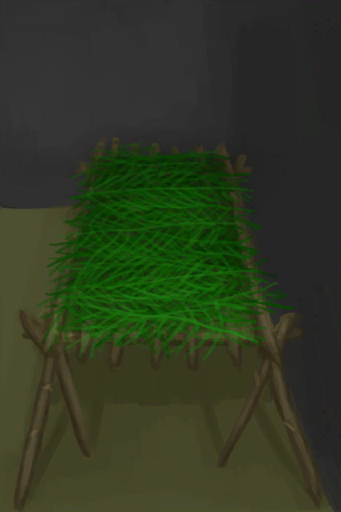
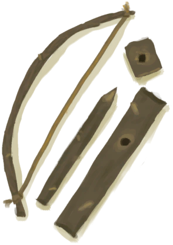
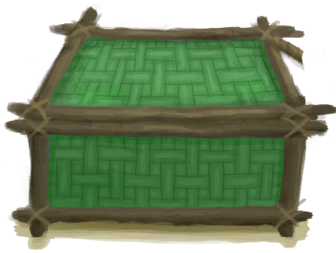
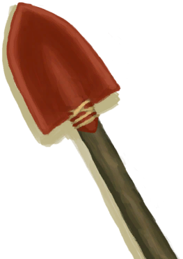
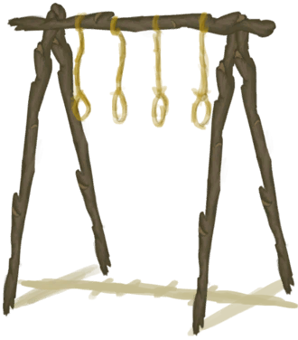
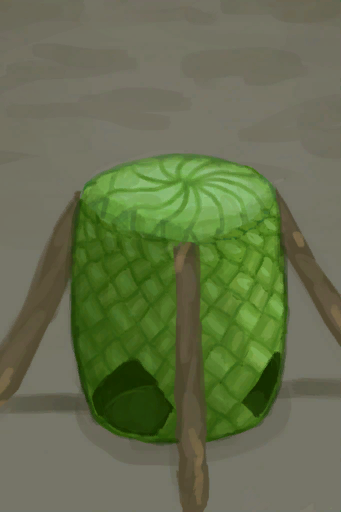
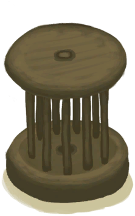
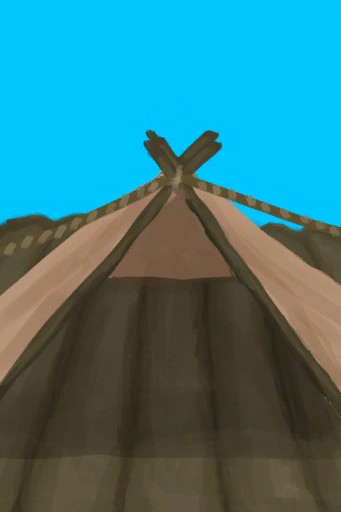
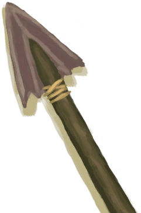
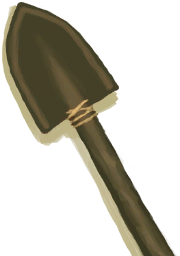

# 长木棍  
> 有很多用途，比如搭建庇护所或者削尖成长矛。  
  
<table class="table table-bordered table4442" data-toggle="table"  data-show-header="false"><thead style="display:none"><tr ><th  style="width:50%;"  >title</th><th  style="width:50%;"  ></th></tr></thead><tr ><td  style="width:50%;"  >**重量：**250  **标签：**	[“大的”](tag_Large.md)</td><td  style="width:50%;"  >

<a href="StickLong.md" style="color:black">长木棍</a>

长木棍是你求生路上的好帮手！  可以在<b>丛林</b>中找到，主要是通过<b>用斧子砍小树</b>。  它们有许多不同的用途，比如制作<b>长矛</b>或者搭建<b>窝棚和棚屋</b>。  真可谓是原始技术的支柱！</td></tr></tbody></table>  
  
## 获取来源  

拆解

[简易床](BedRustic.md)

拆除

[窝棚](Shelter.md)

转化

[窝棚](Shelter.md)

拆除

[有遮蔽的叶床](ShelteredLeafBed.md)

转化

[有遮蔽的叶床](ShelteredLeafBed.md)

拆除

[诱捕笼](CageTrap.md)

拆解

[晾晒架](DryingRack.md)

拆除陷阱

[原木陷阱](LogTrap.md)

拆除陷阱

[原木陷阱(未重置)](LogTrapTriggered.md)

拆卸织布机

[织布机（空）](LoomEmpty.md)

拆除

[稻草人](Scarecrow.md)

转化

[稻草人](Scarecrow.md)

拆除陷阱

[陷坑](TrappingPit.md)

拆除陷阱

[陷坑](TrappingPitTriggered.md)

拆解

[简易的弓](BowRustic.md)

Dismantle

[小拉车](Travois.md)

拆解

[扫帚](Broom.md)

扫帚坏了！

[扫帚](Broom.md)

拆解

[铜长矛](SpearCopper.md)

拆解

[燧石长矛](SpearFlint.md)

拆解

[黑曜石长矛](SpearObsidian.md)

拆解

[废金属长矛](SpearScrap.md)

** 使用**[“斧”](tag_Axe.md)砍树

[金鸡纳树](CinchonaTree.md)

** 使用**[“斧”](tag_Axe.md)砍树

[剥净的金鸡纳树](CinchonaTreeCleared.md)

清理

[废墟(泥屋)](Debris.md)

** 使用**[“铲子”](tag_Shovel.md)清理

[废墟(泥屋)](Debris.md)

** 使用**[“斧”](tag_Axe.md)砍树

[小芒果树](MangoTreeYoung.md)

探索

[丛林深处](DeepJungle.md)

探索

[丛林](Jungle.md)

探索

[丛林高地](JungleHighlands.md)

探索

[湿地丛林(湿地)](Wetlands.md)

** 使用**[“斧”](tag_Axe.md)砍树

[幼年椰子树](PalmTreeYoung.md)

** 使用**[“斧”](tag_Axe.md)砍树

[小棕榈树](SmallPalm.md)

** 使用**[“斧”](tag_Axe.md)砍树

[小树](SmallTree.md)

** 使用**[“斧”](tag_Axe.md)砍树

[小杏仁树](TropicalAlmondTreeYoung.md)

  
  
## 动作  

<table><tr><td rowspan="2" style="width:200px;text-align:center;font-size:1.3em;font-weight:bold">

折断长木棍

15分

</td><td>[“手部动作(组)”](HandAction.md)</td></tr><tr><td><b>自身：</b>→ [

[小树枝](Sticks.md)](Sticks.md)</td></tr><tr><td colspan="2"><b>需求：</b>[

[光亮](Light.md)](Light.md): <b>10-100</b></td></tr></table>
  
  
  
## 可拖入  

<table style="margin-bottom:0px;"><tr><td style="width:40%;text-align:left; background-color:#FEFEFE"><b>拖入：</b>[“切割工具”](tag_Cutter.md)</td><td style="width:40%;font-size:1em;font-weight:bold;background-color:#FEFEFE">削成简易长矛 (1小时) [“手部动作(组)”](HandAction.md)</td></tr><tr style="background-color:#FFFFFF"><td style=""><b>使用物：</b>可用次数  <b>-1</b></td><td style=""><b>自身：</b>→ [

[简易长矛](SpearRustic.md)](SpearRustic.md)</td></tr><tr><td colspan="2"><b>状态变化：</b>[

[制作(技能)](Skill_Crafting.md)](Skill_Crafting.md)<b>+1</b></td></tr><tr><td colspan="2"><b>需求：</b>[

[光亮](Light.md)](Light.md): <b>10-100</b></td></tr></table>
  
  
## 可拖至  

[营火](Campfire.md)

[粘土火盆](ClayFirePit.md)

[火堆](Fire.md)

[烟熏炉](Smoker.md)

[烟熏炉(塑料布)(点燃)](SmokerPlastic.md)

  
  
## 可用于蓝图  

<a href="Bp_BedRustic.md" style="color:black">简易床</a>

<a href="Bp_Bow.md" style="color:black">弓</a>

<a href="Bp_BowDrill.md" style="color:black">弓钻</a>

<a href="Bp_Broom.md" style="color:black">扫帚</a>

<a href="Bp_CageTrap.md" style="color:black">诱捕笼</a>

<a href="Bp_Chest.md" style="color:black">储物箱</a>

<a href="Bp_Cistern.md" style="color:black">水窖</a>

<a href="Bp_CompostBin.md" style="color:black">堆肥箱</a>

<a href="Bp_CopperShovel.md" style="color:black">铜铲</a>

<a href="Bp_CopperSpear.md" style="color:black">铜长矛</a>

<a href="Bp_DryingRack.md" style="color:black">晾晒架</a>

<a href="Bp_Enclosure.md" style="color:black">畜栏</a>

<a href="Bp_FishingRod.md" style="color:black">钓鱼竿</a>

<a href="Bp_FishingSpear.md" style="color:black">鱼叉</a>

<a href="Bp_FlintSpear.md" style="color:black">燧石长矛</a>

<a href="Bp_GoatFeeder.md" style="color:black">羊食槽</a>

<a href="Bp_Harpoon.md" style="color:black">鱼镖</a>

<a href="Bp_LogTrap.md" style="color:black">原木陷阱</a>

<a href="Bp_Loom.md" style="color:black">织布机</a>

<a href="Bp_MudHut.md" style="color:black">泥屋</a>

<a href="Bp_ObsidianSpear.md" style="color:black">黑曜石长矛</a>

<a href="Bp_PartridgeFeeder.md" style="color:black">灰山鹑喂食器</a>

<a href="Bp_PotteryWheel.md" style="color:black">陶轮</a>

<a href="Bp_Raft.md" style="color:black">木筏</a>

<a href="Bp_RaftFishTrap.md" style="color:black">捕捞拖网</a>

<a href="Bp_RaftShelter.md" style="color:black">木筏庇护所</a>

<a href="Bp_RusticSpear.md" style="color:black">简易长矛</a>

<a href="Bp_Scarecrow.md" style="color:black">稻草人</a>

<a href="Bp_ScrapShovel.md" style="color:black">废金属铲</a>

<a href="Bp_ScrapSpear.md" style="color:black">废金属长矛</a>

<a href="Bp_Shed.md" style="color:black">棚屋</a>

<a href="Bp_Shelter.md" style="color:black">窝棚</a>

<a href="Bp_Splint.md" style="color:black">夹板</a>

<a href="Bp_SupplyChest.md" style="color:black">补给箱</a>

<a href="Bp_TrappingPit.md" style="color:black">陷坑</a>

<a href="Bp_Travois.md" style="color:black">小拉车</a>

<a href="Bp_Well.md" style="color:black">水井</a>

<a href="Bp_WoodenShovel.md" style="color:black">木铲</a>

  
  
  

