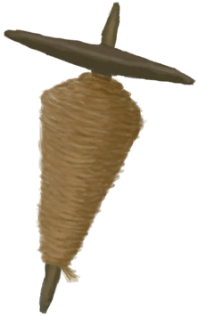

# 小树枝  
> 可以作为燃料或者制作一些别的东西，比如手钻什么的。  
  
<table class="table table-bordered" data-toggle="table"  data-show-header="false"><thead style="display:none"><tr ><th  style="width:50%;text-align:left;vertical-align:top;"  >title</th><th  style="width:50%;text-align:left;vertical-align:top;"  ></th></tr></thead><tr ><td  style="width:50%;text-align:left;vertical-align:top;"  >**重量：**150  **标签：**	[“燃料”](tag_Fuel.md), [“小棍子”](tag_Sticks.md)</td><td  style="width:50%;text-align:left;vertical-align:top;"  >

<a href="Sticks.md" style="color:black">小树枝</a>

树枝几乎可以在任何地方通过<b>搜寻</b>找到。  它们可以用<b>切割工具</b>雕刻成<b>手钻</b>，一个必要的工具用于<b>生火</b>。  它们也可以用作<b>燃料</b>，说到火，那是个常见的材料，用作制作各种<b>工具和建筑</b>。</td></tr></tbody></table>  
  
## 获取来源  
<table class="table table-bordered" data-toggle="table"  ><thead style=""><tr ><th  style="text-align:left;vertical-align:top;"  >来源</th><th  style="text-align:left;vertical-align:top;"  >操作</th></tr></thead><tr ><td  style="text-align:left;vertical-align:top;"  >[

[简易床](BedRustic.md)](BedRustic.md)</td><td  style="text-align:left;vertical-align:top;"  >拆解</td></tr><tr ><td  style="text-align:left;vertical-align:top;"  >[

[诱捕笼](CageTrap.md)](CageTrap.md)</td><td  style="text-align:left;vertical-align:top;"  >拆除</td></tr><tr ><td  style="text-align:left;vertical-align:top;"  >[

[落石陷阱](DeadfallTrap.md)](DeadfallTrap.md)</td><td  style="text-align:left;vertical-align:top;"  >拆除陷阱</td></tr><tr ><td  style="text-align:left;vertical-align:top;"  >[

[落石陷阱(未重置)](DeadfallTrapTriggered.md)](DeadfallTrapTriggered.md)</td><td  style="text-align:left;vertical-align:top;"  >拆除陷阱</td></tr><tr ><td  style="text-align:left;vertical-align:top;"  >[

[捕鱼陷阱(未放置)](FishTrap.md)](FishTrap.md)</td><td  style="text-align:left;vertical-align:top;"  >拆除</td></tr><tr ><td  style="text-align:left;vertical-align:top;"  >[

[原木陷阱](LogTrap.md)](LogTrap.md)</td><td  style="text-align:left;vertical-align:top;"  >拆除陷阱</td></tr><tr ><td  style="text-align:left;vertical-align:top;"  >[

[原木陷阱(未重置)](LogTrapTriggered.md)](LogTrapTriggered.md)</td><td  style="text-align:left;vertical-align:top;"  >拆除陷阱</td></tr><tr ><td  style="text-align:left;vertical-align:top;"  >[

[烟熏炉框架](SmokerFrame.md)](SmokerFrame.md)</td><td  style="text-align:left;vertical-align:top;"  >移除树枝</td></tr><tr ><td  style="text-align:left;vertical-align:top;"  >[

[套索陷阱](SnareTrap.md)](SnareTrap.md)</td><td  style="text-align:left;vertical-align:top;"  >拆除陷阱</td></tr><tr ><td  style="text-align:left;vertical-align:top;"  >[

[套索陷阱(未重置)](SnareTrapTriggered.md)](SnareTrapTriggered.md)</td><td  style="text-align:left;vertical-align:top;"  >拆除陷阱</td></tr><tr ><td  style="text-align:left;vertical-align:top;"  >[

[简易的弓](BowRustic.md)](BowRustic.md)</td><td  style="text-align:left;vertical-align:top;"  >转化</td></tr><tr ><td  style="text-align:left;vertical-align:top;"  >[

[上弦的简易弓](BowRustic_Copper.md)](BowRustic_Copper.md)</td><td  style="text-align:left;vertical-align:top;"  >转化</td></tr><tr ><td  style="text-align:left;vertical-align:top;"  >[

[上弦的简易弓](BowRustic_Simple.md)](BowRustic_Simple.md)</td><td  style="text-align:left;vertical-align:top;"  >转化</td></tr><tr ><td  style="text-align:left;vertical-align:top;"  >[

[夹板](Splint.md)](Splint.md)</td><td  style="text-align:left;vertical-align:top;"  >转化</td></tr><tr ><td  style="text-align:left;vertical-align:top;"  >[

[止血带](Tourniquet.md)](Tourniquet.md)</td><td  style="text-align:left;vertical-align:top;"  >拆解</td></tr><tr ><td  style="text-align:left;vertical-align:top;"  >[

[架子](Shelf.md)](Shelf.md)</td><td  style="text-align:left;vertical-align:top;"  >拆解</td></tr><tr ><td  style="text-align:left;vertical-align:top;"  >[

[长木棍](StickLong.md)](StickLong.md)</td><td  style="text-align:left;vertical-align:top;"  >折断长木棍</td></tr><tr ><td  style="text-align:left;vertical-align:top;"  >[

[铜斧](AxeCopper.md)](AxeCopper.md)</td><td  style="text-align:left;vertical-align:top;"  >转化</td></tr><tr ><td  style="text-align:left;vertical-align:top;"  >[

[燧石斧](AxeFlint.md)](AxeFlint.md)</td><td  style="text-align:left;vertical-align:top;"  >转化</td></tr><tr ><td  style="text-align:left;vertical-align:top;"  >[

[废金属斧](AxeScrap.md)](AxeScrap.md)</td><td  style="text-align:left;vertical-align:top;"  >拆解</td></tr><tr ><td  style="text-align:left;vertical-align:top;"  >[

[废金属斧](AxeScrap.md)](AxeScrap.md)</td><td  style="text-align:left;vertical-align:top;"  >转化</td></tr><tr ><td  style="text-align:left;vertical-align:top;"  >[

[鱼镖](HarpoonBone.md)](HarpoonBone.md)</td><td  style="text-align:left;vertical-align:top;"  >鱼镖坏了</td></tr><tr ><td  style="text-align:left;vertical-align:top;"  >[

[铜铲](ShovelCopper.md)](ShovelCopper.md)</td><td  style="text-align:left;vertical-align:top;"  >转化</td></tr><tr ><td  style="text-align:left;vertical-align:top;"  >[

[废金属铲](ShovelScrap.md)](ShovelScrap.md)</td><td  style="text-align:left;vertical-align:top;"  >拆解</td></tr><tr ><td  style="text-align:left;vertical-align:top;"  >[

[废金属铲](ShovelScrap.md)](ShovelScrap.md)</td><td  style="text-align:left;vertical-align:top;"  >转化</td></tr><tr ><td  style="text-align:left;vertical-align:top;"  >[

[木铲](ShovelWooden.md)](ShovelWooden.md)</td><td  style="text-align:left;vertical-align:top;"  >转化</td></tr><tr ><td  style="text-align:left;vertical-align:top;"  >[

[铜长矛](SpearCopper.md)](SpearCopper.md)</td><td  style="text-align:left;vertical-align:top;"  >长矛坏了</td></tr><tr ><td  style="text-align:left;vertical-align:top;"  >[

[鱼叉](SpearFishing.md)](SpearFishing.md)</td><td  style="text-align:left;vertical-align:top;"  >折断鱼叉</td></tr><tr ><td  style="text-align:left;vertical-align:top;"  >[

[鱼叉](SpearFishing.md)](SpearFishing.md)</td><td  style="text-align:left;vertical-align:top;"  >鱼叉坏了</td></tr><tr ><td  style="text-align:left;vertical-align:top;"  >[

[燧石长矛](SpearFlint.md)](SpearFlint.md)</td><td  style="text-align:left;vertical-align:top;"  >长矛坏了</td></tr><tr ><td  style="text-align:left;vertical-align:top;"  >[

[黑曜石长矛](SpearObsidian.md)](SpearObsidian.md)</td><td  style="text-align:left;vertical-align:top;"  >长矛坏了</td></tr><tr ><td  style="text-align:left;vertical-align:top;"  >[

[简易长矛](SpearRustic.md)](SpearRustic.md)</td><td  style="text-align:left;vertical-align:top;"  >长矛坏了</td></tr><tr ><td  style="text-align:left;vertical-align:top;"  >[

[废金属长矛](SpearScrap.md)](SpearScrap.md)</td><td  style="text-align:left;vertical-align:top;"  >长矛坏了</td></tr><tr ><td  style="text-align:left;vertical-align:top;"  >[

[石斧](StoneAxe.md)](StoneAxe.md)</td><td  style="text-align:left;vertical-align:top;"  >转化</td></tr><tr ><td  style="text-align:left;vertical-align:top;"  >[

[金鸡纳树](CinchonaTree.md)](CinchonaTree.md)</td><td  style="text-align:left;vertical-align:top;"  >砍树 ** 拖入：**[“斧”](tag_Axe.md)</td></tr><tr ><td  style="text-align:left;vertical-align:top;"  >[

[剥净的金鸡纳树](CinchonaTreeCleared.md)](CinchonaTreeCleared.md)</td><td  style="text-align:left;vertical-align:top;"  >砍树 ** 拖入：**[“斧”](tag_Axe.md)</td></tr><tr ><td  style="text-align:left;vertical-align:top;"  >[

[废墟(泥屋)](Debris.md)](Debris.md)</td><td  style="text-align:left;vertical-align:top;"  >清理</td></tr><tr ><td  style="text-align:left;vertical-align:top;"  >[

[废墟(泥屋)](Debris.md)](Debris.md)</td><td  style="text-align:left;vertical-align:top;"  >清理 ** 拖入：**[“铲子”](tag_Shovel.md)</td></tr><tr ><td  style="text-align:left;vertical-align:top;"  >[

[漂浮的残骸](FloatingDebris.md)](FloatingDebris.md)</td><td  style="text-align:left;vertical-align:top;"  >采集</td></tr><tr ><td  style="text-align:left;vertical-align:top;"  >[

[小芒果树](MangoTreeYoung.md)](MangoTreeYoung.md)</td><td  style="text-align:left;vertical-align:top;"  >砍树 ** 拖入：**[“斧”](tag_Axe.md)</td></tr><tr ><td  style="text-align:left;vertical-align:top;"  >[

[海湾](Bay.md)](Bay.md)</td><td  style="text-align:left;vertical-align:top;"  >随便逛逛</td></tr><tr ><td  style="text-align:left;vertical-align:top;"  >[

[沙滩](Beach.md)](Beach.md)</td><td  style="text-align:left;vertical-align:top;"  >随便逛逛</td></tr><tr ><td  style="text-align:left;vertical-align:top;"  >[

[丛林深处](DeepJungle.md)](DeepJungle.md)</td><td  style="text-align:left;vertical-align:top;"  >探索</td></tr><tr ><td  style="text-align:left;vertical-align:top;"  >[

[丛林深处](DeepJungle.md)](DeepJungle.md)</td><td  style="text-align:left;vertical-align:top;"  >砍伐木材 ** 拖入：**[“高级斧”](tag_AxeAdv.md)</td></tr><tr ><td  style="text-align:left;vertical-align:top;"  >[

[丛林深处](DeepJungle.md)](DeepJungle.md)</td><td  style="text-align:left;vertical-align:top;"  >砍伐木材 ** 拖入：**[“斧”](tag_Axe.md)</td></tr><tr ><td  style="text-align:left;vertical-align:top;"  >[

[荒芜沙滩](DesolateBeach.md)](DesolateBeach.md)</td><td  style="text-align:left;vertical-align:top;"  >探索</td></tr><tr ><td  style="text-align:left;vertical-align:top;"  >[

[东部草原](GrasslandsE.md)](GrasslandsE.md)</td><td  style="text-align:left;vertical-align:top;"  >探索</td></tr><tr ><td  style="text-align:left;vertical-align:top;"  >[

[西部草原](GrasslandsW.md)](GrasslandsW.md)</td><td  style="text-align:left;vertical-align:top;"  >探索</td></tr><tr ><td  style="text-align:left;vertical-align:top;"  >[

[东部高地](HighlandsEastern.md)](HighlandsEastern.md)</td><td  style="text-align:left;vertical-align:top;"  >砍伐木材 ** 拖入：**[“高级斧”](tag_AxeAdv.md)</td></tr><tr ><td  style="text-align:left;vertical-align:top;"  >[

[东部高地](HighlandsEastern.md)](HighlandsEastern.md)</td><td  style="text-align:left;vertical-align:top;"  >砍伐木材 ** 拖入：**[“斧”](tag_Axe.md)</td></tr><tr ><td  style="text-align:left;vertical-align:top;"  >[

[西部高地](HighlandsWestern.md)](HighlandsWestern.md)</td><td  style="text-align:left;vertical-align:top;"  >探索</td></tr><tr ><td  style="text-align:left;vertical-align:top;"  >[

[西部高地](HighlandsWestern.md)](HighlandsWestern.md)</td><td  style="text-align:left;vertical-align:top;"  >砍伐木材 ** 拖入：**[“高级斧”](tag_AxeAdv.md)</td></tr><tr ><td  style="text-align:left;vertical-align:top;"  >[

[西部高地](HighlandsWestern.md)](HighlandsWestern.md)</td><td  style="text-align:left;vertical-align:top;"  >砍伐木材 ** 拖入：**[“斧”](tag_Axe.md)</td></tr><tr ><td  style="text-align:left;vertical-align:top;"  >[

[丛林](Jungle.md)](Jungle.md)</td><td  style="text-align:left;vertical-align:top;"  >探索</td></tr><tr ><td  style="text-align:left;vertical-align:top;"  >[

[丛林](Jungle.md)](Jungle.md)</td><td  style="text-align:left;vertical-align:top;"  >砍伐木材 ** 拖入：**[“高级斧”](tag_AxeAdv.md)</td></tr><tr ><td  style="text-align:left;vertical-align:top;"  >[

[丛林](Jungle.md)](Jungle.md)</td><td  style="text-align:left;vertical-align:top;"  >砍伐木材 ** 拖入：**[“斧”](tag_Axe.md)</td></tr><tr ><td  style="text-align:left;vertical-align:top;"  >[

[丛林高地](JungleHighlands.md)](JungleHighlands.md)</td><td  style="text-align:left;vertical-align:top;"  >探索</td></tr><tr ><td  style="text-align:left;vertical-align:top;"  >[

[丛林高地](JungleHighlands.md)](JungleHighlands.md)</td><td  style="text-align:left;vertical-align:top;"  >砍伐木材 ** 拖入：**[“高级斧”](tag_AxeAdv.md)</td></tr><tr ><td  style="text-align:left;vertical-align:top;"  >[

[丛林高地](JungleHighlands.md)](JungleHighlands.md)</td><td  style="text-align:left;vertical-align:top;"  >砍伐木材 ** 拖入：**[“斧”](tag_Axe.md)</td></tr><tr ><td  style="text-align:left;vertical-align:top;"  >[

[红树林](Mangroves.md)](Mangroves.md)</td><td  style="text-align:left;vertical-align:top;"  >砍伐木材 ** 拖入：**[“高级斧”](tag_AxeAdv.md)</td></tr><tr ><td  style="text-align:left;vertical-align:top;"  >[

[红树林](Mangroves.md)](Mangroves.md)</td><td  style="text-align:left;vertical-align:top;"  >砍伐木材 ** 拖入：**[“斧”](tag_Axe.md)</td></tr><tr ><td  style="text-align:left;vertical-align:top;"  >[

[丛林边缘](Outskirts.md)](Outskirts.md)</td><td  style="text-align:left;vertical-align:top;"  >探索</td></tr><tr ><td  style="text-align:left;vertical-align:top;"  >[

[丛林边缘](Outskirts.md)](Outskirts.md)</td><td  style="text-align:left;vertical-align:top;"  >砍伐木材 ** 拖入：**[“高级斧”](tag_AxeAdv.md)</td></tr><tr ><td  style="text-align:left;vertical-align:top;"  >[

[丛林边缘](Outskirts.md)](Outskirts.md)</td><td  style="text-align:left;vertical-align:top;"  >砍伐木材 ** 拖入：**[“斧”](tag_Axe.md)</td></tr><tr ><td  style="text-align:left;vertical-align:top;"  >[

[神秘谷](SecretValley.md)](SecretValley.md)</td><td  style="text-align:left;vertical-align:top;"  >探索</td></tr><tr ><td  style="text-align:left;vertical-align:top;"  >[

[湿地丛林(湿地)](Wetlands.md)](Wetlands.md)</td><td  style="text-align:left;vertical-align:top;"  >探索</td></tr><tr ><td  style="text-align:left;vertical-align:top;"  >[

[湿地丛林(湿地)](Wetlands.md)](Wetlands.md)</td><td  style="text-align:left;vertical-align:top;"  >砍伐木材 ** 拖入：**[“高级斧”](tag_AxeAdv.md)</td></tr><tr ><td  style="text-align:left;vertical-align:top;"  >[

[湿地丛林(湿地)](Wetlands.md)](Wetlands.md)</td><td  style="text-align:left;vertical-align:top;"  >砍伐木材 ** 拖入：**[“斧”](tag_Axe.md)</td></tr><tr ><td  style="text-align:left;vertical-align:top;"  >[

[大树](LargeTree.md)](LargeTree.md)</td><td  style="text-align:left;vertical-align:top;"  >转化</td></tr><tr ><td  style="text-align:left;vertical-align:top;"  >[

[倒下的大树](LargeTreeFelled.md)](LargeTreeFelled.md)</td><td  style="text-align:left;vertical-align:top;"  >修整原木 ** 拖入：**[石斧](StoneAxe.md)</td></tr><tr ><td  style="text-align:left;vertical-align:top;"  >[

[倒下的大树](LargeTreeFelled.md)](LargeTreeFelled.md)</td><td  style="text-align:left;vertical-align:top;"  >修整原木 ** 拖入：**[“斧”](tag_Axe.md)</td></tr><tr ><td  style="text-align:left;vertical-align:top;"  >[

[摘光的芒果树](MangoTreeCleared.md)](MangoTreeCleared.md)</td><td  style="text-align:left;vertical-align:top;"  >转化</td></tr><tr ><td  style="text-align:left;vertical-align:top;"  >[

[摘光的热带杏仁树](TropicalAlmondTreeCleared.md)](TropicalAlmondTreeCleared.md)</td><td  style="text-align:left;vertical-align:top;"  >转化</td></tr><tr ><td  style="text-align:left;vertical-align:top;"  >[

[倒下的热带杏仁树](TropicalAlmondTreeFelled.md)](TropicalAlmondTreeFelled.md)</td><td  style="text-align:left;vertical-align:top;"  >清理树枝 ** 拖入：**[石斧](StoneAxe.md)</td></tr><tr ><td  style="text-align:left;vertical-align:top;"  >[

[倒下的热带杏仁树](TropicalAlmondTreeFelled.md)](TropicalAlmondTreeFelled.md)</td><td  style="text-align:left;vertical-align:top;"  >清理树枝 ** 拖入：**[“斧”](tag_Axe.md)</td></tr><tr ><td  style="text-align:left;vertical-align:top;"  >[

[小树](SmallTree.md)](SmallTree.md)</td><td  style="text-align:left;vertical-align:top;"  >砍树 ** 拖入：**[“斧”](tag_Axe.md)</td></tr><tr ><td  style="text-align:left;vertical-align:top;"  >[

[小杏仁树](TropicalAlmondTreeYoung.md)](TropicalAlmondTreeYoung.md)</td><td  style="text-align:left;vertical-align:top;"  >砍树 ** 拖入：**[“斧”](tag_Axe.md)</td></tr><tr ><td  style="text-align:left;vertical-align:top;"  >[

[野枣丛](WildJujube.md)](WildJujube.md)</td><td  style="text-align:left;vertical-align:top;"  >砍倒 ** 拖入：**[“斧”](tag_Axe.md)</td></tr><tr ><td  style="text-align:left;vertical-align:top;"  >[

[摘光的野枣从](WildJujubeCleared.md)](WildJujubeCleared.md)</td><td  style="text-align:left;vertical-align:top;"  >砍倒 ** 拖入：**[“斧”](tag_Axe.md)</td></tr></tbody></table>  
  
## 可拖入  
<table class="table table-bordered" data-toggle="table"  ><thead style=""><tr ><th  style="text-align:left;vertical-align:top;"  >使用</th><th  style="text-align:left;vertical-align:top;"  >动作</th><th  style="text-align:left;vertical-align:top;"  >耗时</th><th  style="text-align:left;vertical-align:top;"  >条件</th><th  style="text-align:left;vertical-align:top;"  >变化</th><th  style="text-align:left;vertical-align:top;"  >玩家状态</th></tr></thead><tr ><td  style="text-align:left;vertical-align:top;"  >[“切割工具”](tag_Cutter.md)</td><td  style="text-align:left;vertical-align:top;"  >制作手钻 [“手部动作(组)”](HandAction.md) [“制造动作(组)”](CraftAction.md)</td><td  style="text-align:left;vertical-align:top;"  >30分</td><td  style="text-align:left;vertical-align:top;"  >[

[光亮](Light.md)](Light.md): 10-100</td><td  style="text-align:left;vertical-align:top;"  >** 自身: ** → [

[手钻](HandDrill.md)](HandDrill.md)  ** 使用物: ** 可用次数  -1</td><td  style="text-align:left;vertical-align:top;"  >[

[制作(技能)](Skill_Crafting.md)](Skill_Crafting.md)+0.25 [

[木工(技能)](Skill_Woodworking.md)](Skill_Woodworking.md)+0.5</td></tr><tr ><td  style="text-align:left;vertical-align:top;"  >[

[细线](CordFiber.md)](CordFiber.md)</td><td  style="text-align:left;vertical-align:top;"  >制作止血带 [“手部动作(组)”](HandAction.md)</td><td  style="text-align:left;vertical-align:top;"  >30分</td><td  style="text-align:left;vertical-align:top;"  >[

[光亮](Light.md)](Light.md): 10-100</td><td  style="text-align:left;vertical-align:top;"  >** 自身: ** → [

[简易止血带](TourniquetRustic.md)](TourniquetRustic.md)  ** 使用物: ** →消失 可用次数  -1</td><td  style="text-align:left;vertical-align:top;"  >[

[制作(技能)](Skill_Crafting.md)](Skill_Crafting.md)+1</td></tr></tbody></table>  
  
## 可拖至  

[蒸馏器(关)](AlembicOff.md)

[蒸馏器(开)](AlembicOn.md)

[营火](Campfire.md)

[营火(熄灭)](CampfireExtinguished.md)

[粘土火盆](ClayFirePit.md)

[粘土火盆(熄灭)](ClayFirePitExtinguished.md)

[火堆](Fire.md)

[火堆(熄灭)](FireExtinguished.md)

[熔炉](Forge.md)

[熔炉(熄灭)](ForgeExtinguished.md)

[窑炉](Kiln.md)

[高级窑炉](KilnAdvanced.md)

[高级窑炉(熄灭)](KilnAdvancedExtinguished.md)

[窑炉(熄灭)](KilnExtinguished.md)

[火炉](Stove.md)

[火炉(熄灭)](StoveExtinguished.md)

[烟熏炉](Smoker.md)

[烟熏炉(熄灭)](SmokerExtinguished.md)

[烟熏炉(塑料布)(熄灭)](SmokerExtinguishedPlastic.md)

[烟熏炉(塑料布)(点燃)](SmokerPlastic.md)

[布](Cloth.md)

[木材](Wood.md)

  
  
## 可用于蓝图  

[

[箭矢(蓝图)](Bp_Arrow.md)](Bp_Arrow.md)

[

[空蜂箱(蓝图)](Bp_BeeSkepEmpty.md)](Bp_BeeSkepEmpty.md)

[

[猪食槽(蓝图)](Bp_BoarFeeder.md)](Bp_BoarFeeder.md)

[

[诱捕笼(蓝图)](Bp_CageTrap.md)](Bp_CageTrap.md)

[

[营火(蓝图)](Bp_Campfire.md)](Bp_Campfire.md)

[

[农田(蓝图)](Bp_CropPlot.md)](Bp_CropPlot.md)

[

[落石陷阱(蓝图)](Bp_DeadfallTrap.md)](Bp_DeadfallTrap.md)

[

[畜栏(蓝图)](Bp_Enclosure.md)](Bp_Enclosure.md)

[

[火堆(蓝图)](Bp_Fire.md)](Bp_Fire.md)

[

[捕鱼陷阱(蓝图)](Bp_FishTrap.md)](Bp_FishTrap.md)

[

[手钻(蓝图)](Bp_HandDrill.md)](Bp_HandDrill.md)

[

[窑炉(蓝图)](Bp_Kiln.md)](Bp_Kiln.md)

[

[泥屋(蓝图)](Bp_MudHut.md)](Bp_MudHut.md)

[

[套索陷阱(蓝图)](Bp_SnareTrap.md)](Bp_SnareTrap.md)

[

[纺锤(蓝图)](Bp_Spindle.md)](Bp_Spindle.md)

[

[火炉(蓝图)](Bp_Stove.md)](Bp_Stove.md)

[

[止血带(蓝图)](Bp_Tourniquet.md)](Bp_Tourniquet.md)

[

[简易止血带(蓝图)](Bp_TourniquetRustic.md)](Bp_TourniquetRustic.md)

[

[滤水器(蓝图)](Bp_WaterFilter.md)](Bp_WaterFilter.md)

[

[黄油(蓝图)](Bp_Butter.md)](Bp_Butter.md)

[

[猕猴肉串(蓝图)](Bp_MacaqueSkewers.md)](Bp_MacaqueSkewers.md)

[

[风箱(蓝图)](Bp_Bellows.md)](Bp_Bellows.md)

[

[木针(蓝图)](Bp_WoodenNeedles.md)](Bp_WoodenNeedles.md)

  
  
  

