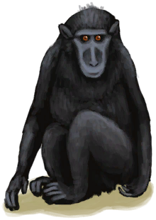
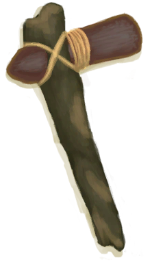

# 石头  
> 可以当作锤子使用，也可以用来打磨另一块石头。可置于窑炉内煅烧成生石灰。  
  
<table class="table table-bordered" data-toggle="table"  data-show-header="false"><thead style="display:none"><tr ><th  style="width:50%;text-align:left;vertical-align:top;"  >title</th><th  style="width:50%;text-align:left;vertical-align:top;"  ></th></tr></thead><tr ><td  style="width:50%;text-align:left;vertical-align:top;"  >**重量：**100  **标签：**	[“锤”](tag_Hammer.md), [“可烹饪的”](tag_Cookable.md), [“沉重的”](tag_Heavy.md)</td><td  style="width:50%;text-align:left;vertical-align:top;"  >

<a href="Stone.md" style="color:black">石头</a>

一小块石灰岩。  它可以在<b>大石块</b>上打磨成<b>石刀</b>。 也可以在小石头上打磨，但耗时更久，对你的手损伤也更大。</td></tr></tbody></table>  
  
## 获取来源  
<table class="table table-bordered" data-toggle="table"  ><thead style=""><tr ><th  style="text-align:left;vertical-align:top;"  >来源</th><th  style="text-align:left;vertical-align:top;"  >操作</th></tr></thead><tr ><td  style="text-align:left;vertical-align:top;"  >[

[铜矿脉(洞穴上层)](CopperVein.md)](CopperVein.md)</td><td  style="text-align:left;vertical-align:top;"  >轰隆！ ** 拖入：**[炸‍葯(开)](DynamiteOn.md)</td></tr><tr ><td  style="text-align:left;vertical-align:top;"  >[

[营火](Campfire.md)](Campfire.md)</td><td  style="text-align:left;vertical-align:top;"  >拆解</td></tr><tr ><td  style="text-align:left;vertical-align:top;"  >[

[营火(熄灭)](CampfireExtinguished.md)](CampfireExtinguished.md)</td><td  style="text-align:left;vertical-align:top;"  >拆解</td></tr><tr ><td  style="text-align:left;vertical-align:top;"  >[

[陷坑](TrappingPit.md)](TrappingPit.md)</td><td  style="text-align:left;vertical-align:top;"  >拆除陷阱</td></tr><tr ><td  style="text-align:left;vertical-align:top;"  >[

[陷坑](TrappingPitTriggered.md)](TrappingPitTriggered.md)</td><td  style="text-align:left;vertical-align:top;"  >拆除陷阱</td></tr><tr ><td  style="text-align:left;vertical-align:top;"  >[

[礼物！(事件)](Event_MacaqueFriendGift.md)](Event_MacaqueFriendGift.md)</td><td  style="text-align:left;vertical-align:top;"  >看看礼物</td></tr><tr ><td  style="text-align:left;vertical-align:top;"  >[

[晶洞](Geode.md)](Geode.md)</td><td  style="text-align:left;vertical-align:top;"  >敲开 ** 拖入：**[“锤”](tag_Hammer.md)</td></tr><tr ><td  style="text-align:left;vertical-align:top;"  >[

[晶石洞穴(洞穴上层)](CrystalChamber.md)](CrystalChamber.md)</td><td  style="text-align:left;vertical-align:top;"  >探索</td></tr><tr ><td  style="text-align:left;vertical-align:top;"  >[

[狭窄通道(洞穴底层)](CrystalChamberEntranceClosed.md)](CrystalChamberEntranceClosed.md)</td><td  style="text-align:left;vertical-align:top;"  >挖 ** 拖入：**[“锤”](tag_Hammer.md)</td></tr><tr ><td  style="text-align:left;vertical-align:top;"  >[

[狭窄通道(洞穴底层)](CrystalChamberEntranceClosed.md)](CrystalChamberEntranceClosed.md)</td><td  style="text-align:left;vertical-align:top;"  >轰隆！ ** 拖入：**[炸‍葯(开)](DynamiteOn.md)</td></tr><tr ><td  style="text-align:left;vertical-align:top;"  >[

[潮湿洞穴](DampChamber.md)](DampChamber.md)</td><td  style="text-align:left;vertical-align:top;"  >探索</td></tr><tr ><td  style="text-align:left;vertical-align:top;"  >[

[狭窄通道(潮湿洞穴)](DarkCaveCaveEntranceClosed.md)](DarkCaveCaveEntranceClosed.md)</td><td  style="text-align:left;vertical-align:top;"  >挖 ** 拖入：**[“锤”](tag_Hammer.md)</td></tr><tr ><td  style="text-align:left;vertical-align:top;"  >[

[狭窄通道(潮湿洞穴)](DarkCaveCaveEntranceClosed.md)](DarkCaveCaveEntranceClosed.md)</td><td  style="text-align:left;vertical-align:top;"  >轰隆！ ** 拖入：**[炸‍葯(开)](DynamiteOn.md)</td></tr><tr ><td  style="text-align:left;vertical-align:top;"  >[

[狭窄通道(洞穴中层)](DarkChamberCaveEntranceClosed.md)](DarkChamberCaveEntranceClosed.md)</td><td  style="text-align:left;vertical-align:top;"  >挖 ** 拖入：**[“锤”](tag_Hammer.md)</td></tr><tr ><td  style="text-align:left;vertical-align:top;"  >[

[狭窄通道(洞穴中层)](DarkChamberCaveEntranceClosed.md)](DarkChamberCaveEntranceClosed.md)</td><td  style="text-align:left;vertical-align:top;"  >轰隆！ ** 拖入：**[炸‍葯(开)](DynamiteOn.md)</td></tr><tr ><td  style="text-align:left;vertical-align:top;"  >[

[覆溺洞穴](FloodedChamber.md)](FloodedChamber.md)</td><td  style="text-align:left;vertical-align:top;"  >探索</td></tr><tr ><td  style="text-align:left;vertical-align:top;"  >[

[狭窄通道(洞穴上层)](FloodedChamberEntranceClosed.md)](FloodedChamberEntranceClosed.md)</td><td  style="text-align:left;vertical-align:top;"  >挖 ** 拖入：**[“锤”](tag_Hammer.md)</td></tr><tr ><td  style="text-align:left;vertical-align:top;"  >[

[狭窄通道(洞穴上层)](FloodedChamberEntranceClosed.md)](FloodedChamberEntranceClosed.md)</td><td  style="text-align:left;vertical-align:top;"  >轰隆！ ** 拖入：**[炸‍葯(开)](DynamiteOn.md)</td></tr><tr ><td  style="text-align:left;vertical-align:top;"  >[

[洞穴上层](HighChamber.md)](HighChamber.md)</td><td  style="text-align:left;vertical-align:top;"  >探索</td></tr><tr ><td  style="text-align:left;vertical-align:top;"  >[

[狭窄通道(隧道)](HighChamberEntranceClosed.md)](HighChamberEntranceClosed.md)</td><td  style="text-align:left;vertical-align:top;"  >挖 ** 拖入：**[“锤”](tag_Hammer.md)</td></tr><tr ><td  style="text-align:left;vertical-align:top;"  >[

[狭窄通道(隧道)](HighChamberEntranceClosed.md)](HighChamberEntranceClosed.md)</td><td  style="text-align:left;vertical-align:top;"  >轰隆！ ** 拖入：**[炸‍葯(开)](DynamiteOn.md)</td></tr><tr ><td  style="text-align:left;vertical-align:top;"  >[

[洞穴底层](LowChamber.md)](LowChamber.md)</td><td  style="text-align:left;vertical-align:top;"  >探索</td></tr><tr ><td  style="text-align:left;vertical-align:top;"  >[

[洞穴中层](MidChamber.md)](MidChamber.md)</td><td  style="text-align:left;vertical-align:top;"  >探索</td></tr><tr ><td  style="text-align:left;vertical-align:top;"  >[

[狭窄隧道(洞穴上层)](NarrowTunnel.md)](NarrowTunnel.md)</td><td  style="text-align:left;vertical-align:top;"  >探索</td></tr><tr ><td  style="text-align:left;vertical-align:top;"  >[

[海水(覆溺洞穴)](Sea_Cave.md)](Sea_Cave.md)</td><td  style="text-align:left;vertical-align:top;"  >潜水</td></tr><tr ><td  style="text-align:left;vertical-align:top;"  >[

[坍塌的隧道入口(东部高地)](TunnelEntranceClosed.md)](TunnelEntranceClosed.md)</td><td  style="text-align:left;vertical-align:top;"  >挖</td></tr><tr ><td  style="text-align:left;vertical-align:top;"  >[

[坍塌的隧道入口(东部高地)](TunnelEntranceClosed.md)](TunnelEntranceClosed.md)</td><td  style="text-align:left;vertical-align:top;"  >轰隆！ ** 拖入：**[炸‍葯(开)](DynamiteOn.md)</td></tr><tr ><td  style="text-align:left;vertical-align:top;"  >[

[幽暗洞穴](DarkCave.md)](DarkCave.md)</td><td  style="text-align:left;vertical-align:top;"  >探索</td></tr><tr ><td  style="text-align:left;vertical-align:top;"  >[

[酸湖(火山)](AcidLake.md)](AcidLake.md)</td><td  style="text-align:left;vertical-align:top;"  >探索</td></tr><tr ><td  style="text-align:left;vertical-align:top;"  >[

[环礁](Atoll.md)](Atoll.md)</td><td  style="text-align:left;vertical-align:top;"  >探索</td></tr><tr ><td  style="text-align:left;vertical-align:top;"  >[

[海湾](Bay.md)](Bay.md)</td><td  style="text-align:left;vertical-align:top;"  >随便逛逛</td></tr><tr ><td  style="text-align:left;vertical-align:top;"  >[

[沙滩](Beach.md)](Beach.md)</td><td  style="text-align:left;vertical-align:top;"  >随便逛逛</td></tr><tr ><td  style="text-align:left;vertical-align:top;"  >[

[鸟岩岛](BirdRock.md)](BirdRock.md)</td><td  style="text-align:left;vertical-align:top;"  >探索</td></tr><tr ><td  style="text-align:left;vertical-align:top;"  >[

[隐秘港湾(沙滩)](Cove.md)](Cove.md)</td><td  style="text-align:left;vertical-align:top;"  >探索</td></tr><tr ><td  style="text-align:left;vertical-align:top;"  >[

[丛林深处](DeepJungle.md)](DeepJungle.md)</td><td  style="text-align:left;vertical-align:top;"  >探索</td></tr><tr ><td  style="text-align:left;vertical-align:top;"  >[

[荒芜沙滩](DesolateBeach.md)](DesolateBeach.md)</td><td  style="text-align:left;vertical-align:top;"  >探索</td></tr><tr ><td  style="text-align:left;vertical-align:top;"  >[

[东部草原](GrasslandsE.md)](GrasslandsE.md)</td><td  style="text-align:left;vertical-align:top;"  >探索</td></tr><tr ><td  style="text-align:left;vertical-align:top;"  >[

[西部草原](GrasslandsW.md)](GrasslandsW.md)</td><td  style="text-align:left;vertical-align:top;"  >探索</td></tr><tr ><td  style="text-align:left;vertical-align:top;"  >[

[东部高地](HighlandsEastern.md)](HighlandsEastern.md)</td><td  style="text-align:left;vertical-align:top;"  >探索</td></tr><tr ><td  style="text-align:left;vertical-align:top;"  >[

[西部高地](HighlandsWestern.md)](HighlandsWestern.md)</td><td  style="text-align:left;vertical-align:top;"  >探索</td></tr><tr ><td  style="text-align:left;vertical-align:top;"  >[

[丛林](Jungle.md)](Jungle.md)</td><td  style="text-align:left;vertical-align:top;"  >探索</td></tr><tr ><td  style="text-align:left;vertical-align:top;"  >[

[丛林高地](JungleHighlands.md)](JungleHighlands.md)</td><td  style="text-align:left;vertical-align:top;"  >探索</td></tr><tr ><td  style="text-align:left;vertical-align:top;"  >[

[红树林](Mangroves.md)](Mangroves.md)</td><td  style="text-align:left;vertical-align:top;"  >探索</td></tr><tr ><td  style="text-align:left;vertical-align:top;"  >[

[岩滩](Rocks.md)](Rocks.md)</td><td  style="text-align:left;vertical-align:top;"  >探索</td></tr><tr ><td  style="text-align:left;vertical-align:top;"  >[

[海(环礁)](Sea_Atoll.md)](Sea_Atoll.md)</td><td  style="text-align:left;vertical-align:top;"  >潜水</td></tr><tr ><td  style="text-align:left;vertical-align:top;"  >[

[海(海湾)](Sea_Bay.md)](Sea_Bay.md)</td><td  style="text-align:left;vertical-align:top;"  >潜水</td></tr><tr ><td  style="text-align:left;vertical-align:top;"  >[

[海(沙滩)](Sea_Beach.md)](Sea_Beach.md)</td><td  style="text-align:left;vertical-align:top;"  >潜水</td></tr><tr ><td  style="text-align:left;vertical-align:top;"  >[

[海(沙滩)](Sea_Cove.md)](Sea_Cove.md)</td><td  style="text-align:left;vertical-align:top;"  >潜水</td></tr><tr ><td  style="text-align:left;vertical-align:top;"  >[

[海(荒芜沙滩)](Sea_DesolateBeach.md)](Sea_DesolateBeach.md)</td><td  style="text-align:left;vertical-align:top;"  >潜水</td></tr><tr ><td  style="text-align:left;vertical-align:top;"  >[

[海(红树林)](Sea_Mangroves.md)](Sea_Mangroves.md)</td><td  style="text-align:left;vertical-align:top;"  >潜水</td></tr><tr ><td  style="text-align:left;vertical-align:top;"  >[

[海(鸟岩岛)](Sea_Rocks.md)](Sea_Rocks.md)</td><td  style="text-align:left;vertical-align:top;"  >潜水</td></tr><tr ><td  style="text-align:left;vertical-align:top;"  >[

[神秘谷](SecretValley.md)](SecretValley.md)</td><td  style="text-align:left;vertical-align:top;"  >探索</td></tr><tr ><td  style="text-align:left;vertical-align:top;"  >[

[火山](Volcano.md)](Volcano.md)</td><td  style="text-align:left;vertical-align:top;"  >探索</td></tr><tr ><td  style="text-align:left;vertical-align:top;"  >[

[湿地丛林(湿地)](Wetlands.md)](Wetlands.md)</td><td  style="text-align:left;vertical-align:top;"  >探索</td></tr><tr ><td  style="text-align:left;vertical-align:top;"  >[

[雨水收集器](RainCatcher.md)](RainCatcher.md)</td><td  style="text-align:left;vertical-align:top;"  >拆解</td></tr><tr ><td  style="text-align:left;vertical-align:top;"  >[

[太阳能蒸馏器](SolarStill.md)](SolarStill.md)</td><td  style="text-align:left;vertical-align:top;"  >拆解</td></tr><tr ><td  style="text-align:left;vertical-align:top;"  >[

[滤水器](WaterFilter.md)](WaterFilter.md)</td><td  style="text-align:left;vertical-align:top;"  >拆除 ** 拖入：**[“锤”](tag_Hammer.md)</td></tr></tbody></table>  
  
## 动作  
<table class="table table-bordered" data-toggle="table"  ><thead style=""><tr ><th  style="text-align:left;vertical-align:top;"  >动作</th><th  style="text-align:left;vertical-align:top;"  >耗时</th><th  style="text-align:left;vertical-align:top;"  >条件</th><th  style="text-align:left;vertical-align:top;"  data-sortable="true"  >变化</th><th  style="text-align:left;vertical-align:top;"  >状态</th></tr></thead><tr ><td  style="text-align:left;vertical-align:top;"  >练习投石 [“手部动作(组)”](HandAction.md)</td><td  style="text-align:left;vertical-align:top;"  >1小时</td><td  style="text-align:left;vertical-align:top;"  >[手部动作受限](ModifierHand.md): 0-2</td><td  style="text-align:left;vertical-align:top;"  ></td><td  style="text-align:left;vertical-align:top;"  >[

[投石(技能)](Skill_RockThrowing.md)](Skill_RockThrowing.md)+1 [

[情绪](Morale.md)](Morale.md)+0.25</td></tr></tbody></table>  
  
## 可拖入  
<table class="table table-bordered" data-toggle="table"  ><thead style=""><tr ><th  style="text-align:left;vertical-align:top;"  >使用</th><th  style="text-align:left;vertical-align:top;"  >动作</th><th  style="text-align:left;vertical-align:top;"  >耗时</th><th  style="text-align:left;vertical-align:top;"  >条件</th><th  style="text-align:left;vertical-align:top;"  >变化</th><th  style="text-align:left;vertical-align:top;"  >玩家状态</th></tr></thead><tr ><td  style="text-align:left;vertical-align:top;"  >[

[石头](Stone.md)](Stone.md)</td><td  style="text-align:left;vertical-align:top;"  >打磨石头 [“手部动作(组)”](HandAction.md) [“制造动作(组)”](CraftAction.md)</td><td  style="text-align:left;vertical-align:top;"  >2小时</td><td  style="text-align:left;vertical-align:top;"  >[

[光亮](Light.md)](Light.md): 10-100</td><td  style="text-align:left;vertical-align:top;"  >** 自身: ** → [

[石刀](StoneSharpened.md)](StoneSharpened.md)  ** 使用物: ** 可用次数  -1</td><td  style="text-align:left;vertical-align:top;"  >[

[手掌损伤](HandDamage.md)](HandDamage.md)+40 [

[制作(技能)](Skill_Crafting.md)](Skill_Crafting.md)+1</td></tr></tbody></table>  
  
## 可拖至  

[铜矿脉(洞穴上层)](CopperVein.md)

[干土堆](DirtPile.md)

[火炉(熄灭)](StoveExtinguished.md)

[泥堆](MudPile.md)

[水槽](WateringTrough.md)

[骨头碎片](BoneSplinters.md)

[骨头](Bones.md)

[木炭](Charcoal.md)

[椰子](Coconut.md)

[青椰子](CoconutHusked.md)

[带孔椰子](CoconutPerforated.md)

[腐烂的椰子](CoconutRotten.md)

[海螺](Conch.md)

[铜制装饰品](CopperDecoration_Mold.md)

[燧石](Flint.md)

[燧石板](FlintSlab.md)

[干辣椒](ChiliesDried.md)

[海螺肉](ConchMeat.md)

[姜](Ginger.md)

[干姜](GingerDried.md)

[茉莉花](JasmineFlowers.md)

[卡瓦根](KavaRoot.md)

[干燥的卡瓦根](KavaRootDried.md)

[柠檬草](LemongrassStalks.md)

[蜘蛛兰叶](SpiderLilyLeaves.md)

[干燥的蜘蛛兰叶](SpiderLilyLeavesDried.md)

[晶洞](Geode.md)

[大海螺](GiantConch.md)

[煅烧后的砂浆](MortarBurnt.md)

[泥砖](MudBrick.md)

[硝石晶体](NiterCrystals.md)

[黑曜石](Obsidian.md)

[牡蛎](Oyster.md)

[蛇草](SnakeGrass.md)

[石头](Stone.md)

[煅烧后的石头](StoneBurnt.md)

[大石块](StoneHeavy.md)

[硫磺石](StoneHeavyBrimstone.md)

[煅烧后的大石块](StoneHeavyBurnt.md)

[钝斧子头](AxeHeadBlunt.md)

[求生斧](AxeSurvival.md)

[钝的求生斧](AxeSurvivalBlunt.md)

[铜刀](KnifeCopper.md)

[钝刀](KnifeCopperBlunt.md)

[祖父的刀](KnifeGrandpa.md)

[祖父的钝刀](KnifeGrandpaBlunt.md)

[军刀](KnifeMilitary.md)

[钝刀](KnifeMilitaryBlunt.md)

[钝矛头](SpearHeadBlunt.md)

[热带杏仁](TropicalAlmonds.md)

[海胆](Urchin.md)

[硫磺喷口(火山)](VentBrimstone.md)

[韦斯顿](Weston.md)

[狭窄通道(洞穴底层)](CrystalChamberEntranceClosed.md)

[狭窄通道(潮湿洞穴)](DarkCaveCaveEntranceClosed.md)

[狭窄通道(洞穴中层)](DarkChamberCaveEntranceClosed.md)

[狭窄通道(洞穴上层)](FloodedChamberEntranceClosed.md)

[狭窄通道(隧道)](HighChamberEntranceClosed.md)

[椰子树](PalmTreeNew.md)

[椰子树(旧)](PalmTreeOld.md)

[椰子树(旧)](PalmTreeOld.md)

[滤水器](WaterFilter.md)

  
  
## 可用于蓝图  

[

[硫磺膏(蓝图)](Bp_BrimstoneGel.md)](Bp_BrimstoneGel.md)

[

[驱虫膏(蓝图)](Bp_BugRepellent.md)](Bp_BugRepellent.md)

[

[营火(蓝图)](Bp_Campfire.md)](Bp_Campfire.md)

[

[地窖(蓝图)](Bp_Cellar.md)](Bp_Cellar.md)

[

[仪式匕首(蓝图)](Bp_CeremonialDagger.md)](Bp_CeremonialDagger.md)

[

[水窖(蓝图)](Bp_Cistern.md)](Bp_Cistern.md)

[

[铜板(蓝图)](Bp_CopperSheet.md)](Bp_CopperSheet.md)

[

[燧石斧(蓝图)](Bp_FlintAxe.md)](Bp_FlintAxe.md)

[

[燧石刀(蓝图)](Bp_FlintKnife.md)](Bp_FlintKnife.md)

[

[燧石长矛(蓝图)](Bp_FlintSpear.md)](Bp_FlintSpear.md)

[

[蜂蜜(蓝图)](Bp_Honey.md)](Bp_Honey.md)

[

[砂浆(蓝图)](Bp_Mortar.md)](Bp_Mortar.md)

[

[黑曜石刀(蓝图)](Bp_ObsidianKnife.md)](Bp_ObsidianKnife.md)

[

[黑曜石长矛(蓝图)](Bp_ObsidianSpear.md)](Bp_ObsidianSpear.md)

[

[硫磺农药(蓝图)](Bp_PesticideBrimstone.md)](Bp_PesticideBrimstone.md)

[

[陶轮(蓝图)](Bp_PotteryWheel.md)](Bp_PotteryWheel.md)

[

[金鸡纳树皮粉(蓝图)](Bp_Quinine.md)](Bp_Quinine.md)

[

[集雨器(蓝图)](Bp_Raincatcher.md)](Bp_Raincatcher.md)

[

[废金属斧(蓝图)](Bp_ScrapAxe.md)](Bp_ScrapAxe.md)

[

[废金属刀(蓝图)](Bp_ScrapKnife.md)](Bp_ScrapKnife.md)

[

[废金属铲(蓝图)](Bp_ScrapShovel.md)](Bp_ScrapShovel.md)

[

[石刀(蓝图)](Bp_SharpenedStone.md)](Bp_SharpenedStone.md)

[

[太阳能蒸馏器(蓝图)](Bp_SolarStill.md)](Bp_SolarStill.md)

[

[石屋(蓝图)](Bp_StoneHut.md)](Bp_StoneHut.md)

[

[木桌(蓝图)](Bp_Table.md)](Bp_Table.md)

[

[陷坑(蓝图)](Bp_TrappingPit.md)](Bp_TrappingPit.md)

[

[硫酸(蓝图)](Bp_Vitriol.md)](Bp_Vitriol.md)

[

[滤水器(蓝图)](Bp_WaterFilter.md)](Bp_WaterFilter.md)

[

[水井(蓝图)](Bp_Well.md)](Bp_Well.md)

[

[椰奶(蓝图)](Bp_CoconutMilk.md)](Bp_CoconutMilk.md)

[

[铜瓶(蓝图)](Bp_CopperBottle.md)](Bp_CopperBottle.md)

[

[铜罐(蓝图)](Bp_CopperJar.md)](Bp_CopperJar.md)

  
  
  
## 可用于转化  
<table class="table table-bordered" data-toggle="table"  ><thead style=""><tr ><th  style="text-align:left;vertical-align:top;"  >转化为</th><th  style="text-align:left;vertical-align:top;"  >容器</th></tr></thead><tr ><td  style="text-align:left;vertical-align:top;"  >[

[煅烧后的石头](StoneBurnt.md)](StoneBurnt.md)</td><td  style="text-align:left;vertical-align:top;"  >[

[窑炉](Kiln.md)](Kiln.md)</td></tr><tr ><td  style="text-align:left;vertical-align:top;"  >[

[煅烧后的石头](StoneBurnt.md)](StoneBurnt.md)</td><td  style="text-align:left;vertical-align:top;"  >[

[高级窑炉](KilnAdvanced.md)](KilnAdvanced.md)</td></tr></tbody></table>  
  

