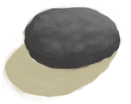

# 煅烧后的石头  
> 可以敲碎获取生石灰。  
   
> 一小块石灰岩。  它可以在<b>大石块</b>上打磨成<b>石刀</b>。 也可以在小石头上打磨，但耗时更久，对你的手损伤也更大。  
  
<table class="table table-bordered"><tbody><tr ><td  style="width:80%;text-align:left;vertical-align:top;" >**重量：**100  **标签：**	[“可烹饪的”](tag_Cookable.md), [“沉重的”](tag_Heavy.md)</td><td  style="width:20%;text-align:left;vertical-align:top;" >

</td></tr></tbody></tbody></table>  
  
## 获取来源  
<table class="table table-bordered"><thead><tr ><th  style="text-align:left;vertical-align:top;" >来源</th><th  style="text-align:left;vertical-align:top;" >操作</th></tr></thead><tr ><td  style="text-align:left;vertical-align:top;" >[

[石头](Stone.md)](Stone.md) , [

[石刀](StoneSharpened.md)](StoneSharpened.md) , [

[窑炉](Kiln.md)](Kiln.md)</td><td  style="text-align:left;vertical-align:top;" >煅烧石头</td></tr><tr ><td  style="text-align:left;vertical-align:top;" >[

[石头](Stone.md)](Stone.md) , [

[石刀](StoneSharpened.md)](StoneSharpened.md) , [

[高级窑炉](KilnAdvanced.md)](KilnAdvanced.md)</td><td  style="text-align:left;vertical-align:top;" >煅烧石头</td></tr></tbody></table>  
  
## 可拖入  
<table class="table table-bordered"><thead><tr ><th  style="text-align:left;vertical-align:top;" >使用</th><th  style="text-align:left;vertical-align:top;" >动作</th><th  style="text-align:left;vertical-align:top;" >耗时</th><th  style="text-align:left;vertical-align:top;" >条件</th><th  style="text-align:left;vertical-align:top;" >变化</th><th  style="text-align:left;vertical-align:top;" >玩家状态</th></tr></thead><tr ><td  style="text-align:left;vertical-align:top;" >[“锤”](tag_Hammer.md)</td><td  style="text-align:left;vertical-align:top;" >敲碎 [手部动作(组)](HandAction.md) [制造动作(组)](CraftAction.md)</td><td  style="text-align:left;vertical-align:top;" >30分</td><td  style="text-align:left;vertical-align:top;" ></td><td  style="text-align:left;vertical-align:top;" >** 自身: ** →消失  ** 使用物: ** 可用次数  -1  ** 获得: **   [

[生石灰](Quicklime.md)](Quicklime.md)(+3) </td><td  style="text-align:left;vertical-align:top;" ></td></tr></tbody></table>  
  

