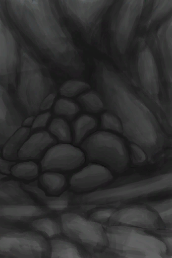
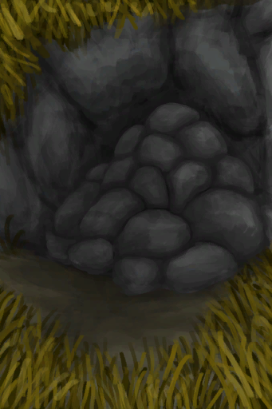
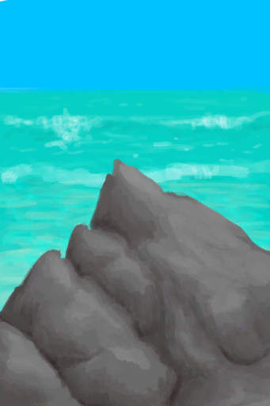

# 大石块  
> 一块又大又重的石头，理想的陷阱材料。也可以置于窑炉内煅烧成石灰。  
  
<table class="table table-bordered" data-toggle="table"  data-show-header="false"><thead style="display:none"><tr ><th  style="width:50%;text-align:left;vertical-align:top;"  >title</th><th  style="width:50%;text-align:left;vertical-align:top;"  ></th></tr></thead><tr ><td  style="width:50%;text-align:left;vertical-align:top;"  >**重量：**750  **标签：**	[“锤”](tag_Hammer.md), [“沉重的”](tag_Heavy.md)</td><td  style="width:50%;text-align:left;vertical-align:top;"  >

<a href="StoneHeavy.md" style="color:black">大石块</a>

大块的<b>石灰石</b>。足够的重量使其成为了<b>落石陷阱</b>的理想选择。  它们也可以用来<b>打磨</b>工具及其他石头，或在<b>窑</b>里面煅烧成<b>生石灰</b>。它们还有另外一种富含硫磺的淡黄色品种，可以煅烧出<b>硫磺</b>。</td></tr></tbody></table>  
  
## 获取来源  
<table class="table table-bordered" data-toggle="table"  ><thead style=""><tr ><th  style="text-align:left;vertical-align:top;"  >来源</th><th  style="text-align:left;vertical-align:top;"  >操作</th></tr></thead><tr ><td  style="text-align:left;vertical-align:top;"  >[

[落石陷阱](DeadfallTrap.md)](DeadfallTrap.md)</td><td  style="text-align:left;vertical-align:top;"  >拆除陷阱</td></tr><tr ><td  style="text-align:left;vertical-align:top;"  >[

[落石陷阱(未重置)](DeadfallTrapTriggered.md)](DeadfallTrapTriggered.md)</td><td  style="text-align:left;vertical-align:top;"  >拆除陷阱</td></tr><tr ><td  style="text-align:left;vertical-align:top;"  >[

[陷坑](TrappingPit.md)](TrappingPit.md)</td><td  style="text-align:left;vertical-align:top;"  >拆除陷阱</td></tr><tr ><td  style="text-align:left;vertical-align:top;"  >[

[陷坑](TrappingPitTriggered.md)](TrappingPitTriggered.md)</td><td  style="text-align:left;vertical-align:top;"  >拆除陷阱</td></tr><tr ><td  style="text-align:left;vertical-align:top;"  >[

[狭窄通道(洞穴底层)](CrystalChamberEntranceClosed.md)](CrystalChamberEntranceClosed.md)</td><td  style="text-align:left;vertical-align:top;"  >挖 ** 拖入：**[“锤”](tag_Hammer.md)</td></tr><tr ><td  style="text-align:left;vertical-align:top;"  >[

[狭窄通道(潮湿洞穴)](DarkCaveCaveEntranceClosed.md)](DarkCaveCaveEntranceClosed.md)</td><td  style="text-align:left;vertical-align:top;"  >挖 ** 拖入：**[“锤”](tag_Hammer.md)</td></tr><tr ><td  style="text-align:left;vertical-align:top;"  >[

[狭窄通道(洞穴中层)](DarkChamberCaveEntranceClosed.md)](DarkChamberCaveEntranceClosed.md)</td><td  style="text-align:left;vertical-align:top;"  >挖 ** 拖入：**[“锤”](tag_Hammer.md)</td></tr><tr ><td  style="text-align:left;vertical-align:top;"  >[

[狭窄通道(洞穴上层)](FloodedChamberEntranceClosed.md)](FloodedChamberEntranceClosed.md)</td><td  style="text-align:left;vertical-align:top;"  >挖 ** 拖入：**[“锤”](tag_Hammer.md)</td></tr><tr ><td  style="text-align:left;vertical-align:top;"  >[

[狭窄通道(隧道)](HighChamberEntranceClosed.md)](HighChamberEntranceClosed.md)</td><td  style="text-align:left;vertical-align:top;"  >挖 ** 拖入：**[“锤”](tag_Hammer.md)</td></tr><tr ><td  style="text-align:left;vertical-align:top;"  >[

[坍塌的隧道入口(东部高地)](TunnelEntranceClosed.md)](TunnelEntranceClosed.md)</td><td  style="text-align:left;vertical-align:top;"  >挖</td></tr><tr ><td  style="text-align:left;vertical-align:top;"  >[

[酸湖(火山)](AcidLake.md)](AcidLake.md)</td><td  style="text-align:left;vertical-align:top;"  >探索</td></tr><tr ><td  style="text-align:left;vertical-align:top;"  >[

[海湾](Bay.md)](Bay.md)</td><td  style="text-align:left;vertical-align:top;"  >随便逛逛</td></tr><tr ><td  style="text-align:left;vertical-align:top;"  >[

[沙滩](Beach.md)](Beach.md)</td><td  style="text-align:left;vertical-align:top;"  >随便逛逛</td></tr><tr ><td  style="text-align:left;vertical-align:top;"  >[

[鸟岩岛](BirdRock.md)](BirdRock.md)</td><td  style="text-align:left;vertical-align:top;"  >探索</td></tr><tr ><td  style="text-align:left;vertical-align:top;"  >[

[隐秘港湾(沙滩)](Cove.md)](Cove.md)</td><td  style="text-align:left;vertical-align:top;"  >探索</td></tr><tr ><td  style="text-align:left;vertical-align:top;"  >[

[丛林深处](DeepJungle.md)](DeepJungle.md)</td><td  style="text-align:left;vertical-align:top;"  >探索</td></tr><tr ><td  style="text-align:left;vertical-align:top;"  >[

[荒芜沙滩](DesolateBeach.md)](DesolateBeach.md)</td><td  style="text-align:left;vertical-align:top;"  >探索</td></tr><tr ><td  style="text-align:left;vertical-align:top;"  >[

[东部草原](GrasslandsE.md)](GrasslandsE.md)</td><td  style="text-align:left;vertical-align:top;"  >探索</td></tr><tr ><td  style="text-align:left;vertical-align:top;"  >[

[西部草原](GrasslandsW.md)](GrasslandsW.md)</td><td  style="text-align:left;vertical-align:top;"  >探索</td></tr><tr ><td  style="text-align:left;vertical-align:top;"  >[

[东部高地](HighlandsEastern.md)](HighlandsEastern.md)</td><td  style="text-align:left;vertical-align:top;"  >探索</td></tr><tr ><td  style="text-align:left;vertical-align:top;"  >[

[西部高地](HighlandsWestern.md)](HighlandsWestern.md)</td><td  style="text-align:left;vertical-align:top;"  >探索</td></tr><tr ><td  style="text-align:left;vertical-align:top;"  >[

[丛林](Jungle.md)](Jungle.md)</td><td  style="text-align:left;vertical-align:top;"  >探索</td></tr><tr ><td  style="text-align:left;vertical-align:top;"  >[

[丛林高地](JungleHighlands.md)](JungleHighlands.md)</td><td  style="text-align:left;vertical-align:top;"  >探索</td></tr><tr ><td  style="text-align:left;vertical-align:top;"  >[

[红树林](Mangroves.md)](Mangroves.md)</td><td  style="text-align:left;vertical-align:top;"  >探索</td></tr><tr ><td  style="text-align:left;vertical-align:top;"  >[

[丛林边缘](Outskirts.md)](Outskirts.md)</td><td  style="text-align:left;vertical-align:top;"  >探索</td></tr><tr ><td  style="text-align:left;vertical-align:top;"  >[

[岩滩](Rocks.md)](Rocks.md)</td><td  style="text-align:left;vertical-align:top;"  >探索</td></tr><tr ><td  style="text-align:left;vertical-align:top;"  >[

[神秘谷](SecretValley.md)](SecretValley.md)</td><td  style="text-align:left;vertical-align:top;"  >探索</td></tr><tr ><td  style="text-align:left;vertical-align:top;"  >[

[火山](Volcano.md)](Volcano.md)</td><td  style="text-align:left;vertical-align:top;"  >探索</td></tr><tr ><td  style="text-align:left;vertical-align:top;"  >[

[湿地丛林(湿地)](Wetlands.md)](Wetlands.md)</td><td  style="text-align:left;vertical-align:top;"  >探索</td></tr></tbody></table>  
  
## 可拖入  
<table class="table table-bordered" data-toggle="table"  ><thead style=""><tr ><th  style="text-align:left;vertical-align:top;"  >使用</th><th  style="text-align:left;vertical-align:top;"  >动作</th><th  style="text-align:left;vertical-align:top;"  >耗时</th><th  style="text-align:left;vertical-align:top;"  >条件</th><th  style="text-align:left;vertical-align:top;"  >变化</th><th  style="text-align:left;vertical-align:top;"  >玩家状态</th></tr></thead><tr ><td  style="text-align:left;vertical-align:top;"  >[

[石头](Stone.md)](Stone.md)</td><td  style="text-align:left;vertical-align:top;"  >打磨石头 [“手部动作(组)”](HandAction.md)</td><td  style="text-align:left;vertical-align:top;"  >1小时</td><td  style="text-align:left;vertical-align:top;"  >[

[光亮](Light.md)](Light.md): 10-100</td><td  style="text-align:left;vertical-align:top;"  > ** 使用物: ** → [

[石刀](StoneSharpened.md)](StoneSharpened.md) 可用次数  -1</td><td  style="text-align:left;vertical-align:top;"  >[

[手掌损伤](HandDamage.md)](HandDamage.md)+20 [

[制作(技能)](Skill_Crafting.md)](Skill_Crafting.md)+1</td></tr></tbody></table>  
  
## 可拖至  

[铜矿脉(洞穴上层)](CopperVein.md)

[干土堆](DirtPile.md)

[火炉(熄灭)](StoveExtinguished.md)

[泥堆](MudPile.md)

[水槽](WateringTrough.md)

[骨头碎片](BoneSplinters.md)

[骨头](Bones.md)

[木炭](Charcoal.md)

[椰子](Coconut.md)

[青椰子](CoconutHusked.md)

[带孔椰子](CoconutPerforated.md)

[腐烂的椰子](CoconutRotten.md)

[海螺](Conch.md)

[铜制装饰品](CopperDecoration_Mold.md)

[干辣椒](ChiliesDried.md)

[海螺肉](ConchMeat.md)

[姜](Ginger.md)

[干姜](GingerDried.md)

[茉莉花](JasmineFlowers.md)

[卡瓦根](KavaRoot.md)

[干燥的卡瓦根](KavaRootDried.md)

[母猪](BoarEnclosureFemale.md)

[公猪](BoarEnclosureMale.md)

[小猪](BoarEnclosurePiglet.md)

[母猪](BoarTiedFemale.md)

[公猪](BoarTiedMale.md)

[小猪](BoarTiedPiglet.md)

[母山羊](GoatEnclosureFemale.md)

[小羊](GoatEnclosureKid.md)

[哺乳期山羊](GoatEnclosureLactating.md)

[公山羊](GoatEnclosureMale.md)

[母山羊](GoatTiedFemale.md)

[哺乳期山羊](GoatTiedFemaleLactating.md)

[小羊](GoatTiedKid.md)

[公山羊](GoatTiedMale.md)

[柠檬草](LemongrassStalks.md)

[蜘蛛兰叶](SpiderLilyLeaves.md)

[干燥的蜘蛛兰叶](SpiderLilyLeavesDried.md)

[晶洞](Geode.md)

[大海螺](GiantConch.md)

[煅烧后的砂浆](MortarBurnt.md)

[泥砖](MudBrick.md)

[硝石晶体](NiterCrystals.md)

[牡蛎](Oyster.md)

[蛇草](SnakeGrass.md)

[煅烧后的石头](StoneBurnt.md)

[煅烧后的大石块](StoneHeavyBurnt.md)

[钝斧子头](AxeHeadBlunt.md)

[钝的求生斧](AxeSurvivalBlunt.md)

[钝刀](KnifeCopperBlunt.md)

[祖父的刀](KnifeGrandpa.md)

[祖父的钝刀](KnifeGrandpaBlunt.md)

[钝刀](KnifeMilitaryBlunt.md)

[钝矛头](SpearHeadBlunt.md)

[热带杏仁](TropicalAlmonds.md)

[海胆](Urchin.md)

[硫磺喷口(火山)](VentBrimstone.md)

[韦斯顿](Weston.md)

[狭窄通道(洞穴底层)](CrystalChamberEntranceClosed.md)

[狭窄通道(潮湿洞穴)](DarkCaveCaveEntranceClosed.md)

[狭窄通道(洞穴中层)](DarkChamberCaveEntranceClosed.md)

[狭窄通道(洞穴上层)](FloodedChamberEntranceClosed.md)

[狭窄通道(隧道)](HighChamberEntranceClosed.md)

[滤水器](WaterFilter.md)

  
  
## 可用于蓝图  

[

[铜板(蓝图)](Bp_CopperSheet.md)](Bp_CopperSheet.md)

[

[落石陷阱(蓝图)](Bp_DeadfallTrap.md)](Bp_DeadfallTrap.md)

[

[木质餐具(蓝图)](Bp_EatingUtensilsWooden.md)](Bp_EatingUtensilsWooden.md)

[

[石刀(蓝图)](Bp_SharpenedStone.md)](Bp_SharpenedStone.md)

[

[石屋(蓝图)](Bp_StoneHut.md)](Bp_StoneHut.md)

[

[陷坑(蓝图)](Bp_TrappingPit.md)](Bp_TrappingPit.md)

  
  
  
## 可用于转化  
<table class="table table-bordered" data-toggle="table"  ><thead style=""><tr ><th  style="text-align:left;vertical-align:top;"  >转化为</th><th  style="text-align:left;vertical-align:top;"  >容器</th></tr></thead><tr ><td  style="text-align:left;vertical-align:top;"  >[

[煅烧后的大石块](StoneHeavyBurnt.md)](StoneHeavyBurnt.md)</td><td  style="text-align:left;vertical-align:top;"  >[

[窑炉](Kiln.md)](Kiln.md)</td></tr><tr ><td  style="text-align:left;vertical-align:top;"  >[

[煅烧后的大石块](StoneHeavyBurnt.md)](StoneHeavyBurnt.md)</td><td  style="text-align:left;vertical-align:top;"  >[

[高级窑炉](KilnAdvanced.md)](KilnAdvanced.md)</td></tr></tbody></table>  
  

