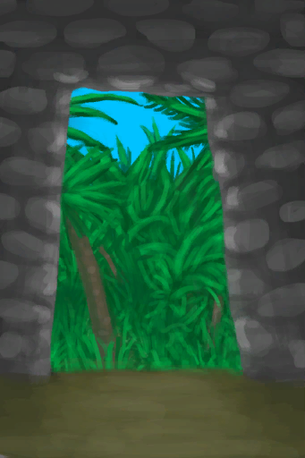

# 石屋  
> 进入石屋  
  
<table class="table table-bordered" data-toggle="table"  data-show-header="false"><thead style="display:none"><tr ><th  style="width:50%;text-align:left;vertical-align:top;"  >title</th><th  style="width:50%;text-align:left;vertical-align:top;"  ></th></tr></thead><tr ><td  style="width:50%;text-align:left;vertical-align:top;"  >** 可重命名 **</td><td  style="width:50%;text-align:left;vertical-align:top;"  >

<a href="StoneHutEntrance.md" style="color:black">石屋</a>

用<b>石头和砂浆</b>建造的房子。它能够抵御<b>风暴、雨水和日晒</b>。  石屋可以进行许多升级改进，包括扩展存储容量、屋门、给墙面刷漆等等。 石屋坚固的特性可以使其彻底免遭<b>风暴</b>的侵害。</td></tr></tbody></table>  
  
## 获取来源  

蓝图制造

[石屋(蓝图)](Bp_StoneHut.md)

  
  
## 动作  

<table><tr><td rowspan="2" style="width:200px;text-align:center;font-size:1.3em;font-weight:bold">

进入

</td><td></td></tr><tr><td></td></tr><tr><td colspan="2">[

[石屋(环境)](Env_StoneHut.md)](Env_StoneHut.md)(<b>+1</b>), [

[离开(石屋)](StoneHutExit.md)](StoneHutExit.md)(<b>+1</b>), [

[石屋](StoneHut.md)](StoneHut.md)(<b>+1</b>)</td></tr></table>
  
  
  

