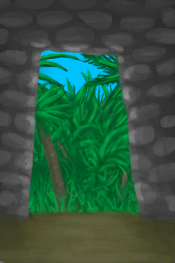

# 离开  
> 离开石屋  
  
  离开  |   图片   
 ----  |  ----:   
 ** 区域唯一 **  |     
  
## 获取来源  
来源  |  操作  
----  |  ----  
[石屋](StoneHutEntrance.md)  |  进入  
## 动作  
动作  |  耗时  |  条件  |  变化  |  状态  
----  |  ----  |  ----  |  ----  |  ----  
离开   |  -  |    |    |    
