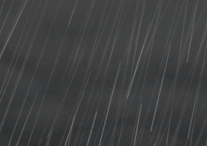

# 海湾风暴  
  

<b>基础值: </b> 0 
  

<b>变化范围: </b> 0 ~ 1 
  

<b>基础变化率: </b> 无 
  
  
## 加成值影响因素  
<table class="table table-bordered" data-toggle="table"  ><thead style=""><tr ><th  style="text-align:left;vertical-align:top;"  >来源</th><th  style="text-align:left;vertical-align:top;"  >操作</th><th  style="text-align:left;vertical-align:top;"  >值</th></tr></thead><tr ><td  style="text-align:left;vertical-align:top;"  >[风暴](TropicalIsland_Storm.md)</td><td  style="text-align:left;vertical-align:top;"  >被动效果</td><td  style="text-align:left;vertical-align:top;"  >加成+1</td></tr><tr ><td  style="text-align:left;vertical-align:top;"  >[风暴](TropicalIsland_StormInfinite.md)</td><td  style="text-align:left;vertical-align:top;"  >被动效果</td><td  style="text-align:left;vertical-align:top;"  >加成+1</td></tr><tr ><td  style="text-align:left;vertical-align:top;"  >[风暴](TropicalIsland_StormStart.md)</td><td  style="text-align:left;vertical-align:top;"  >被动效果</td><td  style="text-align:left;vertical-align:top;"  >加成+1</td></tr></tbody></table>  
  
  
## 可被以下操作改变  
<table class="table table-bordered" data-toggle="table"  ><thead style=""><tr ><th  style="text-align:left;vertical-align:top;"  data-sortable="true"  >来源</th><th  style="text-align:left;vertical-align:top;"  data-sortable="true"  >操作</th><th  style="text-align:left;vertical-align:top;"  data-sortable="true"  >值</th></tr></thead></tbody></table>  
  
  
## 被以下操作需求  
<table class="table table-bordered" data-toggle="table"  ><thead style=""><tr ><th  style="text-align:left;vertical-align:top;"  >来源</th><th  style="text-align:left;vertical-align:top;"  >操作</th><th  style="text-align:left;vertical-align:top;"  data-sortable="true"  >值</th></tr></thead><tr ><td  style="text-align:left;vertical-align:top;"  >[风暴侵袭(事件)](Event_StormDamage.md)</td><td  style="text-align:left;vertical-align:top;"  >触发事件</td><td  style="text-align:left;vertical-align:top;"  >1</td></tr></tbody></table>  
  
  
## 相关触发器  

<table><tr style="background-color:#F8F8F8"><td><b>风暴损失！</b></td></tr><tr><td><b>触发条件：</b>[海湾风暴](Storm_Bay.md): <b>1-1</b>, ~~[

[风暴](TropicalIsland_Storm.md)](TropicalIsland_Storm.md)存在于手中/面板~~, 位于[

[海湾(环境)](Env_Bay.md)](Env_Bay.md)</td></tr><tr><td>[

[风暴侵袭(事件)](Event_StormDamage.md)](Event_StormDamage.md)(<b>+1</b>)[海湾风暴](Storm_Bay.md)<b>-1</b></td></tr></table>
  

