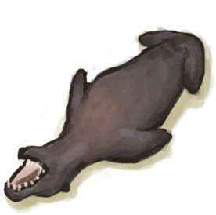
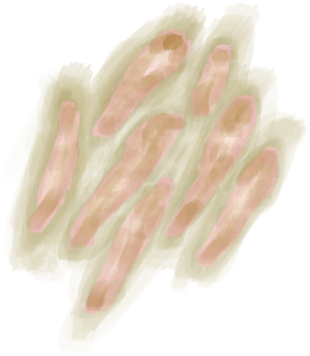
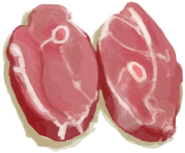

# 火炉  
> 我可以在这里烹饪或熏制食物。  
  
<table class="table table-bordered" data-toggle="table"  data-show-header="false"><thead style="display:none"><tr ><th  style="width:50%;text-align:left;vertical-align:top;"  >title</th><th  style="width:50%;text-align:left;vertical-align:top;"  ></th></tr></thead><tr ><td  style="width:50%;text-align:left;vertical-align:top;"  >** 不可删除 **  **标签：**	[“火”](tag_Fire.md)  **槽位：**4  **过滤器：**[“可烹饪的”](tag_Cookable.md) , [“储水容器”](tag_WaterContainer.md)  ** 效果: ** [

[保温](InsulationCold.md)](InsulationCold.md)+15 [

[湿度](Wetness.md)](Wetness.md)加成-1 [

[光亮](Light.md)](Light.md)+25</td><td  style="width:50%;text-align:left;vertical-align:top;"  >

<a href="Stove.md" style="color:black">火炉</a>

一种由泥砖制成的简易厨具，它只能在室内建造。  它有<b>4个烹饪槽</b>（比营火多2个）而且能够<b>熏制食物</b>使其保存更长时间。  火炉对体温的影响要低于营火，这使其更适合用于室内烹饪。</td></tr></tbody></table>  
  
## 获取来源  
<table class="table table-bordered" data-toggle="table"  ><thead style=""><tr ><th  style="text-align:left;vertical-align:top;"  >来源</th><th  style="text-align:left;vertical-align:top;"  >操作</th></tr></thead><tr ><td  style="text-align:left;vertical-align:top;"  >[

[火炉(熄灭)](StoveExtinguished.md)](StoveExtinguished.md)</td><td  style="text-align:left;vertical-align:top;"  >点燃 ** 拖入：**[火种](TinderLit.md)</td></tr></tbody></table>  
  
## 动作  
<table class="table table-bordered" data-toggle="table"  ><thead style=""><tr ><th  style="text-align:left;vertical-align:top;"  >动作</th><th  style="text-align:left;vertical-align:top;"  >耗时</th><th  style="text-align:left;vertical-align:top;"  data-sortable="true"  >条件</th><th  style="text-align:left;vertical-align:top;"  >变化</th><th  style="text-align:left;vertical-align:top;"  data-sortable="true"  >状态</th></tr></thead><tr ><td  style="text-align:left;vertical-align:top;"  >取出火炭 </td><td  style="text-align:left;vertical-align:top;"  >15分</td><td  style="text-align:left;vertical-align:top;"  ></td><td  style="text-align:left;vertical-align:top;"  >** 自身：** 燃料  -16(-11.11%) 

  -16(-100%)  ** 获得： ** ** [Embers]  **   [

[火炭](Embers.md)](Embers.md)(+1) 基础权重：1</td><td  style="text-align:left;vertical-align:top;"  ></td></tr><tr ><td  style="text-align:left;vertical-align:top;"  >熄灭火焰 </td><td  style="text-align:left;vertical-align:top;"  >-</td><td  style="text-align:left;vertical-align:top;"  ></td><td  style="text-align:left;vertical-align:top;"  >** 自身：** → [

[火炉(熄灭)](StoveExtinguished.md)](StoveExtinguished.md)</td><td  style="text-align:left;vertical-align:top;"  ></td></tr></tbody></table>  
  
## 可拖入  
<table class="table table-bordered" data-toggle="table"  ><thead style=""><tr ><th  style="text-align:left;vertical-align:top;"  >使用</th><th  style="text-align:left;vertical-align:top;"  >动作</th><th  style="text-align:left;vertical-align:top;"  data-sortable="true"  >耗时</th><th  style="text-align:left;vertical-align:top;"  data-sortable="true"  >条件</th><th  style="text-align:left;vertical-align:top;"  >变化</th><th  style="text-align:left;vertical-align:top;"  data-sortable="true"  >玩家状态</th></tr></thead><tr ><td  style="text-align:left;vertical-align:top;"  >[

[椰子壳](CoconutShell.md)](CoconutShell.md)</td><td  style="text-align:left;vertical-align:top;"  >添入椰子壳 </td><td  style="text-align:left;vertical-align:top;"  >-</td><td  style="text-align:left;vertical-align:top;"  ></td><td  style="text-align:left;vertical-align:top;"  >** 自身: ** 燃料  +3(2.08%)  ** 使用物: ** →消失</td><td  style="text-align:left;vertical-align:top;"  ></td></tr><tr ><td  style="text-align:left;vertical-align:top;"  >[

[木材](Wood.md)](Wood.md)</td><td  style="text-align:left;vertical-align:top;"  >添入柴火 </td><td  style="text-align:left;vertical-align:top;"  >-</td><td  style="text-align:left;vertical-align:top;"  ></td><td  style="text-align:left;vertical-align:top;"  >** 自身: ** 燃料  +28(19.44%)  ** 使用物: ** →消失</td><td  style="text-align:left;vertical-align:top;"  ></td></tr><tr ><td  style="text-align:left;vertical-align:top;"  >[“燃料”](tag_Fuel.md)</td><td  style="text-align:left;vertical-align:top;"  >添入燃料 </td><td  style="text-align:left;vertical-align:top;"  >-</td><td  style="text-align:left;vertical-align:top;"  ></td><td  style="text-align:left;vertical-align:top;"  >** 自身: ** 燃料  +7(4.86%)  ** 使用物: ** →消失</td><td  style="text-align:left;vertical-align:top;"  ></td></tr><tr ><td  style="text-align:left;vertical-align:top;"  >[

[木炭](Charcoal.md)](Charcoal.md) [

[火炭](Embers.md)](Embers.md)</td><td  style="text-align:left;vertical-align:top;"  >添入木炭 </td><td  style="text-align:left;vertical-align:top;"  >-</td><td  style="text-align:left;vertical-align:top;"  ></td><td  style="text-align:left;vertical-align:top;"  >** 自身: ** 燃料  +7(4.86%) 

  +7(43.75%)  ** 使用物: ** →消失</td><td  style="text-align:left;vertical-align:top;"  ></td></tr><tr ><td  style="text-align:left;vertical-align:top;"  >[

[枯叶](LeavesDry.md)](LeavesDry.md) [

[鸟巢](Nest.md)](Nest.md) [

[木屑](WoodShavings.md)](WoodShavings.md) [

[纤维](Fibers.md)](Fibers.md) [

[纸](Papers.md)](Papers.md)</td><td  style="text-align:left;vertical-align:top;"  >点燃火绒 </td><td  style="text-align:left;vertical-align:top;"  >-</td><td  style="text-align:left;vertical-align:top;"  ></td><td  style="text-align:left;vertical-align:top;"  > ** 使用物: ** → [

[火种](TinderLit.md)](TinderLit.md)</td><td  style="text-align:left;vertical-align:top;"  ></td></tr><tr ><td  style="text-align:left;vertical-align:top;"  >[“树叶”](tag_Leaves.md)</td><td  style="text-align:left;vertical-align:top;"  >添入树叶 </td><td  style="text-align:left;vertical-align:top;"  >-</td><td  style="text-align:left;vertical-align:top;"  ></td><td  style="text-align:left;vertical-align:top;"  >** 自身: ** 燃料  +2(1.39%)  ** 使用物: ** →消失</td><td  style="text-align:left;vertical-align:top;"  ></td></tr></tbody></table>  
  
## 可拖至  

[装有燃料的油桶](JerrycanFuel.md)

[熏蜂器(关)](BeeSmokerOff.md)

[香茅蜡烛(关)](CandleCitronellaOff.md)

[茉莉蜡烛(关)](CandleJasmineOff.md)

[蜡烛(关)](CandleOff.md)

[炸‍葯(关)](DynamiteOff.md)

[火把(关)](TorchOff.md)

  
  
## 转化  
<table class="table table-bordered" data-toggle="table"  ><thead style=""><tr ><th  style="text-align:left;vertical-align:top;"  >放入</th><th  style="text-align:left;vertical-align:top;"  >动作</th><th  style="text-align:left;vertical-align:top;"  >耗时</th><th  style="text-align:left;vertical-align:top;"  >条件</th><th  style="text-align:left;vertical-align:top;"  >变化</th><th  style="text-align:left;vertical-align:top;"  >玩家状态</th></tr></thead><tr ><td  style="text-align:left;vertical-align:top;"  >[

[蝙蝠尸体](Bat.md)](Bat.md)</td><td  style="text-align:left;vertical-align:top;"  >蝙蝠肉</td><td  style="text-align:left;vertical-align:top;"  >30分</td><td  style="text-align:left;vertical-align:top;"  ></td><td  style="text-align:left;vertical-align:top;"  >[

[烤蝙蝠](BatCooked.md)](BatCooked.md)(+1)</td><td  style="text-align:left;vertical-align:top;"  >[

[烹饪(技能)](Skill_Cooking.md)](Skill_Cooking.md)+0.25</td></tr><tr ><td  style="text-align:left;vertical-align:top;"  >[

[鸟肉](BirdMeat.md)](BirdMeat.md)</td><td  style="text-align:left;vertical-align:top;"  >鸟肉</td><td  style="text-align:left;vertical-align:top;"  >30分</td><td  style="text-align:left;vertical-align:top;"  ></td><td  style="text-align:left;vertical-align:top;"  >[

[烤鸟肉](BirdMeatCooked.md)](BirdMeatCooked.md)(+1)</td><td  style="text-align:left;vertical-align:top;"  >[

[烹饪(技能)](Skill_Cooking.md)](Skill_Cooking.md)+0.25</td></tr><tr ><td  style="text-align:left;vertical-align:top;"  >[

[烤鸟肉](BirdMeatCooked.md)](BirdMeatCooked.md)</td><td  style="text-align:left;vertical-align:top;"  >鸟肉熏制好了</td><td  style="text-align:left;vertical-align:top;"  >3小时</td><td  style="text-align:left;vertical-align:top;"  ></td><td  style="text-align:left;vertical-align:top;"  >[

[烟熏鸟肉](BirdMeatSmoked.md)](BirdMeatSmoked.md)(+1)</td><td  style="text-align:left;vertical-align:top;"  >[

[烹饪(技能)](Skill_Cooking.md)](Skill_Cooking.md)+0.25</td></tr><tr ><td  style="text-align:left;vertical-align:top;"  >[

[野猪肉](BoarMeat.md)](BoarMeat.md)</td><td  style="text-align:left;vertical-align:top;"  >野猪肉</td><td  style="text-align:left;vertical-align:top;"  >30分</td><td  style="text-align:left;vertical-align:top;"  ></td><td  style="text-align:left;vertical-align:top;"  >[

[烤野猪肉](BoarMeatCooked.md)](BoarMeatCooked.md)(+1)</td><td  style="text-align:left;vertical-align:top;"  >[

[烹饪(技能)](Skill_Cooking.md)](Skill_Cooking.md)+0.25</td></tr><tr ><td  style="text-align:left;vertical-align:top;"  >[

[烤野猪肉](BoarMeatCooked.md)](BoarMeatCooked.md)</td><td  style="text-align:left;vertical-align:top;"  >野猪肉熏制好了</td><td  style="text-align:left;vertical-align:top;"  >3小时</td><td  style="text-align:left;vertical-align:top;"  ></td><td  style="text-align:left;vertical-align:top;"  >[

[烟熏野猪肉](BoarMeatSmoked.md)](BoarMeatSmoked.md)(+1)</td><td  style="text-align:left;vertical-align:top;"  >[

[烹饪(技能)](Skill_Cooking.md)](Skill_Cooking.md)+0.25</td></tr><tr ><td  style="text-align:left;vertical-align:top;"  >[

[香茅油混合物](LQ_OilCitronellaMix.md)](LQ_OilCitronellaMix.md)</td><td  style="text-align:left;vertical-align:top;"  >熬制香茅精油</td><td  style="text-align:left;vertical-align:top;"  >1小时</td><td  style="text-align:left;vertical-align:top;"  ></td><td  style="text-align:left;vertical-align:top;"  >→ [

[香茅精油](LQ_OilCitronella.md)](LQ_OilCitronella.md)</td><td  style="text-align:left;vertical-align:top;"  ></td></tr><tr ><td  style="text-align:left;vertical-align:top;"  >[

[未熬制的胶水](GlueUncooked.md)](GlueUncooked.md)</td><td  style="text-align:left;vertical-align:top;"  >熬制胶水</td><td  style="text-align:left;vertical-align:top;"  >2小时</td><td  style="text-align:left;vertical-align:top;"  ></td><td  style="text-align:left;vertical-align:top;"  >[

[熬制好的胶水](GlueCooked.md)](GlueCooked.md)(+1)  含水量  -300</td><td  style="text-align:left;vertical-align:top;"  ></td></tr><tr ><td  style="text-align:left;vertical-align:top;"  >[

[茉莉油混合物](LQ_OilJasmineMix.md)](LQ_OilJasmineMix.md)</td><td  style="text-align:left;vertical-align:top;"  >熬制茉莉精油</td><td  style="text-align:left;vertical-align:top;"  >1小时</td><td  style="text-align:left;vertical-align:top;"  ></td><td  style="text-align:left;vertical-align:top;"  >→ [

[茉莉精油](LQ_OilJasmine.md)](LQ_OilJasmine.md)</td><td  style="text-align:left;vertical-align:top;"  ></td></tr><tr ><td  style="text-align:left;vertical-align:top;"  >[

[浸泡的米](LQ_SoakedRice.md)](LQ_SoakedRice.md)</td><td  style="text-align:left;vertical-align:top;"  >煮米饭</td><td  style="text-align:left;vertical-align:top;"  >30分</td><td  style="text-align:left;vertical-align:top;"  >** 需要容器：** [“金属容器”](tag_ContainerMetal.md)</td><td  style="text-align:left;vertical-align:top;"  >[

[米饭](RiceCooked.md)](RiceCooked.md)(+1)  → [

[米汤](LQ_WaterRice.md)](LQ_WaterRice.md)</td><td  style="text-align:left;vertical-align:top;"  ></td></tr><tr ><td  style="text-align:left;vertical-align:top;"  >[

[浸泡的米](LQ_SoakedRice.md)](LQ_SoakedRice.md)</td><td  style="text-align:left;vertical-align:top;"  >煮米饭</td><td  style="text-align:left;vertical-align:top;"  >45分</td><td  style="text-align:left;vertical-align:top;"  ></td><td  style="text-align:left;vertical-align:top;"  >[

[米饭](RiceCooked.md)](RiceCooked.md)(+1)  → [

[米汤](LQ_WaterRice.md)](LQ_WaterRice.md)</td><td  style="text-align:left;vertical-align:top;"  ></td></tr><tr ><td  style="text-align:left;vertical-align:top;"  >[

[盐水](LQ_WaterSalt.md)](LQ_WaterSalt.md)</td><td  style="text-align:left;vertical-align:top;"  >蒸发制盐</td><td  style="text-align:left;vertical-align:top;"  >30分</td><td  style="text-align:left;vertical-align:top;"  >** 需要属性：** 含水量: 250～999999 ** 需要容器：** [“金属容器”](tag_ContainerMetal.md)</td><td  style="text-align:left;vertical-align:top;"  >[

[盐](Salt.md)](Salt.md)(+1)  含水量  -300</td><td  style="text-align:left;vertical-align:top;"  ></td></tr><tr ><td  style="text-align:left;vertical-align:top;"  >[

[盐水](LQ_WaterSalt.md)](LQ_WaterSalt.md)</td><td  style="text-align:left;vertical-align:top;"  >蒸发制盐</td><td  style="text-align:left;vertical-align:top;"  >1小时</td><td  style="text-align:left;vertical-align:top;"  >** 需要属性：** 含水量: 250～999999</td><td  style="text-align:left;vertical-align:top;"  >[

[盐](Salt.md)](Salt.md)(+1)  含水量  -300</td><td  style="text-align:left;vertical-align:top;"  ></td></tr><tr ><td  style="text-align:left;vertical-align:top;"  >[

[水椰树汁](LQ_Sap.md)](LQ_Sap.md)</td><td  style="text-align:left;vertical-align:top;"  >熬煮树汁</td><td  style="text-align:left;vertical-align:top;"  >1小时</td><td  style="text-align:left;vertical-align:top;"  >** 需要属性：** 含水量: 250～999999</td><td  style="text-align:left;vertical-align:top;"  >[

[糖](Sugar.md)](Sugar.md)(+2)  含水量  -300</td><td  style="text-align:left;vertical-align:top;"  ></td></tr><tr ><td  style="text-align:left;vertical-align:top;"  >[“灌溉用水”](tag_WaterFresh.md)</td><td  style="text-align:left;vertical-align:top;"  >烧开水</td><td  style="text-align:left;vertical-align:top;"  >15分</td><td  style="text-align:left;vertical-align:top;"  >** 需要容器：** [“金属容器”](tag_ContainerMetal.md)</td><td  style="text-align:left;vertical-align:top;"  >→ [

[开水](LQ_WaterBoiling.md)](LQ_WaterBoiling.md)</td><td  style="text-align:left;vertical-align:top;"  ></td></tr><tr ><td  style="text-align:left;vertical-align:top;"  >[“灌溉用水”](tag_WaterFresh.md)</td><td  style="text-align:left;vertical-align:top;"  >烧开水</td><td  style="text-align:left;vertical-align:top;"  >30分</td><td  style="text-align:left;vertical-align:top;"  ></td><td  style="text-align:left;vertical-align:top;"  >→ [

[开水](LQ_WaterBoiling.md)](LQ_WaterBoiling.md)</td><td  style="text-align:left;vertical-align:top;"  ></td></tr><tr ><td  style="text-align:left;vertical-align:top;"  >[

[开水](LQ_WaterBoiling.md)](LQ_WaterBoiling.md)</td><td  style="text-align:left;vertical-align:top;"  >烧开水</td><td  style="text-align:left;vertical-align:top;"  >15分</td><td  style="text-align:left;vertical-align:top;"  ></td><td  style="text-align:left;vertical-align:top;"  >燃料  +2</td><td  style="text-align:left;vertical-align:top;"  ></td></tr><tr ><td  style="text-align:left;vertical-align:top;"  >[

[浸泡的参薯](LQ_SoakedYam.md)](LQ_SoakedYam.md)</td><td  style="text-align:left;vertical-align:top;"  >煮参薯</td><td  style="text-align:left;vertical-align:top;"  >45分</td><td  style="text-align:left;vertical-align:top;"  >** 需要容器：** [“金属容器”](tag_ContainerMetal.md)</td><td  style="text-align:left;vertical-align:top;"  >[

[煮熟的参薯](YamBoiled.md)](YamBoiled.md)(+1)  含水量  -300</td><td  style="text-align:left;vertical-align:top;"  ></td></tr><tr ><td  style="text-align:left;vertical-align:top;"  >[

[浸泡的参薯](LQ_SoakedYam.md)](LQ_SoakedYam.md)</td><td  style="text-align:left;vertical-align:top;"  >煮参薯</td><td  style="text-align:left;vertical-align:top;"  >1小时</td><td  style="text-align:left;vertical-align:top;"  ></td><td  style="text-align:left;vertical-align:top;"  >[

[煮熟的参薯](YamBoiled.md)](YamBoiled.md)(+1)  含水量  -300</td><td  style="text-align:left;vertical-align:top;"  ></td></tr><tr ><td  style="text-align:left;vertical-align:top;"  >[

[北梭鱼肉](BonefishMeat.md)](BonefishMeat.md)</td><td  style="text-align:left;vertical-align:top;"  >北梭鱼</td><td  style="text-align:left;vertical-align:top;"  >30分</td><td  style="text-align:left;vertical-align:top;"  ></td><td  style="text-align:left;vertical-align:top;"  >[

[烤北梭鱼](BonefishCooked.md)](BonefishCooked.md)(+1)</td><td  style="text-align:left;vertical-align:top;"  >[

[烹饪(技能)](Skill_Cooking.md)](Skill_Cooking.md)+0.25</td></tr><tr ><td  style="text-align:left;vertical-align:top;"  >[

[烤北梭鱼](BonefishCooked.md)](BonefishCooked.md)</td><td  style="text-align:left;vertical-align:top;"  >北梭鱼熏制好了</td><td  style="text-align:left;vertical-align:top;"  >3小时</td><td  style="text-align:left;vertical-align:top;"  ></td><td  style="text-align:left;vertical-align:top;"  >[

[烟熏北梭鱼](BonefishSmoked.md)](BonefishSmoked.md)(+1)</td><td  style="text-align:left;vertical-align:top;"  >[

[烹饪(技能)](Skill_Cooking.md)](Skill_Cooking.md)+0.25</td></tr><tr ><td  style="text-align:left;vertical-align:top;"  >[

[未烹饪的黄油牡蛎](ButterBakedOystersUncooked.md)](ButterBakedOystersUncooked.md)</td><td  style="text-align:left;vertical-align:top;"  >黄油焗牡蛎</td><td  style="text-align:left;vertical-align:top;"  >30分</td><td  style="text-align:left;vertical-align:top;"  ></td><td  style="text-align:left;vertical-align:top;"  >[

[黄油焗牡蛎](ButterBakedOystersCooked.md)](ButterBakedOystersCooked.md)(+1)</td><td  style="text-align:left;vertical-align:top;"  >[

[烹饪(技能)](Skill_Cooking.md)](Skill_Cooking.md)+0.25</td></tr><tr ><td  style="text-align:left;vertical-align:top;"  >[

[未烹饪的姜糖](CandiedGingerUncooked.md)](CandiedGingerUncooked.md)</td><td  style="text-align:left;vertical-align:top;"  >姜糖</td><td  style="text-align:left;vertical-align:top;"  >45分</td><td  style="text-align:left;vertical-align:top;"  ></td><td  style="text-align:left;vertical-align:top;"  >[

[姜糖(做好的)](CandiedGingerCooked.md)](CandiedGingerCooked.md)(+1)</td><td  style="text-align:left;vertical-align:top;"  >[

[烹饪(技能)](Skill_Cooking.md)](Skill_Cooking.md)+0.25</td></tr><tr ><td  style="text-align:left;vertical-align:top;"  >[

[烤弹涂鱼](MudskipperCooked.md)](MudskipperCooked.md) [

[烤海螺肉](ConchMeatCooked.md)](ConchMeatCooked.md) [

[松软的烤海螺肉](ConchMeatSoftCooked.md)](ConchMeatSoftCooked.md) [

[烤螃蟹](CrabCooked.md)](CrabCooked.md) [

[烤虾](PrawnsCooked.md)](PrawnsCooked.md) [

[烤鱼杂](FishScrapsCooked.md)](FishScrapsCooked.md) [

[烤热带杏仁](TropicalAlmondsRoasted.md)](TropicalAlmondsRoasted.md) [

[烤蛋](EggCooked.md)](EggCooked.md) [

[水煮蛋](EggBoiled.md)](EggBoiled.md) [

[烤海胆](UrchinMeatCooked.md)](UrchinMeatCooked.md) [

[西米饼](SagoFlatbread.md)](SagoFlatbread.md) [

[烤椰肉](CoconutMeatCooked.md)](CoconutMeatCooked.md) [

[烤鱼片](FishSlicesCooked.md)](FishSlicesCooked.md) [

[烤老鼠](MouseCooked.md)](MouseCooked.md) [

[烤蝙蝠](BatCooked.md)](BatCooked.md) [

[烤蜥蜴](LizardCooked.md)](LizardCooked.md) [

[烤蛇肉](SnakeCooked.md)](SnakeCooked.md) [

[烤牡蛎肉](OysterMeatCooked.md)](OysterMeatCooked.md)</td><td  style="text-align:left;vertical-align:top;"  >烧焦物</td><td  style="text-align:left;vertical-align:top;"  >1小时</td><td  style="text-align:left;vertical-align:top;"  ></td><td  style="text-align:left;vertical-align:top;"  >[

[烧焦物](CharredRemains.md)](CharredRemains.md)(+1)</td><td  style="text-align:left;vertical-align:top;"  ></td></tr><tr ><td  style="text-align:left;vertical-align:top;"  >[

[未烹饪的椰子鱼](CoconutFishUncooked.md)](CoconutFishUncooked.md)</td><td  style="text-align:left;vertical-align:top;"  >椰子鱼</td><td  style="text-align:left;vertical-align:top;"  >45分</td><td  style="text-align:left;vertical-align:top;"  ></td><td  style="text-align:left;vertical-align:top;"  >[

[椰子鱼](CoconutFish.md)](CoconutFish.md)(+1)</td><td  style="text-align:left;vertical-align:top;"  >[

[烹饪(技能)](Skill_Cooking.md)](Skill_Cooking.md)+0.25</td></tr><tr ><td  style="text-align:left;vertical-align:top;"  >[

[椰肉](CoconutMeat.md)](CoconutMeat.md)</td><td  style="text-align:left;vertical-align:top;"  >椰肉</td><td  style="text-align:left;vertical-align:top;"  >30分</td><td  style="text-align:left;vertical-align:top;"  ></td><td  style="text-align:left;vertical-align:top;"  >[

[烤椰肉](CoconutMeatCooked.md)](CoconutMeatCooked.md)(+1)</td><td  style="text-align:left;vertical-align:top;"  >[

[烹饪(技能)](Skill_Cooking.md)](Skill_Cooking.md)+0.25</td></tr><tr ><td  style="text-align:left;vertical-align:top;"  >[

[咖啡豆](CoffeeBeans.md)](CoffeeBeans.md)</td><td  style="text-align:left;vertical-align:top;"  >咖啡</td><td  style="text-align:left;vertical-align:top;"  >30分</td><td  style="text-align:left;vertical-align:top;"  ></td><td  style="text-align:left;vertical-align:top;"  >[

[烤咖啡豆](CoffeeRoastedBeans.md)](CoffeeRoastedBeans.md)(+1)</td><td  style="text-align:left;vertical-align:top;"  >[

[烹饪(技能)](Skill_Cooking.md)](Skill_Cooking.md)+0.25</td></tr><tr ><td  style="text-align:left;vertical-align:top;"  >[

[海螺肉](ConchMeat.md)](ConchMeat.md)</td><td  style="text-align:left;vertical-align:top;"  >海螺肉</td><td  style="text-align:left;vertical-align:top;"  >30分</td><td  style="text-align:left;vertical-align:top;"  ></td><td  style="text-align:left;vertical-align:top;"  >[

[烤海螺肉](ConchMeatCooked.md)](ConchMeatCooked.md)(+1)</td><td  style="text-align:left;vertical-align:top;"  >[

[烹饪(技能)](Skill_Cooking.md)](Skill_Cooking.md)+0.25</td></tr><tr ><td  style="text-align:left;vertical-align:top;"  >[

[装有燃料的油桶](JerrycanFuel.md)](JerrycanFuel.md)</td><td  style="text-align:left;vertical-align:top;"  >加热油桶</td><td  style="text-align:left;vertical-align:top;"  >30分</td><td  style="text-align:left;vertical-align:top;"  ></td><td  style="text-align:left;vertical-align:top;"  >[

[<b>砰！！！</b>(事件)](Event_JerrycanExplosion.md)](Event_JerrycanExplosion.md)(+1)</td><td  style="text-align:left;vertical-align:top;"  ></td></tr><tr ><td  style="text-align:left;vertical-align:top;"  >[

[螃蟹](Crab.md)](Crab.md)</td><td  style="text-align:left;vertical-align:top;"  >螃蟹</td><td  style="text-align:left;vertical-align:top;"  >30分</td><td  style="text-align:left;vertical-align:top;"  ></td><td  style="text-align:left;vertical-align:top;"  >[

[烤螃蟹](CrabCooked.md)](CrabCooked.md)(+1)</td><td  style="text-align:left;vertical-align:top;"  >[

[烹饪(技能)](Skill_Cooking.md)](Skill_Cooking.md)+0.25</td></tr><tr ><td  style="text-align:left;vertical-align:top;"  >[

[未烹饪的醉蟹](DrunkenCrabUncooked.md)](DrunkenCrabUncooked.md)</td><td  style="text-align:left;vertical-align:top;"  >醉蟹</td><td  style="text-align:left;vertical-align:top;"  >30分</td><td  style="text-align:left;vertical-align:top;"  ></td><td  style="text-align:left;vertical-align:top;"  >[

[醉蟹](DrunkenCrab.md)](DrunkenCrab.md)(+1)</td><td  style="text-align:left;vertical-align:top;"  >[

[烹饪(技能)](Skill_Cooking.md)](Skill_Cooking.md)+0.25</td></tr><tr ><td  style="text-align:left;vertical-align:top;"  >[

[辣椒](Chilies.md)](Chilies.md)</td><td  style="text-align:left;vertical-align:top;"  >烘干辣椒</td><td  style="text-align:left;vertical-align:top;"  >15分</td><td  style="text-align:left;vertical-align:top;"  ></td><td  style="text-align:left;vertical-align:top;"  >能量  +4</td><td  style="text-align:left;vertical-align:top;"  ></td></tr><tr ><td  style="text-align:left;vertical-align:top;"  >[

[金鸡纳树皮](BarkCinchona.md)](BarkCinchona.md)</td><td  style="text-align:left;vertical-align:top;"  >烘干金鸡纳树皮</td><td  style="text-align:left;vertical-align:top;"  >15分</td><td  style="text-align:left;vertical-align:top;"  ></td><td  style="text-align:left;vertical-align:top;"  >能量  +4</td><td  style="text-align:left;vertical-align:top;"  ></td></tr><tr ><td  style="text-align:left;vertical-align:top;"  >[

[姜](Ginger.md)](Ginger.md)</td><td  style="text-align:left;vertical-align:top;"  >烘干生姜</td><td  style="text-align:left;vertical-align:top;"  >15分</td><td  style="text-align:left;vertical-align:top;"  ></td><td  style="text-align:left;vertical-align:top;"  >能量  +4</td><td  style="text-align:left;vertical-align:top;"  ></td></tr><tr ><td  style="text-align:left;vertical-align:top;"  >[

[蜘蛛兰叶](SpiderLilyLeaves.md)](SpiderLilyLeaves.md)</td><td  style="text-align:left;vertical-align:top;"  >烘干蜘蛛兰叶</td><td  style="text-align:left;vertical-align:top;"  >15分</td><td  style="text-align:left;vertical-align:top;"  ></td><td  style="text-align:left;vertical-align:top;"  >能量  +4</td><td  style="text-align:left;vertical-align:top;"  ></td></tr><tr ><td  style="text-align:left;vertical-align:top;"  >[

[卡瓦根](KavaRoot.md)](KavaRoot.md)</td><td  style="text-align:left;vertical-align:top;"  >烘干卡瓦根</td><td  style="text-align:left;vertical-align:top;"  >15分</td><td  style="text-align:left;vertical-align:top;"  ></td><td  style="text-align:left;vertical-align:top;"  >能量  +4</td><td  style="text-align:left;vertical-align:top;"  ></td></tr><tr ><td  style="text-align:left;vertical-align:top;"  >[

[蛋](Egg.md)](Egg.md) [

[受精蛋](EggPartridgeFertilized.md)](EggPartridgeFertilized.md)</td><td  style="text-align:left;vertical-align:top;"  >蛋</td><td  style="text-align:left;vertical-align:top;"  >15分</td><td  style="text-align:left;vertical-align:top;"  ></td><td  style="text-align:left;vertical-align:top;"  >[

[烤蛋](EggCooked.md)](EggCooked.md)(+1)</td><td  style="text-align:left;vertical-align:top;"  >[

[烹饪(技能)](Skill_Cooking.md)](Skill_Cooking.md)+0.25</td></tr><tr ><td  style="text-align:left;vertical-align:top;"  >[

[未烹饪的炸鱼薯条](FishNChipsUncooked.md)](FishNChipsUncooked.md)</td><td  style="text-align:left;vertical-align:top;"  >炸鱼薯条</td><td  style="text-align:left;vertical-align:top;"  >45分</td><td  style="text-align:left;vertical-align:top;"  ></td><td  style="text-align:left;vertical-align:top;"  >[

[炸鱼薯条](FishNChips.md)](FishNChips.md)(+1)</td><td  style="text-align:left;vertical-align:top;"  >[

[烹饪(技能)](Skill_Cooking.md)](Skill_Cooking.md)+0.25</td></tr><tr ><td  style="text-align:left;vertical-align:top;"  >[

[未烹饪的鱼肉蛋饼](FishOmeletteUncooked.md)](FishOmeletteUncooked.md)</td><td  style="text-align:left;vertical-align:top;"  >鱼肉煎蛋饼</td><td  style="text-align:left;vertical-align:top;"  >30分</td><td  style="text-align:left;vertical-align:top;"  ></td><td  style="text-align:left;vertical-align:top;"  >[

[鱼肉蛋饼](FishOmelette.md)](FishOmelette.md)(+1)</td><td  style="text-align:left;vertical-align:top;"  >[

[烹饪(技能)](Skill_Cooking.md)](Skill_Cooking.md)+0.25</td></tr><tr ><td  style="text-align:left;vertical-align:top;"  >[

[鱼杂](FishScraps.md)](FishScraps.md)</td><td  style="text-align:left;vertical-align:top;"  >鱼杂</td><td  style="text-align:left;vertical-align:top;"  >30分</td><td  style="text-align:left;vertical-align:top;"  ></td><td  style="text-align:left;vertical-align:top;"  >[

[烤鱼杂](FishScrapsCooked.md)](FishScrapsCooked.md)(+0)  → [

[烤鱼杂](FishScrapsCooked.md)](FishScrapsCooked.md)</td><td  style="text-align:left;vertical-align:top;"  >[

[烹饪(技能)](Skill_Cooking.md)](Skill_Cooking.md)+0.25</td></tr><tr ><td  style="text-align:left;vertical-align:top;"  >[

[鱼片](FishSlices.md)](FishSlices.md)</td><td  style="text-align:left;vertical-align:top;"  >鱼片</td><td  style="text-align:left;vertical-align:top;"  >30分</td><td  style="text-align:left;vertical-align:top;"  ></td><td  style="text-align:left;vertical-align:top;"  >[

[烤鱼片](FishSlicesCooked.md)](FishSlicesCooked.md)(+0)  → [

[烤鱼片](FishSlicesCooked.md)](FishSlicesCooked.md)</td><td  style="text-align:left;vertical-align:top;"  >[

[烹饪(技能)](Skill_Cooking.md)](Skill_Cooking.md)+0.25</td></tr><tr ><td  style="text-align:left;vertical-align:top;"  >[

[西米粉](SagoFlour.md)](SagoFlour.md)</td><td  style="text-align:left;vertical-align:top;"  >面饼</td><td  style="text-align:left;vertical-align:top;"  >30分</td><td  style="text-align:left;vertical-align:top;"  ></td><td  style="text-align:left;vertical-align:top;"  >[

[西米饼](SagoFlatbread.md)](SagoFlatbread.md)(+1)</td><td  style="text-align:left;vertical-align:top;"  >[

[烹饪(技能)](Skill_Cooking.md)](Skill_Cooking.md)+0.25</td></tr><tr ><td  style="text-align:left;vertical-align:top;"  >[

[未烹饪的炸香蕉](FriedBananasUncooked.md)](FriedBananasUncooked.md)</td><td  style="text-align:left;vertical-align:top;"  >炸香蕉</td><td  style="text-align:left;vertical-align:top;"  >45分</td><td  style="text-align:left;vertical-align:top;"  ></td><td  style="text-align:left;vertical-align:top;"  >[

[熟的炸香蕉](FriedBananasCooked.md)](FriedBananasCooked.md)(+1)</td><td  style="text-align:left;vertical-align:top;"  >[

[烹饪(技能)](Skill_Cooking.md)](Skill_Cooking.md)+0.25</td></tr><tr ><td  style="text-align:left;vertical-align:top;"  >[

[未烹饪的炒菇球](FriedPuffballsUncooked.md)](FriedPuffballsUncooked.md)</td><td  style="text-align:left;vertical-align:top;"  >炒菇球</td><td  style="text-align:left;vertical-align:top;"  >30分</td><td  style="text-align:left;vertical-align:top;"  ></td><td  style="text-align:left;vertical-align:top;"  >[

[炒菇球](FriedPuffballs.md)](FriedPuffballs.md)(+1)</td><td  style="text-align:left;vertical-align:top;"  >[

[烹饪(技能)](Skill_Cooking.md)](Skill_Cooking.md)+0.25</td></tr><tr ><td  style="text-align:left;vertical-align:top;"  >[

[干胶水](GlueDry.md)](GlueDry.md)</td><td  style="text-align:left;vertical-align:top;"  >加热胶水</td><td  style="text-align:left;vertical-align:top;"  >15分</td><td  style="text-align:left;vertical-align:top;"  ></td><td  style="text-align:left;vertical-align:top;"  >[

[胶水](Glue.md)](Glue.md)(+1)</td><td  style="text-align:left;vertical-align:top;"  ></td></tr><tr ><td  style="text-align:left;vertical-align:top;"  >[

[羊肉](GoatMeat.md)](GoatMeat.md)</td><td  style="text-align:left;vertical-align:top;"  >羊肉</td><td  style="text-align:left;vertical-align:top;"  >30分</td><td  style="text-align:left;vertical-align:top;"  ></td><td  style="text-align:left;vertical-align:top;"  >[

[烤羊肉](GoatMeatCooked.md)](GoatMeatCooked.md)(+1)</td><td  style="text-align:left;vertical-align:top;"  >[

[烹饪(技能)](Skill_Cooking.md)](Skill_Cooking.md)+0.25</td></tr><tr ><td  style="text-align:left;vertical-align:top;"  >[

[烤羊肉](GoatMeatCooked.md)](GoatMeatCooked.md)</td><td  style="text-align:left;vertical-align:top;"  >羊肉熏制好了</td><td  style="text-align:left;vertical-align:top;"  >3小时</td><td  style="text-align:left;vertical-align:top;"  ></td><td  style="text-align:left;vertical-align:top;"  >[

[烟熏羊肉](GoatMeatSmoked.md)](GoatMeatSmoked.md)(+1)</td><td  style="text-align:left;vertical-align:top;"  >[

[烹饪(技能)](Skill_Cooking.md)](Skill_Cooking.md)+0.25</td></tr><tr ><td  style="text-align:left;vertical-align:top;"  >[

[未烹饪的羊汤](GoatStewUncooked.md)](GoatStewUncooked.md)</td><td  style="text-align:left;vertical-align:top;"  >炖羊肉</td><td  style="text-align:left;vertical-align:top;"  >2小时</td><td  style="text-align:left;vertical-align:top;"  ></td><td  style="text-align:left;vertical-align:top;"  >[

[炖羊汤](GoatStew.md)](GoatStew.md)(+1)</td><td  style="text-align:left;vertical-align:top;"  >[

[烹饪(技能)](Skill_Cooking.md)](Skill_Cooking.md)+0.25</td></tr><tr ><td  style="text-align:left;vertical-align:top;"  >[

[绯鲤](Goatfish.md)](Goatfish.md)</td><td  style="text-align:left;vertical-align:top;"  >绯鲤</td><td  style="text-align:left;vertical-align:top;"  >30分</td><td  style="text-align:left;vertical-align:top;"  ></td><td  style="text-align:left;vertical-align:top;"  >[

[烤绯鲤](GoatfishCooked.md)](GoatfishCooked.md)(+1)</td><td  style="text-align:left;vertical-align:top;"  >[

[烹饪(技能)](Skill_Cooking.md)](Skill_Cooking.md)+0.25</td></tr><tr ><td  style="text-align:left;vertical-align:top;"  >[

[烤绯鲤](GoatfishCooked.md)](GoatfishCooked.md)</td><td  style="text-align:left;vertical-align:top;"  >绯鲤熏制好了</td><td  style="text-align:left;vertical-align:top;"  >3小时</td><td  style="text-align:left;vertical-align:top;"  ></td><td  style="text-align:left;vertical-align:top;"  >[

[烟熏绯鲤](GoatfishSmoked.md)](GoatfishSmoked.md)(+1)</td><td  style="text-align:left;vertical-align:top;"  >[

[烹饪(技能)](Skill_Cooking.md)](Skill_Cooking.md)+0.25</td></tr><tr ><td  style="text-align:left;vertical-align:top;"  >[

[石斑鱼肉](GrouperMeat.md)](GrouperMeat.md)</td><td  style="text-align:left;vertical-align:top;"  >石斑鱼</td><td  style="text-align:left;vertical-align:top;"  >30分</td><td  style="text-align:left;vertical-align:top;"  ></td><td  style="text-align:left;vertical-align:top;"  >[

[烤石斑鱼](GrouperMeatCooked.md)](GrouperMeatCooked.md)(+1)</td><td  style="text-align:left;vertical-align:top;"  >[

[烹饪(技能)](Skill_Cooking.md)](Skill_Cooking.md)+0.25</td></tr><tr ><td  style="text-align:left;vertical-align:top;"  >[

[烤石斑鱼](GrouperMeatCooked.md)](GrouperMeatCooked.md)</td><td  style="text-align:left;vertical-align:top;"  >烟熏石斑鱼</td><td  style="text-align:left;vertical-align:top;"  >30分</td><td  style="text-align:left;vertical-align:top;"  ></td><td  style="text-align:left;vertical-align:top;"  >[

[烟熏石斑鱼](GrouperMeatSmoked.md)](GrouperMeatSmoked.md)(+1)</td><td  style="text-align:left;vertical-align:top;"  >[

[烹饪(技能)](Skill_Cooking.md)](Skill_Cooking.md)+0.25</td></tr><tr ><td  style="text-align:left;vertical-align:top;"  >[

[干胶水](GlueDry.md)](GlueDry.md)</td><td  style="text-align:left;vertical-align:top;"  >加热中的胶水</td><td  style="text-align:left;vertical-align:top;"  >2小时</td><td  style="text-align:left;vertical-align:top;"  ></td><td  style="text-align:left;vertical-align:top;"  >[

[胶水](Glue.md)](Glue.md)(+1)  含水量  -300</td><td  style="text-align:left;vertical-align:top;"  ></td></tr><tr ><td  style="text-align:left;vertical-align:top;"  >[

[鲱鱼](Herring.md)](Herring.md)</td><td  style="text-align:left;vertical-align:top;"  >鲱鱼</td><td  style="text-align:left;vertical-align:top;"  >30分</td><td  style="text-align:left;vertical-align:top;"  ></td><td  style="text-align:left;vertical-align:top;"  >[

[烤鲱鱼](HerringCooked.md)](HerringCooked.md)(+1)</td><td  style="text-align:left;vertical-align:top;"  >[

[烹饪(技能)](Skill_Cooking.md)](Skill_Cooking.md)+0.25</td></tr><tr ><td  style="text-align:left;vertical-align:top;"  >[

[未烹饪的蜜糖](HoneyCandyUncooked.md)](HoneyCandyUncooked.md)</td><td  style="text-align:left;vertical-align:top;"  >蜜糖</td><td  style="text-align:left;vertical-align:top;"  >1小时30分</td><td  style="text-align:left;vertical-align:top;"  ></td><td  style="text-align:left;vertical-align:top;"  >[

[蜜糖(做好的)](HoneyCandyCooked.md)](HoneyCandyCooked.md)(+1)</td><td  style="text-align:left;vertical-align:top;"  >[

[烹饪(技能)](Skill_Cooking.md)](Skill_Cooking.md)+0.25</td></tr><tr ><td  style="text-align:left;vertical-align:top;"  >[

[未烹饪的蜜汁火腿](HoneyGlazedPorkUncooked.md)](HoneyGlazedPorkUncooked.md)</td><td  style="text-align:left;vertical-align:top;"  >蜜汁火腿</td><td  style="text-align:left;vertical-align:top;"  >1小时30分</td><td  style="text-align:left;vertical-align:top;"  ></td><td  style="text-align:left;vertical-align:top;"  >[

[蜜汁火腿](HoneyGlazedPork.md)](HoneyGlazedPork.md)(+1)</td><td  style="text-align:left;vertical-align:top;"  >[

[烹饪(技能)](Skill_Cooking.md)](Skill_Cooking.md)+0.25</td></tr><tr ><td  style="text-align:left;vertical-align:top;"  >[

[未烹饪的热带烤鸡](IslandChickenUncooked.md)](IslandChickenUncooked.md)</td><td  style="text-align:left;vertical-align:top;"  >热带烤鸡</td><td  style="text-align:left;vertical-align:top;"  >45分</td><td  style="text-align:left;vertical-align:top;"  ></td><td  style="text-align:left;vertical-align:top;"  >[

[热带烤鸡](IslandChicken.md)](IslandChicken.md)(+1)</td><td  style="text-align:left;vertical-align:top;"  >[

[烹饪(技能)](Skill_Cooking.md)](Skill_Cooking.md)+0.25</td></tr><tr ><td  style="text-align:left;vertical-align:top;"  >[

[蜥蜴](Lizard.md)](Lizard.md)</td><td  style="text-align:left;vertical-align:top;"  >蜥蜴</td><td  style="text-align:left;vertical-align:top;"  >30分</td><td  style="text-align:left;vertical-align:top;"  ></td><td  style="text-align:left;vertical-align:top;"  >[

[烤蜥蜴](LizardCooked.md)](LizardCooked.md)(+1)</td><td  style="text-align:left;vertical-align:top;"  >[

[烹饪(技能)](Skill_Cooking.md)](Skill_Cooking.md)+0.25</td></tr><tr ><td  style="text-align:left;vertical-align:top;"  >[

[未烹饪的辣炒巨蜥肉](LizardFryUncooked.md)](LizardFryUncooked.md)</td><td  style="text-align:left;vertical-align:top;"  >辣炒巨蜥肉</td><td  style="text-align:left;vertical-align:top;"  >30分</td><td  style="text-align:left;vertical-align:top;"  ></td><td  style="text-align:left;vertical-align:top;"  >[

[辣炒巨蜥肉](LizardFry.md)](LizardFry.md)(+1)</td><td  style="text-align:left;vertical-align:top;"  >[

[烹饪(技能)](Skill_Cooking.md)](Skill_Cooking.md)+0.25</td></tr><tr ><td  style="text-align:left;vertical-align:top;"  >[

[猕猴肉](MacaqueMeat.md)](MacaqueMeat.md)</td><td  style="text-align:left;vertical-align:top;"  >猕猴肉</td><td  style="text-align:left;vertical-align:top;"  >30分</td><td  style="text-align:left;vertical-align:top;"  ></td><td  style="text-align:left;vertical-align:top;"  >[

[烤猕猴肉](MacaqueMeatCooked.md)](MacaqueMeatCooked.md)(+1)</td><td  style="text-align:left;vertical-align:top;"  >[

[烹饪(技能)](Skill_Cooking.md)](Skill_Cooking.md)+0.25</td></tr><tr ><td  style="text-align:left;vertical-align:top;"  >[

[未烹饪的猕猴肉串](MacaqueSkewersUncooked.md)](MacaqueSkewersUncooked.md)</td><td  style="text-align:left;vertical-align:top;"  >猕猴肉串</td><td  style="text-align:left;vertical-align:top;"  >30分</td><td  style="text-align:left;vertical-align:top;"  ></td><td  style="text-align:left;vertical-align:top;"  >[

[猕猴肉串](MacaqueSkewers.md)](MacaqueSkewers.md)(+1)</td><td  style="text-align:left;vertical-align:top;"  >[

[烹饪(技能)](Skill_Cooking.md)](Skill_Cooking.md)+0.25</td></tr><tr ><td  style="text-align:left;vertical-align:top;"  >[

[烤猕猴肉](MacaqueMeatCooked.md)](MacaqueMeatCooked.md)</td><td  style="text-align:left;vertical-align:top;"  >烟熏猕猴肉</td><td  style="text-align:left;vertical-align:top;"  >3小时</td><td  style="text-align:left;vertical-align:top;"  ></td><td  style="text-align:left;vertical-align:top;"  >[

[烟熏猕猴肉](MacaqueMeatSmoked.md)](MacaqueMeatSmoked.md)(+1)</td><td  style="text-align:left;vertical-align:top;"  >[

[烹饪(技能)](Skill_Cooking.md)](Skill_Cooking.md)+0.25</td></tr><tr ><td  style="text-align:left;vertical-align:top;"  >[

[灰水](LQ_AshWater.md)](LQ_AshWater.md)</td><td  style="text-align:left;vertical-align:top;"  >制作碱液</td><td  style="text-align:left;vertical-align:top;"  >30分</td><td  style="text-align:left;vertical-align:top;"  ></td><td  style="text-align:left;vertical-align:top;"  >→ [

[碱液](LQ_Lye.md)](LQ_Lye.md)</td><td  style="text-align:left;vertical-align:top;"  ></td></tr><tr ><td  style="text-align:left;vertical-align:top;"  >[

[椰奶](LQ_CoconutMilk.md)](LQ_CoconutMilk.md)</td><td  style="text-align:left;vertical-align:top;"  >熬制油</td><td  style="text-align:left;vertical-align:top;"  >1小时15分</td><td  style="text-align:left;vertical-align:top;"  >** 需要容器：** [“金属容器”](tag_ContainerMetal.md)</td><td  style="text-align:left;vertical-align:top;"  >→ [

[油](LQ_Oil.md)](LQ_Oil.md)</td><td  style="text-align:left;vertical-align:top;"  ></td></tr><tr ><td  style="text-align:left;vertical-align:top;"  >[

[椰奶](LQ_CoconutMilk.md)](LQ_CoconutMilk.md)</td><td  style="text-align:left;vertical-align:top;"  >熬制油</td><td  style="text-align:left;vertical-align:top;"  >2小时</td><td  style="text-align:left;vertical-align:top;"  ></td><td  style="text-align:left;vertical-align:top;"  >→ [

[油](LQ_Oil.md)](LQ_Oil.md)</td><td  style="text-align:left;vertical-align:top;"  ></td></tr><tr ><td  style="text-align:left;vertical-align:top;"  >[

[肥皂混合物](LQ_SoapMix.md)](LQ_SoapMix.md)</td><td  style="text-align:left;vertical-align:top;"  >制作肥皂</td><td  style="text-align:left;vertical-align:top;"  >30分</td><td  style="text-align:left;vertical-align:top;"  ></td><td  style="text-align:left;vertical-align:top;"  >→ [

[肥皂](SoapDry.md)](SoapDry.md)</td><td  style="text-align:left;vertical-align:top;"  ></td></tr><tr ><td  style="text-align:left;vertical-align:top;"  >[

[巨蜥肉](MonitorMeat.md)](MonitorMeat.md)</td><td  style="text-align:left;vertical-align:top;"  >巨蜥肉</td><td  style="text-align:left;vertical-align:top;"  >30分</td><td  style="text-align:left;vertical-align:top;"  ></td><td  style="text-align:left;vertical-align:top;"  >[

[烤巨蜥肉](MonitorMeatCooked.md)](MonitorMeatCooked.md)(+1)</td><td  style="text-align:left;vertical-align:top;"  >[

[烹饪(技能)](Skill_Cooking.md)](Skill_Cooking.md)+0.25</td></tr><tr ><td  style="text-align:left;vertical-align:top;"  >[

[烤巨蜥肉](MonitorMeatCooked.md)](MonitorMeatCooked.md)</td><td  style="text-align:left;vertical-align:top;"  >烟熏巨蜥肉</td><td  style="text-align:left;vertical-align:top;"  >3小时</td><td  style="text-align:left;vertical-align:top;"  ></td><td  style="text-align:left;vertical-align:top;"  >[

[烟熏巨蜥肉](MonitorMeatSmoked.md)](MonitorMeatSmoked.md)(+1)</td><td  style="text-align:left;vertical-align:top;"  >[

[烹饪(技能)](Skill_Cooking.md)](Skill_Cooking.md)+0.25</td></tr><tr ><td  style="text-align:left;vertical-align:top;"  >[

[老鼠尸体](Mouse.md)](Mouse.md)</td><td  style="text-align:left;vertical-align:top;"  >老鼠肉</td><td  style="text-align:left;vertical-align:top;"  >30分</td><td  style="text-align:left;vertical-align:top;"  ></td><td  style="text-align:left;vertical-align:top;"  >[

[烤老鼠](MouseCooked.md)](MouseCooked.md)(+1)</td><td  style="text-align:left;vertical-align:top;"  >[

[烹饪(技能)](Skill_Cooking.md)](Skill_Cooking.md)+0.25</td></tr><tr ><td  style="text-align:left;vertical-align:top;"  >[

[弹涂鱼](Mudskipper.md)](Mudskipper.md)</td><td  style="text-align:left;vertical-align:top;"  >弹涂鱼</td><td  style="text-align:left;vertical-align:top;"  >30分</td><td  style="text-align:left;vertical-align:top;"  ></td><td  style="text-align:left;vertical-align:top;"  >[

[烤弹涂鱼](MudskipperCooked.md)](MudskipperCooked.md)(+1)</td><td  style="text-align:left;vertical-align:top;"  >[

[烹饪(技能)](Skill_Cooking.md)](Skill_Cooking.md)+0.25</td></tr><tr ><td  style="text-align:left;vertical-align:top;"  >[

[牡蛎肉](OysterMeat.md)](OysterMeat.md)</td><td  style="text-align:left;vertical-align:top;"  >牡蛎</td><td  style="text-align:left;vertical-align:top;"  >30分</td><td  style="text-align:left;vertical-align:top;"  ></td><td  style="text-align:left;vertical-align:top;"  >[

[烤牡蛎肉](OysterMeatCooked.md)](OysterMeatCooked.md)(+1)</td><td  style="text-align:left;vertical-align:top;"  >[

[烹饪(技能)](Skill_Cooking.md)](Skill_Cooking.md)+0.25</td></tr><tr ><td  style="text-align:left;vertical-align:top;"  >[

[鹦哥鱼](ParrotFish.md)](ParrotFish.md)</td><td  style="text-align:left;vertical-align:top;"  >鹦哥鱼</td><td  style="text-align:left;vertical-align:top;"  >30分</td><td  style="text-align:left;vertical-align:top;"  ></td><td  style="text-align:left;vertical-align:top;"  >[

[烤鹦哥鱼](ParrotFishCooked.md)](ParrotFishCooked.md)(+1)</td><td  style="text-align:left;vertical-align:top;"  >[

[烹饪(技能)](Skill_Cooking.md)](Skill_Cooking.md)+0.25</td></tr><tr ><td  style="text-align:left;vertical-align:top;"  >[

[烤鹦哥鱼](ParrotFishCooked.md)](ParrotFishCooked.md)</td><td  style="text-align:left;vertical-align:top;"  >烟熏鹦哥鱼</td><td  style="text-align:left;vertical-align:top;"  >3小时</td><td  style="text-align:left;vertical-align:top;"  ></td><td  style="text-align:left;vertical-align:top;"  >[

[烟熏鹦哥鱼](ParrotFishSmoked.md)](ParrotFishSmoked.md)(+1)</td><td  style="text-align:left;vertical-align:top;"  >[

[烹饪(技能)](Skill_Cooking.md)](Skill_Cooking.md)+0.25</td></tr><tr ><td  style="text-align:left;vertical-align:top;"  >[

[未烹饪的肉食盛宴](HeartyFeastUncooked.md)](HeartyFeastUncooked.md)</td><td  style="text-align:left;vertical-align:top;"  >猪肉大餐</td><td  style="text-align:left;vertical-align:top;"  >45分</td><td  style="text-align:left;vertical-align:top;"  ></td><td  style="text-align:left;vertical-align:top;"  >[

[肉食盛宴](HeartyFeast.md)](HeartyFeast.md)(+1)</td><td  style="text-align:left;vertical-align:top;"  >[

[烹饪(技能)](Skill_Cooking.md)](Skill_Cooking.md)+0.25</td></tr><tr ><td  style="text-align:left;vertical-align:top;"  >[

[虾](Prawns.md)](Prawns.md)</td><td  style="text-align:left;vertical-align:top;"  >虾</td><td  style="text-align:left;vertical-align:top;"  >30分</td><td  style="text-align:left;vertical-align:top;"  ></td><td  style="text-align:left;vertical-align:top;"  >[

[烤虾](PrawnsCooked.md)](PrawnsCooked.md)(+0)  → [

[烤虾](PrawnsCooked.md)](PrawnsCooked.md)</td><td  style="text-align:left;vertical-align:top;"  >[

[烹饪(技能)](Skill_Cooking.md)](Skill_Cooking.md)+0.25</td></tr><tr ><td  style="text-align:left;vertical-align:top;"  >[

[未烹饪的蛋白棒](ProteinBarUncooked.md)](ProteinBarUncooked.md)</td><td  style="text-align:left;vertical-align:top;"  >蛋白棒</td><td  style="text-align:left;vertical-align:top;"  >1小时</td><td  style="text-align:left;vertical-align:top;"  ></td><td  style="text-align:left;vertical-align:top;"  >[

[烹饪好的蛋白棒](ProteinBarsCooked.md)](ProteinBarsCooked.md)(+1)</td><td  style="text-align:left;vertical-align:top;"  >[

[烹饪(技能)](Skill_Cooking.md)](Skill_Cooking.md)+0.25</td></tr><tr ><td  style="text-align:left;vertical-align:top;"  >[

[未烹饪的西米蛋糕](SagoCakeUncooked.md)](SagoCakeUncooked.md)</td><td  style="text-align:left;vertical-align:top;"  >西米蛋糕</td><td  style="text-align:left;vertical-align:top;"  >1小时30分</td><td  style="text-align:left;vertical-align:top;"  ></td><td  style="text-align:left;vertical-align:top;"  >[

[西米蛋糕](SagoCake.md)](SagoCake.md)(+1)</td><td  style="text-align:left;vertical-align:top;"  >[

[烹饪(技能)](Skill_Cooking.md)](Skill_Cooking.md)+0.25</td></tr><tr ><td  style="text-align:left;vertical-align:top;"  >[

[西米粉](SagoFlour.md)](SagoFlour.md)</td><td  style="text-align:left;vertical-align:top;"  >西米饼</td><td  style="text-align:left;vertical-align:top;"  >30分</td><td  style="text-align:left;vertical-align:top;"  ></td><td  style="text-align:left;vertical-align:top;"  >[

[西米饼](SagoFlatbread.md)](SagoFlatbread.md)(+1)</td><td  style="text-align:left;vertical-align:top;"  >[

[烹饪(技能)](Skill_Cooking.md)](Skill_Cooking.md)+0.25</td></tr><tr ><td  style="text-align:left;vertical-align:top;"  >[

[未烹饪的西米糕](SagoSlimeUncooked.md)](SagoSlimeUncooked.md)</td><td  style="text-align:left;vertical-align:top;"  >西米糕</td><td  style="text-align:left;vertical-align:top;"  >1小时</td><td  style="text-align:left;vertical-align:top;"  ></td><td  style="text-align:left;vertical-align:top;"  >[

[烹饪好的西米糕](SagoSlimeCooked.md)](SagoSlimeCooked.md)(+1)</td><td  style="text-align:left;vertical-align:top;"  >[

[烹饪(技能)](Skill_Cooking.md)](Skill_Cooking.md)+0.25</td></tr><tr ><td  style="text-align:left;vertical-align:top;"  >[

[未烹饪的骨头汤](BoneBrothUncooked.md)](BoneBrothUncooked.md)</td><td  style="text-align:left;vertical-align:top;"  >鱼杂汤</td><td  style="text-align:left;vertical-align:top;"  >1小时30分</td><td  style="text-align:left;vertical-align:top;"  ></td><td  style="text-align:left;vertical-align:top;"  >[

[骨头汤](BoneBroth.md)](BoneBroth.md)(+1)</td><td  style="text-align:left;vertical-align:top;"  >[

[烹饪(技能)](Skill_Cooking.md)](Skill_Cooking.md)+0.25</td></tr><tr ><td  style="text-align:left;vertical-align:top;"  >[

[海怪肉](Seahoundmeat.md)](Seahoundmeat.md)</td><td  style="text-align:left;vertical-align:top;"  >海怪肉</td><td  style="text-align:left;vertical-align:top;"  >30分</td><td  style="text-align:left;vertical-align:top;"  ></td><td  style="text-align:left;vertical-align:top;"  >[

[烤海怪肉](SeahoundCooked.md)](SeahoundCooked.md)(+1)</td><td  style="text-align:left;vertical-align:top;"  >[

[烹饪(技能)](Skill_Cooking.md)](Skill_Cooking.md)+0.25</td></tr><tr ><td  style="text-align:left;vertical-align:top;"  >[

[鲨鱼肉](SharkMeat.md)](SharkMeat.md)</td><td  style="text-align:left;vertical-align:top;"  >鲨鱼肉</td><td  style="text-align:left;vertical-align:top;"  >30分</td><td  style="text-align:left;vertical-align:top;"  ></td><td  style="text-align:left;vertical-align:top;"  >[

[烤鲨鱼肉](SharkCooked.md)](SharkCooked.md)(+1)</td><td  style="text-align:left;vertical-align:top;"  >[

[烹饪(技能)](Skill_Cooking.md)](Skill_Cooking.md)+0.25</td></tr><tr ><td  style="text-align:left;vertical-align:top;"  >[

[烤鲨鱼肉](SharkCooked.md)](SharkCooked.md)</td><td  style="text-align:left;vertical-align:top;"  >烟熏鲨鱼肉</td><td  style="text-align:left;vertical-align:top;"  >3小时</td><td  style="text-align:left;vertical-align:top;"  ></td><td  style="text-align:left;vertical-align:top;"  >[

[烟熏鲨鱼肉](SharkSmoked.md)](SharkSmoked.md)(+1)</td><td  style="text-align:left;vertical-align:top;"  >[

[烹饪(技能)](Skill_Cooking.md)](Skill_Cooking.md)+0.25</td></tr><tr ><td  style="text-align:left;vertical-align:top;"  >[

[剥皮的蛇](SnakeSkinned.md)](SnakeSkinned.md)</td><td  style="text-align:left;vertical-align:top;"  >蛇肉</td><td  style="text-align:left;vertical-align:top;"  >30分</td><td  style="text-align:left;vertical-align:top;"  ></td><td  style="text-align:left;vertical-align:top;"  >[

[烤蛇肉](SnakeCooked.md)](SnakeCooked.md)(+1)</td><td  style="text-align:left;vertical-align:top;"  >[

[烹饪(技能)](Skill_Cooking.md)](Skill_Cooking.md)+0.25</td></tr><tr ><td  style="text-align:left;vertical-align:top;"  >[

[松软的海螺肉](ConchMeatSoft.md)](ConchMeatSoft.md)</td><td  style="text-align:left;vertical-align:top;"  >松软的海螺肉</td><td  style="text-align:left;vertical-align:top;"  >30分</td><td  style="text-align:left;vertical-align:top;"  ></td><td  style="text-align:left;vertical-align:top;"  >[

[松软的烤海螺肉](ConchMeatSoftCooked.md)](ConchMeatSoftCooked.md)(+1)</td><td  style="text-align:left;vertical-align:top;"  >[

[烹饪(技能)](Skill_Cooking.md)](Skill_Cooking.md)+0.25</td></tr><tr ><td  style="text-align:left;vertical-align:top;"  >[

[马鲅鱼肉](ThreadfinMeat.md)](ThreadfinMeat.md)</td><td  style="text-align:left;vertical-align:top;"  >马鲅鱼</td><td  style="text-align:left;vertical-align:top;"  >30分</td><td  style="text-align:left;vertical-align:top;"  ></td><td  style="text-align:left;vertical-align:top;"  >[

[烤马鲅鱼](ThreadfinCooked.md)](ThreadfinCooked.md)(+1)</td><td  style="text-align:left;vertical-align:top;"  >[

[烹饪(技能)](Skill_Cooking.md)](Skill_Cooking.md)+0.25</td></tr><tr ><td  style="text-align:left;vertical-align:top;"  >[

[烤马鲅鱼](ThreadfinCooked.md)](ThreadfinCooked.md)</td><td  style="text-align:left;vertical-align:top;"  >烟熏马鲅鱼</td><td  style="text-align:left;vertical-align:top;"  >3小时</td><td  style="text-align:left;vertical-align:top;"  ></td><td  style="text-align:left;vertical-align:top;"  >[

[烟熏马鲅鱼](ThreadfinSmoked.md)](ThreadfinSmoked.md)(+1)</td><td  style="text-align:left;vertical-align:top;"  >[

[烹饪(技能)](Skill_Cooking.md)](Skill_Cooking.md)+0.25</td></tr><tr ><td  style="text-align:left;vertical-align:top;"  >[

[热带杏仁核](TropicalAlmondKernels.md)](TropicalAlmondKernels.md)</td><td  style="text-align:left;vertical-align:top;"  >热带杏仁</td><td  style="text-align:left;vertical-align:top;"  >30分</td><td  style="text-align:left;vertical-align:top;"  ></td><td  style="text-align:left;vertical-align:top;"  >[

[烤热带杏仁](TropicalAlmondsRoasted.md)](TropicalAlmondsRoasted.md)(+1)</td><td  style="text-align:left;vertical-align:top;"  >[

[烹饪(技能)](Skill_Cooking.md)](Skill_Cooking.md)+0.25</td></tr><tr ><td  style="text-align:left;vertical-align:top;"  >[

[海胆肉](UrchinMeat.md)](UrchinMeat.md)</td><td  style="text-align:left;vertical-align:top;"  >海胆</td><td  style="text-align:left;vertical-align:top;"  >30分</td><td  style="text-align:left;vertical-align:top;"  ></td><td  style="text-align:left;vertical-align:top;"  >[

[烤海胆](UrchinMeatCooked.md)](UrchinMeatCooked.md)(+1)</td><td  style="text-align:left;vertical-align:top;"  >[

[烹饪(技能)](Skill_Cooking.md)](Skill_Cooking.md)+0.25</td></tr><tr ><td  style="text-align:left;vertical-align:top;"  >[

[未烹饪的参薯咖喱](YamCurryUncooked.md)](YamCurryUncooked.md)</td><td  style="text-align:left;vertical-align:top;"  >参薯咖喱</td><td  style="text-align:left;vertical-align:top;"  >45分</td><td  style="text-align:left;vertical-align:top;"  ></td><td  style="text-align:left;vertical-align:top;"  >[

[参薯咖喱](YamCurry.md)](YamCurry.md)(+1)</td><td  style="text-align:left;vertical-align:top;"  >[

[烹饪(技能)](Skill_Cooking.md)](Skill_Cooking.md)+0.25</td></tr><tr ><td  style="text-align:left;vertical-align:top;"  >[

[未烹饪的蛋炒饭](EggFriedRiceUncooked.md)](EggFriedRiceUncooked.md)</td><td  style="text-align:left;vertical-align:top;"  >蛋炒饭</td><td  style="text-align:left;vertical-align:top;"  >30分</td><td  style="text-align:left;vertical-align:top;"  ></td><td  style="text-align:left;vertical-align:top;"  >[

[蛋炒饭](EggFriedRice.md)](EggFriedRice.md)(+1)</td><td  style="text-align:left;vertical-align:top;"  >[

[烹饪(技能)](Skill_Cooking.md)](Skill_Cooking.md)+0.25</td></tr><tr ><td  style="text-align:left;vertical-align:top;"  >[

[未烹饪的参薯酱](YamJamUncooked.md)](YamJamUncooked.md)</td><td  style="text-align:left;vertical-align:top;"  >参薯酱</td><td  style="text-align:left;vertical-align:top;"  >45分</td><td  style="text-align:left;vertical-align:top;"  ></td><td  style="text-align:left;vertical-align:top;"  >[

[熟参薯酱](YamJamCooked.md)](YamJamCooked.md)(+1)</td><td  style="text-align:left;vertical-align:top;"  >[

[烹饪(技能)](Skill_Cooking.md)](Skill_Cooking.md)+0.25</td></tr></tbody></table>  
  
## 属性   
<table class="table table-bordered" data-toggle="table"  ><thead style=""><tr ><th  style="text-align:left;vertical-align:top;"  >属性</th><th  style="text-align:left;vertical-align:top;"  >值</th><th  style="text-align:left;vertical-align:top;"  >耗时</th><th  style="text-align:left;vertical-align:top;"  >变化</th></tr></thead><tr ><td  style="text-align:left;vertical-align:top;"  >燃料</td><td  style="text-align:left;vertical-align:top;"  >初始：1 最大：144</td><td  style="text-align:left;vertical-align:top;"  >每15分钟-1 最多需要：1天12小时</td><td  style="text-align:left;vertical-align:top;"  >** 到达0时： ** 基础权重：1 ** 自身 ** → [

[火炉(熄灭)](StoveExtinguished.md)](StoveExtinguished.md)</td></tr><tr ><td  style="text-align:left;vertical-align:top;"  >

</td><td  style="text-align:left;vertical-align:top;"  >初始：0 最大：16</td><td  style="text-align:left;vertical-align:top;"  >每15分钟+1 最多需要：4小时</td><td  style="text-align:left;vertical-align:top;"  ></td></tr></tbody></table>  
  
## 被动效果  
<table class="table table-bordered" data-toggle="table"  ><thead style=""><tr ><th  style="text-align:left;vertical-align:top;"  >名称</th><th  style="text-align:left;vertical-align:top;"  data-sortable="true"  >条件</th><th  style="text-align:left;vertical-align:top;"  data-sortable="true"  >变化(每15分钟)</th><th  style="text-align:left;vertical-align:top;"  >玩家状态</th></tr></thead><tr ><td  style="text-align:left;vertical-align:top;"  >Comfort</td><td  style="text-align:left;vertical-align:top;"  ></td><td  style="text-align:left;vertical-align:top;"  ></td><td  style="text-align:left;vertical-align:top;"  >[

[舒适度](Comfort.md)](Comfort.md)+150</td></tr></tbody></table>  
  

