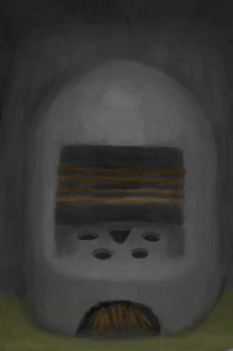
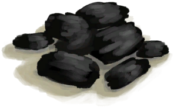
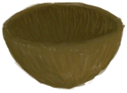
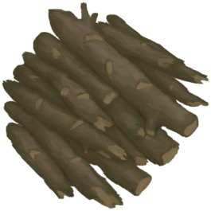
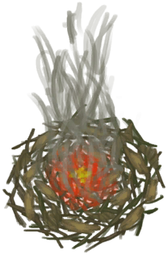
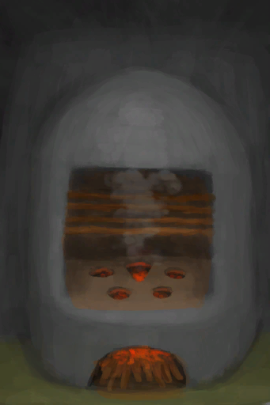

# 火炉  
> 我可以用火种点燃它。  
  
<table class="table table-bordered" data-toggle="table"  data-show-header="false"><thead style="display:none"><tr ><th  style="width:50%;text-align:left;vertical-align:top;"  >title</th><th  style="width:50%;text-align:left;vertical-align:top;"  ></th></tr></thead><tr ><td  style="width:50%;text-align:left;vertical-align:top;"  >** 不可删除 **  **重量：**750  **标签：**	[“火”](tag_Fire.md)  **槽位：**4  **过滤器：**[“可烹饪的”](tag_Cookable.md) , [“储水容器”](tag_WaterContainer.md) , [“饲料”](tag_Feed.md) , [“肉”](tag_Meat.md)</td><td  style="width:50%;text-align:left;vertical-align:top;"  >

<a href="StoveExtinguished.md" style="color:black">火炉</a>

一种由泥砖制成的简易厨具，它只能在室内建造。  它有<b>4个烹饪槽</b>（比营火多2个）而且能够<b>熏制食物</b>使其保存更长时间。  火炉对体温的影响要低于营火，这使其更适合用于室内烹饪。</td></tr></tbody></table>  
  
## 获取来源  

熄灭火焰

[火炉](Stove.md)

转化

[火炉](Stove.md)

蓝图制造

[火炉(蓝图)](Bp_Stove.md)

  
  
## 动作  

<table><tr><td rowspan="2" style="width:200px;text-align:center;font-size:1.3em;font-weight:bold">

取出木炭和灰烬

15分

</td><td></td></tr><tr><td><b>自身：</b>燃料  <b>-16(-11.11%)</b>, 

  <b>-16(-100%)</b></td></tr><tr><td colspan="2"><b>需求：</b>

: <b>16(100%)</b></td></tr><tr><td colspan="2">[

[木炭](Charcoal.md)](Charcoal.md)(<b>+1</b>), [

[灰烬](Ash.md)](Ash.md)(<b>+2</b>)</td></tr></table>
  
  
  
## 可拖入  

<table style="margin-bottom:0px;"><tr><td style="width:40%;text-align:left; background-color:#FEFEFE"><b>拖入：</b>[

[椰子壳](CoconutShell.md)](CoconutShell.md)</td><td style="width:40%;font-size:1em;font-weight:bold;background-color:#FEFEFE">添入椰子壳  </td></tr><tr style="background-color:#FFFFFF"><td style=""><b>使用物：</b>→消失</td><td style=""><b>自身：</b>燃料  <b>+3(2.08%)</b></td></tr></table>
  

<table style="margin-bottom:0px;"><tr><td style="width:40%;text-align:left; background-color:#FEFEFE"><b>拖入：</b>[

[木材](Wood.md)](Wood.md)</td><td style="width:40%;font-size:1em;font-weight:bold;background-color:#FEFEFE">添入柴火  </td></tr><tr style="background-color:#FFFFFF"><td style=""><b>使用物：</b>→消失</td><td style=""><b>自身：</b>燃料  <b>+28(19.44%)</b></td></tr></table>
  

<table style="margin-bottom:0px;"><tr><td style="width:40%;text-align:left; background-color:#FEFEFE"><b>拖入：</b>[“燃料”](tag_Fuel.md)</td><td style="width:40%;font-size:1em;font-weight:bold;background-color:#FEFEFE">添入燃料  </td></tr><tr style="background-color:#FFFFFF"><td style=""><b>使用物：</b>→消失</td><td style=""><b>自身：</b>燃料  <b>+7(4.86%)</b></td></tr></table>
  

<table style="margin-bottom:0px;"><tr><td style="width:40%;text-align:left; background-color:#FEFEFE"><b>拖入：</b>[“弱效燃料”](tag_FuelWeak.md)</td><td style="width:40%;font-size:1em;font-weight:bold;background-color:#FEFEFE">添入燃料  </td></tr><tr style="background-color:#FFFFFF"><td style=""><b>使用物：</b>→消失</td><td style=""><b>自身：</b>燃料  <b>+4(2.78%)</b></td></tr></table>
  

<table style="margin-bottom:0px;"><tr><td style="width:40%;text-align:left; background-color:#FEFEFE"><b>拖入：</b>[

[木炭](Charcoal.md)](Charcoal.md)</td><td style="width:40%;font-size:1em;font-weight:bold;background-color:#FEFEFE">添入木炭  </td></tr><tr style="background-color:#FFFFFF"><td style=""><b>使用物：</b>→消失</td><td style=""><b>自身：</b>燃料  <b>+7(4.86%)</b>, 

  <b>+7(43.75%)</b></td></tr></table>
  

<table style="margin-bottom:0px;"><tr><td style="width:40%;text-align:left; background-color:#FEFEFE"><b>拖入：</b>[“树叶”](tag_Leaves.md)</td><td style="width:40%;font-size:1em;font-weight:bold;background-color:#FEFEFE">添入树叶  </td></tr><tr style="background-color:#FFFFFF"><td style=""><b>使用物：</b>→消失</td><td style=""><b>自身：</b>燃料  <b>+2(1.39%)</b></td></tr></table>
  

<table style="margin-bottom:0px;"><tr><td style="width:40%;text-align:left; background-color:#FEFEFE"><b>拖入：</b>[

[火种](TinderLit.md)](TinderLit.md)</td><td style="width:40%;font-size:1em;font-weight:bold;background-color:#FEFEFE">点燃  </td></tr><tr style="background-color:#FFFFFF"><td style=""><b>使用物：</b>→消失</td><td style=""><b>自身：</b>→ [

[火炉](Stove.md)](Stove.md), 燃料  <b>+1(0.69%)</b></td></tr></table>
  

<table style="margin-bottom:0px;"><tr><td style="width:40%;text-align:left; background-color:#FEFEFE"><b>拖入：</b>[“锤”](tag_Hammer.md)</td><td style="width:40%;font-size:1em;font-weight:bold;background-color:#FEFEFE">拆除 (3小时) [“手部动作(组)”](HandAction.md)</td></tr><tr style="background-color:#FFFFFF"><td style=""><b>使用物：</b></td><td style=""><b>自身：</b>→消失</td></tr><tr><td colspan="2"><b>状态变化：</b>[

[污垢](Filth.md)](Filth.md)<b>+35</b>, [

[耐力](Stamina.md)](Stamina.md)<b>-20</b>, [

[手掌损伤](HandDamage.md)](HandDamage.md)<b>+40</b></td></tr><tr><td colspan="2">[

[干土堆](DirtPile.md)](DirtPile.md)(<b>+8</b>)</td></tr></table>
  
  
## 可拖至  

[装有燃料的油桶](JerrycanFuel.md)

  
  
## 属性   

<table style="margin-bottom:0px;"><tr><td style="width:30%;text-align:left; background-color:#FEFEFE;font-size:1.3em;font-weight:bold;">燃料</td><td style="font-size:1em;background-color:#FEFEFE">初始：1 , 最大：144 -</td></tr><tr style="background-color:#FFFFFF"><td colspan=2></td></tr></table>
  

<table style="margin-bottom:0px;"><tr><td style="width:30%;text-align:left; background-color:#FEFEFE;font-size:1.3em;font-weight:bold;">

</td><td style="font-size:1em;background-color:#FEFEFE">初始：0 , 最大：16 -</td></tr><tr style="background-color:#FFFFFF"><td colspan=2></td></tr></table>
  
## 被动效果  
<table class="table table-bordered" data-toggle="table"  ><thead style=""><tr ><th  style="text-align:left;vertical-align:top;"  >名称</th><th  style="text-align:left;vertical-align:top;"  data-sortable="true"  >条件</th><th  style="text-align:left;vertical-align:top;"  data-sortable="true"  >变化(每15分钟)</th><th  style="text-align:left;vertical-align:top;"  >玩家状态</th></tr></thead><tr ><td  style="text-align:left;vertical-align:top;"  >Comfort</td><td  style="text-align:left;vertical-align:top;"  ></td><td  style="text-align:left;vertical-align:top;"  ></td><td  style="text-align:left;vertical-align:top;"  >[

[舒适度](Comfort.md)](Comfort.md)<b>+150</b></td></tr></tbody></table>  
  

