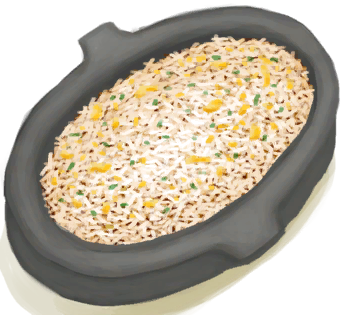
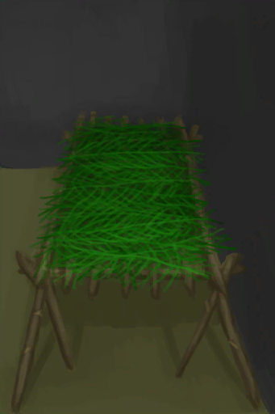
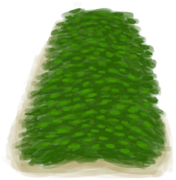

# 世界观  
> 这代表了你的世界观的可预测性和稳定性。  世界观坚定的人对自己的预测非常自信，他们觉得自己了解世界及其运行方式。他们的思想和行为是稳定的。  世界观动摇的人会觉得世事难料，不可预测，这会让他们感到<b>焦虑</b>，但也会让他们的思维更开放，精神意识更易受影响。  
  

<b>基础值: </b> 5000 
  

<b>变化范围: </b> 0 ~ 5000 
  

<b>基础变化率: </b> +1 / 每15分钟 
  

<b>衰减: </b>1天内衰减50% ，叠加2次 
  
## 阶段  

<table><tr style="height:2em;"><td style="background-color:#F0F0F0;text-align:center;width:180px;font-size:1.4em;font-weight:bold;vertical-align:middle;">
0 ～ 100

0% ～ 2%
</td><td colspan=2 style="font-size:1.1em;vertical-align:middle;background-color:#F9F9F9;">
<b>

混乱</b>

</td></tr><tr><td colspan=2><b>影响：</b>[

[精神失常](MindState.md)](MindState.md)加成+4, [

[世界观](Structure.md)](Structure.md)加成+6, [

[失实症](Derealization.md)](Derealization.md)加成+0.75, [

[狂躁](Mania.md)](Mania.md)加成+0.75, [

[压力](Stress.md)](Stress.md)加成+2</td></tr><tr><td colspan=2></td></tr><tr style="height:2em;"><td style="background-color:#F0F0F0;text-align:center;width:180px;font-size:1.4em;font-weight:bold;vertical-align:middle;">
101 ～ 750

2% ～ 15%
</td><td colspan=2 style="font-size:1.1em;vertical-align:middle;background-color:#F9F9F9;">
<b>

弱</b>

</td></tr><tr><td colspan=2><b>影响：</b>[

[精神失常](MindState.md)](MindState.md)加成+2, [

[世界观](Structure.md)](Structure.md)加成+3, [

[失实症](Derealization.md)](Derealization.md)加成+0.75, [

[狂躁](Mania.md)](Mania.md)加成+0.75, [

[压力](Stress.md)](Stress.md)加成+1</td></tr><tr><td colspan=2></td></tr></table>
  
## 相关卡牌  
[情绪](Morale.md)  |  [压力](Stress.md)  |  [清醒度](Wakefulness.md)  |  [外星斑点](AlienSpots.md)  |  [孤独感](Loneliness.md)  |  [酒精](Alcohol.md)  |  [镇痛](Analgesia.md)  |  [咖啡因](Caffeine.md)  |  [船长亲密关系](CaptainPropinquity.md)  |  [船长陪伴](CaptainCompany.md)  |  [光亮](Light.md)  |  [舒适度](Comfort.md)  |  [不适](Discomfort.md)  |  [神圣灵视](GodInsight.md)  |  [猎手的注视](HunterInsight.md)  |  [韦斯顿的陪伴](WestonCompany.md)  |  [韦斯顿亲密关系](WestonPropinquity.md)  |  [孤立感](Isolation.md)  |  [哀悼](Mourning.md)  |  [虚空灵视](VoidInsight.md)  |  [监视者的注视](WatcherInsight.md)  
## 加成值影响因素  
<table class="table table-bordered" data-toggle="table"  ><thead style=""><tr ><th  style="text-align:left;vertical-align:top;"  >来源</th><th  style="text-align:left;vertical-align:top;"  >操作</th><th  style="text-align:left;vertical-align:top;"  >值</th></tr></thead><tr ><td  style="text-align:left;vertical-align:top;"  >

[脚踏实地](Pk_4_DownToEarth.md)</td><td  style="text-align:left;vertical-align:top;"  >特质影响</td><td  style="text-align:left;vertical-align:top;"  >加成+10</td></tr><tr ><td  style="text-align:left;vertical-align:top;"  >[铜项链](CopperNecklace.md)</td><td  style="text-align:left;vertical-align:top;"  >被动</td><td  style="text-align:left;vertical-align:top;"  >加成+0.5</td></tr><tr ><td  style="text-align:left;vertical-align:top;"  >[珍珠项链](PearlNecklace.md)</td><td  style="text-align:left;vertical-align:top;"  >被动</td><td  style="text-align:left;vertical-align:top;"  >加成+0.5</td></tr><tr ><td  style="text-align:left;vertical-align:top;"  >[鲜花项链](FlowerNecklace.md)</td><td  style="text-align:left;vertical-align:top;"  >被动</td><td  style="text-align:left;vertical-align:top;"  >加成+0.25</td></tr><tr ><td  style="text-align:left;vertical-align:top;"  >[夏威夷衬衫](HawaiianShirt.md)</td><td  style="text-align:left;vertical-align:top;"  >被动</td><td  style="text-align:left;vertical-align:top;"  >加成+0.25</td></tr><tr ><td  style="text-align:left;vertical-align:top;"  >[卫衣](HoodieRetromation.md)</td><td  style="text-align:left;vertical-align:top;"  >被动</td><td  style="text-align:left;vertical-align:top;"  >加成+0.25</td></tr><tr ><td  style="text-align:left;vertical-align:top;"  >[月季](ChinaRoseFlowers.md)</td><td  style="text-align:left;vertical-align:top;"  >被动</td><td  style="text-align:left;vertical-align:top;"  >加成+0.25</td></tr><tr ><td  style="text-align:left;vertical-align:top;"  >[椰子凉鞋](CoconutSandals.md)</td><td  style="text-align:left;vertical-align:top;"  >被动</td><td  style="text-align:left;vertical-align:top;"  >加成+0.1</td></tr><tr ><td  style="text-align:left;vertical-align:top;"  >[人字拖](Flipflops.md)</td><td  style="text-align:left;vertical-align:top;"  >被动</td><td  style="text-align:left;vertical-align:top;"  >加成+0.1</td></tr><tr ><td  style="text-align:left;vertical-align:top;"  >[包脚布](FootWrappings.md)</td><td  style="text-align:left;vertical-align:top;"  >被动</td><td  style="text-align:left;vertical-align:top;"  >加成+0.1</td></tr><tr ><td  style="text-align:left;vertical-align:top;"  >[眼镜](Glasses.md)</td><td  style="text-align:left;vertical-align:top;"  >被动</td><td  style="text-align:left;vertical-align:top;"  >加成+0.1</td></tr><tr ><td  style="text-align:left;vertical-align:top;"  >[绑手带](HandWrappings.md)</td><td  style="text-align:left;vertical-align:top;"  >被动</td><td  style="text-align:left;vertical-align:top;"  >加成+0.1</td></tr><tr ><td  style="text-align:left;vertical-align:top;"  >[求生帽](HatSurvival.md)</td><td  style="text-align:left;vertical-align:top;"  >被动</td><td  style="text-align:left;vertical-align:top;"  >加成+0.1</td></tr><tr ><td  style="text-align:left;vertical-align:top;"  >[棕榈编织帽](HatWoven.md)</td><td  style="text-align:left;vertical-align:top;"  >被动</td><td  style="text-align:left;vertical-align:top;"  >加成+0.1</td></tr><tr ><td  style="text-align:left;vertical-align:top;"  >[草裙](LeafSKirt.md)</td><td  style="text-align:left;vertical-align:top;"  >被动</td><td  style="text-align:left;vertical-align:top;"  >加成+0.1</td></tr><tr ><td  style="text-align:left;vertical-align:top;"  >[皮革手套](LeatherGloves.md)</td><td  style="text-align:left;vertical-align:top;"  >被动</td><td  style="text-align:left;vertical-align:top;"  >加成+0.1</td></tr><tr ><td  style="text-align:left;vertical-align:top;"  >[皮裤](LeatherPants.md)</td><td  style="text-align:left;vertical-align:top;"  >被动</td><td  style="text-align:left;vertical-align:top;"  >加成+0.1</td></tr><tr ><td  style="text-align:left;vertical-align:top;"  >[皮革鞋子](LeatherShoes.md)</td><td  style="text-align:left;vertical-align:top;"  >被动</td><td  style="text-align:left;vertical-align:top;"  >加成+0.1</td></tr><tr ><td  style="text-align:left;vertical-align:top;"  >[军靴](MilitaryBoots.md)</td><td  style="text-align:left;vertical-align:top;"  >被动</td><td  style="text-align:left;vertical-align:top;"  >加成+0.1</td></tr><tr ><td  style="text-align:left;vertical-align:top;"  >[军裤](MilitaryPants.md)</td><td  style="text-align:left;vertical-align:top;"  >被动</td><td  style="text-align:left;vertical-align:top;"  >加成+0.1</td></tr><tr ><td  style="text-align:left;vertical-align:top;"  >[布制裤子](PantsCloth.md)</td><td  style="text-align:left;vertical-align:top;"  >被动</td><td  style="text-align:left;vertical-align:top;"  >加成+0.1</td></tr><tr ><td  style="text-align:left;vertical-align:top;"  >[海鸥护符](SeagullCharm.md)</td><td  style="text-align:left;vertical-align:top;"  >被动</td><td  style="text-align:left;vertical-align:top;"  >加成+0.1</td></tr><tr ><td  style="text-align:left;vertical-align:top;"  >[贝壳项链](SeashellNecklace.md)</td><td  style="text-align:left;vertical-align:top;"  >被动</td><td  style="text-align:left;vertical-align:top;"  >加成+0.1</td></tr><tr ><td  style="text-align:left;vertical-align:top;"  >[衬衫](ShirtFiber.md)</td><td  style="text-align:left;vertical-align:top;"  >被动</td><td  style="text-align:left;vertical-align:top;"  >加成+0.1</td></tr><tr ><td  style="text-align:left;vertical-align:top;"  >[短裤](Shorts.md)</td><td  style="text-align:left;vertical-align:top;"  >被动</td><td  style="text-align:left;vertical-align:top;"  >加成+0.1</td></tr><tr ><td  style="text-align:left;vertical-align:top;"  >[运动鞋](Sneakers.md)</td><td  style="text-align:left;vertical-align:top;"  >被动</td><td  style="text-align:left;vertical-align:top;"  >加成+0.1</td></tr><tr ><td  style="text-align:left;vertical-align:top;"  >[袜子](Socks.md)</td><td  style="text-align:left;vertical-align:top;"  >被动</td><td  style="text-align:left;vertical-align:top;"  >加成+0.1</td></tr><tr ><td  style="text-align:left;vertical-align:top;"  >[T恤](T-Shirt.md)</td><td  style="text-align:left;vertical-align:top;"  >被动</td><td  style="text-align:left;vertical-align:top;"  >加成+0.1</td></tr><tr ><td  style="text-align:left;vertical-align:top;"  >[内裤](Underwear.md)</td><td  style="text-align:left;vertical-align:top;"  >被动</td><td  style="text-align:left;vertical-align:top;"  >加成+0.1</td></tr><tr ><td  style="text-align:left;vertical-align:top;"  >[鬼掌印](W_HunterMark.md)</td><td  style="text-align:left;vertical-align:top;"  >条件被动</td><td  style="text-align:left;vertical-align:top;"  >加成-1</td></tr><tr ><td  style="text-align:left;vertical-align:top;"  >[崩解烙印](W_UnravellingMark.md)</td><td  style="text-align:left;vertical-align:top;"  >条件被动</td><td  style="text-align:left;vertical-align:top;"  >加成-1</td></tr></tbody></table>  
  
## 可被以下操作改变  
<table class="table table-bordered" data-toggle="table"  ><thead style=""><tr ><th  style="text-align:left;vertical-align:top;"  >来源</th><th  style="text-align:left;vertical-align:top;"  >操作</th><th  style="text-align:left;vertical-align:top;"  >值</th></tr></thead><tr ><td  style="text-align:left;vertical-align:top;"  >[

[姜糖](CandiedGinger.md)](CandiedGinger.md)</td><td  style="text-align:left;vertical-align:top;"  >食用</td><td  style="text-align:left;vertical-align:top;"  >30</td></tr><tr ><td  style="text-align:left;vertical-align:top;"  >[

[炸鱼薯条](FishNChips.md)](FishNChips.md)</td><td  style="text-align:left;vertical-align:top;"  >食用</td><td  style="text-align:left;vertical-align:top;"  >30</td></tr><tr ><td  style="text-align:left;vertical-align:top;"  >[

[肉食盛宴](HeartyFeast.md)](HeartyFeast.md)</td><td  style="text-align:left;vertical-align:top;"  >食用</td><td  style="text-align:left;vertical-align:top;"  >30</td></tr><tr ><td  style="text-align:left;vertical-align:top;"  >[

[蜜汁火腿](HoneyGlazedPork.md)](HoneyGlazedPork.md)</td><td  style="text-align:left;vertical-align:top;"  >食用</td><td  style="text-align:left;vertical-align:top;"  >30</td></tr><tr ><td  style="text-align:left;vertical-align:top;"  >[

[巧克力](Chocolate.md)](Chocolate.md)</td><td  style="text-align:left;vertical-align:top;"  >食用</td><td  style="text-align:left;vertical-align:top;"  >25</td></tr><tr ><td  style="text-align:left;vertical-align:top;"  >[

[蜜糖](HoneyCandy.md)](HoneyCandy.md)</td><td  style="text-align:left;vertical-align:top;"  >食用</td><td  style="text-align:left;vertical-align:top;"  >25</td></tr><tr ><td  style="text-align:left;vertical-align:top;"  >[

[西米蛋糕](SagoCake.md)](SagoCake.md)</td><td  style="text-align:left;vertical-align:top;"  >食用</td><td  style="text-align:left;vertical-align:top;"  >25</td></tr><tr ><td  style="text-align:left;vertical-align:top;"  >[

[炸香蕉](FriedBanana.md)](FriedBanana.md)</td><td  style="text-align:left;vertical-align:top;"  >食用</td><td  style="text-align:left;vertical-align:top;"  >20</td></tr><tr ><td  style="text-align:left;vertical-align:top;"  >[

[猕猴肉串](MacaqueSkewers.md)](MacaqueSkewers.md)</td><td  style="text-align:left;vertical-align:top;"  >食用</td><td  style="text-align:left;vertical-align:top;"  >20</td></tr><tr ><td  style="text-align:left;vertical-align:top;"  >[

[山羊奶酪](Cheese.md)](Cheese.md)</td><td  style="text-align:left;vertical-align:top;"  >食用</td><td  style="text-align:left;vertical-align:top;"  >15</td></tr><tr ><td  style="text-align:left;vertical-align:top;"  >[

[鸡肉三明治](ChickenSandwich.md)](ChickenSandwich.md)</td><td  style="text-align:left;vertical-align:top;"  >食用</td><td  style="text-align:left;vertical-align:top;"  >15</td></tr><tr ><td  style="text-align:left;vertical-align:top;"  >[

[椰子鱼](CoconutFish.md)](CoconutFish.md)</td><td  style="text-align:left;vertical-align:top;"  >食用</td><td  style="text-align:left;vertical-align:top;"  >15</td></tr><tr ><td  style="text-align:left;vertical-align:top;"  >[

[醉蟹](DrunkenCrab.md)](DrunkenCrab.md)</td><td  style="text-align:left;vertical-align:top;"  >食用</td><td  style="text-align:left;vertical-align:top;"  >15</td></tr><tr ><td  style="text-align:left;vertical-align:top;"  >[

[蛋炒饭](EggFriedRice.md)](EggFriedRice.md)</td><td  style="text-align:left;vertical-align:top;"  >食用</td><td  style="text-align:left;vertical-align:top;"  >15</td></tr><tr ><td  style="text-align:left;vertical-align:top;"  >[

[鱼肉蛋饼](FishOmelette.md)](FishOmelette.md)</td><td  style="text-align:left;vertical-align:top;"  >食用</td><td  style="text-align:left;vertical-align:top;"  >15</td></tr><tr ><td  style="text-align:left;vertical-align:top;"  >[

[鱼肉塔可](FishTaco.md)](FishTaco.md)</td><td  style="text-align:left;vertical-align:top;"  >食用</td><td  style="text-align:left;vertical-align:top;"  >15</td></tr><tr ><td  style="text-align:left;vertical-align:top;"  >[

[炒菇球](FriedPuffballs.md)](FriedPuffballs.md)</td><td  style="text-align:left;vertical-align:top;"  >食用</td><td  style="text-align:left;vertical-align:top;"  >15</td></tr><tr ><td  style="text-align:left;vertical-align:top;"  >[

[热带烤鸡](IslandChicken.md)](IslandChicken.md)</td><td  style="text-align:left;vertical-align:top;"  >食用</td><td  style="text-align:left;vertical-align:top;"  >15</td></tr><tr ><td  style="text-align:left;vertical-align:top;"  >[

[丛林沙拉](JungleSalad.md)](JungleSalad.md)</td><td  style="text-align:left;vertical-align:top;"  >食用</td><td  style="text-align:left;vertical-align:top;"  >15</td></tr><tr ><td  style="text-align:left;vertical-align:top;"  >[

[辣炒巨蜥肉](LizardFry.md)](LizardFry.md)</td><td  style="text-align:left;vertical-align:top;"  >食用</td><td  style="text-align:left;vertical-align:top;"  >15</td></tr><tr ><td  style="text-align:left;vertical-align:top;"  >[

[参薯咖喱](YamCurry.md)](YamCurry.md)</td><td  style="text-align:left;vertical-align:top;"  >食用</td><td  style="text-align:left;vertical-align:top;"  >15</td></tr><tr ><td  style="text-align:left;vertical-align:top;"  >[

[参薯酱](YamJam.md)](YamJam.md)</td><td  style="text-align:left;vertical-align:top;"  >食用</td><td  style="text-align:left;vertical-align:top;"  >15</td></tr><tr ><td  style="text-align:left;vertical-align:top;"  >[

[木床](BedWooden.md)](BedWooden.md)</td><td  style="text-align:left;vertical-align:top;"  >睡觉</td><td  style="text-align:left;vertical-align:top;"  >6 / 每15分钟</td></tr><tr ><td  style="text-align:left;vertical-align:top;"  >[

[蛋白棒](ProteinBar.md)](ProteinBar.md)</td><td  style="text-align:left;vertical-align:top;"  >食用</td><td  style="text-align:left;vertical-align:top;"  >5</td></tr><tr ><td  style="text-align:left;vertical-align:top;"  >[

[简易床](BedRustic.md)](BedRustic.md)</td><td  style="text-align:left;vertical-align:top;"  >睡觉</td><td  style="text-align:left;vertical-align:top;"  >4 / 每15分钟</td></tr><tr ><td  style="text-align:left;vertical-align:top;"  >[

[吊床](Hammock.md)](Hammock.md)</td><td  style="text-align:left;vertical-align:top;"  >睡觉</td><td  style="text-align:left;vertical-align:top;"  >4 / 每15分钟</td></tr><tr ><td  style="text-align:left;vertical-align:top;"  >[

[木床](BedWooden.md)](BedWooden.md)</td><td  style="text-align:left;vertical-align:top;"  >小憩</td><td  style="text-align:left;vertical-align:top;"  >3 / 每15分钟</td></tr><tr ><td  style="text-align:left;vertical-align:top;"  >[

[睡袋](BedRoll.md)](BedRoll.md)</td><td  style="text-align:left;vertical-align:top;"  >睡觉</td><td  style="text-align:left;vertical-align:top;"  >2 / 每15分钟</td></tr><tr ><td  style="text-align:left;vertical-align:top;"  >[

[简易床](BedRustic.md)](BedRustic.md)</td><td  style="text-align:left;vertical-align:top;"  >小憩</td><td  style="text-align:left;vertical-align:top;"  >2 / 每15分钟</td></tr><tr ><td  style="text-align:left;vertical-align:top;"  >[

[吊床](Hammock.md)](Hammock.md)</td><td  style="text-align:left;vertical-align:top;"  >小憩</td><td  style="text-align:left;vertical-align:top;"  >2 / 每15分钟</td></tr><tr ><td  style="text-align:left;vertical-align:top;"  >[

[叶床](LeafBed.md)](LeafBed.md)</td><td  style="text-align:left;vertical-align:top;"  >睡觉</td><td  style="text-align:left;vertical-align:top;"  >2 / 每15分钟</td></tr><tr ><td  style="text-align:left;vertical-align:top;"  >[

[人鱼巢](MermaidNest.md)](MermaidNest.md)</td><td  style="text-align:left;vertical-align:top;"  >睡觉</td><td  style="text-align:left;vertical-align:top;"  >2 / 每15分钟</td></tr><tr ><td  style="text-align:left;vertical-align:top;"  >[

[窝棚](Shelter.md)](Shelter.md)</td><td  style="text-align:left;vertical-align:top;"  >睡觉</td><td  style="text-align:left;vertical-align:top;"  >2 / 每15分钟</td></tr><tr ><td  style="text-align:left;vertical-align:top;"  >[

[有遮蔽的叶床](ShelteredLeafBed.md)](ShelteredLeafBed.md)</td><td  style="text-align:left;vertical-align:top;"  >睡觉</td><td  style="text-align:left;vertical-align:top;"  >2 / 每15分钟</td></tr><tr ><td  style="text-align:left;vertical-align:top;"  >[

[帐篷](TentDeployed.md)](TentDeployed.md)</td><td  style="text-align:left;vertical-align:top;"  >睡觉</td><td  style="text-align:left;vertical-align:top;"  >2 / 每15分钟</td></tr><tr ><td  style="text-align:left;vertical-align:top;"  >[

[木筏庇护所](RaftShelter.md)](RaftShelter.md)</td><td  style="text-align:left;vertical-align:top;"  >睡觉</td><td  style="text-align:left;vertical-align:top;"  >2 / 每15分钟</td></tr><tr ><td  style="text-align:left;vertical-align:top;"  >[

[睡袋](BedRoll.md)](BedRoll.md)</td><td  style="text-align:left;vertical-align:top;"  >小憩</td><td  style="text-align:left;vertical-align:top;"  >1 / 每15分钟</td></tr><tr ><td  style="text-align:left;vertical-align:top;"  >[

[叶床](LeafBed.md)](LeafBed.md)</td><td  style="text-align:left;vertical-align:top;"  >小憩</td><td  style="text-align:left;vertical-align:top;"  >1 / 每15分钟</td></tr><tr ><td  style="text-align:left;vertical-align:top;"  >[

[人鱼巢](MermaidNest.md)](MermaidNest.md)</td><td  style="text-align:left;vertical-align:top;"  >小憩</td><td  style="text-align:left;vertical-align:top;"  >1 / 每15分钟</td></tr><tr ><td  style="text-align:left;vertical-align:top;"  >[

[窝棚](Shelter.md)](Shelter.md)</td><td  style="text-align:left;vertical-align:top;"  >小憩</td><td  style="text-align:left;vertical-align:top;"  >1 / 每15分钟</td></tr><tr ><td  style="text-align:left;vertical-align:top;"  >[

[有遮蔽的叶床](ShelteredLeafBed.md)](ShelteredLeafBed.md)</td><td  style="text-align:left;vertical-align:top;"  >小憩</td><td  style="text-align:left;vertical-align:top;"  >1 / 每15分钟</td></tr><tr ><td  style="text-align:left;vertical-align:top;"  >[

[帐篷](TentDeployed.md)](TentDeployed.md)</td><td  style="text-align:left;vertical-align:top;"  >小憩</td><td  style="text-align:left;vertical-align:top;"  >1 / 每15分钟</td></tr><tr ><td  style="text-align:left;vertical-align:top;"  >[

[你睡着了！(事件)](Event_FallingAsleep.md)](Event_FallingAsleep.md)</td><td  style="text-align:left;vertical-align:top;"  >Zzz……</td><td  style="text-align:left;vertical-align:top;"  >1 / 每15分钟</td></tr><tr ><td  style="text-align:left;vertical-align:top;"  >[

[木筏庇护所](RaftShelter.md)](RaftShelter.md)</td><td  style="text-align:left;vertical-align:top;"  >小憩</td><td  style="text-align:left;vertical-align:top;"  >1 / 每15分钟</td></tr><tr ><td  style="text-align:left;vertical-align:top;"  >[

[虫子](Bugs.md)](Bugs.md)</td><td  style="text-align:left;vertical-align:top;"  >食用</td><td  style="text-align:left;vertical-align:top;"  >-10</td></tr><tr ><td  style="text-align:left;vertical-align:top;"  >[

[监视者(事件)](Event_WatchedExperience1a.md)](Event_WatchedExperience1a.md)</td><td  style="text-align:left;vertical-align:top;"  >盯回去</td><td  style="text-align:left;vertical-align:top;"  >-100</td></tr><tr ><td  style="text-align:left;vertical-align:top;"  >[

[监视者(事件)](Event_WatchedExperience1a.md)](Event_WatchedExperience1a.md)</td><td  style="text-align:left;vertical-align:top;"  >惊恐地尖叫</td><td  style="text-align:left;vertical-align:top;"  >-100</td></tr><tr ><td  style="text-align:left;vertical-align:top;"  >[

[监视者(事件)](Event_WatchedExperience1b.md)](Event_WatchedExperience1b.md)</td><td  style="text-align:left;vertical-align:top;"  >继续盯回去</td><td  style="text-align:left;vertical-align:top;"  >-100</td></tr><tr ><td  style="text-align:left;vertical-align:top;"  >[

[监视者(事件)](Event_WatchedExperience1b.md)](Event_WatchedExperience1b.md)</td><td  style="text-align:left;vertical-align:top;"  >惊恐地尖叫</td><td  style="text-align:left;vertical-align:top;"  >-100</td></tr><tr ><td  style="text-align:left;vertical-align:top;"  >[

[监视者(事件)](Event_WatchedExperience1c.md)](Event_WatchedExperience1c.md)</td><td  style="text-align:left;vertical-align:top;"  >盯着它！</td><td  style="text-align:left;vertical-align:top;"  >-100</td></tr><tr ><td  style="text-align:left;vertical-align:top;"  >[

[监视者(事件)](Event_WatchedExperience1c.md)](Event_WatchedExperience1c.md)</td><td  style="text-align:left;vertical-align:top;"  >惊恐地尖叫</td><td  style="text-align:left;vertical-align:top;"  >-100</td></tr><tr ><td  style="text-align:left;vertical-align:top;"  >[

[监视者(事件)](Event_WatchedExperience1d.md)](Event_WatchedExperience1d.md)</td><td  style="text-align:left;vertical-align:top;"  >继续盯着！</td><td  style="text-align:left;vertical-align:top;"  >-100</td></tr><tr ><td  style="text-align:left;vertical-align:top;"  >[

[监视者(事件)](Event_WatchedExperience1d.md)](Event_WatchedExperience1d.md)</td><td  style="text-align:left;vertical-align:top;"  >惊恐地尖叫</td><td  style="text-align:left;vertical-align:top;"  >-100</td></tr><tr ><td  style="text-align:left;vertical-align:top;"  >[

[监视者(事件)](Event_WatchedExperience1e.md)](Event_WatchedExperience1e.md)</td><td  style="text-align:left;vertical-align:top;"  >保持凝视！</td><td  style="text-align:left;vertical-align:top;"  >-100</td></tr><tr ><td  style="text-align:left;vertical-align:top;"  >[

[监视者(事件)](Event_WatchedExperience1e.md)](Event_WatchedExperience1e.md)</td><td  style="text-align:left;vertical-align:top;"  >惊恐地尖叫</td><td  style="text-align:left;vertical-align:top;"  >-100</td></tr><tr ><td  style="text-align:left;vertical-align:top;"  >[

[监视者(事件)](Event_WatchedExperience1f.md)](Event_WatchedExperience1f.md)</td><td  style="text-align:left;vertical-align:top;"  >解析自我</td><td  style="text-align:left;vertical-align:top;"  >-100</td></tr><tr ><td  style="text-align:left;vertical-align:top;"  >[

[监视者(事件)](Event_WatchedExperience1f.md)](Event_WatchedExperience1f.md)</td><td  style="text-align:left;vertical-align:top;"  >轻笑</td><td  style="text-align:left;vertical-align:top;"  >-100</td></tr><tr ><td  style="text-align:left;vertical-align:top;"  >[

[监视者(事件)](Event_WatchedExperience1f.md)](Event_WatchedExperience1f.md)</td><td  style="text-align:left;vertical-align:top;"  >惊恐地尖叫</td><td  style="text-align:left;vertical-align:top;"  >-100</td></tr><tr ><td  style="text-align:left;vertical-align:top;"  >[

[监视者(事件)](Event_WatchedExperience1gGod.md)](Event_WatchedExperience1gGod.md)</td><td  style="text-align:left;vertical-align:top;"  >成为监视者</td><td  style="text-align:left;vertical-align:top;"  >-100</td></tr><tr ><td  style="text-align:left;vertical-align:top;"  >[

[监视者(事件)](Event_WatchedExperience1gVoid.md)](Event_WatchedExperience1gVoid.md)</td><td  style="text-align:left;vertical-align:top;"  >没有什么在监视你</td><td  style="text-align:left;vertical-align:top;"  >-100</td></tr><tr ><td  style="text-align:left;vertical-align:top;"  >[

[监视者(事件)](Event_WatchedExperience1gVoid.md)](Event_WatchedExperience1gVoid.md)</td><td  style="text-align:left;vertical-align:top;"  >惊恐地尖叫</td><td  style="text-align:left;vertical-align:top;"  >-100</td></tr><tr ><td  style="text-align:left;vertical-align:top;"  >[

[无法控制焦虑！(事件)](Event_AnxietyAttack.md)](Event_AnxietyAttack.md)</td><td  style="text-align:left;vertical-align:top;"  >继续</td><td  style="text-align:left;vertical-align:top;"  >-250</td></tr></tbody></table>  
  
## 被以下操作需求  
<table class="table table-bordered" data-toggle="table"  ><thead style=""><tr ><th  style="text-align:left;vertical-align:top;"  >来源</th><th  style="text-align:left;vertical-align:top;"  >操作</th><th  style="text-align:left;vertical-align:top;"  >值</th></tr></thead><tr ><td  style="text-align:left;vertical-align:top;"  >[监视者(事件)](Event_WatchedExperience1a.md)</td><td  style="text-align:left;vertical-align:top;"  >盯回去</td><td  style="text-align:left;vertical-align:top;"  >101 ~ 5000</td></tr><tr ><td  style="text-align:left;vertical-align:top;"  >[监视者(事件)](Event_WatchedExperience1b.md)</td><td  style="text-align:left;vertical-align:top;"  >继续盯回去</td><td  style="text-align:left;vertical-align:top;"  >101 ~ 5000</td></tr><tr ><td  style="text-align:left;vertical-align:top;"  >[监视者(事件)](Event_WatchedExperience1c.md)</td><td  style="text-align:left;vertical-align:top;"  >盯着它！</td><td  style="text-align:left;vertical-align:top;"  >101 ~ 5000</td></tr><tr ><td  style="text-align:left;vertical-align:top;"  >[监视者(事件)](Event_WatchedExperience1d.md)</td><td  style="text-align:left;vertical-align:top;"  >继续盯着！</td><td  style="text-align:left;vertical-align:top;"  >101 ~ 5000</td></tr><tr ><td  style="text-align:left;vertical-align:top;"  >[监视者(事件)](Event_WatchedExperience1e.md)</td><td  style="text-align:left;vertical-align:top;"  >保持凝视！</td><td  style="text-align:left;vertical-align:top;"  >101 ~ 5000</td></tr><tr ><td  style="text-align:left;vertical-align:top;"  >[监视者(事件)](Event_WatchedExperience1f.md)</td><td  style="text-align:left;vertical-align:top;"  >解析自我</td><td  style="text-align:left;vertical-align:top;"  >101 ~ 5000</td></tr><tr ><td  style="text-align:left;vertical-align:top;"  >[监视者(事件)](Event_WatchedExperience1f.md)</td><td  style="text-align:left;vertical-align:top;"  >轻笑</td><td  style="text-align:left;vertical-align:top;"  >101 ~ 5000</td></tr><tr ><td  style="text-align:left;vertical-align:top;"  >[监视者(事件)](Event_WatchedExperience1gGod.md)</td><td  style="text-align:left;vertical-align:top;"  >成为监视者</td><td  style="text-align:left;vertical-align:top;"  >101 ~ 5000</td></tr><tr ><td  style="text-align:left;vertical-align:top;"  >[监视者(事件)](Event_WatchedExperience1gVoid.md)</td><td  style="text-align:left;vertical-align:top;"  >没有什么在监视你</td><td  style="text-align:left;vertical-align:top;"  >101 ~ 5000</td></tr><tr ><td  style="text-align:left;vertical-align:top;"  >[监视者(事件)](Event_WatchedExperience1a.md)</td><td  style="text-align:left;vertical-align:top;"  >惊恐地尖叫</td><td  style="text-align:left;vertical-align:top;"  >0 ~ 5000</td></tr><tr ><td  style="text-align:left;vertical-align:top;"  >[监视者(事件)](Event_WatchedExperience1b.md)</td><td  style="text-align:left;vertical-align:top;"  >惊恐地尖叫</td><td  style="text-align:left;vertical-align:top;"  >0 ~ 5000</td></tr><tr ><td  style="text-align:left;vertical-align:top;"  >[监视者(事件)](Event_WatchedExperience1c.md)</td><td  style="text-align:left;vertical-align:top;"  >惊恐地尖叫</td><td  style="text-align:left;vertical-align:top;"  >0 ~ 5000</td></tr><tr ><td  style="text-align:left;vertical-align:top;"  >[监视者(事件)](Event_WatchedExperience1d.md)</td><td  style="text-align:left;vertical-align:top;"  >惊恐地尖叫</td><td  style="text-align:left;vertical-align:top;"  >0 ~ 5000</td></tr><tr ><td  style="text-align:left;vertical-align:top;"  >[监视者(事件)](Event_WatchedExperience1e.md)</td><td  style="text-align:left;vertical-align:top;"  >惊恐地尖叫</td><td  style="text-align:left;vertical-align:top;"  >0 ~ 5000</td></tr><tr ><td  style="text-align:left;vertical-align:top;"  >[监视者(事件)](Event_WatchedExperience1f.md)</td><td  style="text-align:left;vertical-align:top;"  >惊恐地尖叫</td><td  style="text-align:left;vertical-align:top;"  >0 ~ 5000</td></tr><tr ><td  style="text-align:left;vertical-align:top;"  >[监视者(事件)](Event_WatchedExperience1gVoid.md)</td><td  style="text-align:left;vertical-align:top;"  >惊恐地尖叫</td><td  style="text-align:left;vertical-align:top;"  >0 ~ 5000</td></tr></tbody></table>  
  

