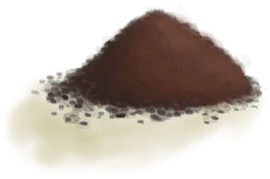
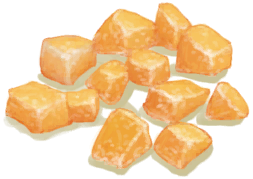
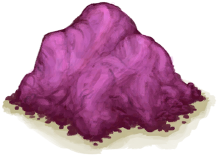

# 糖  
> 水椰糖，很好吃。  
  
<table class="table table-bordered" data-toggle="table"  data-show-header="false"><thead style="display:none"><tr ><th  style="width:50%;text-align:left;vertical-align:top;"  >title</th><th  style="width:50%;text-align:left;vertical-align:top;"  ></th></tr></thead><tr ><td  style="width:50%;text-align:left;vertical-align:top;"  >**重量：**50  **标签：**	[“可烹饪的”](tag_Cookable.md), [“饲料”](tag_Feed.md), [“强效食料”](tag_FeedRich.md)</td><td  style="width:50%;text-align:left;vertical-align:top;"  >

<a href="Sugar.md" style="color:black">糖</a>

糖可以通过简单地煮沸<b>水椰树汁</b>来制成。  它是一种用途丰富的食物，可以用于多种<b>烹饪食谱</b>或混合制成<b>糖水</b>，可以用来喂养<b>蜜蜂</b>或发酵成<b>糖酒</b>，一种高烈度的酒精饮料。</td></tr></tbody></table>  
  
## 获取来源  

熬煮树汁

[水椰树汁](LQ_Sap.md)

熬煮树汁

[水椰树汁](LQ_Sap.md)

熬煮树汁

[水椰树汁](LQ_Sap.md)

熬煮树汁

[水椰树汁](LQ_Sap.md)

熬煮树汁

[水椰树汁](LQ_Sap.md)

  
  
## 动作  

<table><tr><td rowspan="2" style="width:200px;text-align:center;font-size:1.3em;font-weight:bold">

食用

15分

</td><td>[“食用蔬菜类动作(组)”](VegetarianAction.md), [“进食动作(组)”](EatingAction.md)</td></tr><tr><td><b>自身：</b>→消失</td></tr><tr><td colspan="2"><b>状态变化：</b>[

[饱食](Satiation.md)](Satiation.md)<b>+30</b>, [

[胃](Stomach.md)](Stomach.md)<b>+30</b>, [

[压力](Stress.md)](Stress.md)<b>-20</b>, [

[情绪](Morale.md)](Morale.md)<b>+1</b>, [

[糖<nobr>厌倦度</nobr>](SaturationSugar.md)](SaturationSugar.md)<b>+200</b>, [

[污垢](Filth.md)](Filth.md)<b>+2</b></td></tr></table>
  
  
  
## 可拖入  

<table style="margin-bottom:0px;"><tr><td style="width:40%;text-align:left; background-color:#FEFEFE"><b>拖入：</b>[“灌溉用水”](tag_WaterFresh.md)</td><td style="width:40%;font-size:1em;font-weight:bold;background-color:#FEFEFE">浸泡  </td></tr><tr><td colspan="2"><b>需求：</b>含水量: 150</td></tr><tr style="background-color:#FFFFFF"><td style=""><b>使用物：</b>→ [

[糖水](LQ_SugarWater.md)](LQ_SugarWater.md)</td><td style=""><b>自身：</b>→消失</td></tr></table>
  
  
## 可拖至  

[猪食槽](BoarFeeder.md)

[猪食槽(空)](BoarFeederEmpty.md)

[堆肥箱](CompostBin.md)

[灰山鹑喂食器](PartridgeFeeder.md)

[灰山鹑喂食器(空)](PartridgeFeederEmpty.md)

[中陷阱的猕猴](CageTrapMacaque.md)

[母猪](BoarEnclosureFemale.md)

[公猪](BoarEnclosureMale.md)

[小猪](BoarEnclosurePiglet.md)

[母猪](BoarTiedFemale.md)

[公猪](BoarTiedMale.md)

[小猪](BoarTiedPiglet.md)

[猕猴朋友](MacaqueFriend.md)

[受伤的猕猴](MacaqueWounded.md)

[小灰山鹑](PartridgeChick.md)

[雌灰山鹑](PartridgeFemaleEnclosure.md)

[雌灰山鹑](PartridgeFemaleLive.md)

[雄灰山鹑](PartridgeMaleEnclosure.md)

[雄灰山鹑](PartridgeMaleLive.md)

  
  
## 可用于蓝图  

<a href="Bp_CandiedGinger.md" style="color:black">姜糖</a>

<a href="Bp_FriedBananas.md" style="color:black">炸香蕉</a>

<a href="Bp_HoneyCandy.md" style="color:black">蜜糖</a>

<a href="Bp_SagoCake.md" style="color:black">西米蛋糕</a>

<a href="Bp_TonicWater.md" style="color:black">汤力水</a>

<a href="Bp_YamJam.md" style="color:black">参薯酱</a>

  
  
  

