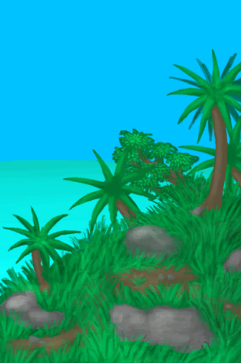
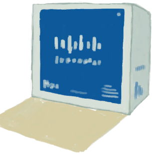

# 补给胶囊  
> 里面有各种各样的物资。  
  
<table class="table table-bordered" data-toggle="table"  data-show-header="false"><thead style="display:none"><tr ><th  style="width:50%;text-align:left;vertical-align:top;"  >title</th><th  style="width:50%;text-align:left;vertical-align:top;"  ></th></tr></thead><tr ><td  style="width:50%;text-align:left;vertical-align:top;"  >** 区域唯一 **  ** 不可堆叠 **  **标签：**	[“袋子”](tag_Bag.md)</td><td  style="width:50%;text-align:left;vertical-align:top;"  >

<a href="TV_SupplyCapsule.md" style="color:black">补给胶囊</a>

</td></tr></tbody></table>  
  
## 获取来源  
<table class="table table-bordered" data-toggle="table"  ><thead style=""><tr ><th  style="text-align:left;vertical-align:top;"  >来源</th><th  style="text-align:left;vertical-align:top;"  >操作</th></tr></thead><tr ><td  style="text-align:left;vertical-align:top;"  >[

[酸湖(火山)](AcidLake.md)](AcidLake.md)</td><td  style="text-align:left;vertical-align:top;"  >探索</td></tr><tr ><td  style="text-align:left;vertical-align:top;"  >[

[鸟岩岛](BirdRock.md)](BirdRock.md)</td><td  style="text-align:left;vertical-align:top;"  >探索</td></tr><tr ><td  style="text-align:left;vertical-align:top;"  >[

[丛林深处](DeepJungle.md)](DeepJungle.md)</td><td  style="text-align:left;vertical-align:top;"  >探索</td></tr><tr ><td  style="text-align:left;vertical-align:top;"  >[

[荒芜沙滩](DesolateBeach.md)](DesolateBeach.md)</td><td  style="text-align:left;vertical-align:top;"  >探索</td></tr><tr ><td  style="text-align:left;vertical-align:top;"  >[

[东部草原](GrasslandsE.md)](GrasslandsE.md)</td><td  style="text-align:left;vertical-align:top;"  >探索</td></tr><tr ><td  style="text-align:left;vertical-align:top;"  >[

[西部草原](GrasslandsW.md)](GrasslandsW.md)</td><td  style="text-align:left;vertical-align:top;"  >探索</td></tr><tr ><td  style="text-align:left;vertical-align:top;"  >[

[东部高地](HighlandsEastern.md)](HighlandsEastern.md)</td><td  style="text-align:left;vertical-align:top;"  >探索</td></tr><tr ><td  style="text-align:left;vertical-align:top;"  >[

[西部高地](HighlandsWestern.md)](HighlandsWestern.md)</td><td  style="text-align:left;vertical-align:top;"  >探索</td></tr><tr ><td  style="text-align:left;vertical-align:top;"  >[

[丛林](Jungle.md)](Jungle.md)</td><td  style="text-align:left;vertical-align:top;"  >探索</td></tr><tr ><td  style="text-align:left;vertical-align:top;"  >[

[丛林高地](JungleHighlands.md)](JungleHighlands.md)</td><td  style="text-align:left;vertical-align:top;"  >探索</td></tr><tr ><td  style="text-align:left;vertical-align:top;"  >[

[红树林](Mangroves.md)](Mangroves.md)</td><td  style="text-align:left;vertical-align:top;"  >探索</td></tr><tr ><td  style="text-align:left;vertical-align:top;"  >[

[岩滩](Rocks.md)](Rocks.md)</td><td  style="text-align:left;vertical-align:top;"  >探索</td></tr><tr ><td  style="text-align:left;vertical-align:top;"  >[

[神秘谷](SecretValley.md)](SecretValley.md)</td><td  style="text-align:left;vertical-align:top;"  >探索</td></tr><tr ><td  style="text-align:left;vertical-align:top;"  >[

[火山](Volcano.md)](Volcano.md)</td><td  style="text-align:left;vertical-align:top;"  >探索</td></tr></tbody></table>  
  
## 动作  
<table class="table table-bordered" data-toggle="table"  ><thead style=""><tr ><th  style="text-align:left;vertical-align:top;"  >动作</th><th  style="text-align:left;vertical-align:top;"  data-sortable="true"  >耗时</th><th  style="text-align:left;vertical-align:top;"  data-sortable="true"  >条件</th><th  style="text-align:left;vertical-align:top;"  >变化</th><th  style="text-align:left;vertical-align:top;"  >状态</th></tr></thead><tr ><td  style="text-align:left;vertical-align:top;"  >打开 </td><td  style="text-align:left;vertical-align:top;"  >-</td><td  style="text-align:left;vertical-align:top;"  ></td><td  style="text-align:left;vertical-align:top;"  >** 自身：** →消失  ** 获得： ** ** [Food]  **   [

[压缩干粮包](FoodRationsPackage.md)](FoodRationsPackage.md)(+1) 基础权重：1<li>[真人秀舞台](TV_Stage.md)为8～10时权重-1</li> ** [Water]  **   [

[应急水袋](WaterRationsPackage.md)](WaterRationsPackage.md)(+1) 基础权重：1<li>[真人秀舞台](TV_Stage.md)为8～10时权重-1</li> ** [Painkillers]  **   [

[止‍疼薬](Painkillers.md)](Painkillers.md)(+1) 基础权重：1<li>[真人秀舞台](TV_Stage.md)为8～10时权重-1</li> ** [Antibiotics]  **   [

[抗生素](Antibiotics.md)](Antibiotics.md)(+1) 基础权重：1<li>[真人秀舞台](TV_Stage.md)为8～10时权重-1</li> ** [Antidiarrhoea]  **   [

[泻立停](AntiDiarrhoeaPills.md)](AntiDiarrhoeaPills.md)(+1) 基础权重：1<li>[真人秀舞台](TV_Stage.md)为8～10时权重-1</li> ** [Dressings]  **   [

[伤口敷料](WoundDressing.md)](WoundDressing.md)(+2) 基础权重：1<li>[真人秀舞台](TV_Stage.md)为8～10时权重-1</li> ** [Trash]  **   [

[袜子](Socks.md)](Socks.md)(+2)   [

[木炭](Charcoal.md)](Charcoal.md)(+2) 基础权重：1<li>[真人秀舞台](TV_Stage.md)为8～10时权重-1</li> ** [Gun]  **   [

[枪](Gun.md)](Gun.md)(+1) 基础权重：1<li>[真人秀舞台](TV_Stage.md)为8～10时权重-1</li> ** [Knife]  **   [

[军刀](KnifeMilitary.md)](KnifeMilitary.md)(+1) 基础权重：1<li>[真人秀舞台](TV_Stage.md)为8～10时权重-1</li> ** [Victory]  **   [

[胜利手册](TV_Leaflet.md)](TV_Leaflet.md)(+1)   [

[胜利药片](VictoryPillsTV.md)](VictoryPillsTV.md)(+1) [

[真人秀 - 等待](TV_CounterWait.md)](TV_CounterWait.md)-1 基础权重：0<li>[真人秀舞台](TV_Stage.md)为8～10时权重+1000</li></td><td  style="text-align:left;vertical-align:top;"  >[真人秀舞台](TV_Stage.md)+1 [

[真人秀 - 等待](TV_CounterWait.md)](TV_CounterWait.md)-287 [

[真人秀 - 包裹倒计时](TV_CounterRush.md)](TV_CounterRush.md)-288 [

[真人秀 丛林](TV_Jungle.md)](TV_Jungle.md)-1 [真人秀 丛林 - 探索](TV_JungleExplore.md)-20 [

[真人秀 红树林](TV_Mangroves.md)](TV_Mangroves.md)-1 [真人秀 红树林 - 探索](TV_MangrovesExplore.md)-20 [

[真人秀 - 岩滩](TV_Rocks.md)](TV_Rocks.md)-1 [真人秀 石滩 - 探索](TV_RocksExplore.md)-20 [

[真人秀 高地](TV_Highlands.md)](TV_Highlands.md)-1 [真人秀 高地 - 探索](TV_HighlandsExplore.md)-20 [

[真人秀 草原](TV_Grasslands.md)](TV_Grasslands.md)-1 [真人秀 草原 - 探索](TV_GrasslandsExplore.md)-20</td></tr></tbody></table>  
  
## 属性   
<table class="table table-bordered" data-toggle="table"  ><thead style=""><tr ><th  style="text-align:left;vertical-align:top;"  >属性</th><th  style="text-align:left;vertical-align:top;"  >值</th><th  style="text-align:left;vertical-align:top;"  data-sortable="true"  >耗时</th><th  style="text-align:left;vertical-align:top;"  >变化</th></tr></thead><tr ><td  style="text-align:left;vertical-align:top;"  >进度</td><td  style="text-align:left;vertical-align:top;"  >初始：1 最大：1</td><td  style="text-align:left;vertical-align:top;"  >-</td><td  style="text-align:left;vertical-align:top;"  >** 到达0时：自毁 **  ** 自身 ** →消失</td></tr></tbody></table>  
  
## 状态触发  
<table class="table table-bordered" data-toggle="table"  ><thead style=""><tr ><th  style="text-align:left;vertical-align:top;"  >名称</th><th  style="text-align:left;vertical-align:top;"  >条件</th><th  style="text-align:left;vertical-align:top;"  >变化</th></tr></thead><tr ><td  style="text-align:left;vertical-align:top;"  >自毁</td><td  style="text-align:left;vertical-align:top;"  >[阻止抽到陨石坑事件](TV_CrateKiller.md): 1-1</td><td  style="text-align:left;vertical-align:top;"  >能量  -1</td></tr></tbody></table>  
  

