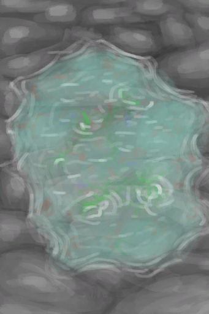

# 潮汐池  
> 可以捞一些吃的。在涨潮时会被淹没。  
   
> 在<b>多岩的海滩</b>地区，潮水经常会流入岩石围成的水池中。  <b>涨潮</b>时池子将会被淹没，而在退潮时，大量的<b>虾、螃蟹之类的东西</b>将被困在水池的水中。  因此潮汐池是<b>不错的可再生食物来源</b>。  不过，海水的气味会引起一些不适，所以不建议在附近安营扎寨。  
  
  潮汐池  |   图片   
 ----  |  ----:   
 ** 不可堆叠 **  **环境：**[岩滩(区域)](Rocks.md)  **可使用次数：**6  ** 效果: ** [不适](Discomfort.md)+250  |     
  
## 获取来源  
来源  |  操作  
----  |  ----  
[被淹没的潮汐池(岩滩)](TidePoolFlooded.md)  |  未蓄满的  
## 动作  
动作  |  耗时  |  条件  |  变化  |  状态  
----  |  ----  |  ----  |  ----  |  ----  
拾海 [手部动作](HandAction.md)  |  15分  |  [光亮](Light.md): 1-100  |  食物  -1  ** 获得： ** ** [Urchin] **   [虾](Prawns.md)(0～+2)   [螃蟹](Crab.md)(0～+1)   [海胆](Urchin.md)(0～+1) 基础权重：1  ** [Standard] **   [虾](Prawns.md)(0～+2)   [螃蟹](Crab.md)(0～+1) 基础权重：15  ** [Seaweed] **   [虾](Prawns.md)(0～+2)   [螃蟹](Crab.md)(0～+1)   [海藻](Seaweed.md)(0～+1) 基础权重：3   |    
洗个澡 [手部动作](HandAction.md)  |  15分  |    |  ** 相关卡牌 **  [“腿部（内层）”](tag_Clothing.md)燃料 + 12  ** 相关卡牌 **  [眼镜蛇毒液](W_CobraSpit.md)燃料  -75  |  [湿度](Wetness.md)+100 [情绪](Morale.md)+1 [污垢](Filth.md)-150 [泥巴防护](MudProtection.md)-50 [芦荟膏防护](AloeVeraGelProtection.md)-50 [驱虫](BugRepellentApplied.md)-50 [阳光防护](SunProtection.md)-50  
饮用   |  -  |  [肾脏](IfKidneys.md): 1-1  |  耐久  -250  |  [水分](Hydration.md)+40 [钠](Sodium.md)+250  
## 可拖入  
使用  |  动作  |  耗时  |  条件  |  变化  |  玩家状态  
----  |  ----  |  ----  |  ----  |  ----  |  ----  
## 可拖至  
[人鱼巢](MermaidNest.md)  
## 属性   
属性  |  值  |  耗时  |  变化  
----  |  ----  |  ----  |  ----  
食物  |  初始：6 最大：6  |  -  |    
## 触发器  
名称  |  条件  |  变化  
----  |  ----  |  ----  
潮汐  |  [潮汐](Tides.md): 1-1  |  → [被淹没的潮汐池(岩滩)](TidePoolFlooded.md)  
