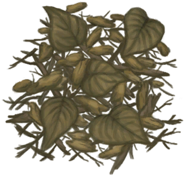

# 火种  
> 可以用来点燃营火。  
  
<table class="table table-bordered" data-toggle="table"  data-show-header="false"><thead style="display:none"><tr ><th  style="width:50%;text-align:left;vertical-align:top;"  >title</th><th  style="width:50%;text-align:left;vertical-align:top;"  ></th></tr></thead><tr ><td  style="width:50%;text-align:left;vertical-align:top;"  >**重量：**25</td><td  style="width:50%;text-align:left;vertical-align:top;"  >

<a href="TinderLit.md" style="color:black">火种</a>

</td></tr></tbody></table>  
  
## 获取来源  
<table class="table table-bordered" data-toggle="table"  ><thead style=""><tr ><th  style="text-align:left;vertical-align:top;"  >来源</th><th  style="text-align:left;vertical-align:top;"  >操作</th></tr></thead><tr ><td  style="text-align:left;vertical-align:top;"  >[

[蒸馏器(开)](AlembicOn.md)](AlembicOn.md)</td><td  style="text-align:left;vertical-align:top;"  >点燃火绒 ** 拖入：**[枯叶](LeavesDry.md) , [鸟巢](Nest.md) , [木屑](WoodShavings.md) , [纤维](Fibers.md) , [纸](Papers.md)</td></tr><tr ><td  style="text-align:left;vertical-align:top;"  >[

[营火](Campfire.md)](Campfire.md)</td><td  style="text-align:left;vertical-align:top;"  >点燃火绒 ** 拖入：**[枯叶](LeavesDry.md) , [鸟巢](Nest.md) , [木屑](WoodShavings.md) , [纤维](Fibers.md) , [纸](Papers.md)</td></tr><tr ><td  style="text-align:left;vertical-align:top;"  >[

[粘土火盆](ClayFirePit.md)](ClayFirePit.md)</td><td  style="text-align:left;vertical-align:top;"  >点燃火绒 ** 拖入：**[枯叶](LeavesDry.md) , [鸟巢](Nest.md) , [木屑](WoodShavings.md) , [纤维](Fibers.md) , [纸](Papers.md)</td></tr><tr ><td  style="text-align:left;vertical-align:top;"  >[

[火堆](Fire.md)](Fire.md)</td><td  style="text-align:left;vertical-align:top;"  >点燃火绒 ** 拖入：**[枯叶](LeavesDry.md) , [鸟巢](Nest.md) , [木屑](WoodShavings.md) , [纤维](Fibers.md) , [纸](Papers.md)</td></tr><tr ><td  style="text-align:left;vertical-align:top;"  >[

[熔炉](Forge.md)](Forge.md)</td><td  style="text-align:left;vertical-align:top;"  >点燃火绒 ** 拖入：**[枯叶](LeavesDry.md) , [鸟巢](Nest.md) , [木屑](WoodShavings.md) , [纤维](Fibers.md) , [纸](Papers.md)</td></tr><tr ><td  style="text-align:left;vertical-align:top;"  >[

[瓦斯炉(开)](GasCookerOn.md)](GasCookerOn.md)</td><td  style="text-align:left;vertical-align:top;"  >点燃火绒 ** 拖入：**[枯叶](LeavesDry.md) , [鸟巢](Nest.md) , [木屑](WoodShavings.md) , [纤维](Fibers.md) , [纸](Papers.md)</td></tr><tr ><td  style="text-align:left;vertical-align:top;"  >[

[窑炉](Kiln.md)](Kiln.md)</td><td  style="text-align:left;vertical-align:top;"  >点燃火绒 ** 拖入：**[枯叶](LeavesDry.md) , [鸟巢](Nest.md) , [木屑](WoodShavings.md) , [纤维](Fibers.md) , [纸](Papers.md)</td></tr><tr ><td  style="text-align:left;vertical-align:top;"  >[

[高级窑炉](KilnAdvanced.md)](KilnAdvanced.md)</td><td  style="text-align:left;vertical-align:top;"  >点燃火绒 ** 拖入：**[枯叶](LeavesDry.md) , [鸟巢](Nest.md) , [木屑](WoodShavings.md) , [纤维](Fibers.md) , [纸](Papers.md)</td></tr><tr ><td  style="text-align:left;vertical-align:top;"  >[

[火炉](Stove.md)](Stove.md)</td><td  style="text-align:left;vertical-align:top;"  >点燃火绒 ** 拖入：**[枯叶](LeavesDry.md) , [鸟巢](Nest.md) , [木屑](WoodShavings.md) , [纤维](Fibers.md) , [纸](Papers.md)</td></tr><tr ><td  style="text-align:left;vertical-align:top;"  >[

[火炭](Embers.md)](Embers.md)</td><td  style="text-align:left;vertical-align:top;"  >生火 ** 拖入：**[枯叶](LeavesDry.md) , [纤维](Fibers.md) , [鸟巢](Nest.md) , [木屑](WoodShavings.md)</td></tr><tr ><td  style="text-align:left;vertical-align:top;"  >[

[纤维](Fibers.md)](Fibers.md)</td><td  style="text-align:left;vertical-align:top;"  >钻木取火 ** 拖入：**[手钻](HandDrill.md)</td></tr><tr ><td  style="text-align:left;vertical-align:top;"  >[

[纤维](Fibers.md)](Fibers.md)</td><td  style="text-align:left;vertical-align:top;"  >钻木取火 ** 拖入：**[弓钻](BowDrill.md)</td></tr><tr ><td  style="text-align:left;vertical-align:top;"  >[

[纤维](Fibers.md)](Fibers.md)</td><td  style="text-align:left;vertical-align:top;"  >点燃火绒 ** 拖入：**[火把(开)](TorchOn.md) , [蜡烛(开)](CandleOn.md) , [茉莉蜡烛(开)](CandleJasmineOn.md) , [香茅蜡烛(开)](CandleCitronellaOn.md) , [燃烧的信号弹(开)](FlareHandOn.md)</td></tr><tr ><td  style="text-align:left;vertical-align:top;"  >[

[纤维](Fibers.md)](Fibers.md)</td><td  style="text-align:left;vertical-align:top;"  >点燃火绒 ** 拖入：**[信号镜](SignalingMirror.md) , [眼镜](Glasses.md)</td></tr><tr ><td  style="text-align:left;vertical-align:top;"  >[

[枯叶](LeavesDry.md)](LeavesDry.md)</td><td  style="text-align:left;vertical-align:top;"  >钻木取火 ** 拖入：**[手钻](HandDrill.md)</td></tr><tr ><td  style="text-align:left;vertical-align:top;"  >[

[枯叶](LeavesDry.md)](LeavesDry.md)</td><td  style="text-align:left;vertical-align:top;"  >钻木取火 ** 拖入：**[弓钻](BowDrill.md)</td></tr><tr ><td  style="text-align:left;vertical-align:top;"  >[

[枯叶](LeavesDry.md)](LeavesDry.md)</td><td  style="text-align:left;vertical-align:top;"  >点燃火绒 ** 拖入：**[火把(开)](TorchOn.md) , [蜡烛(开)](CandleOn.md) , [茉莉蜡烛(开)](CandleJasmineOn.md) , [香茅蜡烛(开)](CandleCitronellaOn.md) , [燃烧的信号弹(开)](FlareHandOn.md)</td></tr><tr ><td  style="text-align:left;vertical-align:top;"  >[

[枯叶](LeavesDry.md)](LeavesDry.md)</td><td  style="text-align:left;vertical-align:top;"  >点燃火绒 ** 拖入：**[信号镜](SignalingMirror.md) , [眼镜](Glasses.md)</td></tr><tr ><td  style="text-align:left;vertical-align:top;"  >[

[鸟巢](Nest.md)](Nest.md)</td><td  style="text-align:left;vertical-align:top;"  >钻木取火 ** 拖入：**[手钻](HandDrill.md)</td></tr><tr ><td  style="text-align:left;vertical-align:top;"  >[

[鸟巢](Nest.md)](Nest.md)</td><td  style="text-align:left;vertical-align:top;"  >钻木取火 ** 拖入：**[弓钻](BowDrill.md)</td></tr><tr ><td  style="text-align:left;vertical-align:top;"  >[

[鸟巢](Nest.md)](Nest.md)</td><td  style="text-align:left;vertical-align:top;"  >点燃火绒 ** 拖入：**[火把(开)](TorchOn.md) , [蜡烛(开)](CandleOn.md) , [茉莉蜡烛(开)](CandleJasmineOn.md) , [香茅蜡烛(开)](CandleCitronellaOn.md) , [燃烧的信号弹(开)](FlareHandOn.md)</td></tr><tr ><td  style="text-align:left;vertical-align:top;"  >[

[鸟巢](Nest.md)](Nest.md)</td><td  style="text-align:left;vertical-align:top;"  >点燃火绒 ** 拖入：**[信号镜](SignalingMirror.md) , [眼镜](Glasses.md)</td></tr><tr ><td  style="text-align:left;vertical-align:top;"  >[

[纸](Papers.md)](Papers.md)</td><td  style="text-align:left;vertical-align:top;"  >钻木取火 ** 拖入：**[手钻](HandDrill.md)</td></tr><tr ><td  style="text-align:left;vertical-align:top;"  >[

[纸](Papers.md)](Papers.md)</td><td  style="text-align:left;vertical-align:top;"  >钻木取火 ** 拖入：**[弓钻](BowDrill.md)</td></tr><tr ><td  style="text-align:left;vertical-align:top;"  >[

[纸](Papers.md)](Papers.md)</td><td  style="text-align:left;vertical-align:top;"  >点燃火绒 ** 拖入：**[火把(开)](TorchOn.md) , [蜡烛(开)](CandleOn.md) , [茉莉蜡烛(开)](CandleJasmineOn.md) , [香茅蜡烛(开)](CandleCitronellaOn.md) , [燃烧的信号弹(开)](FlareHandOn.md) , [火炭](Embers.md)</td></tr><tr ><td  style="text-align:left;vertical-align:top;"  >[

[纸](Papers.md)](Papers.md)</td><td  style="text-align:left;vertical-align:top;"  >点燃火绒 ** 拖入：**[信号镜](SignalingMirror.md) , [眼镜](Glasses.md)</td></tr><tr ><td  style="text-align:left;vertical-align:top;"  >[

[手钻](FirePlow.md)](FirePlow.md)</td><td  style="text-align:left;vertical-align:top;"  >点燃火绒 ** 拖入：**[“火绒”](tag_Tinder.md)</td></tr><tr ><td  style="text-align:left;vertical-align:top;"  >[

[木屑](WoodShavings.md)](WoodShavings.md)</td><td  style="text-align:left;vertical-align:top;"  >钻木取火 ** 拖入：**[手钻](HandDrill.md)</td></tr><tr ><td  style="text-align:left;vertical-align:top;"  >[

[木屑](WoodShavings.md)](WoodShavings.md)</td><td  style="text-align:left;vertical-align:top;"  >钻木取火 ** 拖入：**[弓钻](BowDrill.md)</td></tr><tr ><td  style="text-align:left;vertical-align:top;"  >[

[木屑](WoodShavings.md)](WoodShavings.md)</td><td  style="text-align:left;vertical-align:top;"  >点燃火绒 ** 拖入：**[火把(开)](TorchOn.md) , [蜡烛(开)](CandleOn.md) , [茉莉蜡烛(开)](CandleJasmineOn.md) , [香茅蜡烛(开)](CandleCitronellaOn.md) , [燃烧的信号弹(开)](FlareHandOn.md)</td></tr><tr ><td  style="text-align:left;vertical-align:top;"  >[

[木屑](WoodShavings.md)](WoodShavings.md)</td><td  style="text-align:left;vertical-align:top;"  >点燃火绒 ** 拖入：**[信号镜](SignalingMirror.md) , [眼镜](Glasses.md)</td></tr></tbody></table>  
  
## 可拖至  

[蒸馏器(关)](AlembicOff.md)

[营火(熄灭)](CampfireExtinguished.md)

[粘土火盆(熄灭)](ClayFirePitExtinguished.md)

[火堆(熄灭)](FireExtinguished.md)

[熔炉(熄灭)](ForgeExtinguished.md)

[高级窑炉(熄灭)](KilnAdvancedExtinguished.md)

[窑炉(熄灭)](KilnExtinguished.md)

[火炉(熄灭)](StoveExtinguished.md)

[烟熏炉](Smoker.md)

[烟熏炉(熄灭)](SmokerExtinguished.md)

[烟熏炉(塑料布)(熄灭)](SmokerExtinguishedPlastic.md)

[烟熏炉(塑料布)(点燃)](SmokerPlastic.md)

[熏蜂器(关)](BeeSmokerOff.md)

[香茅蜡烛(关)](CandleCitronellaOff.md)

[茉莉蜡烛(关)](CandleJasmineOff.md)

[蜡烛(关)](CandleOff.md)

[炸弹(关)](DynamiteOff.md)

[火把(关)](TorchOff.md)

  
  
## 属性   
<table class="table table-bordered" data-toggle="table"  ><thead style=""><tr ><th  style="text-align:left;vertical-align:top;"  >属性</th><th  style="text-align:left;vertical-align:top;"  >值</th><th  style="text-align:left;vertical-align:top;"  >耗时</th><th  style="text-align:left;vertical-align:top;"  >变化</th></tr></thead><tr ><td  style="text-align:left;vertical-align:top;"  >燃料</td><td  style="text-align:left;vertical-align:top;"  >初始：6</td><td  style="text-align:left;vertical-align:top;"  >每15分钟-1 最多需要：1小时30分</td><td  style="text-align:left;vertical-align:top;"  >** 到达0时： **  ** 自身 ** →消失</td></tr></tbody></table>  
  

