## 游客  

<table style="margin-bottom:0px;"><tr><td rowspan=2 style="width:160px">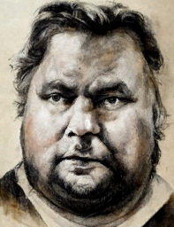</td><td style="font-size:1.8em"><b>游客</b></td><td style="width:50%">解锁价格：1🌙</td></tr><tr><td  colspan=2 style=""><i>这本应是完美的假期……但你的飞机却偏要坠毁在这与世隔绝的鬼地方。

你不仅近视、紫外线过敏，而且你很清楚虫子会一点点把你蚕食，就像它们以前对你做的……
噢，你还在流血，致命的大出血！看起来你身处窘境。

所幸你体内的脂肪足够你支撑一段时间，因此当务之急就是止血！</i></td><tr><td colspan=2><b>初始环境：</b>[

[沙滩](Beach.md)](Beach.md)<td colspan=1><b>初始天气：</b>[

[晴朗](TropicalIsland_ClearStart.md)](TropicalIsland_ClearStart.md)</tr></tr><tr><td colspan=3><b>初始特性：</b>

[坠机](Pk_1_PlaneCrash.md)

[游客](Pk_2_Tourist.md)

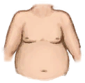
[过度肥胖](Pk_3_Obese.md)

[胃口大开](Pk_4_Gluttonous.md)

[正在流血](Pk_3_BleedingWound.md)

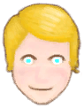
[皮肤白皙](Pk_3_PaleSkin.md)

[免疫系统脆弱](Pk_4_ImmuneSystemWeak.md)

[招虫体质](Pk_4_BugAttractant.md)

[近视](Pk_3_Shortsighted.md)

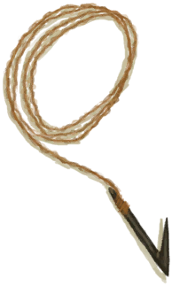
[钓鱼佬](Pk_5_Fisher.md)

[猕猴诅咒](Pk_1_MacaqueCurse.md)

  
  
</tr><tr><td colspan=3><b>初始衣物：</b> 

<a href="T-Shirt.md" style="color:black">T恤</a>

<a href="Socks.md" style="color:black">袜子</a>

<a href="Underwear.md" style="color:black">内裤</a>

<a href="Shorts.md" style="color:black">短裤</a>

  
  
</tr><tr><td colspan=3><b>初始卡牌：</b> 

<a href="Trunk.md" style="color:black">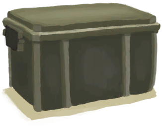收纳箱</a>

<a href="SeatAttached.md" style="color:black">座椅x6</a>

<a href="LuggageA.md" style="color:black">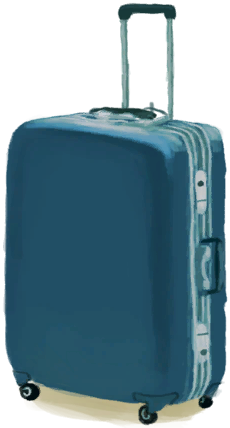行李箱</a>

<a href="LuggageC.md" style="color:black">行李箱</a>

<a href="JerrycanFuel.md" style="color:black">装有燃料的油桶</a>

<a href="SafetyKnife.md" style="color:black">安全刀</a>

<a href="FirstAidKitPlane.md" style="color:black">急救包</a>

<a href="Painkillers.md" style="color:black">止痛药</a>

<a href="Antibiotics.md" style="color:black">抗生素</a>

<a href="WoundDressing.md" style="color:black">伤口敷料x2</a>

<a href="Socks.md" style="color:black">袜子x5</a>

<a href="Underwear.md" style="color:black">内裤x2</a>

<a href="Shorts.md" style="color:black">短裤x2</a>

<a href="T-Shirt.md" style="color:black">T恤x3</a>

<a href="Sneakers.md" style="color:black">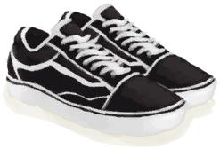运动鞋</a>

<a href="Papers.md" style="color:black">纸x7</a>

<a href="Glasses.md" style="color:black">眼镜x2</a>

<a href="Chocolate.md" style="color:black">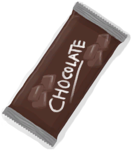巧克力x4</a>

<a href="BackpackTourist.md" style="color:black">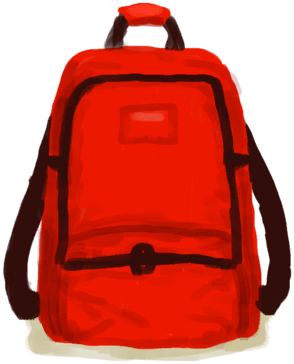背包</a>

<a href="HawaiianShirt.md" style="color:black">夏威夷衬衫</a>

<a href="Flipflops.md" style="color:black">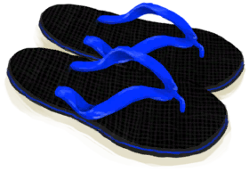人字拖</a>

<a href="SunScreen.md" style="color:black">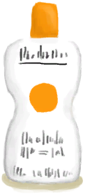防晒霜</a>

<a href="ChickenSandwich.md" style="color:black">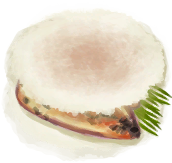鸡肉三明治</a>

<a href="PlasticBottleFull.md" style="color:black">塑料瓶</a>

<a href="W_ArmLacerationR.md" style="color:black">右臂撕裂伤</a>

<a href="Event_IntroTourist1.md" style="color:black">坠机</a>

<a href="Camera.md" style="color:black">相机</a>

<a href="BeltBag.md" style="color:black">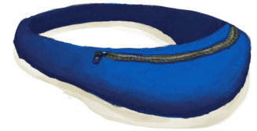腰包</a>

<a href="W_Abrasion.md" style="color:black">擦伤x2</a>

<a href="Passport.md" style="color:black">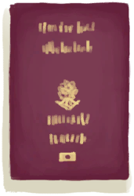护照</a>

  
  
</tr><tr><td colspan=3><b>初始蓝图：</b> 

<a href="Bp_FishingLine.md" style="color:black">钓鱼线</a>

<a href="Bp_FishingRod.md" style="color:black">钓鱼竿</a>

<a href="Bp_FishBait.md" style="color:black">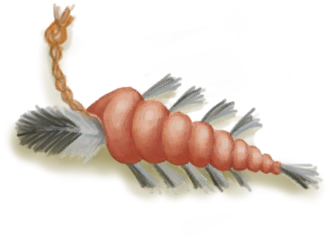鱼饵</a>

<a href="Bp_Tourniquet.md" style="color:black">止血带</a>

  
  
</tr></table>
    
  
## 目标  

<b>优先事项</b>

<table style="margin-bottom:0px;"><tr><td rowSpan=3 style="width:50px;max-height:100px;text-align:center;vertical-align:top"></td><td colspan=2 >
<b>服用止痛药</b>
<i>保持理智，掌控局面。</i></td></tr><tr style=""><td><b>达成条件：</b>服用 [

[止痛药](Painkillers.md)](Painkillers.md) </td></tr><tr style=""><td ><b>达成奖励：</b>[

[压力](Stress.md)](Stress.md)<b>-48</b>&nbsp;&nbsp;&nbsp;&nbsp;[假期满意度](HolidaySatisfaction.md)<b>+100</b></td></tr><tr style="border-bottom:2px solid #CCC;height:1px;"></tr><tr><td rowSpan=3 style="width:50px;max-height:100px;text-align:center;vertical-align:top"></td><td colspan=2 >
<b>制作一个止血带</b>
<i>用以止血。</i></td></tr><tr style=""><td><b>达成条件：</b>[

[简易止血带](TourniquetRustic.md)](TourniquetRustic.md)x1&nbsp;&nbsp;&nbsp;&nbsp;[

[止血带](Tourniquet.md)](Tourniquet.md)x1 </td></tr><tr style=""><td ><b>达成奖励：</b>[

[压力](Stress.md)](Stress.md)<b>-48</b>&nbsp;&nbsp;&nbsp;&nbsp;[假期满意度](HolidaySatisfaction.md)<b>+100</b></td></tr><tr style="border-bottom:2px solid #CCC;height:1px;"></tr><tr><td rowSpan=3 style="width:50px;max-height:100px;text-align:center;vertical-align:top"></td><td colspan=2 >
<b>吃掉鸡肉三明治</b>
<i>得填饱肚子才好理清思维。</i></td></tr><tr style=""><td><b>达成条件：</b>食用 [

[鸡肉三明治](ChickenSandwich.md)](ChickenSandwich.md) </td></tr><tr style=""><td ><b>达成奖励：</b>[

[压力](Stress.md)](Stress.md)<b>-48</b>&nbsp;&nbsp;&nbsp;&nbsp;[假期满意度](HolidaySatisfaction.md)<b>+100</b></td></tr><tr style="border-bottom:2px solid #CCC;height:1px;"></tr></table>
 
<b>水分</b>

<table style="margin-bottom:0px;"><tr><td rowSpan=3 style="width:50px;max-height:100px;text-align:center;vertical-align:top">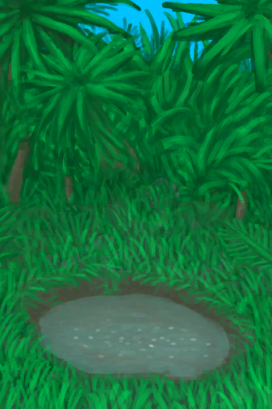</td><td colspan=2 >
<b>找到水塘</b>
<i>作为紧急水源使用。</i></td></tr><tr style=""><td><b>达成条件：</b>[

[干涸的小水塘(湿地)](Puddle.md)](Puddle.md)x1 </td></tr><tr style=""><td ><b>达成奖励：</b>[

[决心](Determination.md)](Determination.md)<b>+250</b>&nbsp;&nbsp;&nbsp;&nbsp;[

[压力](Stress.md)](Stress.md)<b>-48</b></td></tr><tr style="border-bottom:2px solid #CCC;height:1px;"></tr><tr><td rowSpan=3 style="width:50px;max-height:100px;text-align:center;vertical-align:top"></td><td colspan=2 >
<b>烧开一些水</b>
<i>我可不想喝出病来。</i></td></tr><tr style=""><td><b>达成条件：</b>[

[开水](LQ_WaterBoiling.md)](LQ_WaterBoiling.md)x1 </td></tr><tr style=""><td ><b>达成奖励：</b>[

[压力](Stress.md)](Stress.md)<b>-48</b>&nbsp;&nbsp;&nbsp;&nbsp;[假期满意度](HolidaySatisfaction.md)<b>+100</b></td></tr><tr style="border-bottom:2px solid #CCC;height:1px;"></tr><tr><td rowSpan=3 style="width:50px;max-height:100px;text-align:center;vertical-align:top"></td><td colspan=2 >
<b>做些陶碗</b>
<i>用作额外的水容器。</i></td></tr><tr style=""><td><b>达成条件：</b>[

[陶碗](ClayBowl.md)](ClayBowl.md)x1 </td></tr><tr style=""><td ><b>达成奖励：</b>[

[压力](Stress.md)](Stress.md)<b>-48</b>&nbsp;&nbsp;&nbsp;&nbsp;[假期满意度](HolidaySatisfaction.md)<b>+100</b></td></tr><tr style="border-bottom:2px solid #CCC;height:1px;"></tr></table>
 
<b><i>生存必备</i></b>

<table style="margin-bottom:0px;"><tr><td rowSpan=3 style="width:50px;max-height:100px;text-align:center;vertical-align:top">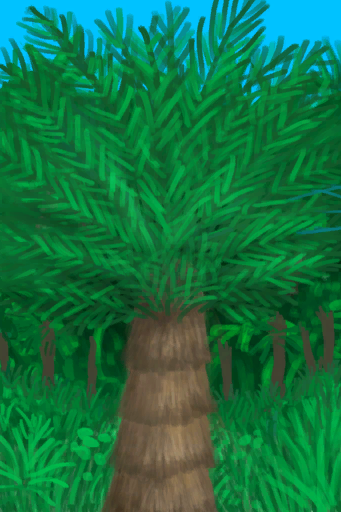</td><td colspan=2 >
<b>做些西米粉</b>
<i>应该够我吃一段时间的。</i></td></tr><tr style=""><td><b>达成条件：</b>[

[西米粉](SagoFlour.md)](SagoFlour.md)x1 </td></tr><tr style=""><td ><b>达成奖励：</b>[

[压力](Stress.md)](Stress.md)<b>-48</b>&nbsp;&nbsp;&nbsp;&nbsp;[假期满意度](HolidaySatisfaction.md)<b>+100</b></td></tr><tr style="border-bottom:2px solid #CCC;height:1px;"></tr><tr><td rowSpan=3 style="width:50px;max-height:100px;text-align:center;vertical-align:top"></td><td colspan=2 >
<b>建造一个火炉</b>
<i>防止做菜的时候把自己也烤了。</i></td></tr><tr style=""><td><b>达成条件：</b>[

[火炉(熄灭)](StoveExtinguished.md)](StoveExtinguished.md)x1 </td></tr><tr style=""><td ><b>达成奖励：</b>[

[压力](Stress.md)](Stress.md)<b>-48</b>&nbsp;&nbsp;&nbsp;&nbsp;[假期满意度](HolidaySatisfaction.md)<b>+100</b></td></tr><tr style="border-bottom:2px solid #CCC;height:1px;"></tr><tr><td rowSpan=3 style="width:50px;max-height:100px;text-align:center;vertical-align:top"></td><td colspan=2 >
<b>建造一座蓄水池</b>
<i>未雨绸缪。</i></td></tr><tr style=""><td><b>达成条件：</b>[

[蓄水池](WaterReservoir.md)](WaterReservoir.md)x1 </td></tr><tr style=""><td ><b>达成奖励：</b>[

[压力](Stress.md)](Stress.md)<b>-48</b>&nbsp;&nbsp;&nbsp;&nbsp;[假期满意度](HolidaySatisfaction.md)<b>+100</b></td></tr><tr style="border-bottom:2px solid #CCC;height:1px;"></tr></table>
 
<b>度假不能停！</b>

<table style="margin-bottom:0px;"><tr><td rowSpan=3 style="width:50px;max-height:100px;text-align:center;vertical-align:top"></td><td colspan=2 >
<b>度假不能停！</b>
<i>别让这些小意外毁了整个假期。让我们整点好活！</i></td></tr><tr style=""></tr><tr style="border-bottom:2px solid #CCC;height:1px;"></tr><tr><td rowSpan=3 style="width:50px;max-height:100px;text-align:center;vertical-align:top"></td><td colspan=2 >
<b>DIY乐园</b>
</td></tr><tr style=""><td>
<table style="margin-bottom:0px;"><tr><td rowSpan=3 style="width:50px;max-height:100px;text-align:center;vertical-align:top"></td><td colspan=2 >
<b>移除飞机座位</b>
<i>腾出些空间并回收点可用材料。</i></td></tr><tr style=""><td><b>达成条件：</b>分离 [

[座椅](SeatAttached.md)](SeatAttached.md) </td></tr><tr style=""><td ><b>达成奖励：</b>[

[压力](Stress.md)](Stress.md)<b>-48</b>&nbsp;&nbsp;&nbsp;&nbsp;[假期满意度](HolidaySatisfaction.md)<b>+100</b></td></tr><tr style="border-bottom:2px solid #CCC;height:1px;"></tr><tr><td rowSpan=3 style="width:50px;max-height:100px;text-align:center;vertical-align:top">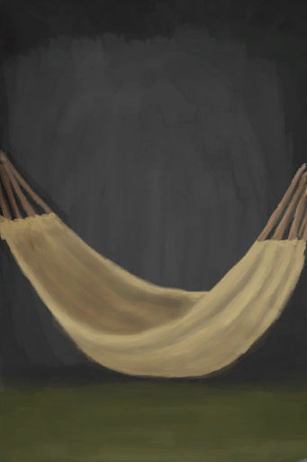</td><td colspan=2 >
<b>搭一顶吊床</b>
<i>享受美好假期。</i></td></tr><tr style=""><td><b>达成条件：</b>[

[吊床](Hammock.md)](Hammock.md)x1 </td></tr><tr style=""><td ><b>达成奖励：</b>[

[压力](Stress.md)](Stress.md)<b>-48</b>&nbsp;&nbsp;&nbsp;&nbsp;[假期满意度](HolidaySatisfaction.md)<b>+100</b></td></tr><tr style="border-bottom:2px solid #CCC;height:1px;"></tr><tr><td rowSpan=3 style="width:50px;max-height:100px;text-align:center;vertical-align:top"></td><td colspan=2 >
<b>装一扇门</b>
<i>高档酒店可不欢迎猕猴。</i></td></tr><tr style=""><td><b>达成条件：</b>[

[门](Imp_Door.md)](Imp_Door.md)x1 </td></tr><tr style=""><td ><b>达成奖励：</b>[

[压力](Stress.md)](Stress.md)<b>-48</b>&nbsp;&nbsp;&nbsp;&nbsp;[假期满意度](HolidaySatisfaction.md)<b>+100</b></td></tr><tr style="border-bottom:2px solid #CCC;height:1px;"></tr></table>
  </td></tr><tr style=""><td ><b>达成奖励：</b>[

[压力](Stress.md)](Stress.md)<b>-48</b>&nbsp;&nbsp;&nbsp;&nbsp;[假期满意度](HolidaySatisfaction.md)<b>+100</b></td></tr><tr style="border-bottom:2px solid #CCC;height:1px;"></tr><tr><td rowSpan=3 style="width:50px;max-height:100px;text-align:center;vertical-align:top">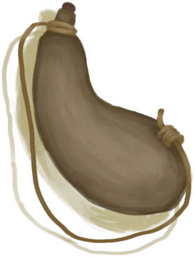</td><td colspan=2 >
<b>派对时间！</b>
</td></tr><tr style=""><td>
<table style="margin-bottom:0px;"><tr><td rowSpan=3 style="width:50px;max-height:100px;text-align:center;vertical-align:top"></td><td colspan=2 >
<b>交个猕猴朋友</b>
<i>部分猕猴还是友好的。仅限部分！</i></td></tr><tr style=""><td><b>达成条件：</b>[

[猕猴朋友](MacaqueFriend.md)](MacaqueFriend.md)x1 </td></tr><tr style=""><td ><b>达成奖励：</b>[

[压力](Stress.md)](Stress.md)<b>-48</b>&nbsp;&nbsp;&nbsp;&nbsp;[假期满意度](HolidaySatisfaction.md)<b>+100</b></td></tr><tr style="border-bottom:2px solid #CCC;height:1px;"></tr><tr><td rowSpan=3 style="width:50px;max-height:100px;text-align:center;vertical-align:top"></td><td colspan=2 >
<b>喝个烂醉！</b>
<i>芜湖！！！</i></td></tr><tr style=""><td><b>达成条件：</b>[

[酒精](Alcohol.md)](Alcohol.md): <b>49～70</b> </td></tr><tr style=""><td ><b>达成奖励：</b>[

[压力](Stress.md)](Stress.md)<b>-48</b>&nbsp;&nbsp;&nbsp;&nbsp;[假期满意度](HolidaySatisfaction.md)<b>+100</b></td></tr><tr style="border-bottom:2px solid #CCC;height:1px;"></tr><tr><td rowSpan=3 style="width:50px;max-height:100px;text-align:center;vertical-align:top"></td><td colspan=2 >
<b>敲鼓！</b>
<i>大宝贝来咯我的邻居们！</i></td></tr><tr style=""><td><b>达成条件：</b>激昂的节奏 [

[鼓](Drum.md)](Drum.md) </td></tr><tr style=""><td ><b>达成奖励：</b>[

[压力](Stress.md)](Stress.md)<b>-48</b>&nbsp;&nbsp;&nbsp;&nbsp;[假期满意度](HolidaySatisfaction.md)<b>+100</b></td></tr><tr style="border-bottom:2px solid #CCC;height:1px;"></tr></table>
  </td></tr><tr style=""><td ><b>达成奖励：</b>[

[压力](Stress.md)](Stress.md)<b>-48</b>&nbsp;&nbsp;&nbsp;&nbsp;[假期满意度](HolidaySatisfaction.md)<b>+100</b></td></tr><tr style="border-bottom:2px solid #CCC;height:1px;"></tr><tr><td rowSpan=3 style="width:50px;max-height:100px;text-align:center;vertical-align:top"></td><td colspan=2 >
<b>值得铭记的假期！</b>
</td></tr><tr style=""><td>
<table style="margin-bottom:0px;"><tr><td rowSpan=3 style="width:50px;max-height:100px;text-align:center;vertical-align:top"></td><td colspan=2 >
<b>拍些酷炫的照片</b>
<i>让这些记忆永远留存！</i></td></tr><tr style=""><td>
<table style="margin-bottom:0px;"><tr><td rowSpan=3 style="width:50px;max-height:100px;text-align:center;vertical-align:top"></td><td colspan=2 >
<b>美丽海滩</b>
<i>我会成为全家人羡慕的对象。</i></td></tr><tr style=""><td><b>达成条件：</b>Take Picture! [

[沙滩](Beach.md)](Beach.md)&nbsp;&nbsp;&nbsp;&nbsp;Take Picture! [

[海湾](Bay.md)](Bay.md) </td></tr><tr style=""><td ><b>达成奖励：</b>[

[压力](Stress.md)](Stress.md)<b>-48</b>&nbsp;&nbsp;&nbsp;&nbsp;[假期满意度](HolidaySatisfaction.md)<b>+100</b></td></tr><tr style="border-bottom:2px solid #CCC;height:1px;"></tr><tr><td rowSpan=3 style="width:50px;max-height:100px;text-align:center;vertical-align:top"></td><td colspan=2 >
<b>危险动物</b>
<i>我乃真正的冒险家！</i></td></tr><tr style=""><td><b>达成条件：</b>拍照！ [

[一头巨蜥！(事件)(洞穴)](Event_MonitorFight.md)](Event_MonitorFight.md) </td></tr><tr style=""><td ><b>达成奖励：</b>[

[压力](Stress.md)](Stress.md)<b>-48</b>&nbsp;&nbsp;&nbsp;&nbsp;[假期满意度](HolidaySatisfaction.md)<b>+100</b></td></tr><tr style="border-bottom:2px solid #CCC;height:1px;"></tr><tr><td rowSpan=3 style="width:50px;max-height:100px;text-align:center;vertical-align:top"></td><td colspan=2 >
<b>莫逆之交</b>
<i>不像家里那些刻薄的家伙。</i></td></tr><tr style=""><td><b>达成条件：</b>Take Picture! [

[韦斯顿](Weston.md)](Weston.md) </td></tr><tr style=""><td ><b>达成奖励：</b>[

[压力](Stress.md)](Stress.md)<b>-48</b>&nbsp;&nbsp;&nbsp;&nbsp;[假期满意度](HolidaySatisfaction.md)<b>+100</b></td></tr><tr style="border-bottom:2px solid #CCC;height:1px;"></tr></table>
  </td></tr><tr style=""><td ><b>达成奖励：</b>[

[压力](Stress.md)](Stress.md)<b>-48</b>&nbsp;&nbsp;&nbsp;&nbsp;[假期满意度](HolidaySatisfaction.md)<b>+100</b></td></tr><tr style="border-bottom:2px solid #CCC;height:1px;"></tr><tr><td rowSpan=3 style="width:50px;max-height:100px;text-align:center;vertical-align:top">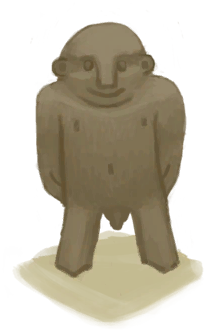</td><td colspan=2 >
<b>收集一些纪念品</b>
<i>时光不再，记忆永恒。</i></td></tr><tr style=""><td>
<table style="margin-bottom:0px;"><tr><td rowSpan=3 style="width:50px;max-height:100px;text-align:center;vertical-align:top">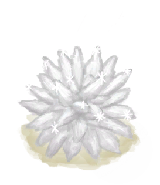</td><td colspan=2 >
<b>方解石晶体</b>
<i>超酷的石头！</i></td></tr><tr style=""><td><b>达成条件：</b>[

[方解石晶体](Calcite.md)](Calcite.md)x1 </td></tr><tr style=""><td ><b>达成奖励：</b>[

[压力](Stress.md)](Stress.md)<b>-48</b>&nbsp;&nbsp;&nbsp;&nbsp;[假期满意度](HolidaySatisfaction.md)<b>+100</b></td></tr><tr style="border-bottom:2px solid #CCC;height:1px;"></tr><tr><td rowSpan=3 style="width:50px;max-height:100px;text-align:center;vertical-align:top">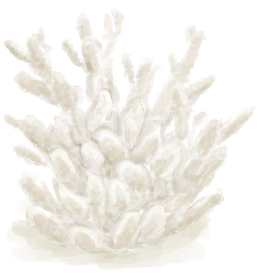</td><td colspan=2 >
<b>一块珊瑚！</b>
<i>从海里捞上来的！</i></td></tr><tr style=""><td><b>达成条件：</b>[

[珊瑚](Coral.md)](Coral.md)x1 </td></tr><tr style=""><td ><b>达成奖励：</b>[

[压力](Stress.md)](Stress.md)<b>-48</b>&nbsp;&nbsp;&nbsp;&nbsp;[假期满意度](HolidaySatisfaction.md)<b>+100</b></td></tr><tr style="border-bottom:2px solid #CCC;height:1px;"></tr><tr><td rowSpan=3 style="width:50px;max-height:100px;text-align:center;vertical-align:top"></td><td colspan=2 >
<b>木制手办</b>
<i>完全原创！</i></td></tr><tr style=""><td><b>达成条件：</b>[
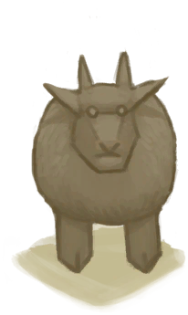
[山羊木雕](WoodCarving_Goat.md)](WoodCarving_Goat.md)x1&nbsp;&nbsp;&nbsp;&nbsp;[

[小人木雕（男）](WoodCarving_Man.md)](WoodCarving_Man.md)x1&nbsp;&nbsp;&nbsp;&nbsp;[
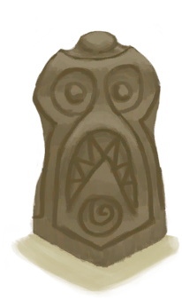
[神灵木雕](WoodCarving_Monster.md)](WoodCarving_Monster.md)x1&nbsp;&nbsp;&nbsp;&nbsp;[
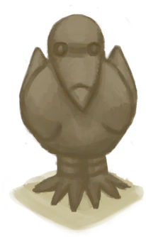
[海鸥木雕](WoodCarving_Seagull.md)](WoodCarving_Seagull.md)x1&nbsp;&nbsp;&nbsp;&nbsp;[

[小人木雕（女）](WoodCarving_Woman.md)](WoodCarving_Woman.md)x1 </td></tr><tr style=""><td ><b>达成奖励：</b>[

[压力](Stress.md)](Stress.md)<b>-48</b>&nbsp;&nbsp;&nbsp;&nbsp;[假期满意度](HolidaySatisfaction.md)<b>+100</b></td></tr><tr style="border-bottom:2px solid #CCC;height:1px;"></tr></table>
  </td></tr><tr style=""><td ><b>达成奖励：</b>[

[压力](Stress.md)](Stress.md)<b>-48</b>&nbsp;&nbsp;&nbsp;&nbsp;[假期满意度](HolidaySatisfaction.md)<b>+100</b></td></tr><tr style="border-bottom:2px solid #CCC;height:1px;"></tr><tr><td rowSpan=3 style="width:50px;max-height:100px;text-align:center;vertical-align:top">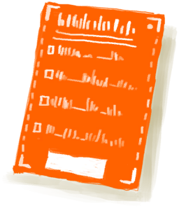</td><td colspan=2 >
<b>找回护照</b>
<i>事关尊严，那些猴子怎能一直逍遥法外。</i></td></tr><tr style=""><td><b>达成条件：</b>[

[猕猴窝(环境)](Env_MacaqueDen.md)](Env_MacaqueDen.md)x1 </td></tr><tr style=""><td ><b>达成奖励：</b>[

[压力](Stress.md)](Stress.md)<b>-48</b>&nbsp;&nbsp;&nbsp;&nbsp;[假期满意度](HolidaySatisfaction.md)<b>+100</b></td></tr><tr style="border-bottom:2px solid #CCC;height:1px;"></tr></table>
  </td></tr><tr style=""><td ><b>达成奖励：</b>[

[压力](Stress.md)](Stress.md)<b>-48</b>&nbsp;&nbsp;&nbsp;&nbsp;[假期满意度](HolidaySatisfaction.md)<b>+100</b></td></tr><tr style="border-bottom:2px solid #CCC;height:1px;"></tr></table>
 
<b>直面命运</b>

<table style="margin-bottom:0px;"><tr><td rowSpan=3 style="width:50px;max-height:100px;text-align:center;vertical-align:top"></td><td colspan=2 >
<b>享受假期！</b>
<i>假期狂欢！</i></td></tr><tr style=""><td><b>达成条件：</b>[假期满意度](HolidaySatisfaction.md): <b>2600</b> </td></tr><tr style="border-bottom:2px solid #CCC;height:1px;"></tr><tr><td rowSpan=3 style="width:50px;max-height:100px;text-align:center;vertical-align:top"></td><td colspan=2 >
<b>逃离海岛</b>
</td></tr><tr style=""><td>
<table style="margin-bottom:0px;"><tr><td rowSpan=3 style="width:50px;max-height:100px;text-align:center;vertical-align:top"></td><td colspan=2 >
<b>建造一艘木筏</b>
<i>以离开岛屿并回去当社畜</i></td></tr><tr style=""><td><b>达成条件：</b>[

[木筏](RaftEntrance.md)](RaftEntrance.md)x1 </td></tr><tr style="border-bottom:2px solid #CCC;height:1px;"></tr><tr><td rowSpan=3 style="width:50px;max-height:100px;text-align:center;vertical-align:top"></td><td colspan=2 >
<b>重返文明世界</b>
<i>给假期画上句号</i></td></tr><tr style=""><td><b>达成条件：</b>[

[距离](Distance.md)](Distance.md): <b>2016</b> </td></tr><tr style="border-bottom:2px solid #CCC;height:1px;"></tr></table>
  </td></tr><tr style="border-bottom:2px solid #CCC;height:1px;"></tr><tr><td rowSpan=3 style="width:50px;max-height:100px;text-align:center;vertical-align:top"></td><td colspan=2 >
<b>在岛上定居</b>
</td></tr><tr style=""><td>
<table style="margin-bottom:0px;"><tr><td rowSpan=3 style="width:50px;max-height:100px;text-align:center;vertical-align:top"></td><td colspan=2 >
<b>在岛上生存120天</b>
<i>来熟悉这座岛。</i></td></tr><tr style=""><td><b>达成条件：</b>[计数](Counter.md): <b>11520～999999</b> </td></tr><tr style="border-bottom:2px solid #CCC;height:1px;"></tr><tr><td rowSpan=3 style="width:50px;max-height:100px;text-align:center;vertical-align:top">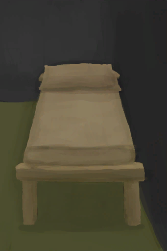</td><td colspan=2 >
<b>达到最高舒适度</b>
<i>来把你的度假小屋变成五星级酒店！</i></td></tr><tr style=""><td><b>达成条件：</b>[

[舒适度](Comfort.md)](Comfort.md): <b>1751～2500</b> </td></tr><tr style="border-bottom:2px solid #CCC;height:1px;"></tr></table>
  </td></tr><tr style="border-bottom:2px solid #CCC;height:1px;"></tr></table>
   

