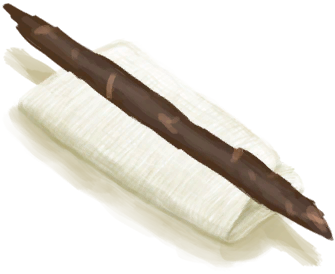

# 止血带  
> 可以帮助止血。不要持续使用它超过几个小时，否则可能会造成永久性损伤。  
   
> 止血带可用于在<b>严重开放性伤口</b>的情况下迅速止血。  它的作用原理是缠绕在你的肢体上并收紧，从而暂时中断血液流动。  它可以简单地用<b>细线</b>和<b>小树枝</b>制成，若使用<b>布</b>代替细线则能使其更加耐用。  止血带只能<b>短时间</b>使用，因为长时间中断血液流动会对肢体造成损害，导致<b>永久性神经损伤</b>。  请在紧急情况下使用它来阻止失血，并请确保<b>在止血之后立即正确处理伤口</b>。  
  
  止血带  |   图片   
 ----  |  ----:   
 **重量：**150  **装备时减重：**-100  **标签：**	[“止血带”](tag_Tourniquet.md)  **可使用次数：**672  ** 效果: ** [疼痛](Pain.md)+100  |     
  
## 获取来源  
来源  |  操作  
----  |  ----  
[止血带(蓝图)](Bp_Tourniquet.md)  |  蓝图制造  
[布](Cloth.md)  |  制作止血带 ** 拖入：**[小树枝](Sticks.md)  
## 动作  
动作  |  耗时  |  条件  |  变化  |  状态  
----  |  ----  |  ----  |  ----  |  ----  
拆解   |  -  |    |  ** 自身：** →消失  ** 获得： ** ** [dismantle] **   [小树枝](Sticks.md)(+1)   [布](Cloth.md)(+1)   |    
## 属性   
属性  |  值  |  耗时  |  变化  
----  |  ----  |  ----  |  ----  
使用次数  |  初始：672 最大：672  |  -  |  ** 到达0时： **   [布](Cloth.md)(+1)  自身→消失  

