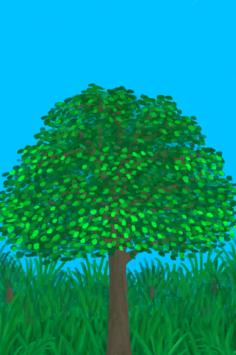

# 摘光的热带杏仁树  
> 杏仁还是会长出来的。  
   
>   
  
  摘光的热带杏仁树  |   图片   
 ----  |  ----:   
   |     
  
## 获取来源  
来源  |  操作  
----  |  ----  
[热带杏仁树](TropicalAlmondTree.md)  |  转化  
[小杏仁树](TropicalAlmondTreeYoung.md)  |  转化  
## 可拖入  
使用  |  动作  |  耗时  |  条件  |  变化  |  玩家状态  
----  |  ----  |  ----  |  ----  |  ----  |  ----  
[石斧](StoneAxe.md)  |  砍树 [手部动作](HandAction.md)  |  30分  |  [光亮](Light.md): 10-100 [耐力](Stamina.md): 11-32 [IGNOREKEY](OnNotAxeAdv.md): 0-0  |  ** 自身: ** 杏仁生长度  -1500 砍伐进度  -10  ** 使用物: ** 可用次数  -3  |  [耐力](Stamina.md)-8 [手掌损伤](HandDamage.md)+80 [木工(技能)](Skill_Woodworking.md)+1  
[“斧状的”](tag_AxeAdv.md)  |  砍树 [手部动作](HandAction.md)  |  30分  |  [光亮](Light.md): 10-100 [耐力](Stamina.md): 11-32  |  ** 自身: ** 杏仁生长度  -1500 砍伐进度  -25  ** 使用物: ** 可用次数  -3  |  [耐力](Stamina.md)-6 [手掌损伤](HandDamage.md)+60 [木工(技能)](Skill_Woodworking.md)+1  
## 属性   
属性  |  值  |  耗时  |  变化  
----  |  ----  |  ----  |  ----  
杏仁生长度  |  初始：0 最大：2880  |  每15分钟+1 最多需要：30天  |  ** 到达上限时： **  → [热带杏仁树](TropicalAlmondTree.md)  
砍伐进度  |  初始：50 最大：50  |  -  |  ** 到达0时： ** ** [Tree] **   [小树枝](Sticks.md)(+2～+4)   [树叶](LeavesFresh.md)(+6～+18)  → [倒下的大树](LargeTreeFelled.md)  

