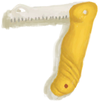

# 收纳箱  
> 我可以把物品储存在里面。  
  
<table class="table table-bordered" data-toggle="table"  data-show-header="false"><thead style="display:none"><tr ><th  style="width:50%;text-align:left;vertical-align:top;"  >title</th><th  style="width:50%;text-align:left;vertical-align:top;"  ></th></tr></thead><tr ><td  style="width:50%;text-align:left;vertical-align:top;"  >** 不可堆叠 **  **重量：**2000  **标签：**	[“袋子”](tag_Bag.md), [“沉重的”](tag_Heavy.md), [“大的”](tag_Large.md)  **槽位：**12  **初始卡牌：**

[

[装有燃料的油桶](JerrycanFuel.md)](JerrycanFuel.md)

[

[安全刀](SafetyKnife.md)](SafetyKnife.md)

[

[急救包(飞机)](FirstAidKitPlane.md)](FirstAidKitPlane.md)

[

[止痛药](Painkillers.md)](Painkillers.md)

[

[抗生素](Antibiotics.md)](Antibiotics.md)

[

[伤口敷料](WoundDressing.md)](WoundDressing.md)(2)

  
  
  **过滤器：**~~[“袋子”](tag_Bag.md)~~ , ~~[“火源”](tag_FireSource.md)~~ , ~~[“火”](tag_Fire.md)~~ , ~~[“可泼溅的”](tag_Spillable.md)~~  **容量：**3000  **减重：**-1500</td><td  style="width:50%;text-align:left;vertical-align:top;"  >

<a href="Trunk.md" style="color:black">收纳箱</a>

装满有用物资的大容量坚固储物箱。 <b>你在野外找不到这样的东西。</b>  不过，如果你在生存时发现自己刚好有一个，请确保将其保留在身边并利用它作为自己的优势。  将物品放在坚固的容器中是<b>保护它们免受动物和风暴侵害</b>的好方法。</td></tr></tbody></table>  
  
## 获取来源  

拿起

[收纳箱](TrunkPlaced.md)

特质影响

[坠机](Pk_1_PlaneCrash.md)

  
  
## 动作  

<table><tr><td rowspan="2" style="width:200px;text-align:center;font-size:1.3em;font-weight:bold">

放置

</td><td></td></tr><tr><td><b>自身：</b>→ [

[收纳箱](TrunkPlaced.md)](TrunkPlaced.md)</td></tr></table>
  
  
  

