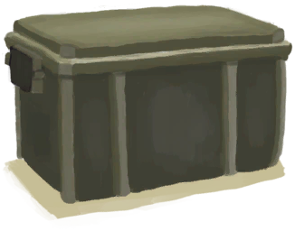

# 收纳箱  
> 我可以把物品储存在里面。  
   
> 装满有用物资的大容量坚固储物箱。 <b>你在野外找不到这样的东西。</b>  不过，如果你在生存时发现自己刚好有一个，请确保将其保留在身边并利用它作为自己的优势。  将物品放在坚固的容器中是<b>保护它们免受动物和风暴侵害</b>的好方法。  
  
  收纳箱  |   图片   
 ----  |  ----:   
 ** 不可堆叠 **  **标签：**	[“袋子”](tag_Bag.md), [“沉重的”](tag_Heavy.md), [“大的”](tag_Large.md)  **槽位：**4  **过滤器：**~~[“袋子”](tag_Bag.md)~~ , ~~[“火源”](tag_FireSource.md)~~ , ~~[“火”](tag_Fire.md)~~ , ~~[“可泼溅的”](tag_Spillable.md)~~  **容量：**3000  **减重量：**-1500  |     
  
## 获取来源  
来源  |  操作  
----  |  ----  
[收纳箱](Trunk.md)  |  放置  
## 动作  
动作  |  耗时  |  条件  |  变化  |  状态  
----  |  ----  |  ----  |  ----  |  ----  
拿起   |  -  |    |  → [收纳箱](Trunk.md)  |    
