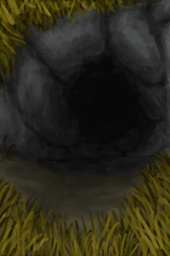

# 隧道入口  
> 进入隧道  
  
  隧道入口  |   图片   
 ----  |  ----:   
 ** 区域唯一 **  **环境：**[东部高地(环境)](Env_HighlandsEastern.md)  |     
  
## 获取来源  
来源  |  操作  
----  |  ----  
[坍塌的隧道入口(东部高地)](TunnelEntranceClosed.md)  |  转化  
## 动作  
动作  |  耗时  |  条件  |  变化  |  状态  
----  |  ----  |  ----  |  ----  |  ----  
进入   |  -  |    |  ** 获得： ** ** [Exit]  **   [隧道(环境)](Env_Tunnel.md)(+1)   [离开(隧道)](TunnelExit.md)(+1) 基础权重：1  |    

