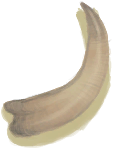

# 野猪牙  
>   
  
  属性  |   图片   
 ----  |  ----:   
 **重量：**150  |     
  
## 可拖入  
使用  |  动作  |  时间  |  条件  |  变化  |  玩家状态  
----  |  ----  |  ----  |  ----  |  ----  |  ----  
[“高级切割工具”](tag_CutterAdv.md)  |  雕刻  |  2小时  |  [光亮](Light.md):10-100  |  自身: 进度 + 1  使用物: 可用次数  -2  获得: 基础权重：1000 - [木工(技能)](Skill_Woodworking.md)为1～150时权重0～-790  [侏儒牙雕（男）](TuskCarving_GnomeMale.md)(+1) 基础权重：50  [侏儒牙雕（女）](TuskCarving_GnomeFemale.md)(+1) 基础权重：50    |  [木工(技能)](Skill_Woodworking.md)+0.5 [手掌损伤](HandDamage.md)+10 [情绪](Morale.md)+25 [压力](Stress.md)-10 [娱乐](Entertainment.md)+40  
## 可用于蓝图  
- [仪式匕首(蓝图)](Bp_CeremonialDagger.md)  
  
  
