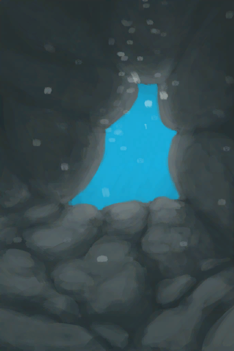

# 水下出口  
> 似乎是通往大海的小型通道。  
  
  水下出口  |   图片   
 ----  |  ----:   
 ** 区域唯一 **  |     
  
## 获取来源  
来源  |  操作  
----  |  ----  
[海水(覆溺洞穴)](Sea_Cave.md)  |  潜水  
[水下洞穴](UnderwaterEntrance.md)  |  进入  
## 动作  
动作  |  耗时  |  条件  |  变化  |  状态  
----  |  ----  |  ----  |  ----  |  ----  
离开 [ClimbAction](ClimbAction.md)  |  30分  |    |  → [丛林(环境)](Env_Jungle.md)  [沙滩(环境)](Env_Cove.md)(+1) [水下洞穴](UnderwaterEntrance.md)(+1) 基础权重：10  [(事件)我游不动了……](Event_SwimFail.md)(+1) 基础权重：1000 - [游泳(技能)](Skill_Swimming.md)为10～150时权重-900 - [游泳(技能)](Skill_Swimming.md)为30～150时权重-90 - [游泳(技能)](Skill_Swimming.md)为75～150时权重0～-10   |  [湿度](Wetness.md)+200 [耐力](Stamina.md)-5 [游泳(技能)](Skill_Swimming.md)+0.5  
