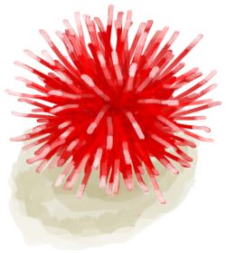
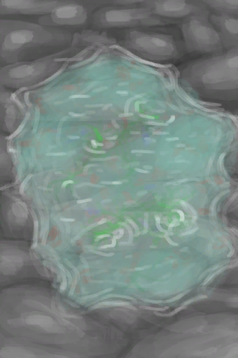

# 海胆  
> 我得把里面那玩意儿整出来。  
   
> 海胆是一种与海星有亲缘关系的带刺动物。它们可以在岛上的<b>岩滩</b>以及<b>潮汐池</b>中找到。  在它们的栖息地附近拾海时，建议穿戴足部保护装备，因为踩到它们会导致易<b>感染</b>的<b>疼痛</b>伤口，让你<b>行走</b>更加困难。如果你不幸踩到了，请尽快将刺从伤口上取下来。  
  
<table class="table table-bordered"><tbody><tr ><td  style="width:80%;text-align:left;vertical-align:top;" >**重量：**100</td><td  style="width:20%;text-align:left;vertical-align:top;" >

</td></tr></tbody></tbody></table>  
  
## 获取来源  
<table class="table table-bordered"><thead><tr ><th  style="text-align:left;vertical-align:top;" >来源</th><th  style="text-align:left;vertical-align:top;" >操作</th></tr></thead><tr ><td  style="text-align:left;vertical-align:top;" >[

[海胆！！(事件)](Event_Urchin.md)](Event_Urchin.md)</td><td  style="text-align:left;vertical-align:top;" >我的鞋子保护了我！</td></tr><tr ><td  style="text-align:left;vertical-align:top;" >[

[海胆！！(事件)](Event_Urchin.md)](Event_Urchin.md)</td><td  style="text-align:left;vertical-align:top;" >检查伤口</td></tr><tr ><td  style="text-align:left;vertical-align:top;" >[

[潮汐池(岩滩)](TidePool.md)](TidePool.md)</td><td  style="text-align:left;vertical-align:top;" >拾海</td></tr><tr ><td  style="text-align:left;vertical-align:top;" >[

[海水(覆溺洞穴)](Sea_Cave.md)](Sea_Cave.md)</td><td  style="text-align:left;vertical-align:top;" >潜水</td></tr><tr ><td  style="text-align:left;vertical-align:top;" >[

[岩滩](Rocks.md)](Rocks.md)</td><td  style="text-align:left;vertical-align:top;" >探索</td></tr><tr ><td  style="text-align:left;vertical-align:top;" >[

[海(环礁)](Sea_Atoll.md)](Sea_Atoll.md)</td><td  style="text-align:left;vertical-align:top;" >潜水</td></tr><tr ><td  style="text-align:left;vertical-align:top;" >[

[海(海湾)](Sea_Bay.md)](Sea_Bay.md)</td><td  style="text-align:left;vertical-align:top;" >潜水</td></tr><tr ><td  style="text-align:left;vertical-align:top;" >[

[海(沙滩)](Sea_Beach.md)](Sea_Beach.md)</td><td  style="text-align:left;vertical-align:top;" >潜水</td></tr><tr ><td  style="text-align:left;vertical-align:top;" >[

[海(沙滩)](Sea_Cove.md)](Sea_Cove.md)</td><td  style="text-align:left;vertical-align:top;" >潜水</td></tr><tr ><td  style="text-align:left;vertical-align:top;" >[

[海(荒芜沙滩)](Sea_DesolateBeach.md)](Sea_DesolateBeach.md)</td><td  style="text-align:left;vertical-align:top;" >潜水</td></tr><tr ><td  style="text-align:left;vertical-align:top;" >[

[海(鸟岩岛)](Sea_Rocks.md)](Sea_Rocks.md)</td><td  style="text-align:left;vertical-align:top;" >潜水</td></tr></tbody></table>  
  
## 可拖入  
<table class="table table-bordered"><thead><tr ><th  style="text-align:left;vertical-align:top;" >使用</th><th  style="text-align:left;vertical-align:top;" >动作</th><th  style="text-align:left;vertical-align:top;" >耗时</th><th  style="text-align:left;vertical-align:top;" >条件</th><th  style="text-align:left;vertical-align:top;" >变化</th><th  style="text-align:left;vertical-align:top;" >玩家状态</th></tr></thead><tr ><td  style="text-align:left;vertical-align:top;" >[“锤”](tag_Hammer.md)</td><td  style="text-align:left;vertical-align:top;" >破开海胆 [手部动作(组)](HandAction.md)</td><td  style="text-align:left;vertical-align:top;" >15分</td><td  style="text-align:left;vertical-align:top;" >[

[光亮](Light.md)](Light.md): 10-100</td><td  style="text-align:left;vertical-align:top;" >** 自身: ** →消失  ** 获得: ** ** [Meat]  **   [

[海胆肉](UrchinMeat.md)](UrchinMeat.md)(+1) 基础权重：1</td><td  style="text-align:left;vertical-align:top;" ></td></tr></tbody></table>  
  

