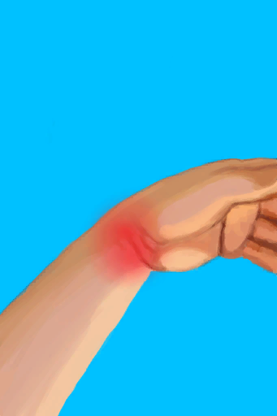
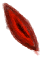

# 左臂骨折  
> 太痛了……  
  
<table class="table table-bordered" data-toggle="table"  data-show-header="false"><thead style="display:none"><tr ><th  style="width:50%;text-align:left;vertical-align:top;"  >title</th><th  style="width:50%;text-align:left;vertical-align:top;"  ></th></tr></thead><tr ><td  style="width:50%;text-align:left;vertical-align:top;"  >** 区域唯一 **  ** 不可删除 **  **标签：**	[“伤口需要夹板”](tag_WoundSplint.md)  **装备：**[“左臂骨折”](eTag_WArmFractureL.md)  **槽位：**1  **可用次数：**0</td><td  style="width:50%;text-align:left;vertical-align:top;"  >

<a href="W_ArmFractureL.md" style="color:black">左臂骨折</a>

骨折最常见于<b>从高处坠落</b>。  这是一种剧烈疼痛的外伤，会<b>长时间使你的胳膊或腿残废</b>。 当你手或者腿骨折时，一些基本的任务，比如<b>手工制作和行走</b>，会花费<b>更多的时间</b>。  要治疗骨折，最好的方法是<b>用夹板固定肢体</b>直到骨头愈合。<b>芦荟膏</b>涂抹于患处，可以减轻一些疼痛。</td></tr></tbody></table>  
  
## 获取来源  

真他妈不错

[野猪伤到了我！(事件)](Event_BoarWoundMajor.md)

真不错

[野猪伤到了我！(事件)](Event_BoarWoundMinor.md)

真他妈不错

[坠落！(事件)](Event_FallFracture.md)

  
  
## 可拖入  

<table style="margin-bottom:0px;"><tr><td style="width:40%;text-align:left; background-color:#FEFEFE"><b>拖入：</b>[

[芦荟膏](AloeVeraGel.md)](AloeVeraGel.md)</td><td style="width:40%;font-size:1em;font-weight:bold;background-color:#FEFEFE">涂抹  </td></tr><tr style="background-color:#FFFFFF"><td style=""><b>使用物：</b>→消失, 可用次数  <b>-1</b></td><td style=""><b>自身：</b>

  <b>+16(50%)</b></td></tr></table>
  
  
## 转化  

<table style="margin-bottom:0px;"><tr><td  colspan=2 style="font-size:1em;font-weight:bold;background-color:#FEFEFE">夹板</td><td style="text-align:right; background-color:#FEFEFE"></td></tr><tr style="background-color:#FFFFFF"><td style="width:30%;font-size:1em;text-align:right;vertical-align:middle;">[

[夹板](Splint.md)](Splint.md)</td><td style="text-align:center;width:20%;vertical-align:middle;">
-

夹板
</td><td style="text-align:left;vertical-align:middle;">耐久  <b>-1</b> 可用次数  <b>-1</b></td></tr></table>
  
## 属性   

<table style="margin-bottom:0px;"><tr><td style="width:30%;text-align:left; background-color:#FEFEFE;font-size:1.3em;font-weight:bold;">

</td><td style="font-size:1em;background-color:#FEFEFE">初始：0 , 最大：1500 每15分钟+1 , 最多需要：15天15小时</td></tr><tr style="background-color:#FFFFFF"><td colspan=2>** 到达上限时：骨折 ** 自身: →消失</td></tr></table>
  

<table style="margin-bottom:0px;"><tr><td style="width:30%;text-align:left; background-color:#FEFEFE;font-size:1.3em;font-weight:bold;">

</td><td style="font-size:1em;background-color:#FEFEFE">初始：0 , 最大：32 每15分钟-1 , 最多需要：8小时</td></tr><tr style="background-color:#FFFFFF"><td colspan=2></td></tr></table>
  
## 被动效果  
<table class="table table-bordered" data-toggle="table"  ><thead style=""><tr ><th  style="text-align:left;vertical-align:top;"  >名称</th><th  style="text-align:left;vertical-align:top;"  >条件</th><th  style="text-align:left;vertical-align:top;"  >变化(每15分钟)</th><th  style="text-align:left;vertical-align:top;"  >玩家状态</th></tr></thead><tr ><td  style="text-align:left;vertical-align:top;"  >Splint</td><td  style="text-align:left;vertical-align:top;"  >** 需要存在卡牌：** [夹板](Splint.md) ** 需要放入：** [夹板](Splint.md)</td><td  style="text-align:left;vertical-align:top;"  >

 +1(0.06%)</td><td  style="text-align:left;vertical-align:top;"  ></td></tr><tr ><td  style="text-align:left;vertical-align:top;"  >Gel Support</td><td  style="text-align:left;vertical-align:top;"  >** 需要属性：** 

: <b>1～32(3.13%～100%)</b></td><td  style="text-align:left;vertical-align:top;"  ></td><td  style="text-align:left;vertical-align:top;"  >[

[疼痛](Pain.md)](Pain.md)<b>-25</b></td></tr><tr ><td  style="text-align:left;vertical-align:top;"  >Fracture Extreme</td><td  style="text-align:left;vertical-align:top;"  >** 需要属性：** 

: <b>0～750(0%～50%)</b></td><td  style="text-align:left;vertical-align:top;"  ></td><td  style="text-align:left;vertical-align:top;"  >[

[疼痛](Pain.md)](Pain.md)<b>+500</b> [

[体重](Weight.md)](Weight.md)加成<b>-0.5</b> [手部动作受限](ModifierHand.md)<b>+2</b> [攀爬动作受限](ModifierClimb.md)<b>+2</b> [

[受伤](Wounds.md)](Wounds.md)<b>+750</b></td></tr><tr ><td  style="text-align:left;vertical-align:top;"  >Fracture Severe</td><td  style="text-align:left;vertical-align:top;"  >** 需要属性：** 

: <b>751～1250(50.07%～83.33%)</b></td><td  style="text-align:left;vertical-align:top;"  ></td><td  style="text-align:left;vertical-align:top;"  >[

[疼痛](Pain.md)](Pain.md)<b>+325</b> [

[体重](Weight.md)](Weight.md)加成<b>-0.25</b> [手部动作受限](ModifierHand.md)<b>+1</b> [攀爬动作受限](ModifierClimb.md)<b>+1</b> [

[受伤](Wounds.md)](Wounds.md)<b>+750</b></td></tr><tr ><td  style="text-align:left;vertical-align:top;"  >Fracture Moderate</td><td  style="text-align:left;vertical-align:top;"  >** 需要属性：** 

: <b>1251～1500(83.4%～100%)</b></td><td  style="text-align:left;vertical-align:top;"  ></td><td  style="text-align:left;vertical-align:top;"  >[

[疼痛](Pain.md)](Pain.md)<b>+150</b> [

[体重](Weight.md)](Weight.md)加成<b>-0.1</b> [手部动作受限](ModifierHand.md)<b>+0.5</b> [攀爬动作受限](ModifierClimb.md)<b>+0.5</b> [

[受伤](Wounds.md)](Wounds.md)<b>+250</b></td></tr></tbody></table>  
  

