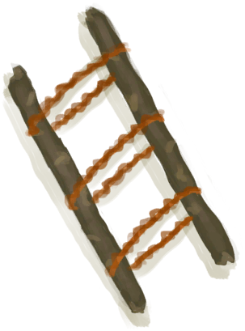

# 右腿骨折  
> 太痛了……  
  
<table class="table table-bordered" data-toggle="table"  data-show-header="false"><thead style="display:none"><tr ><th  style="width:50%;text-align:left;vertical-align:top;"  >title</th><th  style="width:50%;text-align:left;vertical-align:top;"  ></th></tr></thead><tr ><td  style="width:50%;text-align:left;vertical-align:top;"  >** 区域唯一 **  ** 不可删除 **  **重量：**1000  **标签：**	[“伤口需要夹板”](tag_WoundSplint.md)  **装备：**[“右腿骨折”](eTag_WLegFractureR.md)  **槽位：**1  **可用次数：**0</td><td  style="width:50%;text-align:left;vertical-align:top;"  >

<a href="W_LegFractureR.md" style="color:black">右腿骨折</a>

骨折最常见于<b>从高处坠落</b>。  这是一种剧烈疼痛的外伤，会<b>长时间使你的胳膊或腿残废</b>。 当你手或者腿骨折时，一些基本的任务，比如<b>手工制作和行走</b>，会花费<b>更多的时间</b>。  要治疗骨折，最好的方法是<b>用夹板固定肢体</b>直到骨头愈合。<b>芦荟膏</b>涂抹于患处，可以减轻一些疼痛。</td></tr></tbody></table>  
  
## 获取来源  
<table class="table table-bordered" data-toggle="table"  ><thead style=""><tr ><th  style="text-align:left;vertical-align:top;"  >来源</th><th  style="text-align:left;vertical-align:top;"  >操作</th></tr></thead><tr ><td  style="text-align:left;vertical-align:top;"  >[

[野猪伤到了我！(事件)](Event_BoarWoundMajor.md)](Event_BoarWoundMajor.md)</td><td  style="text-align:left;vertical-align:top;"  >真他妈不错</td></tr><tr ><td  style="text-align:left;vertical-align:top;"  >[

[野猪伤到了我！(事件)](Event_BoarWoundMinor.md)](Event_BoarWoundMinor.md)</td><td  style="text-align:left;vertical-align:top;"  >真不错</td></tr><tr ><td  style="text-align:left;vertical-align:top;"  >[

[坠落！(事件)](Event_FallFracture.md)](Event_FallFracture.md)</td><td  style="text-align:left;vertical-align:top;"  >真他妈不错</td></tr></tbody></table>  
  
## 可拖入  
<table class="table table-bordered" data-toggle="table"  ><thead style=""><tr ><th  style="text-align:left;vertical-align:top;"  >使用</th><th  style="text-align:left;vertical-align:top;"  >动作</th><th  style="text-align:left;vertical-align:top;"  data-sortable="true"  >耗时</th><th  style="text-align:left;vertical-align:top;"  data-sortable="true"  >条件</th><th  style="text-align:left;vertical-align:top;"  >变化</th><th  style="text-align:left;vertical-align:top;"  data-sortable="true"  >玩家状态</th></tr></thead><tr ><td  style="text-align:left;vertical-align:top;"  >[

[芦荟膏](AloeVeraGel.md)](AloeVeraGel.md)</td><td  style="text-align:left;vertical-align:top;"  >涂抹 </td><td  style="text-align:left;vertical-align:top;"  >-</td><td  style="text-align:left;vertical-align:top;"  ></td><td  style="text-align:left;vertical-align:top;"  >** 自身: ** 

  +16(50%)  ** 使用物: ** →消失 可用次数  -1</td><td  style="text-align:left;vertical-align:top;"  ></td></tr></tbody></table>  
  
## 转化  
<table class="table table-bordered" data-toggle="table"  ><thead style=""><tr ><th  style="text-align:left;vertical-align:top;"  >放入</th><th  style="text-align:left;vertical-align:top;"  >动作</th><th  style="text-align:left;vertical-align:top;"  data-sortable="true"  >耗时</th><th  style="text-align:left;vertical-align:top;"  data-sortable="true"  >条件</th><th  style="text-align:left;vertical-align:top;"  >变化</th><th  style="text-align:left;vertical-align:top;"  data-sortable="true"  >玩家状态</th></tr></thead><tr ><td  style="text-align:left;vertical-align:top;"  >[

[夹板](Splint.md)](Splint.md)</td><td  style="text-align:left;vertical-align:top;"  >夹板</td><td  style="text-align:left;vertical-align:top;"  >-</td><td  style="text-align:left;vertical-align:top;"  ></td><td  style="text-align:left;vertical-align:top;"  >耐久  -1 可用次数  -1</td><td  style="text-align:left;vertical-align:top;"  ></td></tr></tbody></table>  
  
## 属性   
<table class="table table-bordered" data-toggle="table"  ><thead style=""><tr ><th  style="text-align:left;vertical-align:top;"  >属性</th><th  style="text-align:left;vertical-align:top;"  >值</th><th  style="text-align:left;vertical-align:top;"  >耗时</th><th  style="text-align:left;vertical-align:top;"  >变化</th></tr></thead><tr ><td  style="text-align:left;vertical-align:top;"  >

</td><td  style="text-align:left;vertical-align:top;"  >初始：0 最大：1500</td><td  style="text-align:left;vertical-align:top;"  >每15分钟+1 最多需要：15天15小时</td><td  style="text-align:left;vertical-align:top;"  >** 到达上限时：骨折 **  ** 自身 ** →消失</td></tr><tr ><td  style="text-align:left;vertical-align:top;"  >

</td><td  style="text-align:left;vertical-align:top;"  >初始：0 最大：32</td><td  style="text-align:left;vertical-align:top;"  >每15分钟-1 最多需要：8小时</td><td  style="text-align:left;vertical-align:top;"  ></td></tr></tbody></table>  
  
## 被动效果  
<table class="table table-bordered" data-toggle="table"  ><thead style=""><tr ><th  style="text-align:left;vertical-align:top;"  >名称</th><th  style="text-align:left;vertical-align:top;"  >条件</th><th  style="text-align:left;vertical-align:top;"  >变化(每15分钟)</th><th  style="text-align:left;vertical-align:top;"  >玩家状态</th></tr></thead><tr ><td  style="text-align:left;vertical-align:top;"  >Splint</td><td  style="text-align:left;vertical-align:top;"  >** 需要存在卡牌：** [夹板](Splint.md) ** 需要放入：** [夹板](Splint.md)</td><td  style="text-align:left;vertical-align:top;"  >

 +1(0.06%)</td><td  style="text-align:left;vertical-align:top;"  ></td></tr><tr ><td  style="text-align:left;vertical-align:top;"  >Gel Support</td><td  style="text-align:left;vertical-align:top;"  >** 需要属性：** 

: 1～32(3.13%～100%)</td><td  style="text-align:left;vertical-align:top;"  ></td><td  style="text-align:left;vertical-align:top;"  >[

[疼痛](Pain.md)](Pain.md)-25</td></tr><tr ><td  style="text-align:left;vertical-align:top;"  >Fracture Extreme</td><td  style="text-align:left;vertical-align:top;"  >** 需要属性：** 

: 0～750(0%～50%)</td><td  style="text-align:left;vertical-align:top;"  ></td><td  style="text-align:left;vertical-align:top;"  >[

[疼痛](Pain.md)](Pain.md)+500 [

[体重](Weight.md)](Weight.md)加成-0.5 [腿部动作受限](ModifierLeg.md)+2 [攀爬动作受限](ModifierClimb.md)+2 [

[受伤](Wounds.md)](Wounds.md)+750</td></tr><tr ><td  style="text-align:left;vertical-align:top;"  >Fracture Severe</td><td  style="text-align:left;vertical-align:top;"  >** 需要属性：** 

: 751～1250(50.07%～83.33%)</td><td  style="text-align:left;vertical-align:top;"  ></td><td  style="text-align:left;vertical-align:top;"  >[

[疼痛](Pain.md)](Pain.md)+350 [

[体重](Weight.md)](Weight.md)加成-0.25 [腿部动作受限](ModifierLeg.md)+1 [攀爬动作受限](ModifierClimb.md)+1 [

[受伤](Wounds.md)](Wounds.md)+750</td></tr><tr ><td  style="text-align:left;vertical-align:top;"  >Fracture Moderate</td><td  style="text-align:left;vertical-align:top;"  >** 需要属性：** 

: 1251～1500(83.4%～100%)</td><td  style="text-align:left;vertical-align:top;"  ></td><td  style="text-align:left;vertical-align:top;"  >[

[疼痛](Pain.md)](Pain.md)+150 [

[体重](Weight.md)](Weight.md)加成-0.1 [腿部动作受限](ModifierLeg.md)+0.5 [攀爬动作受限](ModifierClimb.md)+0.5 [

[受伤](Wounds.md)](Wounds.md)+250</td></tr></tbody></table>  
  

