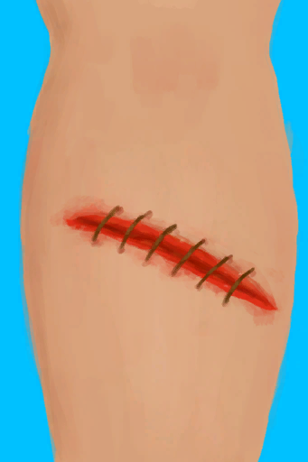

# 左腿撕裂伤  
> 一道正在流血的深撕裂伤口。好痛……  
  
<table class="table table-bordered table2439" data-toggle="table"  data-show-header="false"><thead style="display:none"><tr ><th  style="width:50%;"  >title</th><th  style="width:50%;"  ></th></tr></thead><tr ><td  style="width:50%;"  >** 区域唯一 **  ** 不可删除 **  **标签：**	[“开放性伤口”](tag_OpenWound.md)  **装备：**[“大腿撕裂伤”](eTag_WLegLacerationL.md)  **槽位：**1  **过滤器：**[“敷料”](tag_Dressing.md) , [“止血带”](tag_Tourniquet.md)  **可用次数：**0</td><td  style="width:50%;"  >

<a href="W_LegLacerationL.md" style="color:black">左腿撕裂伤</a>

与<b>野猪这样的野生动物</b>相遇可能会严重受伤。 这种深度的切口带来的主要风险是<b>出血</b>：如果不及时控制，它可以<b>很快致命</b>。  当务之急是使用<b>止血带</b>止血。一旦控制住失血，尽快把止血带拿掉，以防止<b>对你的肢体造成神经损伤</b>。  下一步是用<b>水、碱液、蜂蜜或肥皂</b>清洗伤口以防止<b>感染</b>，最后用<b>伤口敷料</b>保护伤口直到愈合。 在这段时间里，<b>行走会很困难</b>，有些工作也将需要更长的时间才能完成。  如果你有<b>针和线</b>，建议<b>缝合伤口</b>来加速愈合过程。</td></tr></tbody></table>  
  
## 获取来源  

真他妈不错

[野猪伤到了我！(事件)](Event_BoarWoundMajor.md)

真不错

[野猪伤到了我！(事件)](Event_BoarWoundMinor.md)

真他妈不错

[啊！(事件)](Event_DiveLaceration.md)

真他妈不错

[无人机伤到了我！(事件)](Event_DroneWoundMajor.md)

真他妈不错

[无人机伤到了我！(事件)](Event_DroneWoundMinor.md)

  
  
## 可拖入  

<table style="margin-bottom:0px;"><tr><td style="width:40%;text-align:left; background-color:#FEFEFE"><b>拖入：</b>[

[盐水](LQ_WaterSalt.md)](LQ_WaterSalt.md)</td><td style="width:40%;font-size:1em;font-weight:bold;background-color:#FEFEFE">用海水清理 (15分) </td></tr><tr style="background-color:#FFFFFF"><td style=""><b>使用物：</b>耐久  <b>-300</b>, 可用次数  <b>-1</b>, 含水量  <b>-300</b></td><td style=""><b>自身：</b>

  <b>-32(-100%)</b>, 

  <b>-150(-52.08%)</b></td></tr><tr><td colspan="2"><b>状态变化：</b>[

[情绪](Morale.md)](Morale.md)<b>-5</b></td></tr><tr><td colspan="2"><b>需求：</b>[

[勇气](Courage.md)](Courage.md): <b>400-4000</b></td></tr></table>
  

<table style="margin-bottom:0px;"><tr><td style="width:40%;text-align:left; background-color:#FEFEFE"><b>拖入：</b>[“弱效清洁剂”](tag_CleanerWeak.md)</td><td style="width:40%;font-size:1em;font-weight:bold;background-color:#FEFEFE">用淡水清理 (15分) [“手部动作(组)”](HandAction.md)</td></tr><tr style="background-color:#FFFFFF"><td style=""><b>使用物：</b>耐久  <b>-300</b>, 可用次数  <b>-1</b>, 含水量  <b>-300</b></td><td style=""><b>自身：</b>

  <b>-32(-100%)</b>, 

  <b>-150(-52.08%)</b></td></tr><tr><td colspan="2"><b>需求：</b>[

[勇气](Courage.md)](Courage.md): <b>0-4000</b></td></tr></table>
  

<table style="margin-bottom:0px;"><tr><td style="width:40%;text-align:left; background-color:#FEFEFE"><b>拖入：</b>[

[蜂蜜水](LQ_HoneyWater.md)](LQ_HoneyWater.md)</td><td style="width:40%;font-size:1em;font-weight:bold;background-color:#FEFEFE">用蜂蜜水清理 (15分) [“手部动作(组)”](HandAction.md)</td></tr><tr style="background-color:#FFFFFF"><td style=""><b>使用物：</b>耐久  <b>-300</b>, 可用次数  <b>-1</b>, 含水量  <b>-300</b></td><td style=""><b>自身：</b>

  <b>-32(-100%)</b>, 

  <b>-250(-86.81%)</b></td></tr><tr><td colspan="2"><b>需求：</b>[

[勇气](Courage.md)](Courage.md): <b>50-4000</b></td></tr></table>
  

<table style="margin-bottom:0px;"><tr><td style="width:40%;text-align:left; background-color:#FEFEFE"><b>拖入：</b>[

[碱液](LQ_Lye.md)](LQ_Lye.md)</td><td style="width:40%;font-size:1em;font-weight:bold;background-color:#FEFEFE">用碱水清理 (15分) [“手部动作(组)”](HandAction.md)</td></tr><tr style="background-color:#FFFFFF"><td style=""><b>使用物：</b>耐久  <b>-300</b>, 可用次数  <b>-1</b>, 含水量  <b>-100</b></td><td style=""><b>自身：</b>

  <b>-32(-100%)</b>, 

  <b>-500(-173.61%)</b></td></tr><tr><td colspan="2"><b>需求：</b>[

[勇气](Courage.md)](Courage.md): <b>50-4000</b></td></tr></table>
  

<table style="margin-bottom:0px;"><tr><td style="width:40%;text-align:left; background-color:#FEFEFE"><b>拖入：</b>[

[湿肥皂](SoapWet.md)](SoapWet.md)</td><td style="width:40%;font-size:1em;font-weight:bold;background-color:#FEFEFE">用肥皂清理 (15分) </td></tr><tr style="background-color:#FFFFFF"><td style=""><b>使用物：</b>可用次数  <b>-1</b></td><td style=""><b>自身：</b>

  <b>-32(-100%)</b>, 

  <b>-500(-173.61%)</b></td></tr><tr><td colspan="2"><b>需求：</b>[

[勇气](Courage.md)](Courage.md): <b>200-4000</b></td></tr></table>
  

<table style="margin-bottom:0px;"><tr><td style="width:40%;text-align:left; background-color:#FEFEFE"><b>拖入：</b>[

[芦荟膏](AloeVeraGel.md)](AloeVeraGel.md) | [

[硫磺膏](BrimstoneGel.md)](BrimstoneGel.md)</td><td style="width:40%;font-size:1em;font-weight:bold;background-color:#FEFEFE">涂抹 (15分) </td></tr><tr style="background-color:#FFFFFF"><td style=""><b>使用物：</b>→消失, 可用次数  <b>-1</b></td><td style=""><b>自身：</b>

  <b>+16(50%)</b>, 

  <b>-150(-52.08%)</b></td></tr></table>
  

<table style="margin-bottom:0px;"><tr><td style="width:40%;text-align:left; background-color:#FEFEFE"><b>拖入：</b>[

[蜂蜜](LQ_Honey.md)](LQ_Honey.md)</td><td style="width:40%;font-size:1em;font-weight:bold;background-color:#FEFEFE">涂抹蜂蜜 (15分) [“手部动作(组)”](HandAction.md)</td></tr><tr style="background-color:#FFFFFF"><td style=""><b>使用物：</b>耐久  <b>-300</b>, 可用次数  <b>-1</b>, 含水量  <b>-150</b></td><td style=""><b>自身：</b>

  <b>+16(50%)</b>, 

  <b>-150(-52.08%)</b></td></tr><tr><td colspan="2"><b>需求：</b>[

[勇气](Courage.md)](Courage.md): <b>50-4000</b></td></tr></table>
  

<table style="margin-bottom:0px;"><tr><td style="width:40%;text-align:left; background-color:#FEFEFE"><b>拖入：</b>[“针线”](tag_ThreadedNeedle.md)</td><td style="width:40%;font-size:1em;font-weight:bold;background-color:#FEFEFE">缝合 (15分) [“手部动作(组)”](HandAction.md)</td></tr><tr style="background-color:#FFFFFF"><td style=""><b>使用物：</b>→消失, 可用次数  <b>-1</b></td><td style=""><b>自身：</b>→ [

[已缝合的左腿撕裂伤](W_LegLacerationLStitched.md)](W_LegLacerationLStitched.md), 

  <b>+8(25%)</b>, 

  <b>-350(-121.53%)</b></td></tr><tr><td colspan="2"><b>需求：</b>[

[光亮](Light.md)](Light.md): <b>10-100</b>, [

[勇气](Courage.md)](Courage.md): <b>800-4000</b></td></tr></table>
  
  
## 转化  

<table style="margin-bottom:0px;"><tr><td  colspan=2 style="font-size:1em;font-weight:bold;background-color:#FEFEFE">压迫</td><td style="text-align:right; background-color:#FEFEFE"></td></tr><tr style="background-color:#FFFFFF"><td style="width:30%;font-size:1em;text-align:right;vertical-align:middle;">[“敷料”](tag_Dressing.md) [“止血带”](tag_Tourniquet.md)</td><td style="text-align:center;width:20%;vertical-align:middle;">
-

压迫
</td><td style="text-align:left;vertical-align:middle;">耐久  <b>-1</b> 可用次数  <b>-1</b></td></tr></table>
  
## 属性   

<table style="margin-bottom:0px;"><tr><td style="width:30%;text-align:left; background-color:#FEFEFE;font-size:1.3em;font-weight:bold;">

</td><td style="font-size:1em;background-color:#FEFEFE">初始：0 , 最大：2000 每15分钟+1 , 最多需要：20天20小时</td></tr><tr style="background-color:#FFFFFF"><td colspan=2>** 到达上限时：撕裂伤 ** 自身: → [

[轻微撕裂伤](W_MinorLaceration.md)](W_MinorLaceration.md)</td></tr></table>
  

<table style="margin-bottom:0px;"><tr><td style="width:30%;text-align:left; background-color:#FEFEFE;font-size:1.3em;font-weight:bold;">

</td><td style="font-size:1em;background-color:#FEFEFE">初始：0 , 最大：32 每15分钟-1 , 最多需要：8小时</td></tr><tr style="background-color:#FFFFFF"><td colspan=2></td></tr></table>
  

<table style="margin-bottom:0px;"><tr><td style="width:30%;text-align:left; background-color:#FEFEFE;font-size:1.3em;font-weight:bold;">

</td><td style="font-size:1em;background-color:#FEFEFE">初始：0 , 最大：288 每15分钟+1 , 最多需要：3天</td></tr><tr style="background-color:#FFFFFF"><td colspan=2></td></tr></table>
  

<table style="margin-bottom:0px;"><tr><td style="width:30%;text-align:left; background-color:#FEFEFE;font-size:1.3em;font-weight:bold;">

已止血</td><td style="font-size:1em;background-color:#FEFEFE">初始：0 , 最大：16 每15分钟+1 , 最多需要：4小时</td></tr><tr style="background-color:#FFFFFF"><td colspan=2></td></tr></table>
  
## 被动效果  
<table class="table table-bordered table9897" data-toggle="table"  ><thead style=""><tr ><th  style=""  >名称</th><th  style=""  >条件</th><th  style=""  >变化(每15分钟)</th><th  style=""  >玩家状态</th></tr></thead><tr ><td  style=""  >Dressing (weak)</td><td  style=""  >** 需要存在卡牌：** [叶片绷带](LeafDressing.md) [临时绷带](ImprovisedDressing.md) ** 需要放入：** [叶片绷带](LeafDressing.md) [临时绷带](ImprovisedDressing.md)</td><td  style=""  >

 +1(0.05%) 

 -0.5(-0.18%)</td><td  style=""  >[

[皮肤完整度](SkinIntegrity.md)](SkinIntegrity.md)<b>+2</b> [

[失血](BloodLoss.md)](BloodLoss.md)<b>-3</b></td></tr><tr ><td  style=""  >Dressing (strong)</td><td  style=""  >** 需要存在卡牌：** [伤口敷料](WoundDressing.md) [草木灰敷料](AshDressing.md) ** 需要放入：** [伤口敷料](WoundDressing.md) [草木灰敷料](AshDressing.md)</td><td  style=""  >

 +1.5(0.07%) 

 -1(-0.35%)</td><td  style=""  >[

[皮肤完整度](SkinIntegrity.md)](SkinIntegrity.md)<b>+2</b> [

[失血](BloodLoss.md)](BloodLoss.md)<b>-3</b></td></tr><tr ><td  style=""  >Tourniquet</td><td  style=""  >** 需要放入：** [“止血带”](tag_Tourniquet.md)</td><td  style=""  >

 +1(0.05%) 

 -0.5(-0.18%)</td><td  style=""  >[

[皮肤完整度](SkinIntegrity.md)](SkinIntegrity.md)<b>+2</b> [

[失血](BloodLoss.md)](BloodLoss.md)<b>-6</b> [

[腿部神经损伤](NerveDamageLegs.md)](NerveDamageLegs.md)加成<b>+2</b></td></tr><tr ><td  style=""  >Coagulated</td><td  style=""  >** 需要属性：** 已止血

: <b>16(100%)</b></td><td  style=""  ></td><td  style=""  >[

[失血](BloodLoss.md)](BloodLoss.md)<b>-3</b></td></tr><tr ><td  style=""  >Surface Bacteria 1</td><td  style=""  >** 需要状态：** [

[表面细菌](BacteriaSurface.md)](BacteriaSurface.md): <b>1-1</b></td><td  style=""  >

 +1(0.34%)</td><td  style=""  ></td></tr><tr ><td  style=""  >Surface Bacteria 2</td><td  style=""  >** 需要状态：** [

[表面细菌](BacteriaSurface.md)](BacteriaSurface.md): <b>2-2</b></td><td  style=""  >

 +2(0.69%)</td><td  style=""  ></td></tr><tr ><td  style=""  >Surface Bacteria 3</td><td  style=""  >** 需要状态：** [

[表面细菌](BacteriaSurface.md)](BacteriaSurface.md): <b>3-3</b></td><td  style=""  >

 +4(1.38%)</td><td  style=""  ></td></tr><tr ><td  style=""  >Surface Bacteria 4</td><td  style=""  >** 需要状态：** [

[表面细菌](BacteriaSurface.md)](BacteriaSurface.md): <b>4-4</b></td><td  style=""  >

 +8(2.77%)</td><td  style=""  ></td></tr><tr ><td  style=""  >Surface Bacteria 5</td><td  style=""  >** 需要状态：** [

[表面细菌](BacteriaSurface.md)](BacteriaSurface.md): <b>5-5</b></td><td  style=""  >

 +16(5.55%)</td><td  style=""  ></td></tr><tr ><td  style=""  >Gel Support</td><td  style=""  >** 需要属性：** 

: <b>1～32(3.13%～100%)</b></td><td  style=""  >

 +0.25(0.01%) 

 -0.25(-0.09%)</td><td  style=""  >[

[疼痛](Pain.md)](Pain.md)<b>-25</b></td></tr><tr ><td  style=""  >Sepsis</td><td  style=""  >** 需要属性：** 

: <b>240～288(83.33%～100%)</b></td><td  style=""  >

 -2(-0.1%) 

 +1(0.34%)</td><td  style=""  >[

[细菌性发烧](BacteriaFever.md)](BacteriaFever.md)加成<b>+10</b></td></tr><tr ><td  style=""  >Laceration Extreme</td><td  style=""  >** 需要属性：** 

: <b>0～1000(0%～50%)</b></td><td  style=""  ></td><td  style=""  >[

[疼痛](Pain.md)](Pain.md)<b>+500</b> [

[皮肤完整度](SkinIntegrity.md)](SkinIntegrity.md)<b>-5</b> [

[体重](Weight.md)](Weight.md)加成<b>-1</b> [

[失血](BloodLoss.md)](BloodLoss.md)<b>+6</b> [腿部动作受限](ModifierLeg.md)<b>+2</b> [攀爬动作受限](ModifierClimb.md)<b>+2</b> [

[受伤](Wounds.md)](Wounds.md)<b>+750</b></td></tr><tr ><td  style=""  >Laceration Severe</td><td  style=""  >** 需要属性：** 

: <b>1001～1500(50.05%～75%)</b></td><td  style=""  ></td><td  style=""  >[

[疼痛](Pain.md)](Pain.md)<b>+325</b> [

[皮肤完整度](SkinIntegrity.md)](SkinIntegrity.md)<b>-4</b> [

[体重](Weight.md)](Weight.md)加成<b>-0.5</b> [

[失血](BloodLoss.md)](BloodLoss.md)<b>+3</b> [腿部动作受限](ModifierLeg.md)<b>+1</b> [攀爬动作受限](ModifierClimb.md)<b>+1</b> [

[受伤](Wounds.md)](Wounds.md)<b>+750</b></td></tr><tr ><td  style=""  >Laceration Moderate</td><td  style=""  >** 需要属性：** 

: <b>1501～2000(75.05%～100%)</b></td><td  style=""  ></td><td  style=""  >[

[疼痛](Pain.md)](Pain.md)<b>+150</b> [

[皮肤完整度](SkinIntegrity.md)](SkinIntegrity.md)<b>-3</b> [

[体重](Weight.md)](Weight.md)加成<b>-0.25</b> [

[失血](BloodLoss.md)](BloodLoss.md)<b>+1</b> [腿部动作受限](ModifierLeg.md)<b>+0.5</b> [攀爬动作受限](ModifierClimb.md)<b>+0.5</b> [

[受伤](Wounds.md)](Wounds.md)<b>+250</b></td></tr></tbody></table>  
  

