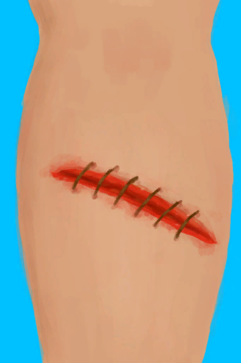
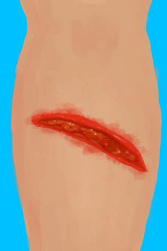
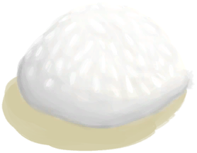
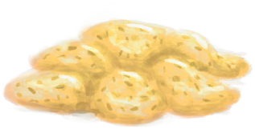
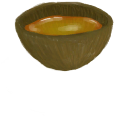
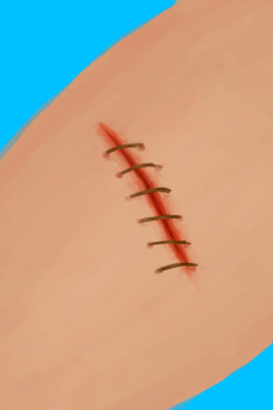

# 已缝合的左腿撕裂伤  
> 还是好痛，至少现在伤口缝上了。  
  
<table class="table table-bordered" data-toggle="table"  data-show-header="false"><thead style="display:none"><tr ><th  style="width:50%;text-align:left;vertical-align:top;"  >title</th><th  style="width:50%;text-align:left;vertical-align:top;"  ></th></tr></thead><tr ><td  style="width:50%;text-align:left;vertical-align:top;"  >** 区域唯一 **  ** 不可删除 **  **装备：**[“大腿撕裂伤”](eTag_WLegLacerationL.md)  **槽位：**1  **过滤器：**[“敷料”](tag_Dressing.md) , [“止血带”](tag_Tourniquet.md)  **可用次数：**0</td><td  style="width:50%;text-align:left;vertical-align:top;"  >

<a href="W_LegLacerationLStitched.md" style="color:black">已缝合的左腿撕裂伤</a>

与<b>野猪这样的野生动物</b>相遇可能会严重受伤。 这种深度的切口带来的主要风险是<b>出血</b>：如果不及时控制，它可以<b>很快致命</b>。  当务之急是使用<b>止血带</b>止血。一旦控制住失血，尽快把止血带拿掉，以防止<b>对你的肢体造成神经损伤</b>。  下一步是用<b>水、碱液、蜂蜜或肥皂</b>清洗伤口以防止<b>感染</b>，最后用<b>伤口敷料</b>保护伤口直到愈合。 在这段时间里，<b>行走会很困难</b>，有些工作也将需要更长的时间才能完成。  如果你有<b>针和线</b>，建议<b>缝合伤口</b>来加速愈合过程。</td></tr></tbody></table>  
  
## 获取来源  
<table class="table table-bordered" data-toggle="table"  ><thead style=""><tr ><th  style="text-align:left;vertical-align:top;"  >来源</th><th  style="text-align:left;vertical-align:top;"  >操作</th></tr></thead><tr ><td  style="text-align:left;vertical-align:top;"  >[

[左腿撕裂伤](W_LegLacerationL.md)](W_LegLacerationL.md)</td><td  style="text-align:left;vertical-align:top;"  >缝合 ** 拖入：**[“针线”](tag_ThreadedNeedle.md)</td></tr></tbody></table>  
  
## 可拖入  
<table class="table table-bordered" data-toggle="table"  ><thead style=""><tr ><th  style="text-align:left;vertical-align:top;"  >使用</th><th  style="text-align:left;vertical-align:top;"  >动作</th><th  style="text-align:left;vertical-align:top;"  >耗时</th><th  style="text-align:left;vertical-align:top;"  >条件</th><th  style="text-align:left;vertical-align:top;"  >变化</th><th  style="text-align:left;vertical-align:top;"  >玩家状态</th></tr></thead><tr ><td  style="text-align:left;vertical-align:top;"  >[

[盐水](LQ_WaterSalt.md)](LQ_WaterSalt.md)</td><td  style="text-align:left;vertical-align:top;"  >用海水清理 </td><td  style="text-align:left;vertical-align:top;"  >15分</td><td  style="text-align:left;vertical-align:top;"  >[

[勇气](Courage.md)](Courage.md): 400-4000</td><td  style="text-align:left;vertical-align:top;"  >** 自身: ** 

  -32(-100%) 

  -150(-52.08%)  ** 使用物: ** 耐久  -300 可用次数  -1 含水量  -300</td><td  style="text-align:left;vertical-align:top;"  >[

[情绪](Morale.md)](Morale.md)-5</td></tr><tr ><td  style="text-align:left;vertical-align:top;"  >[“弱效清洁剂”](tag_CleanerWeak.md)</td><td  style="text-align:left;vertical-align:top;"  >用淡水清理 [“手部动作(组)”](HandAction.md)</td><td  style="text-align:left;vertical-align:top;"  >15分</td><td  style="text-align:left;vertical-align:top;"  >[

[勇气](Courage.md)](Courage.md): 0-4000</td><td  style="text-align:left;vertical-align:top;"  >** 自身: ** 

  -32(-100%) 

  -150(-52.08%)  ** 使用物: ** 耐久  -300 可用次数  -1 含水量  -300</td><td  style="text-align:left;vertical-align:top;"  ></td></tr><tr ><td  style="text-align:left;vertical-align:top;"  >[

[蜂蜜水](LQ_HoneyWater.md)](LQ_HoneyWater.md)</td><td  style="text-align:left;vertical-align:top;"  >用蜂蜜水清理 [“手部动作(组)”](HandAction.md)</td><td  style="text-align:left;vertical-align:top;"  >15分</td><td  style="text-align:left;vertical-align:top;"  >[

[勇气](Courage.md)](Courage.md): 50-4000</td><td  style="text-align:left;vertical-align:top;"  >** 自身: ** 

  -32(-100%) 

  -250(-86.81%)  ** 使用物: ** 耐久  -300 可用次数  -1 含水量  -300</td><td  style="text-align:left;vertical-align:top;"  ></td></tr><tr ><td  style="text-align:left;vertical-align:top;"  >[

[碱液](LQ_Lye.md)](LQ_Lye.md)</td><td  style="text-align:left;vertical-align:top;"  >用碱水清理 [“手部动作(组)”](HandAction.md)</td><td  style="text-align:left;vertical-align:top;"  >15分</td><td  style="text-align:left;vertical-align:top;"  >[

[勇气](Courage.md)](Courage.md): 50-4000</td><td  style="text-align:left;vertical-align:top;"  >** 自身: ** 

  -32(-100%) 

  -500(-173.61%)  ** 使用物: ** 耐久  -300 可用次数  -1 含水量  -100</td><td  style="text-align:left;vertical-align:top;"  ></td></tr><tr ><td  style="text-align:left;vertical-align:top;"  >[

[湿肥皂](SoapWet.md)](SoapWet.md)</td><td  style="text-align:left;vertical-align:top;"  >用肥皂清理 </td><td  style="text-align:left;vertical-align:top;"  >15分</td><td  style="text-align:left;vertical-align:top;"  >[

[勇气](Courage.md)](Courage.md): 200-4000</td><td  style="text-align:left;vertical-align:top;"  >** 自身: ** 

  -32(-100%) 

  -500(-173.61%)  ** 使用物: ** 可用次数  -1</td><td  style="text-align:left;vertical-align:top;"  ></td></tr><tr ><td  style="text-align:left;vertical-align:top;"  >[

[芦荟膏](AloeVeraGel.md)](AloeVeraGel.md) [

[硫磺膏](BrimstoneGel.md)](BrimstoneGel.md)</td><td  style="text-align:left;vertical-align:top;"  >涂抹 </td><td  style="text-align:left;vertical-align:top;"  >15分</td><td  style="text-align:left;vertical-align:top;"  ></td><td  style="text-align:left;vertical-align:top;"  >** 自身: ** 

  +16(50%) 

  -150(-52.08%)  ** 使用物: ** →消失 可用次数  -1</td><td  style="text-align:left;vertical-align:top;"  ></td></tr><tr ><td  style="text-align:left;vertical-align:top;"  >[

[蜂蜜](LQ_Honey.md)](LQ_Honey.md)</td><td  style="text-align:left;vertical-align:top;"  >涂抹蜂蜜 [“手部动作(组)”](HandAction.md)</td><td  style="text-align:left;vertical-align:top;"  >15分</td><td  style="text-align:left;vertical-align:top;"  >[

[勇气](Courage.md)](Courage.md): 50-4000</td><td  style="text-align:left;vertical-align:top;"  >** 自身: ** 

  +16(50%) 

  -150(-52.08%)  ** 使用物: ** 耐久  -300 可用次数  -1 含水量  -150</td><td  style="text-align:left;vertical-align:top;"  ></td></tr></tbody></table>  
  
## 转化  
<table class="table table-bordered" data-toggle="table"  ><thead style=""><tr ><th  style="text-align:left;vertical-align:top;"  >放入</th><th  style="text-align:left;vertical-align:top;"  >动作</th><th  style="text-align:left;vertical-align:top;"  data-sortable="true"  >耗时</th><th  style="text-align:left;vertical-align:top;"  data-sortable="true"  >条件</th><th  style="text-align:left;vertical-align:top;"  >变化</th><th  style="text-align:left;vertical-align:top;"  data-sortable="true"  >玩家状态</th></tr></thead><tr ><td  style="text-align:left;vertical-align:top;"  >[“敷料”](tag_Dressing.md) [“止血带”](tag_Tourniquet.md)</td><td  style="text-align:left;vertical-align:top;"  >压迫</td><td  style="text-align:left;vertical-align:top;"  >-</td><td  style="text-align:left;vertical-align:top;"  ></td><td  style="text-align:left;vertical-align:top;"  >耐久  -1 可用次数  -1</td><td  style="text-align:left;vertical-align:top;"  ></td></tr></tbody></table>  
  
## 属性   
<table class="table table-bordered" data-toggle="table"  ><thead style=""><tr ><th  style="text-align:left;vertical-align:top;"  >属性</th><th  style="text-align:left;vertical-align:top;"  >值</th><th  style="text-align:left;vertical-align:top;"  >耗时</th><th  style="text-align:left;vertical-align:top;"  >变化</th></tr></thead><tr ><td  style="text-align:left;vertical-align:top;"  >

</td><td  style="text-align:left;vertical-align:top;"  >初始：0 最大：2000</td><td  style="text-align:left;vertical-align:top;"  >每15分钟+2 最多需要：10天10小时</td><td  style="text-align:left;vertical-align:top;"  >** 到达上限时：撕裂伤 **  ** 自身 ** → [

[已缝合的轻微撕裂伤](W_MinorLacerationStitched.md)](W_MinorLacerationStitched.md)</td></tr><tr ><td  style="text-align:left;vertical-align:top;"  >

</td><td  style="text-align:left;vertical-align:top;"  >初始：0 最大：32</td><td  style="text-align:left;vertical-align:top;"  >每15分钟-1 最多需要：8小时</td><td  style="text-align:left;vertical-align:top;"  ></td></tr><tr ><td  style="text-align:left;vertical-align:top;"  >

</td><td  style="text-align:left;vertical-align:top;"  >初始：0 最大：288</td><td  style="text-align:left;vertical-align:top;"  >每15分钟+1 最多需要：3天</td><td  style="text-align:left;vertical-align:top;"  ></td></tr><tr ><td  style="text-align:left;vertical-align:top;"  >已止血

</td><td  style="text-align:left;vertical-align:top;"  >初始：0 最大：16</td><td  style="text-align:left;vertical-align:top;"  >每15分钟+1 最多需要：4小时</td><td  style="text-align:left;vertical-align:top;"  ></td></tr></tbody></table>  
  
## 被动效果  
<table class="table table-bordered" data-toggle="table"  ><thead style=""><tr ><th  style="text-align:left;vertical-align:top;"  >名称</th><th  style="text-align:left;vertical-align:top;"  >条件</th><th  style="text-align:left;vertical-align:top;"  >变化(每15分钟)</th><th  style="text-align:left;vertical-align:top;"  >玩家状态</th></tr></thead><tr ><td  style="text-align:left;vertical-align:top;"  >Dressing (weak)</td><td  style="text-align:left;vertical-align:top;"  >** 需要存在卡牌：** [叶片绷带](LeafDressing.md) [临时绷带](ImprovisedDressing.md) ** 需要放入：** [叶片绷带](LeafDressing.md) [临时绷带](ImprovisedDressing.md)</td><td  style="text-align:left;vertical-align:top;"  >

 +1(0.05%) 

 -0.5(-0.18%)</td><td  style="text-align:left;vertical-align:top;"  >[

[皮肤完整度](SkinIntegrity.md)](SkinIntegrity.md)+2 [

[失血](BloodLoss.md)](BloodLoss.md)-3</td></tr><tr ><td  style="text-align:left;vertical-align:top;"  >Dressing (strong)</td><td  style="text-align:left;vertical-align:top;"  >** 需要存在卡牌：** [伤口敷料](WoundDressing.md) [草木灰敷料](AshDressing.md) ** 需要放入：** [伤口敷料](WoundDressing.md) [草木灰敷料](AshDressing.md)</td><td  style="text-align:left;vertical-align:top;"  >

 +1.5(0.07%) 

 -1(-0.35%)</td><td  style="text-align:left;vertical-align:top;"  >[

[皮肤完整度](SkinIntegrity.md)](SkinIntegrity.md)+2 [

[失血](BloodLoss.md)](BloodLoss.md)-3</td></tr><tr ><td  style="text-align:left;vertical-align:top;"  >Tourniquet</td><td  style="text-align:left;vertical-align:top;"  >** 需要放入：** [“止血带”](tag_Tourniquet.md)</td><td  style="text-align:left;vertical-align:top;"  >

 +1(0.05%) 

 -0.5(-0.18%)</td><td  style="text-align:left;vertical-align:top;"  >[

[皮肤完整度](SkinIntegrity.md)](SkinIntegrity.md)+2 [

[失血](BloodLoss.md)](BloodLoss.md)-3 [

[腿部神经损伤](NerveDamageLegs.md)](NerveDamageLegs.md)加成+2</td></tr><tr ><td  style="text-align:left;vertical-align:top;"  >Surface Bacteria 1</td><td  style="text-align:left;vertical-align:top;"  >** 需要状态：** [

[表面细菌](BacteriaSurface.md)](BacteriaSurface.md): 1-1</td><td  style="text-align:left;vertical-align:top;"  >

 +1(0.34%)</td><td  style="text-align:left;vertical-align:top;"  ></td></tr><tr ><td  style="text-align:left;vertical-align:top;"  >Surface Bacteria 2</td><td  style="text-align:left;vertical-align:top;"  >** 需要状态：** [

[表面细菌](BacteriaSurface.md)](BacteriaSurface.md): 2-2</td><td  style="text-align:left;vertical-align:top;"  >

 +2(0.69%)</td><td  style="text-align:left;vertical-align:top;"  ></td></tr><tr ><td  style="text-align:left;vertical-align:top;"  >Surface Bacteria 3</td><td  style="text-align:left;vertical-align:top;"  >** 需要状态：** [

[表面细菌](BacteriaSurface.md)](BacteriaSurface.md): 3-3</td><td  style="text-align:left;vertical-align:top;"  >

 +4(1.38%)</td><td  style="text-align:left;vertical-align:top;"  ></td></tr><tr ><td  style="text-align:left;vertical-align:top;"  >Surface Bacteria 4</td><td  style="text-align:left;vertical-align:top;"  >** 需要状态：** [

[表面细菌](BacteriaSurface.md)](BacteriaSurface.md): 4-4</td><td  style="text-align:left;vertical-align:top;"  >

 +8(2.77%)</td><td  style="text-align:left;vertical-align:top;"  ></td></tr><tr ><td  style="text-align:left;vertical-align:top;"  >Surface Bacteria 5</td><td  style="text-align:left;vertical-align:top;"  >** 需要状态：** [

[表面细菌](BacteriaSurface.md)](BacteriaSurface.md): 5-5</td><td  style="text-align:left;vertical-align:top;"  >

 +16(5.55%)</td><td  style="text-align:left;vertical-align:top;"  ></td></tr><tr ><td  style="text-align:left;vertical-align:top;"  >Gel Support</td><td  style="text-align:left;vertical-align:top;"  >** 需要属性：** 

: 1～32(3.13%～100%)</td><td  style="text-align:left;vertical-align:top;"  >

 +0.25(0.01%) 

 -0.25(-0.09%)</td><td  style="text-align:left;vertical-align:top;"  >[

[疼痛](Pain.md)](Pain.md)-25</td></tr><tr ><td  style="text-align:left;vertical-align:top;"  >Sepsis</td><td  style="text-align:left;vertical-align:top;"  >** 需要属性：** 

: 240～288(83.33%～100%)</td><td  style="text-align:left;vertical-align:top;"  >

 -2(-0.1%) 

 +1(0.34%)</td><td  style="text-align:left;vertical-align:top;"  >[

[细菌性发烧](BacteriaFever.md)](BacteriaFever.md)加成+10</td></tr><tr ><td  style="text-align:left;vertical-align:top;"  >Laceration Extreme</td><td  style="text-align:left;vertical-align:top;"  >** 需要属性：** 

: 0～1000(0%～50%)</td><td  style="text-align:left;vertical-align:top;"  ></td><td  style="text-align:left;vertical-align:top;"  >[

[疼痛](Pain.md)](Pain.md)+500 [

[皮肤完整度](SkinIntegrity.md)](SkinIntegrity.md)-2 [

[体重](Weight.md)](Weight.md)加成-1 [

[失血](BloodLoss.md)](BloodLoss.md)+3 [腿部动作受限](ModifierLeg.md)+2 [攀爬动作受限](ModifierClimb.md)+2 [

[受伤](Wounds.md)](Wounds.md)+500</td></tr><tr ><td  style="text-align:left;vertical-align:top;"  >Laceration Severe</td><td  style="text-align:left;vertical-align:top;"  >** 需要属性：** 

: 1001～1500(50.05%～75%)</td><td  style="text-align:left;vertical-align:top;"  ></td><td  style="text-align:left;vertical-align:top;"  >[

[疼痛](Pain.md)](Pain.md)+325 [

[皮肤完整度](SkinIntegrity.md)](SkinIntegrity.md)-2 [

[体重](Weight.md)](Weight.md)加成-0.5 [

[失血](BloodLoss.md)](BloodLoss.md)+1.5 [腿部动作受限](ModifierLeg.md)+1 [攀爬动作受限](ModifierClimb.md)+1 [

[受伤](Wounds.md)](Wounds.md)+350</td></tr><tr ><td  style="text-align:left;vertical-align:top;"  >Laceration Moderate</td><td  style="text-align:left;vertical-align:top;"  >** 需要属性：** 

: 1501～2000(75.05%～100%)</td><td  style="text-align:left;vertical-align:top;"  ></td><td  style="text-align:left;vertical-align:top;"  >[

[疼痛](Pain.md)](Pain.md)+150 [

[皮肤完整度](SkinIntegrity.md)](SkinIntegrity.md)-1.5 [

[体重](Weight.md)](Weight.md)加成-0.25 [

[失血](BloodLoss.md)](BloodLoss.md)+0.5 [腿部动作受限](ModifierLeg.md)+0.5 [攀爬动作受限](ModifierClimb.md)+0.5 [

[受伤](Wounds.md)](Wounds.md)+125</td></tr></tbody></table>  
  

