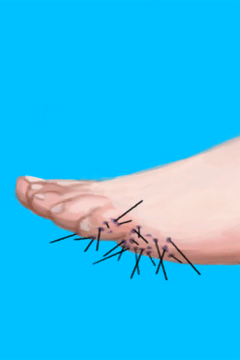

# 海胆刺伤  
> 我应当把刺拔掉！  
   
> 海胆是一种与海星有亲缘关系的带刺动物。它们可以在岛上的<b>岩滩</b>以及<b>潮汐池</b>中找到。  在它们的栖息地附近拾海时，建议穿戴足部保护装备，因为踩到它们会导致易<b>感染</b>的<b>疼痛</b>伤口，让你<b>行走</b>更加困难。如果你不幸踩到了，请尽快将刺从伤口上取下来。  
  
<table class="table table-bordered"><tbody><tr ><td  style="width:80%;text-align:left;vertical-align:top;" >** 不可删除 **  **重量：**1000  **装备：**[“擦伤”](eTag_WAbrasion.md)  **可使用次数：**0</td><td  style="width:20%;text-align:left;vertical-align:top;" >

</td></tr></tbody></tbody></table>  
  
## 获取来源  
<table class="table table-bordered"><thead><tr ><th  style="text-align:left;vertical-align:top;" >来源</th><th  style="text-align:left;vertical-align:top;" >操作</th></tr></thead><tr ><td  style="text-align:left;vertical-align:top;" >[

[海胆！！(事件)](Event_Urchin.md)](Event_Urchin.md)</td><td  style="text-align:left;vertical-align:top;" >检查伤口</td></tr></tbody></table>  
  
## 动作  
<table class="table table-bordered"><thead><tr ><th  style="text-align:left;vertical-align:top;" >动作</th><th  style="text-align:left;vertical-align:top;" >耗时</th><th  style="text-align:left;vertical-align:top;" >条件</th><th  style="text-align:left;vertical-align:top;" >变化</th><th  style="text-align:left;vertical-align:top;" >状态</th></tr></thead><tr ><td  style="text-align:left;vertical-align:top;" >拔掉刺 </td><td  style="text-align:left;vertical-align:top;" >15分</td><td  style="text-align:left;vertical-align:top;" ></td><td  style="text-align:left;vertical-align:top;" >** 自身：** 

  -4～-2(-50%～-25%)</td><td  style="text-align:left;vertical-align:top;" >[

[情绪](Morale.md)](Morale.md)-10</td></tr></tbody></table>  
  
## 属性   
<table class="table table-bordered"><thead><tr ><th  style="text-align:left;vertical-align:top;" >属性</th><th  style="text-align:left;vertical-align:top;" >值</th><th  style="text-align:left;vertical-align:top;" >耗时</th><th  style="text-align:left;vertical-align:top;" >变化</th></tr></thead><tr ><td  style="text-align:left;vertical-align:top;" >

</td><td  style="text-align:left;vertical-align:top;" >初始：0 最大：500</td><td  style="text-align:left;vertical-align:top;" >每15分钟+1 最多需要：5天5小时</td><td  style="text-align:left;vertical-align:top;" >** 到达上限时：擦伤 **  ** 自身 ** →消失</td></tr><tr ><td  style="text-align:left;vertical-align:top;" >

</td><td  style="text-align:left;vertical-align:top;" >初始：0 最大：32</td><td  style="text-align:left;vertical-align:top;" >每15分钟-1 最多需要：8小时</td><td  style="text-align:left;vertical-align:top;" ></td></tr><tr ><td  style="text-align:left;vertical-align:top;" >

</td><td  style="text-align:left;vertical-align:top;" >初始：0 最大：288</td><td  style="text-align:left;vertical-align:top;" >每15分钟+1 最多需要：3天</td><td  style="text-align:left;vertical-align:top;" ></td></tr><tr ><td  style="text-align:left;vertical-align:top;" >

</td><td  style="text-align:left;vertical-align:top;" >初始：8 最大：8</td><td  style="text-align:left;vertical-align:top;" >-</td><td  style="text-align:left;vertical-align:top;" >** 到达0时：刺已拔除！ **  ** 自身 ** → [

[海胆刺伤](W_UrchinWound.md)](W_UrchinWound.md)</td></tr></tbody></table>  
  
## 被动效果  
<table class="table table-bordered"><thead><tr ><th  style="text-align:left;vertical-align:top;" >名称</th><th  style="text-align:left;vertical-align:top;" >条件</th><th  style="text-align:left;vertical-align:top;" >变化(每15分钟)</th><th  style="text-align:left;vertical-align:top;" >玩家状态</th></tr></thead><tr ><td  style="text-align:left;vertical-align:top;" >Surface Bacteria 1</td><td  style="text-align:left;vertical-align:top;" >** 需要状态：** [

[表面细菌](BacteriaSurface.md)](BacteriaSurface.md): 1-1</td><td  style="text-align:left;vertical-align:top;" >

 +1(0.34%)</td><td  style="text-align:left;vertical-align:top;" ></td></tr><tr ><td  style="text-align:left;vertical-align:top;" >Surface Bacteria 2</td><td  style="text-align:left;vertical-align:top;" >** 需要状态：** [

[表面细菌](BacteriaSurface.md)](BacteriaSurface.md): 2-2</td><td  style="text-align:left;vertical-align:top;" >

 +2(0.69%)</td><td  style="text-align:left;vertical-align:top;" ></td></tr><tr ><td  style="text-align:left;vertical-align:top;" >Surface Bacteria 3</td><td  style="text-align:left;vertical-align:top;" >** 需要状态：** [

[表面细菌](BacteriaSurface.md)](BacteriaSurface.md): 3-3</td><td  style="text-align:left;vertical-align:top;" >

 +4(1.38%)</td><td  style="text-align:left;vertical-align:top;" ></td></tr><tr ><td  style="text-align:left;vertical-align:top;" >Surface Bacteria 4</td><td  style="text-align:left;vertical-align:top;" >** 需要状态：** [

[表面细菌](BacteriaSurface.md)](BacteriaSurface.md): 4-4</td><td  style="text-align:left;vertical-align:top;" >

 +8(2.77%)</td><td  style="text-align:left;vertical-align:top;" ></td></tr><tr ><td  style="text-align:left;vertical-align:top;" >Surface Bacteria 5</td><td  style="text-align:left;vertical-align:top;" >** 需要状态：** [

[表面细菌](BacteriaSurface.md)](BacteriaSurface.md): 5-5</td><td  style="text-align:left;vertical-align:top;" >

 +16(5.55%)</td><td  style="text-align:left;vertical-align:top;" ></td></tr><tr ><td  style="text-align:left;vertical-align:top;" >Sepsis</td><td  style="text-align:left;vertical-align:top;" >** 需要属性：** 

: 240～288(83.33%～100%)</td><td  style="text-align:left;vertical-align:top;" >

 -2(-0.4%) 

 +1(0.34%)</td><td  style="text-align:left;vertical-align:top;" >[

[细菌性发烧](BacteriaFever.md)](BacteriaFever.md)加成+10</td></tr><tr ><td  style="text-align:left;vertical-align:top;" >Urchin Wound</td><td  style="text-align:left;vertical-align:top;" >** 需要属性：** 

: 0～250(0%～50%)</td><td  style="text-align:left;vertical-align:top;" ></td><td  style="text-align:left;vertical-align:top;" >[

[疼痛](Pain.md)](Pain.md)+300 [

[皮肤完整度](SkinIntegrity.md)](SkinIntegrity.md)-1 [腿部动作受限](ModifierLeg.md)+3 [

[体重](Weight.md)](Weight.md)加成-0.1 [

[受伤](Wounds.md)](Wounds.md)+100</td></tr></tbody></table>  
  

