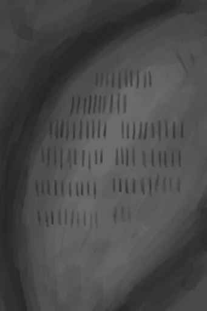

# 墙上的划痕  
> 某个人在洞穴墙壁上刻下的划痕，有96条。恐怕代表天数……  
  
<table class="table table-bordered table6385" data-toggle="table"  data-show-header="false"><thead style="display:none"><tr ><th  style="width:50%;"  >title</th><th  style="width:50%;"  ></th></tr></thead><tr ><td  style="width:50%;"  >** 区域唯一 **  **环境：**[洞穴(环境)](Env_CaveSea.md)</td><td  style="width:50%;"  >

<a href="WallScratchings.md" style="color:black">墙上的划痕</a>

</td></tr></tbody></table>  
  

