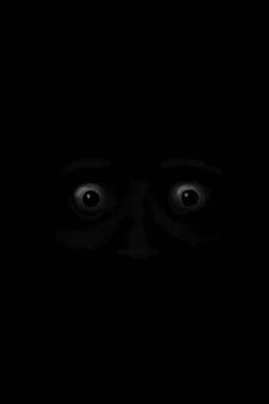
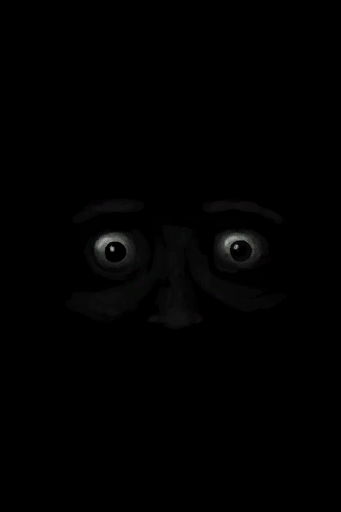
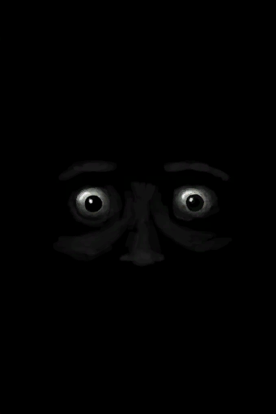

# 监视者的凝视  
> 显示监视者的目光有多强烈。增加你的压力并使你精神状态失常。  
  

<b>基础值: </b> 0 
  

<b>变化范围: </b> 0 ~ 96 
  

<b>基础变化率: </b> -1 / 每15分钟 
  
## 阶段  

<table><tr style="height:2em;"><td style="background-color:#F0F0F0;text-align:center;width:180px;font-size:1.4em;font-weight:bold;vertical-align:middle;">
1 ～ 24

1% ～ 25%
</td><td colspan=2 style="font-size:1.1em;vertical-align:middle;background-color:#F9F9F9;">
<b>

我在被监视……</b>

&nbsp;&nbsp;……
</td></tr><tr><td colspan=2><b>影响：</b>[

[压力](Stress.md)](Stress.md)加成<b>+1</b></td></tr><tr><td colspan=2></td></tr><tr style="height:2em;"><td style="background-color:#F0F0F0;text-align:center;width:180px;font-size:1.4em;font-weight:bold;vertical-align:middle;">
25 ～ 48

26% ～ 50%
</td><td colspan=2 style="font-size:1.1em;vertical-align:middle;background-color:#F9F9F9;">
<b>

我在被监视……</b>

&nbsp;&nbsp;我好紧张……
</td></tr><tr><td colspan=2><b>影响：</b>[

[压力](Stress.md)](Stress.md)加成<b>+1.5</b>, [

[精神失常](MindState.md)](MindState.md)加成<b>+1</b></td></tr><tr><td colspan=2></td></tr><tr style="height:2em;"><td style="background-color:#F0F0F0;text-align:center;width:180px;font-size:1.4em;font-weight:bold;vertical-align:middle;">
49 ～ 72

51% ～ 75%
</td><td colspan=2 style="font-size:1.1em;vertical-align:middle;background-color:#F9F9F9;">
<b>

我在被监视……</b>

&nbsp;&nbsp;我快被逼疯了。
</td></tr><tr><td colspan=2><b>影响：</b>[

[压力](Stress.md)](Stress.md)加成<b>+2</b>, [

[精神失常](MindState.md)](MindState.md)加成<b>+0.5</b></td></tr><tr><td colspan=2></td></tr><tr style="height:2em;"><td style="background-color:#F0F0F0;text-align:center;width:180px;font-size:1.4em;font-weight:bold;vertical-align:middle;">
73 ～ 96

76% ～ 100%
</td><td colspan=2 style="font-size:1.1em;vertical-align:middle;background-color:#F9F9F9;">
<b>

我被严密监视着……</b>

&nbsp;&nbsp;这真可怕。
</td></tr><tr><td colspan=2><b>影响：</b>[

[压力](Stress.md)](Stress.md)加成<b>+4</b>, [

[精神失常](MindState.md)](MindState.md)加成<b>+1</b></td></tr><tr><td colspan=2></td></tr></table>
  
## 相关卡牌  
[光亮](Light.md)  |  [监视者的注视](WatcherInsight.md)  
## 可被以下操作改变  
<table class="table table-bordered" data-toggle="table"  ><thead style=""><tr ><th  style="text-align:left;vertical-align:top;"  >来源</th><th  style="text-align:left;vertical-align:top;"  >操作</th><th  style="text-align:left;vertical-align:top;"  >值</th></tr></thead><tr ><td  style="text-align:left;vertical-align:top;"  >[

[监视者(事件)](Event_WatchedExperience1a.md)](Event_WatchedExperience1a.md)</td><td  style="text-align:left;vertical-align:top;"  >惊恐地尖叫</td><td  style="text-align:left;vertical-align:top;"  >-96 / 每15分钟</td></tr><tr ><td  style="text-align:left;vertical-align:top;"  >[

[监视者(事件)](Event_WatchedExperience1b.md)](Event_WatchedExperience1b.md)</td><td  style="text-align:left;vertical-align:top;"  >惊恐地尖叫</td><td  style="text-align:left;vertical-align:top;"  >-96 / 每15分钟</td></tr><tr ><td  style="text-align:left;vertical-align:top;"  >[

[监视者(事件)](Event_WatchedExperience1c.md)](Event_WatchedExperience1c.md)</td><td  style="text-align:left;vertical-align:top;"  >惊恐地尖叫</td><td  style="text-align:left;vertical-align:top;"  >-96 / 每15分钟</td></tr><tr ><td  style="text-align:left;vertical-align:top;"  >[

[监视者(事件)](Event_WatchedExperience1d.md)](Event_WatchedExperience1d.md)</td><td  style="text-align:left;vertical-align:top;"  >惊恐地尖叫</td><td  style="text-align:left;vertical-align:top;"  >-96 / 每15分钟</td></tr><tr ><td  style="text-align:left;vertical-align:top;"  >[

[监视者(事件)](Event_WatchedExperience1e.md)](Event_WatchedExperience1e.md)</td><td  style="text-align:left;vertical-align:top;"  >惊恐地尖叫</td><td  style="text-align:left;vertical-align:top;"  >-96 / 每15分钟</td></tr><tr ><td  style="text-align:left;vertical-align:top;"  >[

[监视者(事件)](Event_WatchedExperience1f.md)](Event_WatchedExperience1f.md)</td><td  style="text-align:left;vertical-align:top;"  >惊恐地尖叫</td><td  style="text-align:left;vertical-align:top;"  >-96 / 每15分钟</td></tr><tr ><td  style="text-align:left;vertical-align:top;"  >[

[监视者(事件)](Event_WatchedExperience1gGod.md)](Event_WatchedExperience1gGod.md)</td><td  style="text-align:left;vertical-align:top;"  >成为监视者</td><td  style="text-align:left;vertical-align:top;"  >-96</td></tr><tr ><td  style="text-align:left;vertical-align:top;"  >[

[监视者(事件)](Event_WatchedExperience1gVoid.md)](Event_WatchedExperience1gVoid.md)</td><td  style="text-align:left;vertical-align:top;"  >没有什么在监视你</td><td  style="text-align:left;vertical-align:top;"  >-96</td></tr><tr ><td  style="text-align:left;vertical-align:top;"  >[

[监视者(事件)](Event_WatchedExperience1gVoid.md)](Event_WatchedExperience1gVoid.md)</td><td  style="text-align:left;vertical-align:top;"  >惊恐地尖叫</td><td  style="text-align:left;vertical-align:top;"  >-96 / 每15分钟</td></tr></tbody></table>  
  
## 被以下操作需求  
<table class="table table-bordered" data-toggle="table"  ><thead style=""><tr ><th  style="text-align:left;vertical-align:top;"  >来源</th><th  style="text-align:left;vertical-align:top;"  >操作</th><th  style="text-align:left;vertical-align:top;"  data-sortable="true"  >值</th></tr></thead><tr ><td  style="text-align:left;vertical-align:top;"  >[监视者(事件)](Event_WatchedExperience1a.md)</td><td  style="text-align:left;vertical-align:top;"  >触发事件</td><td  style="text-align:left;vertical-align:top;"  >96</td></tr></tbody></table>  
  

