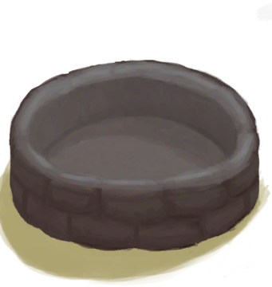

# 蓄水池  
> 大型储水容器。  
  
  属性  |   图片   
 ----  |  ----:   
 **标签：**	[“容器（敞口）”](tag_ContainerOpen.md), [“容器（蓄水池）”](tag_ContainerReservoir.md)  **容水量：**12000  |     
  
## 获取来源  
来源  |  操作  
----  |  ----  
[蓄水池(蓝图)](Bp_WaterReservoir.md)  |  蓝图制造  
[蓄水池（灌溉中）](WaterReservoirIrrigating.md)  |  停止灌溉  
## 动作  
动作  |  时间  |  条件  |  变化  |  状态  
----  |  ----  |  ----  |  ----  |  ----  
开始灌溉   |  -  |  [已灌溉](Irrigated.md):1-1  |  → [蓄水池（灌溉中）](WaterReservoirIrrigating.md)   |    
## 可拖入  
使用  |  动作  |  时间  |  条件  |  变化  |  玩家状态  
----  |  ----  |  ----  |  ----  |  ----  |  ----  
[“储水容器”](tag_WaterContainer.md)  |  防蚊  |  15分  |    |  自身: 防蚊 + 672  使用物: 含水量  -50    |    
## 变化   
操作  |  值  |  时间  |  变化  
----  |  ----  |  ----  |  ----  
防蚊  |  初始：0 最大：672  |  每15分钟-1 最多需要：7天  |    
## 被动效果 (每15分钟)  
名称  |  条件  |  变化  |  玩家状态  
----  |  ----  |  ----  |  ----  
Rain  |  ** 需要状态：** [降水值](RainValue.md):1-5  |  防蚊：-4  |    
Mosquitoes  |  ** 需要属性：** LiquidQuantity50～11995 ** 需要状态：** [降水值](RainValue.md):0-0  |    |  [蚊虫数量](BugPopulation.md)+1  
Mosquito Protection  |  ** 需要属性：** 防蚊1～672 LiquidQuantity50～11995  |    |  [蚊虫数量](BugPopulation.md)-1  
