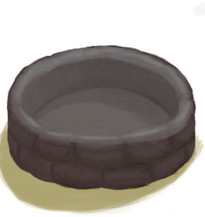

# 蓄水池  
> 大型储水容器。  
  
<table class="table table-bordered table8822" data-toggle="table"  data-show-header="false"><thead style="display:none"><tr ><th  style="width:50%;"  >title</th><th  style="width:50%;"  ></th></tr></thead><tr ><td  style="width:50%;"  >** 不可堆叠 **  **标签：**	[“容器（敞口）”](tag_ContainerOpen.md), [“容器（蓄水池）”](tag_ContainerReservoir.md)  **储水量：**12000</td><td  style="width:50%;"  >

<a href="WaterReservoirFull.md" style="color:black">蓄水池</a>

一种由<b>泥砖</b>砌成，内侧覆有<b>粘土</b>的大型设施。它可以储存大量的水并在下雨时自行填满。  如果被建在升级了<b>灌溉系统</b>的地区，它也可以用于自动灌溉<b>作物</b>。</td></tr></tbody></table>  
  
## 获取来源  

离开

[离开(泥屋)](MudHutExitRuins.md)

  
  
## 动作  

<table><tr><td rowspan="2" style="width:200px;text-align:center;font-size:1.3em;font-weight:bold">

开始灌溉

</td><td></td></tr><tr><td><b>自身：</b>→ [

[蓄水池（灌溉中）](WaterReservoirIrrigating.md)](WaterReservoirIrrigating.md)</td></tr><tr><td colspan="2"><b>需求：</b>[已灌溉](Irrigated.md): <b>1-1</b></td></tr></table>
  
  
  
## 可拖入  

<table style="margin-bottom:0px;"><tr><td style="width:40%;text-align:left; background-color:#FEFEFE"><b>拖入：</b>[“储水容器”](tag_WaterContainer.md)</td><td style="width:40%;font-size:1em;font-weight:bold;background-color:#FEFEFE">防蚊 (15分) </td></tr><tr style="background-color:#FFFFFF"><td style=""><b>使用物：</b>含水量  <b>-50</b></td><td style=""><b>自身：</b>防蚊

  <b>+672(100%)</b></td></tr></table>
  
  
## 属性   

<table style="margin-bottom:0px;"><tr><td style="width:30%;text-align:left; background-color:#FEFEFE;font-size:1.3em;font-weight:bold;">

防蚊</td><td style="font-size:1em;background-color:#FEFEFE">初始：0 , 最大：672 每15分钟-1 , 最多需要：7天</td></tr><tr style="background-color:#FFFFFF"><td colspan=2></td></tr></table>
  

<table style="margin-bottom:0px;"><tr><td style="width:30%;text-align:left; background-color:#FEFEFE;font-size:1.3em;font-weight:bold;"></td><td style="font-size:1em;background-color:#FEFEFE">初始：2 , 最大：2 每15分钟-1 , 最多需要：30分</td></tr><tr style="background-color:#FFFFFF"><td colspan=2>** 到达0时：替换 ** 自身: → [

[蓄水池](WaterReservoir.md)](WaterReservoir.md)</td></tr></table>
  
## 被动效果  
<table class="table table-bordered table1151" data-toggle="table"  ><thead style=""><tr ><th  style=""  >名称</th><th  style=""  >条件</th><th  style=""  >变化(每15分钟)</th><th  style=""  >玩家状态</th></tr></thead><tr ><td  style=""  >Rain</td><td  style=""  >** 需要状态：** [

[降水值](RainValue.md)](RainValue.md): <b>1-5</b></td><td  style=""  >防蚊

 -4(-0.6%) [水](LQ_Water.md)<b>+50</b></td><td  style=""  ></td></tr><tr ><td  style=""  >Mosquitoes</td><td  style=""  >** 需要属性：** 含水量: <b>50～11995</b> ** 需要状态：** [

[降水值](RainValue.md)](RainValue.md): <b>0-0</b></td><td  style=""  ></td><td  style=""  >[

[蚊虫数量](BugPopulation.md)](BugPopulation.md)<b>+1</b></td></tr><tr ><td  style=""  >Mosquito Protection</td><td  style=""  >** 需要属性：** 防蚊

: <b>1～672(0.15%～100%)</b> 含水量: <b>50～11995</b></td><td  style=""  ></td><td  style=""  >[

[蚊虫数量](BugPopulation.md)](BugPopulation.md)<b>-1</b></td></tr></tbody></table>  
  

