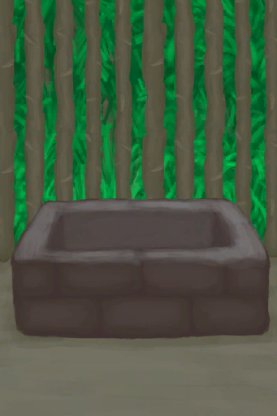

[返回首页](index.md)   |  [查看所有建筑](building.md)
# 水槽  
> 动物们可以在这喝水。  
  
  属性  |   图片   
 ----  |  ----:   
 **标签：**	[“容器（敞口）”](tag_ContainerOpen.md), [“容器（蓄水池）”](tag_ContainerReservoir.md)  **容水量：**3000  **减重量：**-3000  |     
  
## 获取来源  
来源  |  操作  
----  |  ----  
[水槽(蓝图)](Bp_WateringTrough.md)  |  蓝图制造  
## 可拖入  
使用  |  动作  |  时间  |  条件  |  变化  |  状态  
----  |  ----  |  ----  |  ----  |  ----  |  ----  
[“锤”](tag_Hammer.md)  |  拆除  |  2小时  |    |  使用物: 可用次数  -2  获得: [干土堆](DirtPile.md)(+8)   |  [污垢](Filth.md)+30 [耐力](Stamina.md)-15 [手掌损伤](HandDamage.md)+35  
