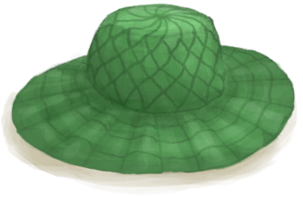

# 棕榈编织物  
> 可以用它做不少东西。  
   
> 在热带岛屿上的很多地方，如<b>沙滩和丛林里</b>都可以找到棕榈叶。 它们可以直接在地上捡到，或者在<b>椰子树和灌木丛</b>采集到。  它们可以被用于制作简单的<b>叶床</b>以保证更舒适的睡眠，同时也是建造<b>小屋和棚屋</b>屋顶的材料。  <b>棕榈叶还可以编织到一起</b>做成各种有用的物品，如<b>编织篓及背篓、帽子或者是简陋的棚屋</b>。  
  
<table class="table table-bordered"><tbody><tr ><td  style="width:80%;text-align:left;vertical-align:top;" >**重量：**150</td><td  style="width:20%;text-align:left;vertical-align:top;" >

</td></tr></tbody></tbody></table>  
  
## 获取来源  
<table class="table table-bordered"><thead><tr ><th  style="text-align:left;vertical-align:top;" >来源</th><th  style="text-align:left;vertical-align:top;" >操作</th></tr></thead><tr ><td  style="text-align:left;vertical-align:top;" >[

[灰山鹑喂食器](PartridgeFeeder.md)](PartridgeFeeder.md)</td><td  style="text-align:left;vertical-align:top;" >拆解</td></tr><tr ><td  style="text-align:left;vertical-align:top;" >[

[灰山鹑喂食器(空)](PartridgeFeederEmpty.md)](PartridgeFeederEmpty.md)</td><td  style="text-align:left;vertical-align:top;" >拆解</td></tr><tr ><td  style="text-align:left;vertical-align:top;" >[

[棕榈叶](PalmFronds.md)](PalmFronds.md)</td><td  style="text-align:left;vertical-align:top;" >编织 ** 拖入：**[棕榈叶](PalmFronds.md)</td></tr></tbody></table>  
  
## 可拖至  

[头部（外层）(蓝图)](OuterHeadBlueprint.md)

  
  
## 可用于蓝图  

[

[空蜂箱(蓝图)](Bp_BeeSkepEmpty.md)](Bp_BeeSkepEmpty.md)

[

[储物箱(蓝图)](Bp_Chest.md)](Bp_Chest.md)

[

[灰山鹑喂食器(蓝图)](Bp_PartridgeFeeder.md)](Bp_PartridgeFeeder.md)

[

[棚屋(蓝图)](Bp_Shed.md)](Bp_Shed.md)

[

[补给箱(蓝图)](Bp_SupplyChest.md)](Bp_SupplyChest.md)

[

[背篓(蓝图)](Bp_WovenBackpack.md)](Bp_WovenBackpack.md)

[

[编织篓(蓝图)](Bp_WovenBasket.md)](Bp_WovenBasket.md)

[

[棕榈编织帽(蓝图)](Bp_WovenHat.md)](Bp_WovenHat.md)

[

[防蜂服(蓝图)](Bp_BeeSuit.md)](Bp_BeeSuit.md)

  
  
  

