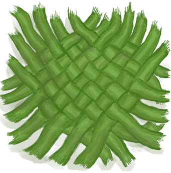

# 棕榈编织物  
> 可以用它做不少东西。  
  
<table class="table table-bordered table3977" data-toggle="table"  data-show-header="false"><thead style="display:none"><tr ><th  style="width:50%;"  >title</th><th  style="width:50%;"  ></th></tr></thead><tr ><td  style="width:50%;"  >**重量：**150</td><td  style="width:50%;"  >

<a href="WeavePalm.md" style="color:black">棕榈编织物</a>

在热带岛屿上的很多地方，如<b>沙滩和丛林里</b>都可以找到棕榈叶。 它们可以直接在地上捡到，或者在<b>椰子树和灌木丛</b>采集到。  它们可以被用于制作简单的<b>叶床</b>以保证更舒适的睡眠，同时也是建造<b>小屋和棚屋</b>屋顶的材料。  <b>棕榈叶还可以编织到一起</b>做成各种有用的物品，如<b>编织篓及背篓、帽子或者是简陋的棚屋</b>。</td></tr></tbody></table>  
  
## 获取来源  

拆解

[灰山鹑喂食器](PartridgeFeeder.md)

拆解

[灰山鹑喂食器(空)](PartridgeFeederEmpty.md)

** 使用**[棕榈叶](PalmFronds.md)编织

[棕榈叶](PalmFronds.md)

  
  
## 可拖至  

[头部（外层）(蓝图)](OuterHeadBlueprint.md)

  
  
## 可用于蓝图  

<a href="Bp_BeeSkepEmpty.md" style="color:black">空蜂箱</a>

<a href="Bp_Chest.md" style="color:black">储物箱</a>

<a href="Bp_PartridgeFeeder.md" style="color:black">灰山鹑喂食器</a>

<a href="Bp_Shed.md" style="color:black">棚屋</a>

<a href="Bp_SupplyChest.md" style="color:black">补给箱</a>

<a href="Bp_WovenBackpack.md" style="color:black">背篓</a>

<a href="Bp_WovenBasket.md" style="color:black">编织篓</a>

<a href="Bp_WovenHat.md" style="color:black">棕榈编织帽</a>

<a href="Bp_BeeSuit.md" style="color:black">防蜂服</a>

  
  
  

