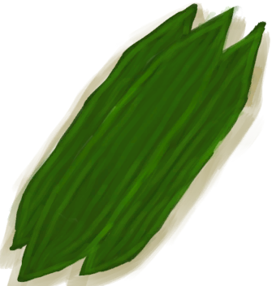

# 大叶仙茅叶片  
> 我可以用它来制作绷带  
   
> 一种在<b>丛林</b>找到的植物  它宽大的<b>叶片</b>可以作为临时<b>伤口敷料</b>来帮助伤口愈合。  将它的<b>叶片种在田里</b>就能落地生根。  
  
  大叶仙茅叶片  |   图片   
 ----  |  ----:   
 **重量：**50  **标签：**	[“喂食（草食动物）”](tag_FeedHerb.md)  |     
  
## 获取来源  
来源  |  操作  
----  |  ----  
[大叶仙茅](WeevilLily.md)  |  采集  
## 动作  
动作  |  耗时  |  条件  |  变化  |  状态  
----  |  ----  |  ----  |  ----  |  ----  
制作绷带 [手部动作](HandAction.md)  |  15分  |  [光亮](Light.md): 10-100  |  ** 自身：** →消失  ** 获得： ** ** [Molineria] **   [叶片绷带](LeafDressing.md)(+1) 基础权重：1  |  [药草学(技能)](Skill_Herbology.md)+0.5  
## 可拖至  
[未栽种的农田(空)](CropPlotEmpty.md) | [羊食槽](GoatFeeder.md) | [羊食槽(空)](GoatFeederEmpty.md) | [母山羊](GoatEnclosureFemale.md) | [小羊](GoatEnclosureKid.md) | [哺乳期山羊](GoatEnclosureLactating.md) | [公山羊](GoatEnclosureMale.md) | [母山羊](GoatTiedFemale.md) | [哺乳期山羊](GoatTiedFemaleLactating.md) | [小羊](GoatTiedKid.md) | [公山羊](GoatTiedMale.md)  
## 属性   
属性  |  值  |  耗时  |  变化  
----  |  ----  |  ----  |  ----  
耐久  |  初始：672  |  每15分钟-1 最多需要：7天  |  ** 到达0时： **  ** 自身 ** →消失  

