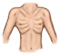

# 体重  
> 显示你的身体储存了多少脂肪。如果归零人物会死亡。  
> 如果你摄入的卡路里比消耗的要少，你的体重就会下降，反之亦然。  如果你的体重过低，你将变得虚弱，<b>免疫系统</b>也更加脆弱。当体重降至0你就会<b>死</b>。 如果你的体重过高，你将变得肥胖，它会为你的<b>行动</b>带来阻碍。  如需增重，你应避免高强度的<b>体力活动</b>，多吃高热量的如富含油脂和碳水化合物的<b>烹饪食物</b>。  
  

<b>基础值: </b> 2500 
  

<b>变化范围: </b> 0 ~ 15000 
  

<b>基础变化率: </b> 无 
  
## 阶段  

<table><tr style="height:2em;"><td style="background-color:#F0F0F0;text-align:center;width:180px;font-size:1.4em;font-weight:bold;vertical-align:middle;">
6721 ～ 15000

44% ～ 100%
</td><td colspan=2 style="font-size:1.1em;vertical-align:middle;background-color:#F9F9F9;">
<b>

过度肥胖</b>

</td></tr><tr><td colspan=2><b>影响：</b>[

[体重](Weight.md)](Weight.md)加成<b>-4</b>, [腿部动作受限](ModifierLeg.md)<b>+1</b></td></tr><tr><td colspan=2></td></tr><tr style="height:2em;"><td style="background-color:#F0F0F0;text-align:center;width:180px;font-size:1.4em;font-weight:bold;vertical-align:middle;">
4033 ～ 6720

26% ～ 44%
</td><td colspan=2 style="font-size:1.1em;vertical-align:middle;background-color:#F9F9F9;">
<b>

超重</b>

</td></tr><tr><td colspan=2><b>影响：</b>[

[体重](Weight.md)](Weight.md)加成<b>-3</b></td></tr><tr><td colspan=2></td></tr><tr style="height:2em;"><td style="background-color:#F0F0F0;text-align:center;width:180px;font-size:1.4em;font-weight:bold;vertical-align:middle;">
3001 ～ 4032

20% ～ 26%
</td><td colspan=2 style="font-size:1.1em;vertical-align:middle;background-color:#F9F9F9;">
<b>

体重正常</b>

</td></tr><tr><td colspan=2><b>影响：</b>[

[体重](Weight.md)](Weight.md)加成<b>-2</b></td></tr><tr><td colspan=2></td></tr><tr style="height:2em;"><td style="background-color:#F0F0F0;text-align:center;width:180px;font-size:1.4em;font-weight:bold;vertical-align:middle;">
2001 ～ 3000

13% ～ 20%
</td><td colspan=2 style="font-size:1.1em;vertical-align:middle;background-color:#F9F9F9;">
<b>

体重正常</b>

</td></tr><tr><td colspan=2><b>影响：</b>[

[体重](Weight.md)](Weight.md)加成<b>-1</b></td></tr><tr><td colspan=2></td></tr><tr style="height:2em;"><td style="background-color:#F0F0F0;text-align:center;width:180px;font-size:1.4em;font-weight:bold;vertical-align:middle;">
701 ～ 2000

4% ～ 13%
</td><td colspan=2 style="font-size:1.1em;vertical-align:middle;background-color:#F9F9F9;">
<b>

体重正常</b>

</td></tr><tr><td colspan=2><b>影响：</b>[

[体重](Weight.md)](Weight.md)加成<b>-0.5</b></td></tr><tr><td colspan=2></td></tr><tr style="height:2em;"><td style="background-color:#F0F0F0;text-align:center;width:180px;font-size:1.4em;font-weight:bold;vertical-align:middle;">
289 ～ 700

1% ～ 4%
</td><td colspan=2 style="font-size:1.1em;vertical-align:middle;background-color:#F9F9F9;">
<b>

过瘦</b>

&nbsp;&nbsp;我感觉身体虚弱
</td></tr><tr><td colspan=2><b>影响：</b>[

[清醒度](Wakefulness.md)](Wakefulness.md)加成<b>-0.5</b>, [

[食欲](Appetite.md)](Appetite.md)<b>+50</b>, [

[体重](Weight.md)](Weight.md)加成<b>-0.25</b>, [

[免疫系统](ImmuneSystem.md)](ImmuneSystem.md)<b>-50</b></td></tr><tr><td colspan=2></td></tr><tr style="height:2em;"><td style="background-color:#F0F0F0;text-align:center;width:180px;font-size:1.4em;font-weight:bold;vertical-align:middle;">
75 ～ 288

0% ～ 1%
</td><td colspan=2 style="font-size:1.1em;vertical-align:middle;background-color:#F9F9F9;">
<b>

骨瘦嶙峋</b>

&nbsp;&nbsp;我感觉身体非常虚弱
</td></tr><tr><td colspan=2><b>影响：</b>[

[免疫系统](ImmuneSystem.md)](ImmuneSystem.md)<b>-100</b>, [

[清醒度](Wakefulness.md)](Wakefulness.md)加成<b>-1</b>, [

[食欲](Appetite.md)](Appetite.md)<b>+100</b>, [

[体重](Weight.md)](Weight.md)加成<b>-0.1</b></td></tr><tr><td colspan=2></td></tr><tr style="height:2em;"><td style="background-color:#F0F0F0;text-align:center;width:180px;font-size:1.4em;font-weight:bold;vertical-align:middle;">
1 ～ 74

0% ～ 0%
</td><td colspan=2 style="font-size:1.1em;vertical-align:middle;background-color:#F9F9F9;">
<b>

快饿死了</b>

&nbsp;&nbsp;我没力气动了……我要坚持不住了
</td></tr><tr><td colspan=2><b>影响：</b>[

[清醒度](Wakefulness.md)](Wakefulness.md)加成<b>-1</b>, [

[细菌性发烧](BacteriaFever.md)](BacteriaFever.md)加成<b>+4</b>, [

[食欲](Appetite.md)](Appetite.md)<b>+100</b>, [

[体重](Weight.md)](Weight.md)加成<b>-0.1</b></td></tr><tr><td colspan=2></td></tr><tr style="height:2em;"><td style="background-color:#F0F0F0;text-align:center;width:180px;font-size:1.4em;font-weight:bold;vertical-align:middle;">
0

0%
</td><td colspan=2 style="font-size:1.1em;vertical-align:middle;background-color:#F9F9F9;">
<b>

死于饥饿</b>

&nbsp;&nbsp;你死于饥饿。
</td></tr><tr><td colspan=2></td></tr></table>
  
## 相关卡牌  
[肠道](Intestines.md)  |  [耐力](Stamina.md)  |  [烧伤](Burns.md)  |  [寄生虫](Parasites.md)  |  [海怪寄生虫](ParasitesSeahound.md)  |  [血压](Blood.md)  |  [月季效果](ChinaRoseEffect.md)  |  [怀孕](Pregnancy.md)  
## 加成值影响因素  
<table class="table table-bordered" data-toggle="table"  ><thead style=""><tr ><th  style="text-align:left;vertical-align:top;"  >来源</th><th  style="text-align:left;vertical-align:top;"  >操作</th><th  style="text-align:left;vertical-align:top;"  >值</th></tr></thead><tr ><td  style="text-align:left;vertical-align:top;"  >

[缓慢代谢](Pk_4_SlowMetabolism.md)</td><td  style="text-align:left;vertical-align:top;"  >特质影响</td><td  style="text-align:left;vertical-align:top;"  >加成+0.5</td></tr><tr ><td  style="text-align:left;vertical-align:top;"  >[左手腕扭伤](W_ArmSprainedL.md)</td><td  style="text-align:left;vertical-align:top;"  >条件被动</td><td  style="text-align:left;vertical-align:top;"  >加成+0</td></tr><tr ><td  style="text-align:left;vertical-align:top;"  >[右手腕扭伤](W_ArmSprainedR.md)</td><td  style="text-align:left;vertical-align:top;"  >条件被动</td><td  style="text-align:left;vertical-align:top;"  >加成+0</td></tr><tr ><td  style="text-align:left;vertical-align:top;"  >[左脚踝扭伤](W_LegSprainedL.md)</td><td  style="text-align:left;vertical-align:top;"  >条件被动</td><td  style="text-align:left;vertical-align:top;"  >加成+0</td></tr><tr ><td  style="text-align:left;vertical-align:top;"  >[右脚踝扭伤](W_LegSprainedR.md)</td><td  style="text-align:left;vertical-align:top;"  >条件被动</td><td  style="text-align:left;vertical-align:top;"  >加成+0</td></tr><tr ><td  style="text-align:left;vertical-align:top;"  >[擦伤](W_Abrasion.md)</td><td  style="text-align:left;vertical-align:top;"  >条件被动</td><td  style="text-align:left;vertical-align:top;"  >加成-0.1</td></tr><tr ><td  style="text-align:left;vertical-align:top;"  >[左臂骨折](W_ArmFractureL.md)</td><td  style="text-align:left;vertical-align:top;"  >条件被动</td><td  style="text-align:left;vertical-align:top;"  >加成-0.1</td></tr><tr ><td  style="text-align:left;vertical-align:top;"  >[右臂骨折](W_ArmFractureR.md)</td><td  style="text-align:left;vertical-align:top;"  >条件被动</td><td  style="text-align:left;vertical-align:top;"  >加成-0.1</td></tr><tr ><td  style="text-align:left;vertical-align:top;"  >[左手腕扭伤](W_ArmSprainedL.md)</td><td  style="text-align:left;vertical-align:top;"  >条件被动</td><td  style="text-align:left;vertical-align:top;"  >加成-0.1</td></tr><tr ><td  style="text-align:left;vertical-align:top;"  >[右手腕扭伤](W_ArmSprainedR.md)</td><td  style="text-align:left;vertical-align:top;"  >条件被动</td><td  style="text-align:left;vertical-align:top;"  >加成-0.1</td></tr><tr ><td  style="text-align:left;vertical-align:top;"  >[狗咬伤](W_DogBite.md)</td><td  style="text-align:left;vertical-align:top;"  >条件被动</td><td  style="text-align:left;vertical-align:top;"  >加成-0.1</td></tr><tr ><td  style="text-align:left;vertical-align:top;"  >[左腿骨折](W_LegFractureL.md)</td><td  style="text-align:left;vertical-align:top;"  >条件被动</td><td  style="text-align:left;vertical-align:top;"  >加成-0.1</td></tr><tr ><td  style="text-align:left;vertical-align:top;"  >[右腿骨折](W_LegFractureR.md)</td><td  style="text-align:left;vertical-align:top;"  >条件被动</td><td  style="text-align:left;vertical-align:top;"  >加成-0.1</td></tr><tr ><td  style="text-align:left;vertical-align:top;"  >[左脚踝扭伤](W_LegSprainedL.md)</td><td  style="text-align:left;vertical-align:top;"  >条件被动</td><td  style="text-align:left;vertical-align:top;"  >加成-0.1</td></tr><tr ><td  style="text-align:left;vertical-align:top;"  >[右脚踝扭伤](W_LegSprainedR.md)</td><td  style="text-align:left;vertical-align:top;"  >条件被动</td><td  style="text-align:left;vertical-align:top;"  >加成-0.1</td></tr><tr ><td  style="text-align:left;vertical-align:top;"  >[猕猴咬伤](W_MacaqueBite.md)</td><td  style="text-align:left;vertical-align:top;"  >条件被动</td><td  style="text-align:left;vertical-align:top;"  >加成-0.1</td></tr><tr ><td  style="text-align:left;vertical-align:top;"  >[轻微撕裂伤](W_MinorLaceration.md)</td><td  style="text-align:left;vertical-align:top;"  >条件被动</td><td  style="text-align:left;vertical-align:top;"  >加成-0.1</td></tr><tr ><td  style="text-align:left;vertical-align:top;"  >[已缝合的轻微撕裂伤](W_MinorLacerationStitched.md)</td><td  style="text-align:left;vertical-align:top;"  >条件被动</td><td  style="text-align:left;vertical-align:top;"  >加成-0.1</td></tr><tr ><td  style="text-align:left;vertical-align:top;"  >[巨蜥咬伤](W_MonitorBite.md)</td><td  style="text-align:left;vertical-align:top;"  >条件被动</td><td  style="text-align:left;vertical-align:top;"  >加成-0.1</td></tr><tr ><td  style="text-align:left;vertical-align:top;"  >[海怪刺伤](W_SeahoundSting.md)</td><td  style="text-align:left;vertical-align:top;"  >条件被动</td><td  style="text-align:left;vertical-align:top;"  >加成-0.1</td></tr><tr ><td  style="text-align:left;vertical-align:top;"  >[鲨鱼咬伤](W_SharkBite.md)</td><td  style="text-align:left;vertical-align:top;"  >条件被动</td><td  style="text-align:left;vertical-align:top;"  >加成-0.1</td></tr><tr ><td  style="text-align:left;vertical-align:top;"  >[蜘蛛咬伤](W_SpiderBite.md)</td><td  style="text-align:left;vertical-align:top;"  >条件被动</td><td  style="text-align:left;vertical-align:top;"  >加成-0.1</td></tr><tr ><td  style="text-align:left;vertical-align:top;"  >[海胆刺伤](W_UrchinWound.md)</td><td  style="text-align:left;vertical-align:top;"  >条件被动</td><td  style="text-align:left;vertical-align:top;"  >加成-0.1</td></tr><tr ><td  style="text-align:left;vertical-align:top;"  >[海胆刺伤](W_UrchinWoundSpines.md)</td><td  style="text-align:left;vertical-align:top;"  >条件被动</td><td  style="text-align:left;vertical-align:top;"  >加成-0.1</td></tr><tr ><td  style="text-align:left;vertical-align:top;"  >[左臂骨折](W_ArmFractureL.md)</td><td  style="text-align:left;vertical-align:top;"  >条件被动</td><td  style="text-align:left;vertical-align:top;"  >加成-0.25</td></tr><tr ><td  style="text-align:left;vertical-align:top;"  >[右臂骨折](W_ArmFractureR.md)</td><td  style="text-align:left;vertical-align:top;"  >条件被动</td><td  style="text-align:left;vertical-align:top;"  >加成-0.25</td></tr><tr ><td  style="text-align:left;vertical-align:top;"  >[左臂撕裂伤](W_ArmLacerationL.md)</td><td  style="text-align:left;vertical-align:top;"  >条件被动</td><td  style="text-align:left;vertical-align:top;"  >加成-0.25</td></tr><tr ><td  style="text-align:left;vertical-align:top;"  >[已缝合的左臂撕裂伤](W_ArmLacerationLStitched.md)</td><td  style="text-align:left;vertical-align:top;"  >条件被动</td><td  style="text-align:left;vertical-align:top;"  >加成-0.25</td></tr><tr ><td  style="text-align:left;vertical-align:top;"  >[右臂撕裂伤](W_ArmLacerationR.md)</td><td  style="text-align:left;vertical-align:top;"  >条件被动</td><td  style="text-align:left;vertical-align:top;"  >加成-0.25</td></tr><tr ><td  style="text-align:left;vertical-align:top;"  >[已缝合的右臂撕裂伤](W_ArmLacerationRStitched.md)</td><td  style="text-align:left;vertical-align:top;"  >条件被动</td><td  style="text-align:left;vertical-align:top;"  >加成-0.25</td></tr><tr ><td  style="text-align:left;vertical-align:top;"  >[左腿骨折](W_LegFractureL.md)</td><td  style="text-align:left;vertical-align:top;"  >条件被动</td><td  style="text-align:left;vertical-align:top;"  >加成-0.25</td></tr><tr ><td  style="text-align:left;vertical-align:top;"  >[右腿骨折](W_LegFractureR.md)</td><td  style="text-align:left;vertical-align:top;"  >条件被动</td><td  style="text-align:left;vertical-align:top;"  >加成-0.25</td></tr><tr ><td  style="text-align:left;vertical-align:top;"  >[左腿撕裂伤](W_LegLacerationL.md)</td><td  style="text-align:left;vertical-align:top;"  >条件被动</td><td  style="text-align:left;vertical-align:top;"  >加成-0.25</td></tr><tr ><td  style="text-align:left;vertical-align:top;"  >[已缝合的左腿撕裂伤](W_LegLacerationLStitched.md)</td><td  style="text-align:left;vertical-align:top;"  >条件被动</td><td  style="text-align:left;vertical-align:top;"  >加成-0.25</td></tr><tr ><td  style="text-align:left;vertical-align:top;"  >[右腿撕裂伤](W_LegLacerationR.md)</td><td  style="text-align:left;vertical-align:top;"  >条件被动</td><td  style="text-align:left;vertical-align:top;"  >加成-0.25</td></tr><tr ><td  style="text-align:left;vertical-align:top;"  >[已缝合的右腿撕裂伤](W_LegLacerationRStitched.md)</td><td  style="text-align:left;vertical-align:top;"  >条件被动</td><td  style="text-align:left;vertical-align:top;"  >加成-0.25</td></tr><tr ><td  style="text-align:left;vertical-align:top;"  >

[快速代谢](Pk_4_FastMetabolism.md)</td><td  style="text-align:left;vertical-align:top;"  >特质影响</td><td  style="text-align:left;vertical-align:top;"  >加成-0.25</td></tr><tr ><td  style="text-align:left;vertical-align:top;"  >[左臂骨折](W_ArmFractureL.md)</td><td  style="text-align:left;vertical-align:top;"  >条件被动</td><td  style="text-align:left;vertical-align:top;"  >加成-0.5</td></tr><tr ><td  style="text-align:left;vertical-align:top;"  >[右臂骨折](W_ArmFractureR.md)</td><td  style="text-align:left;vertical-align:top;"  >条件被动</td><td  style="text-align:left;vertical-align:top;"  >加成-0.5</td></tr><tr ><td  style="text-align:left;vertical-align:top;"  >[左臂撕裂伤](W_ArmLacerationL.md)</td><td  style="text-align:left;vertical-align:top;"  >条件被动</td><td  style="text-align:left;vertical-align:top;"  >加成-0.5</td></tr><tr ><td  style="text-align:left;vertical-align:top;"  >[已缝合的左臂撕裂伤](W_ArmLacerationLStitched.md)</td><td  style="text-align:left;vertical-align:top;"  >条件被动</td><td  style="text-align:left;vertical-align:top;"  >加成-0.5</td></tr><tr ><td  style="text-align:left;vertical-align:top;"  >[右臂撕裂伤](W_ArmLacerationR.md)</td><td  style="text-align:left;vertical-align:top;"  >条件被动</td><td  style="text-align:left;vertical-align:top;"  >加成-0.5</td></tr><tr ><td  style="text-align:left;vertical-align:top;"  >[已缝合的右臂撕裂伤](W_ArmLacerationRStitched.md)</td><td  style="text-align:left;vertical-align:top;"  >条件被动</td><td  style="text-align:left;vertical-align:top;"  >加成-0.5</td></tr><tr ><td  style="text-align:left;vertical-align:top;"  >[左腿骨折](W_LegFractureL.md)</td><td  style="text-align:left;vertical-align:top;"  >条件被动</td><td  style="text-align:left;vertical-align:top;"  >加成-0.5</td></tr><tr ><td  style="text-align:left;vertical-align:top;"  >[右腿骨折](W_LegFractureR.md)</td><td  style="text-align:left;vertical-align:top;"  >条件被动</td><td  style="text-align:left;vertical-align:top;"  >加成-0.5</td></tr><tr ><td  style="text-align:left;vertical-align:top;"  >[左腿撕裂伤](W_LegLacerationL.md)</td><td  style="text-align:left;vertical-align:top;"  >条件被动</td><td  style="text-align:left;vertical-align:top;"  >加成-0.5</td></tr><tr ><td  style="text-align:left;vertical-align:top;"  >[已缝合的左腿撕裂伤](W_LegLacerationLStitched.md)</td><td  style="text-align:left;vertical-align:top;"  >条件被动</td><td  style="text-align:left;vertical-align:top;"  >加成-0.5</td></tr><tr ><td  style="text-align:left;vertical-align:top;"  >[右腿撕裂伤](W_LegLacerationR.md)</td><td  style="text-align:left;vertical-align:top;"  >条件被动</td><td  style="text-align:left;vertical-align:top;"  >加成-0.5</td></tr><tr ><td  style="text-align:left;vertical-align:top;"  >[已缝合的右腿撕裂伤](W_LegLacerationRStitched.md)</td><td  style="text-align:left;vertical-align:top;"  >条件被动</td><td  style="text-align:left;vertical-align:top;"  >加成-0.5</td></tr><tr ><td  style="text-align:left;vertical-align:top;"  >[巨蜥咬伤](W_MonitorBite.md)</td><td  style="text-align:left;vertical-align:top;"  >条件被动</td><td  style="text-align:left;vertical-align:top;"  >加成-0.5</td></tr><tr ><td  style="text-align:left;vertical-align:top;"  >[鲨鱼咬伤](W_SharkBite.md)</td><td  style="text-align:left;vertical-align:top;"  >条件被动</td><td  style="text-align:left;vertical-align:top;"  >加成-0.5</td></tr><tr ><td  style="text-align:left;vertical-align:top;"  >

[超级代谢](Pk_4_HyperMetabolism.md)</td><td  style="text-align:left;vertical-align:top;"  >特质影响</td><td  style="text-align:left;vertical-align:top;"  >加成-0.75</td></tr><tr ><td  style="text-align:left;vertical-align:top;"  >[左臂撕裂伤](W_ArmLacerationL.md)</td><td  style="text-align:left;vertical-align:top;"  >条件被动</td><td  style="text-align:left;vertical-align:top;"  >加成-1</td></tr><tr ><td  style="text-align:left;vertical-align:top;"  >[已缝合的左臂撕裂伤](W_ArmLacerationLStitched.md)</td><td  style="text-align:left;vertical-align:top;"  >条件被动</td><td  style="text-align:left;vertical-align:top;"  >加成-1</td></tr><tr ><td  style="text-align:left;vertical-align:top;"  >[右臂撕裂伤](W_ArmLacerationR.md)</td><td  style="text-align:left;vertical-align:top;"  >条件被动</td><td  style="text-align:left;vertical-align:top;"  >加成-1</td></tr><tr ><td  style="text-align:left;vertical-align:top;"  >[已缝合的右臂撕裂伤](W_ArmLacerationRStitched.md)</td><td  style="text-align:left;vertical-align:top;"  >条件被动</td><td  style="text-align:left;vertical-align:top;"  >加成-1</td></tr><tr ><td  style="text-align:left;vertical-align:top;"  >[左腿撕裂伤](W_LegLacerationL.md)</td><td  style="text-align:left;vertical-align:top;"  >条件被动</td><td  style="text-align:left;vertical-align:top;"  >加成-1</td></tr><tr ><td  style="text-align:left;vertical-align:top;"  >[已缝合的左腿撕裂伤](W_LegLacerationLStitched.md)</td><td  style="text-align:left;vertical-align:top;"  >条件被动</td><td  style="text-align:left;vertical-align:top;"  >加成-1</td></tr><tr ><td  style="text-align:left;vertical-align:top;"  >[右腿撕裂伤](W_LegLacerationR.md)</td><td  style="text-align:left;vertical-align:top;"  >条件被动</td><td  style="text-align:left;vertical-align:top;"  >加成-1</td></tr><tr ><td  style="text-align:left;vertical-align:top;"  >[已缝合的右腿撕裂伤](W_LegLacerationRStitched.md)</td><td  style="text-align:left;vertical-align:top;"  >条件被动</td><td  style="text-align:left;vertical-align:top;"  >加成-1</td></tr></tbody></table>  
  
## 可被以下操作改变  
<table class="table table-bordered" data-toggle="table"  ><thead style=""><tr ><th  style="text-align:left;vertical-align:top;"  >来源</th><th  style="text-align:left;vertical-align:top;"  >操作</th><th  style="text-align:left;vertical-align:top;"  data-sortable="true"  >值</th></tr></thead><tr ><td  style="text-align:left;vertical-align:top;"  >[远处有一座大岛……(事件)](Event_DistantIsland.md)</td><td  style="text-align:left;vertical-align:top;"  >乘坐木筏到岛上</td><td  style="text-align:left;vertical-align:top;"  >8</td></tr><tr ><td  style="text-align:left;vertical-align:top;"  >[

[没气的救生筏](LifeRaftDeflated.md)](LifeRaftDeflated.md)</td><td  style="text-align:left;vertical-align:top;"  >切下塑料布 ** 拖入：**[“切割工具”](tag_Cutter.md)</td><td  style="text-align:left;vertical-align:top;"  >-1</td></tr><tr ><td  style="text-align:left;vertical-align:top;"  >[

[打开的降落伞](ParachuteDeployed.md)](ParachuteDeployed.md)</td><td  style="text-align:left;vertical-align:top;"  >切下塑料布 ** 拖入：**[“切割工具”](tag_Cutter.md)</td><td  style="text-align:left;vertical-align:top;"  >-1</td></tr><tr ><td  style="text-align:left;vertical-align:top;"  >[

[姜](Ginger.md)](Ginger.md)</td><td  style="text-align:left;vertical-align:top;"  >捣碎 ** 拖入：**[“锤”](tag_Hammer.md)</td><td  style="text-align:left;vertical-align:top;"  >-1</td></tr><tr ><td  style="text-align:left;vertical-align:top;"  >[

[干姜](GingerDried.md)](GingerDried.md)</td><td  style="text-align:left;vertical-align:top;"  >捣碎 ** 拖入：**[“锤”](tag_Hammer.md)</td><td  style="text-align:left;vertical-align:top;"  >-1</td></tr><tr ><td  style="text-align:left;vertical-align:top;"  >[

[茉莉花](JasmineFlowers.md)](JasmineFlowers.md)</td><td  style="text-align:left;vertical-align:top;"  >捣碎 ** 拖入：**[“锤”](tag_Hammer.md)</td><td  style="text-align:left;vertical-align:top;"  >-1</td></tr><tr ><td  style="text-align:left;vertical-align:top;"  >[

[卡瓦根](KavaRoot.md)](KavaRoot.md)</td><td  style="text-align:left;vertical-align:top;"  >捣碎 ** 拖入：**[“锤”](tag_Hammer.md)</td><td  style="text-align:left;vertical-align:top;"  >-1</td></tr><tr ><td  style="text-align:left;vertical-align:top;"  >[

[干燥的卡瓦根](KavaRootDried.md)](KavaRootDried.md)</td><td  style="text-align:left;vertical-align:top;"  >捣碎 ** 拖入：**[“锤”](tag_Hammer.md)</td><td  style="text-align:left;vertical-align:top;"  >-1</td></tr><tr ><td  style="text-align:left;vertical-align:top;"  >[

[柠檬草](LemongrassStalks.md)](LemongrassStalks.md)</td><td  style="text-align:left;vertical-align:top;"  >捣碎 ** 拖入：**[“锤”](tag_Hammer.md)</td><td  style="text-align:left;vertical-align:top;"  >-1</td></tr><tr ><td  style="text-align:left;vertical-align:top;"  >[

[蜘蛛兰叶](SpiderLilyLeaves.md)](SpiderLilyLeaves.md)</td><td  style="text-align:left;vertical-align:top;"  >捣碎叶子 ** 拖入：**[“锤”](tag_Hammer.md)</td><td  style="text-align:left;vertical-align:top;"  >-1</td></tr><tr ><td  style="text-align:left;vertical-align:top;"  >[

[干燥的蜘蛛兰叶](SpiderLilyLeavesDried.md)](SpiderLilyLeavesDried.md)</td><td  style="text-align:left;vertical-align:top;"  >捣碎叶子 ** 拖入：**[“锤”](tag_Hammer.md)</td><td  style="text-align:left;vertical-align:top;"  >-1</td></tr><tr ><td  style="text-align:left;vertical-align:top;"  >[

[蛇草](SnakeGrass.md)](SnakeGrass.md)</td><td  style="text-align:left;vertical-align:top;"  >捣碎 ** 拖入：**[“锤”](tag_Hammer.md)</td><td  style="text-align:left;vertical-align:top;"  >-1</td></tr><tr ><td  style="text-align:left;vertical-align:top;"  >[

[摘光的香蕉树](BananaTreeCleared.md)](BananaTreeCleared.md)</td><td  style="text-align:left;vertical-align:top;"  >砍树 ** 拖入：**[“斧”](tag_Axe.md)</td><td  style="text-align:left;vertical-align:top;"  >-1</td></tr><tr ><td  style="text-align:left;vertical-align:top;"  >[

[摘光的香蕉树](BananaTreeCleared.md)](BananaTreeCleared.md)</td><td  style="text-align:left;vertical-align:top;"  >砍树 ** 拖入：**[石斧](StoneAxe.md)</td><td  style="text-align:left;vertical-align:top;"  >-2</td></tr><tr ><td  style="text-align:left;vertical-align:top;"  >[

[椰子树(特殊)](PalmTree_Unique.md)](PalmTree_Unique.md)</td><td  style="text-align:left;vertical-align:top;"  >爬树摘椰子</td><td  style="text-align:left;vertical-align:top;"  >-2 ~ -1</td></tr><tr ><td  style="text-align:left;vertical-align:top;"  >[

[倒下的西米树](SagoPalmFelled.md)](SagoPalmFelled.md)</td><td  style="text-align:left;vertical-align:top;"  >从中劈开 ** 拖入：**[石斧](StoneAxe.md)</td><td  style="text-align:left;vertical-align:top;"  >-4</td></tr><tr ><td  style="text-align:left;vertical-align:top;"  >[

[倒下的西米树](SagoPalmFelled.md)](SagoPalmFelled.md)</td><td  style="text-align:left;vertical-align:top;"  >从中劈开 ** 拖入：**[“斧”](tag_Axe.md)</td><td  style="text-align:left;vertical-align:top;"  >-4</td></tr><tr ><td  style="text-align:left;vertical-align:top;"  >[

[劈开的西米树干](SagoSplitLog.md)](SagoSplitLog.md)</td><td  style="text-align:left;vertical-align:top;"  >刮取树芯 ** 拖入：**[“切割工具”](tag_Cutter.md) , [“斧”](tag_Axe.md)</td><td  style="text-align:left;vertical-align:top;"  >-4</td></tr><tr ><td  style="text-align:left;vertical-align:top;"  >[

[婴儿](Baby.md)](Baby.md)</td><td  style="text-align:left;vertical-align:top;"  >喂奶</td><td  style="text-align:left;vertical-align:top;"  >-5</td></tr><tr ><td  style="text-align:left;vertical-align:top;"  >[

[半根原木](HalfLog.md)](HalfLog.md)</td><td  style="text-align:left;vertical-align:top;"  >切割成木材 ** 拖入：**[“斧”](tag_Axe.md)</td><td  style="text-align:left;vertical-align:top;"  >-6</td></tr><tr ><td  style="text-align:left;vertical-align:top;"  >[

[原木](Log.md)](Log.md)</td><td  style="text-align:left;vertical-align:top;"  >截成两段 ** 拖入：**[“斧”](tag_Axe.md)</td><td  style="text-align:left;vertical-align:top;"  >-6</td></tr><tr ><td  style="text-align:left;vertical-align:top;"  >[

[半根原木](HalfLog.md)](HalfLog.md)</td><td  style="text-align:left;vertical-align:top;"  >切割成木材 ** 拖入：**[石斧](StoneAxe.md)</td><td  style="text-align:left;vertical-align:top;"  >-8</td></tr><tr ><td  style="text-align:left;vertical-align:top;"  >[

[原木](Log.md)](Log.md)</td><td  style="text-align:left;vertical-align:top;"  >截成两段 ** 拖入：**[石斧](StoneAxe.md)</td><td  style="text-align:left;vertical-align:top;"  >-8</td></tr><tr ><td  style="text-align:left;vertical-align:top;"  >[

[椰子树(IH)](PalmTree_IH.md)](PalmTree_IH.md)</td><td  style="text-align:left;vertical-align:top;"  >砍倒 ** 拖入：**[石斧](StoneAxe.md)</td><td  style="text-align:left;vertical-align:top;"  >-8</td></tr><tr ><td  style="text-align:left;vertical-align:top;"  >[

[椰子树(IH)](PalmTree_IH.md)](PalmTree_IH.md)</td><td  style="text-align:left;vertical-align:top;"  >砍倒 ** 拖入：**[铜斧](AxeCopper.md)</td><td  style="text-align:left;vertical-align:top;"  >-8</td></tr><tr ><td  style="text-align:left;vertical-align:top;"  >[

[椰子树(特殊)](PalmTree_Unique.md)](PalmTree_Unique.md)</td><td  style="text-align:left;vertical-align:top;"  >砍倒 ** 拖入：**[石斧](StoneAxe.md)</td><td  style="text-align:left;vertical-align:top;"  >-8</td></tr><tr ><td  style="text-align:left;vertical-align:top;"  >[

[椰子树(特殊)](PalmTree_Unique.md)](PalmTree_Unique.md)</td><td  style="text-align:left;vertical-align:top;"  >砍倒 ** 拖入：**[铜斧](AxeCopper.md)</td><td  style="text-align:left;vertical-align:top;"  >-8</td></tr><tr ><td  style="text-align:left;vertical-align:top;"  >[远处有一座大岛……(事件)](Event_DistantIsland.md)</td><td  style="text-align:left;vertical-align:top;"  >游向小岛</td><td  style="text-align:left;vertical-align:top;"  >-16</td></tr></tbody></table>  
  
## 被以下操作需求  
<table class="table table-bordered" data-toggle="table"  ><thead style=""><tr ><th  style="text-align:left;vertical-align:top;"  >来源</th><th  style="text-align:left;vertical-align:top;"  >操作</th><th  style="text-align:left;vertical-align:top;"  data-sortable="true"  >值</th></tr></thead><tr ><td  style="text-align:left;vertical-align:top;"  >[睡袋](BedRoll.md)</td><td  style="text-align:left;vertical-align:top;"  >小憩</td><td  style="text-align:left;vertical-align:top;"  >0 ~ 74</td></tr><tr ><td  style="text-align:left;vertical-align:top;"  >[睡袋](BedRoll.md)</td><td  style="text-align:left;vertical-align:top;"  >睡觉</td><td  style="text-align:left;vertical-align:top;"  >0 ~ 74</td></tr><tr ><td  style="text-align:left;vertical-align:top;"  >[简易床](BedRustic.md)</td><td  style="text-align:left;vertical-align:top;"  >小憩</td><td  style="text-align:left;vertical-align:top;"  >0 ~ 74</td></tr><tr ><td  style="text-align:left;vertical-align:top;"  >[简易床](BedRustic.md)</td><td  style="text-align:left;vertical-align:top;"  >睡觉</td><td  style="text-align:left;vertical-align:top;"  >0 ~ 74</td></tr><tr ><td  style="text-align:left;vertical-align:top;"  >[木床](BedWooden.md)</td><td  style="text-align:left;vertical-align:top;"  >小憩</td><td  style="text-align:left;vertical-align:top;"  >0 ~ 74</td></tr><tr ><td  style="text-align:left;vertical-align:top;"  >[木床](BedWooden.md)</td><td  style="text-align:left;vertical-align:top;"  >睡觉</td><td  style="text-align:left;vertical-align:top;"  >0 ~ 74</td></tr><tr ><td  style="text-align:left;vertical-align:top;"  >[吊床](Hammock.md)</td><td  style="text-align:left;vertical-align:top;"  >小憩</td><td  style="text-align:left;vertical-align:top;"  >0 ~ 74</td></tr><tr ><td  style="text-align:left;vertical-align:top;"  >[吊床](Hammock.md)</td><td  style="text-align:left;vertical-align:top;"  >睡觉</td><td  style="text-align:left;vertical-align:top;"  >0 ~ 74</td></tr><tr ><td  style="text-align:left;vertical-align:top;"  >[叶床](LeafBed.md)</td><td  style="text-align:left;vertical-align:top;"  >小憩</td><td  style="text-align:left;vertical-align:top;"  >0 ~ 74</td></tr><tr ><td  style="text-align:left;vertical-align:top;"  >[叶床](LeafBed.md)</td><td  style="text-align:left;vertical-align:top;"  >睡觉</td><td  style="text-align:left;vertical-align:top;"  >0 ~ 74</td></tr><tr ><td  style="text-align:left;vertical-align:top;"  >[人鱼巢](MermaidNest.md)</td><td  style="text-align:left;vertical-align:top;"  >小憩</td><td  style="text-align:left;vertical-align:top;"  >0 ~ 74</td></tr><tr ><td  style="text-align:left;vertical-align:top;"  >[人鱼巢](MermaidNest.md)</td><td  style="text-align:left;vertical-align:top;"  >睡觉</td><td  style="text-align:left;vertical-align:top;"  >0 ~ 74</td></tr><tr ><td  style="text-align:left;vertical-align:top;"  >[窝棚](Shelter.md)</td><td  style="text-align:left;vertical-align:top;"  >小憩</td><td  style="text-align:left;vertical-align:top;"  >0 ~ 74</td></tr><tr ><td  style="text-align:left;vertical-align:top;"  >[窝棚](Shelter.md)</td><td  style="text-align:left;vertical-align:top;"  >睡觉</td><td  style="text-align:left;vertical-align:top;"  >0 ~ 74</td></tr><tr ><td  style="text-align:left;vertical-align:top;"  >[有遮蔽的叶床](ShelteredLeafBed.md)</td><td  style="text-align:left;vertical-align:top;"  >小憩</td><td  style="text-align:left;vertical-align:top;"  >0 ~ 74</td></tr><tr ><td  style="text-align:left;vertical-align:top;"  >[有遮蔽的叶床](ShelteredLeafBed.md)</td><td  style="text-align:left;vertical-align:top;"  >睡觉</td><td  style="text-align:left;vertical-align:top;"  >0 ~ 74</td></tr><tr ><td  style="text-align:left;vertical-align:top;"  >[帐篷](TentDeployed.md)</td><td  style="text-align:left;vertical-align:top;"  >小憩</td><td  style="text-align:left;vertical-align:top;"  >0 ~ 74</td></tr><tr ><td  style="text-align:left;vertical-align:top;"  >[帐篷](TentDeployed.md)</td><td  style="text-align:left;vertical-align:top;"  >睡觉</td><td  style="text-align:left;vertical-align:top;"  >0 ~ 74</td></tr><tr ><td  style="text-align:left;vertical-align:top;"  >[无法控制焦虑！(事件)](Event_AnxietyAttack.md)</td><td  style="text-align:left;vertical-align:top;"  >继续</td><td  style="text-align:left;vertical-align:top;"  >0 ~ 74</td></tr><tr ><td  style="text-align:left;vertical-align:top;"  >[你睡着了！(事件)](Event_FallingAsleep.md)</td><td  style="text-align:left;vertical-align:top;"  >Zzz……</td><td  style="text-align:left;vertical-align:top;"  >0 ~ 74</td></tr><tr ><td  style="text-align:left;vertical-align:top;"  >[木筏庇护所](RaftShelter.md)</td><td  style="text-align:left;vertical-align:top;"  >小憩</td><td  style="text-align:left;vertical-align:top;"  >0 ~ 74</td></tr><tr ><td  style="text-align:left;vertical-align:top;"  >[木筏庇护所](RaftShelter.md)</td><td  style="text-align:left;vertical-align:top;"  >睡觉</td><td  style="text-align:left;vertical-align:top;"  >0 ~ 74</td></tr><tr ><td  style="text-align:left;vertical-align:top;"  >[死亡(事件)](Event_DeathNutrition.md)</td><td  style="text-align:left;vertical-align:top;"  >触发事件</td><td  style="text-align:left;vertical-align:top;"  >0</td></tr></tbody></table>  
  

