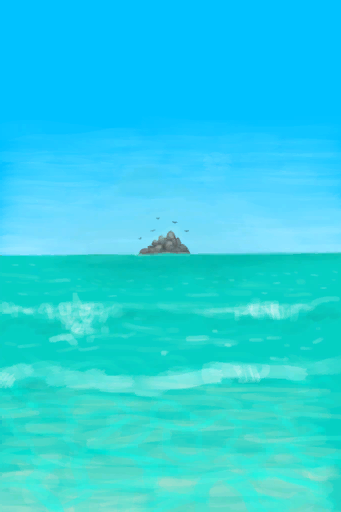

# 湿度  
> 显示你的湿润程度。会降低你的体温并可能使你发烧。  
  

<b>基础值: </b> 0 
  

<b>变化范围: </b> 0 ~ 100 
  

<b>基础变化率: </b> -20 / 每15分钟 
  
## 阶段  

<table><tr style="height:2em;"><td style="background-color:#F0F0F0;text-align:center;width:180px;font-size:1.4em;font-weight:bold;vertical-align:middle;">
0

0%
</td><td colspan=2 style="font-size:1.1em;vertical-align:middle;background-color:#F9F9F9;">
<b>干燥</b>

</td></tr><tr><td colspan=2></td></tr><tr style="height:2em;"><td style="background-color:#F0F0F0;text-align:center;width:180px;font-size:1.4em;font-weight:bold;vertical-align:middle;">
1 ～ 75

1% ～ 75%
</td><td colspan=2 style="font-size:1.1em;vertical-align:middle;background-color:#F9F9F9;">
<b>

潮湿</b>

</td></tr><tr><td colspan=2><b>影响：</b>[

[体感温度](TemperaturePerceived.md)](TemperaturePerceived.md)<b>-10</b>, [

[晒伤](Sunburn.md)](Sunburn.md)加成<b>-1</b>, [

[皮肤潮湿度](SkinHumidity.md)](SkinHumidity.md)加成<b>+8</b></td></tr><tr><td colspan=2></td></tr><tr style="height:2em;"><td style="background-color:#F0F0F0;text-align:center;width:180px;font-size:1.4em;font-weight:bold;vertical-align:middle;">
76 ～ 100

76% ～ 100%
</td><td colspan=2 style="font-size:1.1em;vertical-align:middle;background-color:#F9F9F9;">
<b>

湿透了</b>

</td></tr><tr><td colspan=2><b>影响：</b>[

[体感温度](TemperaturePerceived.md)](TemperaturePerceived.md)<b>-20</b>, [

[细菌性发烧](BacteriaFever.md)](BacteriaFever.md)加成<b>+4</b>, [

[晒伤](Sunburn.md)](Sunburn.md)加成<b>-2</b>, [

[发烧](Fever.md)](Fever.md)<b>-100</b> 加成<b>-1.5</b>, [

[皮肤潮湿度](SkinHumidity.md)](SkinHumidity.md)加成<b>+16</b></td></tr><tr><td colspan=2></td></tr></table>
  
## 相关卡牌  
[体感温度](TemperaturePerceived.md)  |  [淋雨](RainExposure.md)  
## 加成值影响因素  
<table class="table table-bordered" data-toggle="table"  ><thead style=""><tr ><th  style="text-align:left;vertical-align:top;"  >来源</th><th  style="text-align:left;vertical-align:top;"  >操作</th><th  style="text-align:left;vertical-align:top;"  >值</th></tr></thead><tr ><td  style="text-align:left;vertical-align:top;"  >[潮汐洞](CaveTidal.md)</td><td  style="text-align:left;vertical-align:top;"  >条件被动</td><td  style="text-align:left;vertical-align:top;"  >加成+50</td></tr><tr ><td  style="text-align:left;vertical-align:top;"  >[火炉](Stove.md)</td><td  style="text-align:left;vertical-align:top;"  >被动效果</td><td  style="text-align:left;vertical-align:top;"  >加成-1</td></tr><tr ><td  style="text-align:left;vertical-align:top;"  >[烟熏炉](Smoker.md)</td><td  style="text-align:left;vertical-align:top;"  >被动效果</td><td  style="text-align:left;vertical-align:top;"  >加成-1</td></tr><tr ><td  style="text-align:left;vertical-align:top;"  >[烟熏炉(塑料布)(点燃)](SmokerPlastic.md)</td><td  style="text-align:left;vertical-align:top;"  >被动效果</td><td  style="text-align:left;vertical-align:top;"  >加成-1</td></tr><tr ><td  style="text-align:left;vertical-align:top;"  >[蒸馏器(开)](AlembicOn.md)</td><td  style="text-align:left;vertical-align:top;"  >被动效果</td><td  style="text-align:left;vertical-align:top;"  >加成-2</td></tr><tr ><td  style="text-align:left;vertical-align:top;"  >[营火](Campfire.md)</td><td  style="text-align:left;vertical-align:top;"  >被动效果</td><td  style="text-align:left;vertical-align:top;"  >加成-2</td></tr><tr ><td  style="text-align:left;vertical-align:top;"  >[粘土火盆](ClayFirePit.md)</td><td  style="text-align:left;vertical-align:top;"  >被动效果</td><td  style="text-align:left;vertical-align:top;"  >加成-2</td></tr><tr ><td  style="text-align:left;vertical-align:top;"  >[火堆](Fire.md)</td><td  style="text-align:left;vertical-align:top;"  >被动效果</td><td  style="text-align:left;vertical-align:top;"  >加成-2</td></tr><tr ><td  style="text-align:left;vertical-align:top;"  >[瓦斯炉(开)](GasCookerOn.md)</td><td  style="text-align:left;vertical-align:top;"  >被动效果</td><td  style="text-align:left;vertical-align:top;"  >加成-2</td></tr></tbody></table>  
  
## 可被以下操作改变  
<table class="table table-bordered" data-toggle="table"  ><thead style=""><tr ><th  style="text-align:left;vertical-align:top;"  >来源</th><th  style="text-align:left;vertical-align:top;"  >操作</th><th  style="text-align:left;vertical-align:top;"  >值</th></tr></thead><tr ><td  style="text-align:left;vertical-align:top;"  >[

[我游不动了……(事件)](Event_SwimFail.md)](Event_SwimFail.md)</td><td  style="text-align:left;vertical-align:top;"  >游回去</td><td  style="text-align:left;vertical-align:top;"  >200</td></tr><tr ><td  style="text-align:left;vertical-align:top;"  >[

[隐秘港湾](Path_BirdRockToCove.md)](Path_BirdRockToCove.md)</td><td  style="text-align:left;vertical-align:top;"  >游泳</td><td  style="text-align:left;vertical-align:top;"  >200 / 每15分钟</td></tr><tr ><td  style="text-align:left;vertical-align:top;"  >[

[荒芜沙滩(鸟岩岛)](Path_BirdRockToDesolateBeach.md)](Path_BirdRockToDesolateBeach.md)</td><td  style="text-align:left;vertical-align:top;"  >游泳</td><td  style="text-align:left;vertical-align:top;"  >200 / 每15分钟</td></tr><tr ><td  style="text-align:left;vertical-align:top;"  >[

[岩滩(鸟岩岛)](Path_BirdRockToRocks.md)](Path_BirdRockToRocks.md)</td><td  style="text-align:left;vertical-align:top;"  >游泳</td><td  style="text-align:left;vertical-align:top;"  >200 / 每15分钟</td></tr><tr ><td  style="text-align:left;vertical-align:top;"  >[

[鸟岩岛(隐秘港湾)](Path_CoveToBirdRock.md)](Path_CoveToBirdRock.md)</td><td  style="text-align:left;vertical-align:top;"  >游泳</td><td  style="text-align:left;vertical-align:top;"  >200 / 每15分钟</td></tr><tr ><td  style="text-align:left;vertical-align:top;"  >[

[鸟岩岛(荒芜沙滩)](Path_DesolateBeachToBirdRock.md)](Path_DesolateBeachToBirdRock.md)</td><td  style="text-align:left;vertical-align:top;"  >游泳</td><td  style="text-align:left;vertical-align:top;"  >200 / 每15分钟</td></tr><tr ><td  style="text-align:left;vertical-align:top;"  >[

[鸟岩岛](Path_RocksToBirdRock.md)](Path_RocksToBirdRock.md)</td><td  style="text-align:left;vertical-align:top;"  >游泳</td><td  style="text-align:left;vertical-align:top;"  >200 / 每15分钟</td></tr><tr ><td  style="text-align:left;vertical-align:top;"  >[

[水下洞穴](UnderwaterEntrance.md)](UnderwaterEntrance.md)</td><td  style="text-align:left;vertical-align:top;"  >进入</td><td  style="text-align:left;vertical-align:top;"  >200</td></tr><tr ><td  style="text-align:left;vertical-align:top;"  >[

[水下出口(覆溺洞穴)](UnderwaterExit.md)](UnderwaterExit.md)</td><td  style="text-align:left;vertical-align:top;"  >离开</td><td  style="text-align:left;vertical-align:top;"  >200</td></tr><tr ><td  style="text-align:left;vertical-align:top;"  >[

[风太大了！(事件)](Event_Flood.md)](Event_Flood.md)(未实装)</td><td  style="text-align:left;vertical-align:top;"  >躲避一会</td><td  style="text-align:left;vertical-align:top;"  >100</td></tr><tr ><td  style="text-align:left;vertical-align:top;"  >[

[风太大了！(事件)](Event_Storm.md)](Event_Storm.md)</td><td  style="text-align:left;vertical-align:top;"  >躲避狂风暴雨</td><td  style="text-align:left;vertical-align:top;"  >100</td></tr><tr ><td  style="text-align:left;vertical-align:top;"  >[

[潮汐池(岩滩)](TidePool.md)](TidePool.md)</td><td  style="text-align:left;vertical-align:top;"  >洗个澡</td><td  style="text-align:left;vertical-align:top;"  >100 / 每15分钟</td></tr><tr ><td  style="text-align:left;vertical-align:top;"  >[

[被淹没的潮汐池(岩滩)](TidePoolFlooded.md)](TidePoolFlooded.md)</td><td  style="text-align:left;vertical-align:top;"  >洗个澡</td><td  style="text-align:left;vertical-align:top;"  >100 / 每15分钟</td></tr><tr ><td  style="text-align:left;vertical-align:top;"  >[

[水](LQ_Water.md)](LQ_Water.md)</td><td  style="text-align:left;vertical-align:top;"  >洗个澡</td><td  style="text-align:left;vertical-align:top;"  >100 / 每15分钟</td></tr><tr ><td  style="text-align:left;vertical-align:top;"  >[

[盐水](LQ_WaterSalt.md)](LQ_WaterSalt.md)</td><td  style="text-align:left;vertical-align:top;"  >洗个澡</td><td  style="text-align:left;vertical-align:top;"  >100 / 每15分钟</td></tr><tr ><td  style="text-align:left;vertical-align:top;"  >[

[有毒的水](LQ_WaterToxic.md)](LQ_WaterToxic.md)</td><td  style="text-align:left;vertical-align:top;"  >洗个澡</td><td  style="text-align:left;vertical-align:top;"  >100 / 每15分钟</td></tr><tr ><td  style="text-align:left;vertical-align:top;"  >[

[不安全的水](LQ_WaterUnsafe.md)](LQ_WaterUnsafe.md)</td><td  style="text-align:left;vertical-align:top;"  >洗个澡</td><td  style="text-align:left;vertical-align:top;"  >100 / 每15分钟</td></tr><tr ><td  style="text-align:left;vertical-align:top;"  >[

[海水(覆溺洞穴)](Sea_Cave.md)](Sea_Cave.md)</td><td  style="text-align:left;vertical-align:top;"  >潜水</td><td  style="text-align:left;vertical-align:top;"  >100</td></tr><tr ><td  style="text-align:left;vertical-align:top;"  >[

[海水(覆溺洞穴)](Sea_Cave.md)](Sea_Cave.md)</td><td  style="text-align:left;vertical-align:top;"  >洗个澡</td><td  style="text-align:left;vertical-align:top;"  >100 / 每15分钟</td></tr><tr ><td  style="text-align:left;vertical-align:top;"  >[

[海(环礁)](Sea_Atoll.md)](Sea_Atoll.md)</td><td  style="text-align:left;vertical-align:top;"  >潜水</td><td  style="text-align:left;vertical-align:top;"  >100</td></tr><tr ><td  style="text-align:left;vertical-align:top;"  >[

[海(环礁)](Sea_Atoll.md)](Sea_Atoll.md)</td><td  style="text-align:left;vertical-align:top;"  >洗个澡</td><td  style="text-align:left;vertical-align:top;"  >100 / 每15分钟</td></tr><tr ><td  style="text-align:left;vertical-align:top;"  >[

[海(海湾)](Sea_Bay.md)](Sea_Bay.md)</td><td  style="text-align:left;vertical-align:top;"  >潜水</td><td  style="text-align:left;vertical-align:top;"  >100</td></tr><tr ><td  style="text-align:left;vertical-align:top;"  >[

[海(海湾)](Sea_Bay.md)](Sea_Bay.md)</td><td  style="text-align:left;vertical-align:top;"  >洗个澡</td><td  style="text-align:left;vertical-align:top;"  >100 / 每15分钟</td></tr><tr ><td  style="text-align:left;vertical-align:top;"  >[

[海(沙滩)](Sea_Beach.md)](Sea_Beach.md)</td><td  style="text-align:left;vertical-align:top;"  >潜水</td><td  style="text-align:left;vertical-align:top;"  >100</td></tr><tr ><td  style="text-align:left;vertical-align:top;"  >[

[海(沙滩)](Sea_Beach.md)](Sea_Beach.md)</td><td  style="text-align:left;vertical-align:top;"  >洗个澡</td><td  style="text-align:left;vertical-align:top;"  >100 / 每15分钟</td></tr><tr ><td  style="text-align:left;vertical-align:top;"  >[

[海(隐秘港湾)](Sea_Cove.md)](Sea_Cove.md)</td><td  style="text-align:left;vertical-align:top;"  >潜水</td><td  style="text-align:left;vertical-align:top;"  >100</td></tr><tr ><td  style="text-align:left;vertical-align:top;"  >[

[海(隐秘港湾)](Sea_Cove.md)](Sea_Cove.md)</td><td  style="text-align:left;vertical-align:top;"  >洗个澡</td><td  style="text-align:left;vertical-align:top;"  >100 / 每15分钟</td></tr><tr ><td  style="text-align:left;vertical-align:top;"  >[

[海(荒芜沙滩)](Sea_DesolateBeach.md)](Sea_DesolateBeach.md)</td><td  style="text-align:left;vertical-align:top;"  >潜水</td><td  style="text-align:left;vertical-align:top;"  >100</td></tr><tr ><td  style="text-align:left;vertical-align:top;"  >[

[海(荒芜沙滩)](Sea_DesolateBeach.md)](Sea_DesolateBeach.md)</td><td  style="text-align:left;vertical-align:top;"  >洗个澡</td><td  style="text-align:left;vertical-align:top;"  >100 / 每15分钟</td></tr><tr ><td  style="text-align:left;vertical-align:top;"  >[

[海(红树林)](Sea_Mangroves.md)](Sea_Mangroves.md)</td><td  style="text-align:left;vertical-align:top;"  >潜水</td><td  style="text-align:left;vertical-align:top;"  >100</td></tr><tr ><td  style="text-align:left;vertical-align:top;"  >[

[海(红树林)](Sea_Mangroves.md)](Sea_Mangroves.md)</td><td  style="text-align:left;vertical-align:top;"  >洗个澡</td><td  style="text-align:left;vertical-align:top;"  >100 / 每15分钟</td></tr><tr ><td  style="text-align:left;vertical-align:top;"  >[

[海](Sea_Raft.md)](Sea_Raft.md)</td><td  style="text-align:left;vertical-align:top;"  >潜水</td><td  style="text-align:left;vertical-align:top;"  >100 / 每15分钟</td></tr><tr ><td  style="text-align:left;vertical-align:top;"  >[

[海](Sea_Raft.md)](Sea_Raft.md)</td><td  style="text-align:left;vertical-align:top;"  >洗个澡</td><td  style="text-align:left;vertical-align:top;"  >100 / 每15分钟</td></tr><tr ><td  style="text-align:left;vertical-align:top;"  >[

[海(鸟岩岛)](Sea_Rocks.md)](Sea_Rocks.md)</td><td  style="text-align:left;vertical-align:top;"  >潜水</td><td  style="text-align:left;vertical-align:top;"  >100</td></tr><tr ><td  style="text-align:left;vertical-align:top;"  >[

[海(鸟岩岛)](Sea_Rocks.md)](Sea_Rocks.md)</td><td  style="text-align:left;vertical-align:top;"  >洗个澡</td><td  style="text-align:left;vertical-align:top;"  >100 / 每15分钟</td></tr><tr ><td  style="text-align:left;vertical-align:top;"  >[

[沉船(鸟岩岛)](Shipwreck.md)](Shipwreck.md)</td><td  style="text-align:left;vertical-align:top;"  >探索沉船</td><td  style="text-align:left;vertical-align:top;"  >100</td></tr><tr ><td  style="text-align:left;vertical-align:top;"  >[

[淋浴器](Shower.md)](Shower.md)</td><td  style="text-align:left;vertical-align:top;"  >淋浴</td><td  style="text-align:left;vertical-align:top;"  >100 / 每15分钟</td></tr><tr ><td  style="text-align:left;vertical-align:top;"  >[

[海(环礁)](Sea_Atoll.md)](Sea_Atoll.md)</td><td  style="text-align:left;vertical-align:top;"  >叉鱼 ** 拖入：**[“一级矛”](tag_Spear.md)</td><td  style="text-align:left;vertical-align:top;"  >60</td></tr><tr ><td  style="text-align:left;vertical-align:top;"  >[

[海(海湾)](Sea_Bay.md)](Sea_Bay.md)</td><td  style="text-align:left;vertical-align:top;"  >叉鱼 ** 拖入：**[“一级矛”](tag_Spear.md)</td><td  style="text-align:left;vertical-align:top;"  >60</td></tr><tr ><td  style="text-align:left;vertical-align:top;"  >[

[海(沙滩)](Sea_Beach.md)](Sea_Beach.md)</td><td  style="text-align:left;vertical-align:top;"  >叉鱼 ** 拖入：**[“一级矛”](tag_Spear.md)</td><td  style="text-align:left;vertical-align:top;"  >60</td></tr><tr ><td  style="text-align:left;vertical-align:top;"  >[

[海(隐秘港湾)](Sea_Cove.md)](Sea_Cove.md)</td><td  style="text-align:left;vertical-align:top;"  >叉鱼 ** 拖入：**[“一级矛”](tag_Spear.md)</td><td  style="text-align:left;vertical-align:top;"  >60</td></tr><tr ><td  style="text-align:left;vertical-align:top;"  >[

[海(荒芜沙滩)](Sea_DesolateBeach.md)](Sea_DesolateBeach.md)</td><td  style="text-align:left;vertical-align:top;"  >叉鱼 ** 拖入：**[“一级矛”](tag_Spear.md)</td><td  style="text-align:left;vertical-align:top;"  >60</td></tr><tr ><td  style="text-align:left;vertical-align:top;"  >[

[海(红树林)](Sea_Mangroves.md)](Sea_Mangroves.md)</td><td  style="text-align:left;vertical-align:top;"  >叉鱼 ** 拖入：**[“一级矛”](tag_Spear.md)</td><td  style="text-align:left;vertical-align:top;"  >60</td></tr><tr ><td  style="text-align:left;vertical-align:top;"  >[

[海](Sea_Raft.md)](Sea_Raft.md)</td><td  style="text-align:left;vertical-align:top;"  >叉鱼 ** 拖入：**[鱼镖](HarpoonBone.md)</td><td  style="text-align:left;vertical-align:top;"  >60</td></tr><tr ><td  style="text-align:left;vertical-align:top;"  >[

[海(鸟岩岛)](Sea_Rocks.md)](Sea_Rocks.md)</td><td  style="text-align:left;vertical-align:top;"  >叉鱼 ** 拖入：**[“一级矛”](tag_Spear.md)</td><td  style="text-align:left;vertical-align:top;"  >60</td></tr><tr ><td  style="text-align:left;vertical-align:top;"  >[

[卫衣](HoodieRetromation.md)](HoodieRetromation.md)</td><td  style="text-align:left;vertical-align:top;"  >条件被动</td><td  style="text-align:left;vertical-align:top;"  >50</td></tr><tr ><td  style="text-align:left;vertical-align:top;"  >[

[衬衫](ShirtFiber.md)](ShirtFiber.md)</td><td  style="text-align:left;vertical-align:top;"  >条件被动</td><td  style="text-align:left;vertical-align:top;"  >50</td></tr><tr ><td  style="text-align:left;vertical-align:top;"  >[

[T恤](T-Shirt.md)](T-Shirt.md)</td><td  style="text-align:left;vertical-align:top;"  >条件被动</td><td  style="text-align:left;vertical-align:top;"  >50</td></tr><tr ><td  style="text-align:left;vertical-align:top;"  >[

[夏威夷衬衫](HawaiianShirt.md)](HawaiianShirt.md)</td><td  style="text-align:left;vertical-align:top;"  >条件被动</td><td  style="text-align:left;vertical-align:top;"  >40</td></tr><tr ><td  style="text-align:left;vertical-align:top;"  >[

[皮裤](LeatherPants.md)](LeatherPants.md)</td><td  style="text-align:left;vertical-align:top;"  >条件被动</td><td  style="text-align:left;vertical-align:top;"  >40</td></tr><tr ><td  style="text-align:left;vertical-align:top;"  >[

[军裤](MilitaryPants.md)](MilitaryPants.md)</td><td  style="text-align:left;vertical-align:top;"  >条件被动</td><td  style="text-align:left;vertical-align:top;"  >40</td></tr><tr ><td  style="text-align:left;vertical-align:top;"  >[布制裤子](PantsCloth.md)</td><td  style="text-align:left;vertical-align:top;"  >条件被动</td><td  style="text-align:left;vertical-align:top;"  >40</td></tr><tr ><td  style="text-align:left;vertical-align:top;"  >[

[内裤](Underwear.md)](Underwear.md)</td><td  style="text-align:left;vertical-align:top;"  >条件被动</td><td  style="text-align:left;vertical-align:top;"  >40</td></tr><tr ><td  style="text-align:left;vertical-align:top;"  >[

[防蜂服](BeeSuit.md)](BeeSuit.md)</td><td  style="text-align:left;vertical-align:top;"  >条件被动</td><td  style="text-align:left;vertical-align:top;"  >20</td></tr><tr ><td  style="text-align:left;vertical-align:top;"  >[

[包脚布](FootWrappings.md)](FootWrappings.md)</td><td  style="text-align:left;vertical-align:top;"  >条件被动</td><td  style="text-align:left;vertical-align:top;"  >20</td></tr><tr ><td  style="text-align:left;vertical-align:top;"  >[

[绑手带](HandWrappings.md)](HandWrappings.md)</td><td  style="text-align:left;vertical-align:top;"  >条件被动</td><td  style="text-align:left;vertical-align:top;"  >20</td></tr><tr ><td  style="text-align:left;vertical-align:top;"  >[

[求生帽](HatSurvival.md)](HatSurvival.md)</td><td  style="text-align:left;vertical-align:top;"  >条件被动</td><td  style="text-align:left;vertical-align:top;"  >20</td></tr><tr ><td  style="text-align:left;vertical-align:top;"  >[

[头巾](HeadWrappings.md)](HeadWrappings.md)</td><td  style="text-align:left;vertical-align:top;"  >条件被动</td><td  style="text-align:left;vertical-align:top;"  >20</td></tr><tr ><td  style="text-align:left;vertical-align:top;"  >[

[皮革手套](LeatherGloves.md)](LeatherGloves.md)</td><td  style="text-align:left;vertical-align:top;"  >条件被动</td><td  style="text-align:left;vertical-align:top;"  >20</td></tr><tr ><td  style="text-align:left;vertical-align:top;"  >[

[临时防毒面具](MaskMakeshift.md)](MaskMakeshift.md)</td><td  style="text-align:left;vertical-align:top;"  >条件被动</td><td  style="text-align:left;vertical-align:top;"  >20</td></tr><tr ><td  style="text-align:left;vertical-align:top;"  >[

[短裤](Shorts.md)](Shorts.md)</td><td  style="text-align:left;vertical-align:top;"  >条件被动</td><td  style="text-align:left;vertical-align:top;"  >20</td></tr><tr ><td  style="text-align:left;vertical-align:top;"  >[

[运动鞋](Sneakers.md)](Sneakers.md)</td><td  style="text-align:left;vertical-align:top;"  >条件被动</td><td  style="text-align:left;vertical-align:top;"  >20</td></tr><tr ><td  style="text-align:left;vertical-align:top;"  >[

[袜子](Socks.md)](Socks.md)</td><td  style="text-align:left;vertical-align:top;"  >条件被动</td><td  style="text-align:left;vertical-align:top;"  >20</td></tr><tr ><td  style="text-align:left;vertical-align:top;"  >[

[干土堆](DirtPile.md)](DirtPile.md)</td><td  style="text-align:left;vertical-align:top;"  >制作泥巴 ** 拖入：**[“水(任意)”](tag_WaterAny.md)</td><td  style="text-align:left;vertical-align:top;"  >20</td></tr><tr ><td  style="text-align:left;vertical-align:top;"  >[

[干涸的小水塘(湿地)](Puddle.md)](Puddle.md)</td><td  style="text-align:left;vertical-align:top;"  >挖泥巴</td><td  style="text-align:left;vertical-align:top;"  >20</td></tr><tr ><td  style="text-align:left;vertical-align:top;"  >[

[湿肥皂](SoapWet.md)](SoapWet.md)</td><td  style="text-align:left;vertical-align:top;"  >洗个澡</td><td  style="text-align:left;vertical-align:top;"  >15</td></tr><tr ><td  style="text-align:left;vertical-align:top;"  >[

[草裙](LeafSKirt.md)](LeafSKirt.md)</td><td  style="text-align:left;vertical-align:top;"  >条件被动</td><td  style="text-align:left;vertical-align:top;"  >10</td></tr></tbody></table>  
  
## 被以下操作需求  
<table class="table table-bordered" data-toggle="table"  ><thead style=""><tr ><th  style="text-align:left;vertical-align:top;"  >来源</th><th  style="text-align:left;vertical-align:top;"  >操作</th><th  style="text-align:left;vertical-align:top;"  data-sortable="true"  >值</th></tr></thead><tr ><td  style="text-align:left;vertical-align:top;"  >[海鸥巢](SeagullNest.md)</td><td  style="text-align:left;vertical-align:top;"  >影响</td><td  style="text-align:left;vertical-align:top;"  >1 ~ 100</td></tr></tbody></table>  
  

