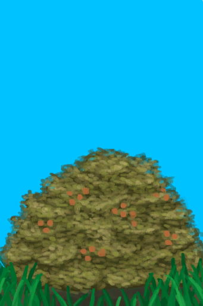

# 野枣丛  
> 它有可食用的果实与大量的树叶。  
  
<table class="table table-bordered" data-toggle="table"  data-show-header="false"><thead style="display:none"><tr ><th  style="width:50%;text-align:left;vertical-align:top;"  data-sortable="true"  >title</th><th  style="width:50%;text-align:left;vertical-align:top;"  ></th></tr></thead><tr ><td  style="width:50%;text-align:left;vertical-align:top;"  ></td><td  style="width:50%;text-align:left;vertical-align:top;"  >

<a href="WildJujube.md" style="color:black">野枣丛</a>

一种大型灌木，可以在<b>草原</b>上找到。  <b>它的果实可以食用</b>，味道酸酸甜甜。  你也可以用斧子砍倒灌木来获得<b>树叶</b>，种子则可以在<b>农田</b>种植和生长。</td></tr></tbody></table>  
  
## 获取来源  

转化

[野枣田](CropPlotWildJujube.md)

探索

[东部草原](GrasslandsE.md)

转化

[摘光的野枣从](WildJujubeCleared.md)

  
  
## 动作  

<table><tr><td rowspan="2" style="width:200px;text-align:center;font-size:1.3em;font-weight:bold">

采集

</td><td></td></tr><tr><td><b>自身：</b>→ [

[摘光的野枣从](WildJujubeCleared.md)](WildJujubeCleared.md)</td></tr><tr><td colspan="2">[

[野枣](JujubeFruits.md)](JujubeFruits.md)(<b>+3～+6</b>)</td></tr></table>
  
  
  
## 可拖入  

<table style="margin-bottom:0px;"><tr><td style="width:40%;text-align:left; background-color:#FEFEFE"><b>拖入：</b>[“斧”](tag_Axe.md)</td><td style="width:40%;font-size:1em;font-weight:bold;background-color:#FEFEFE">砍倒 (15分) [“手部动作(组)”](HandAction.md)</td></tr><tr><td colspan="2"><b>需求：</b>[

[光亮](Light.md)](Light.md): <b>10-100</b></td></tr><tr style="background-color:#FFFFFF"><td style=""><b>使用物：</b>使用次数  <b>-1(-2%)</b></td><td style=""><b>自身：</b>→消失</td></tr><tr><td colspan="2"><b>状态变化：</b>[

[耐力](Stamina.md)](Stamina.md)<b>-1</b>, [

[手掌损伤](HandDamage.md)](HandDamage.md)<b>+20</b></td></tr><tr><td colspan="2">[

[小树枝](Sticks.md)](Sticks.md)(<b>+4～+8</b>), [

[树叶](LeavesFresh.md)](LeavesFresh.md)(<b>+6～+18</b>), [

[野枣](JujubeFruits.md)](JujubeFruits.md)(<b>+3～+6</b>)</td></tr></table>
  
  

