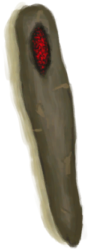

# 烧着的木棒  
> 火炭在木材上烧了个洞。  
  
  烧着的木棒  |   图片   
 ----  |  ----:   
 **重量：**200  |     
  
## 获取来源  
来源  |  操作  
----  |  ----  
[木材](Wood.md) , [火炭](Embers.md)  |  烫一个洞  
## 属性   
属性  |  值  |  耗时  |  变化  
----  |  ----  |  ----  |  ----  
耐久  |  初始：6 最大：6  |  每15分钟-1 最多需要：1小时30分  |  ** 到达0时：木斧柄可以用了！ **  → [木斧柄](HandleWood.md)  

