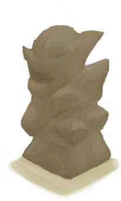

# 未完成的木雕  
> 一个未完成的木雕。应该继续用刀在上面雕刻。  
  
<table class="table table-bordered" data-toggle="table"  data-show-header="false"><thead style="display:none"><tr ><th  style="width:50%;text-align:left;vertical-align:top;"  >title</th><th  style="width:50%;text-align:left;vertical-align:top;"  ></th></tr></thead><tr ><td  style="width:50%;text-align:left;vertical-align:top;"  >**重量：**150  **标签：**	[“燃料”](tag_Fuel.md)</td><td  style="width:50%;text-align:left;vertical-align:top;"  >

<a href="WoodCarving_Unfinished.md" style="color:black">未完成的木雕</a>

如果你有足够的<b>木工技能</b>，可以用<b>木材</b>制作木雕。  雕刻木雕是一个很好的<b>娱乐</b>来源。如果技能足够高，你还能制作出一些好看的<b>装饰品</b>，放在架子上可以增加你的<b>舒适度</b>。</td></tr></tbody></table>  
  
## 获取来源  

蓝图制造

[木雕(蓝图)](Bp_WoodCarvings.md)

  
  
## 可拖入  

<table style="margin-bottom:0px;"><tr><td style="width:40%;text-align:left; background-color:#FEFEFE"><b>拖入：</b>[“高级切割工具”](tag_CutterAdv.md)</td><td style="width:40%;font-size:1em;font-weight:bold;background-color:#FEFEFE">雕刻 (30分) [“手部动作(组)”](HandAction.md), [“制造动作(组)”](CraftAction.md)</td></tr><tr><td colspan="2"><b>需求：</b>[

[光亮](Light.md)](Light.md): <b>10-100</b></td></tr><tr style="background-color:#FFFFFF"><td style=""><b>使用物：</b>使用次数  <b>-1</b></td><td style=""><b>自身：</b>进度  <b>+1(25%)</b></td></tr><tr><td colspan="2"><b>状态变化：</b>[

[木工(技能)](Skill_Woodworking.md)](Skill_Woodworking.md)<b>+1</b>, [

[手掌损伤](HandDamage.md)](HandDamage.md)<b>+20</b>, [

[情绪](Morale.md)](Morale.md)<b>+5</b>, [

[压力](Stress.md)](Stress.md)<b>-10</b>, [

[娱乐](Entertainment.md)](Entertainment.md)<b>+16</b></td></tr><tr><td colspan="2">[

[木屑](WoodShavings.md)](WoodShavings.md)(<b>+0～+1</b>)</td></tr></table>
  
  
## 可拖至  

[蒸馏器(关)](AlembicOff.md)

[蒸馏器(开)](AlembicOn.md)

[营火](Campfire.md)

[营火(熄灭)](CampfireExtinguished.md)

[粘土火盆](ClayFirePit.md)

[粘土火盆(熄灭)](ClayFirePitExtinguished.md)

[火堆](Fire.md)

[火堆(熄灭)](FireExtinguished.md)

[熔炉](Forge.md)

[熔炉(熄灭)](ForgeExtinguished.md)

[窑炉](Kiln.md)

[高级窑炉](KilnAdvanced.md)

[高级窑炉(熄灭)](KilnAdvancedExtinguished.md)

[窑炉(熄灭)](KilnExtinguished.md)

[火炉](Stove.md)

[火炉(熄灭)](StoveExtinguished.md)

  
  
## 属性   

<table style="margin-bottom:0px;"><tr><td style="width:30%;text-align:left; background-color:#FEFEFE;font-size:1.3em;font-weight:bold;">进度</td><td style="font-size:1em;background-color:#FEFEFE">初始：0 , 最大：4 -</td></tr><tr style="background-color:#FFFFFF"><td colspan=2>** 到达上限时：完成了！ ** 自身: →消失 

<table style="margin-bottom:3px;"><tr><td rowspan=2 style="text-align:center" width="80px">
基础权重

800
</td><td style="font-size:0.6em;line-height:0.6em;font-weight:bold">Ruined</td></tr><tr><td>[

[失败品](WoodCarving_Failed.md)](WoodCarving_Failed.md)(<b>+1</b>)</td></tr><tr><td colspan=2><li>[

[木工(技能)](Skill_Woodworking.md)](Skill_Woodworking.md)为<b>1～150</b>时权重<b>+0～-790</b></li></td></tr></table>

<table style="margin-bottom:3px;"><tr><td rowspan=2 style="text-align:center" width="80px">
基础权重

50
</td><td style="font-size:0.6em;line-height:0.6em;font-weight:bold">Goat</td></tr><tr><td>[

[山羊木雕](WoodCarving_Goat.md)](WoodCarving_Goat.md)(<b>+1</b>)[

[情绪](Morale.md)](Morale.md)<b>+10</b></td></tr></table>

<table style="margin-bottom:3px;"><tr><td rowspan=2 style="text-align:center" width="80px">
基础权重

50
</td><td style="font-size:0.6em;line-height:0.6em;font-weight:bold">Seagull</td></tr><tr><td>[

[海鸥木雕](WoodCarving_Seagull.md)](WoodCarving_Seagull.md)(<b>+1</b>)[

[情绪](Morale.md)](Morale.md)<b>+10</b></td></tr></table>

<table style="margin-bottom:3px;"><tr><td rowspan=2 style="text-align:center" width="80px">
基础权重

50
</td><td style="font-size:0.6em;line-height:0.6em;font-weight:bold">Man</td></tr><tr><td>[

[小人木雕（男）](WoodCarving_Man.md)](WoodCarving_Man.md)(<b>+1</b>)[

[情绪](Morale.md)](Morale.md)<b>+10</b></td></tr></table>

<table style="margin-bottom:3px;"><tr><td rowspan=2 style="text-align:center" width="80px">
基础权重

50
</td><td style="font-size:0.6em;line-height:0.6em;font-weight:bold">Woman</td></tr><tr><td>[

[小人木雕（女）](WoodCarving_Woman.md)](WoodCarving_Woman.md)(<b>+1</b>)[

[情绪](Morale.md)](Morale.md)<b>+10</b></td></tr></table>

<table style="margin-bottom:3px;"><tr><td rowspan=2 style="text-align:center" width="80px">
基础权重

50
</td><td style="font-size:0.6em;line-height:0.6em;font-weight:bold">Spirit</td></tr><tr><td>[

[神灵木雕](WoodCarving_Monster.md)](WoodCarving_Monster.md)(<b>+1</b>)[

[情绪](Morale.md)](Morale.md)<b>+10</b></td></tr></table>

</td></tr></table>
  

