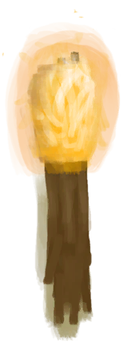

# 木屑  
> 完美的火绒，可以用它来生火。  
   
> 将一把<b>锋利的刀</b>拖到木材上，或通过对应的蓝图来制造木屑。  木屑可以用作随意的<b>火绒</b>，是理想的点火材料。  制作木屑也是一种入门训练<b>木工</b>技能的方法。  
  
<table class="table table-bordered" data-toggle="table" ><tbody><tr ><td  style="width:80%;text-align:left;vertical-align:top;"  >**重量：**15  **标签：**	[“火绒”](tag_Tinder.md)</td><td  style="width:20%;text-align:left;vertical-align:top;"  >

</td></tr></tbody></tbody></table>  
  
## 获取来源  
<table class="table table-bordered" data-toggle="table" ><thead><tr ><th  style="text-align:left;vertical-align:top;"  >来源</th><th  style="text-align:left;vertical-align:top;"  >操作</th></tr></thead><tr ><td  style="text-align:left;vertical-align:top;"  >[

[木屑(蓝图)](Bp_WoodShavings.md)](Bp_WoodShavings.md)</td><td  style="text-align:left;vertical-align:top;"  >蓝图制造</td></tr><tr ><td  style="text-align:left;vertical-align:top;"  >[

[木材](Wood.md)](Wood.md)</td><td  style="text-align:left;vertical-align:top;"  >刨花 ** 拖入：**[“高级切割工具”](tag_CutterAdv.md)</td></tr><tr ><td  style="text-align:left;vertical-align:top;"  >[

[未完成的木雕](WoodCarving_Unfinished.md)](WoodCarving_Unfinished.md)</td><td  style="text-align:left;vertical-align:top;"  >雕刻 ** 拖入：**[“高级切割工具”](tag_CutterAdv.md)</td></tr></tbody></table>  
  
## 可拖入  
<table class="table table-bordered" data-toggle="table" ><thead><tr ><th  style="text-align:left;vertical-align:top;"  >使用</th><th  style="text-align:left;vertical-align:top;"  >动作</th><th  style="text-align:left;vertical-align:top;"  >耗时</th><th  style="text-align:left;vertical-align:top;"  >条件</th><th  style="text-align:left;vertical-align:top;"  >变化</th><th  style="text-align:left;vertical-align:top;"  >玩家状态</th></tr></thead><tr ><td  style="text-align:left;vertical-align:top;"  >[

[手钻](HandDrill.md)](HandDrill.md)</td><td  style="text-align:left;vertical-align:top;"  >钻木取火 [“手部动作(组)”](HandAction.md)</td><td  style="text-align:left;vertical-align:top;"  >2TP</td><td  style="text-align:left;vertical-align:top;"  ></td><td  style="text-align:left;vertical-align:top;"  >** 自身: ** → [

[火种](TinderLit.md)](TinderLit.md)  ** 使用物: ** 可用次数  -1</td><td  style="text-align:left;vertical-align:top;"  >[

[情绪](Morale.md)](Morale.md)+1 [

[手掌损伤](HandDamage.md)](HandDamage.md)+40</td></tr><tr ><td  style="text-align:left;vertical-align:top;"  >[

[弓钻](BowDrill.md)](BowDrill.md)</td><td  style="text-align:left;vertical-align:top;"  >钻木取火 [“手部动作(组)”](HandAction.md)</td><td  style="text-align:left;vertical-align:top;"  >1TP</td><td  style="text-align:left;vertical-align:top;"  ></td><td  style="text-align:left;vertical-align:top;"  >** 自身: ** → [

[火种](TinderLit.md)](TinderLit.md)  ** 使用物: ** 可用次数  -1</td><td  style="text-align:left;vertical-align:top;"  >[

[情绪](Morale.md)](Morale.md)+1 [

[手掌损伤](HandDamage.md)](HandDamage.md)+10</td></tr><tr ><td  style="text-align:left;vertical-align:top;"  >[

[火把(开)](TorchOn.md)](TorchOn.md) [

[蜡烛(开)](CandleOn.md)](CandleOn.md) [

[茉莉蜡烛(开)](CandleJasmineOn.md)](CandleJasmineOn.md) [

[香茅蜡烛(开)](CandleCitronellaOn.md)](CandleCitronellaOn.md) [

[燃烧的信号弹(开)](FlareHandOn.md)](FlareHandOn.md)</td><td  style="text-align:left;vertical-align:top;"  >点燃火绒 </td><td  style="text-align:left;vertical-align:top;"  >-</td><td  style="text-align:left;vertical-align:top;"  ></td><td  style="text-align:left;vertical-align:top;"  >** 自身: ** → [

[火种](TinderLit.md)](TinderLit.md)</td><td  style="text-align:left;vertical-align:top;"  >[

[情绪](Morale.md)](Morale.md)+1</td></tr><tr ><td  style="text-align:left;vertical-align:top;"  >[

[信号镜](SignalingMirror.md)](SignalingMirror.md) [

[眼镜](Glasses.md)](Glasses.md)</td><td  style="text-align:left;vertical-align:top;"  >点燃火绒 </td><td  style="text-align:left;vertical-align:top;"  >3TP</td><td  style="text-align:left;vertical-align:top;"  >[

[降水值](RainValue.md)](RainValue.md): 0-0 [

[阳光强度](SunStrength.md)](SunStrength.md): 1-6</td><td  style="text-align:left;vertical-align:top;"  >** 自身: ** → [

[火种](TinderLit.md)](TinderLit.md)  ** 使用物: ** 可用次数  -1</td><td  style="text-align:left;vertical-align:top;"  >[

[情绪](Morale.md)](Morale.md)+1</td></tr></tbody></table>  
  
## 可拖至  

[蒸馏器(开)](AlembicOn.md)

[营火](Campfire.md)

[粘土火盆](ClayFirePit.md)

[火堆](Fire.md)

[熔炉](Forge.md)

[瓦斯炉(开)](GasCookerOn.md)

[窑炉](Kiln.md)

[高级窑炉](KilnAdvanced.md)

[火炉](Stove.md)

[火炭](Embers.md)

[熏蜂器(关)](BeeSmokerOff.md)

[手钻](FirePlow.md)

  
  
## 可用于蓝图  

[

[炸药(蓝图)](Bp_Dynamite.md)](Bp_Dynamite.md)

  
  
  

