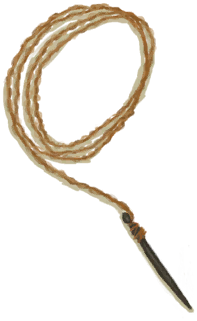

# 木针  
> 用于制作更复杂的纺织品或者皮制品。  
  
<table class="table table-bordered" data-toggle="table"  data-show-header="false"><thead style="display:none"><tr ><th  style="width:50%;text-align:left;vertical-align:top;"  >title</th><th  style="width:50%;text-align:left;vertical-align:top;"  ></th></tr></thead><tr ><td  style="width:50%;text-align:left;vertical-align:top;"  >**重量：**10  **可用次数：**3</td><td  style="width:50%;text-align:left;vertical-align:top;"  >

<a href="WoodenNeedle.md" style="color:black">木针</a>

</td></tr></tbody></table>  
  
## 获取来源  
<table class="table table-bordered" data-toggle="table"  ><thead style=""><tr ><th  style="text-align:left;vertical-align:top;"  >来源</th><th  style="text-align:left;vertical-align:top;"  >操作</th></tr></thead><tr ><td  style="text-align:left;vertical-align:top;"  >[

[木针(蓝图)](Bp_WoodenNeedles.md)](Bp_WoodenNeedles.md)</td><td  style="text-align:left;vertical-align:top;"  >蓝图制造</td></tr><tr ><td  style="text-align:left;vertical-align:top;"  >[

[针线(木针)](WoodenNeedleThreaded.md)](WoodenNeedleThreaded.md)</td><td  style="text-align:left;vertical-align:top;"  >取下细线</td></tr><tr ><td  style="text-align:left;vertical-align:top;"  >[

[针线(木针)](WoodenNeedleThreaded.md)](WoodenNeedleThreaded.md)</td><td  style="text-align:left;vertical-align:top;"  >转化</td></tr></tbody></table>  
  
## 可拖入  
<table class="table table-bordered" data-toggle="table"  ><thead style=""><tr ><th  style="text-align:left;vertical-align:top;"  >使用</th><th  style="text-align:left;vertical-align:top;"  >动作</th><th  style="text-align:left;vertical-align:top;"  >耗时</th><th  style="text-align:left;vertical-align:top;"  >条件</th><th  style="text-align:left;vertical-align:top;"  >变化</th><th  style="text-align:left;vertical-align:top;"  data-sortable="true"  >玩家状态</th></tr></thead><tr ><td  style="text-align:left;vertical-align:top;"  >[

[细线](CordFiber.md)](CordFiber.md)</td><td  style="text-align:left;vertical-align:top;"  >穿线 [“手部动作(组)”](HandAction.md)</td><td  style="text-align:left;vertical-align:top;"  >15分</td><td  style="text-align:left;vertical-align:top;"  >[

[光亮](Light.md)](Light.md): 10-100</td><td  style="text-align:left;vertical-align:top;"  >** 自身: ** → [

[针线(木针)](WoodenNeedleThreaded.md)](WoodenNeedleThreaded.md)  ** 使用物: ** →消失</td><td  style="text-align:left;vertical-align:top;"  ></td></tr></tbody></table>  
  
## 可用于蓝图  

[

[木床(蓝图)](Bp_BedWooden.md)](Bp_BedWooden.md)

[

[地窖(蓝图)](Bp_Cellar.md)](Bp_Cellar.md)

[

[木筏(蓝图)](Bp_Raft.md)](Bp_Raft.md)

[

[木筏庇护所(蓝图)](Bp_RaftShelter.md)](Bp_RaftShelter.md)

[

[防蜂服(蓝图)](Bp_BeeSuit.md)](Bp_BeeSuit.md)

[

[风箱(蓝图)](Bp_Bellows.md)](Bp_Bellows.md)

[

[防毒面具(蓝图)](Bp_GasMask.md)](Bp_GasMask.md)

[

[皮革背包(蓝图)](Bp_LeatherBackpack.md)](Bp_LeatherBackpack.md)

[

[皮革手套(蓝图)](Bp_LeatherGloves.md)](Bp_LeatherGloves.md)

[

[皮裤(蓝图)](Bp_LeatherPants.md)](Bp_LeatherPants.md)

[

[皮革鞋子(蓝图)](Bp_LeatherShoes.md)](Bp_LeatherShoes.md)

[

[箭筒(蓝图)](Bp_Quiver.md)](Bp_Quiver.md)

[

[雨衣(蓝图)](Bp_Raincoat.md)](Bp_Raincoat.md)

[

[布袋(蓝图)](Bp_Sack.md)](Bp_Sack.md)

[

[挎包(蓝图)](Bp_Satchel.md)](Bp_Satchel.md)

[

[衬衫(蓝图)](Bp_Shirt.md)](Bp_Shirt.md)

[

[水袋(蓝图)](Bp_Waterskin.md)](Bp_Waterskin.md)

  
  
  
## 属性   
<table class="table table-bordered" data-toggle="table"  ><thead style=""><tr ><th  style="text-align:left;vertical-align:top;"  >属性</th><th  style="text-align:left;vertical-align:top;"  >值</th><th  style="text-align:left;vertical-align:top;"  data-sortable="true"  >耗时</th><th  style="text-align:left;vertical-align:top;"  >变化</th></tr></thead><tr ><td  style="text-align:left;vertical-align:top;"  >

</td><td  style="text-align:left;vertical-align:top;"  >初始：3 最大：3</td><td  style="text-align:left;vertical-align:top;"  >-</td><td  style="text-align:left;vertical-align:top;"  >** 到达0时： **  ** 自身 ** →消失</td></tr></tbody></table>  
  

