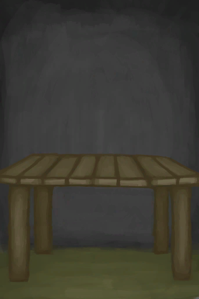
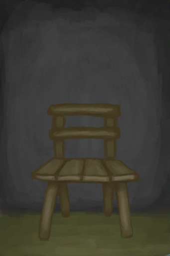
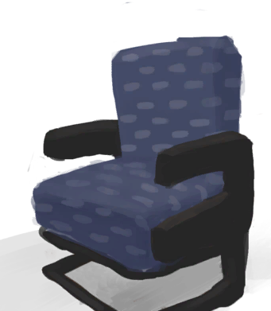

# 工作区  
> 显示你的工作环境有多好，提高制作时的效率。  
  

<b>基础值: </b> 0 
  

<b>变化范围: </b> 0 ~ 1000 
  

<b>基础变化率: </b> 无 
  
## 阶段  

<table><tr style="height:2em;"><td style="background-color:#F0F0F0;text-align:center;width:180px;font-size:1.4em;font-weight:bold;vertical-align:middle;">
1 ～ 250

0% ～ 25%
</td><td colspan=2 style="font-size:1.1em;vertical-align:middle;background-color:#F9F9F9;">
<b>

工作区</b>

&nbsp;&nbsp;轻微效果
</td></tr><tr><td colspan=2><b>影响动作：</b>[“制造动作(组)”](CraftAction.md): , [

[压力](Stress.md)](Stress.md)<b>-2.5</b> 加成<b>-0.75</b>, [

[情绪](Morale.md)](Morale.md)<b>+2.5</b> 加成<b>-0.75</b></td></tr><tr><td colspan=2></td></tr><tr style="height:2em;"><td style="background-color:#F0F0F0;text-align:center;width:180px;font-size:1.4em;font-weight:bold;vertical-align:middle;">
250 ～ 750

25% ～ 75%
</td><td colspan=2 style="font-size:1.1em;vertical-align:middle;background-color:#F9F9F9;">
<b>

工作区</b>

&nbsp;&nbsp;中等效果
</td></tr><tr><td colspan=2><b>影响动作：</b>[“制造动作(组)”](CraftAction.md): , [

[压力](Stress.md)](Stress.md)<b>-5</b> 加成<b>-0.75</b>, [

[情绪](Morale.md)](Morale.md)<b>+5</b> 加成<b>-0.75</b></td></tr><tr><td colspan=2></td></tr><tr style="height:2em;"><td style="background-color:#F0F0F0;text-align:center;width:180px;font-size:1.4em;font-weight:bold;vertical-align:middle;">
750 ～ 1000

75% ～ 100%
</td><td colspan=2 style="font-size:1.1em;vertical-align:middle;background-color:#F9F9F9;">
<b>

工作区</b>

&nbsp;&nbsp;显著效果
</td></tr><tr><td colspan=2><b>影响动作：</b>[“制造动作(组)”](CraftAction.md): , [

[压力](Stress.md)](Stress.md)<b>-10</b> 加成<b>-0.75</b>, [

[情绪](Morale.md)](Morale.md)<b>+10</b> 加成<b>-0.75</b>, 耗时-1</td></tr><tr><td colspan=2></td></tr></table>
  
## 可被以下操作改变  
<table class="table table-bordered table7172" data-toggle="table"  ><thead style=""><tr ><th  style=""  >来源</th><th  style=""  >操作</th><th  style=""  data-sortable="true"  >值</th></tr></thead><tr ><td  style=""  >[

[木桌](Table.md)](Table.md)</td><td  style=""  >被动效果</td><td  style=""  >600</td></tr><tr ><td  style=""  >[

[木桌](Table.md)](Table.md)</td><td  style=""  >条件被动</td><td  style=""  >300</td></tr><tr ><td  style=""  >[

[椅子](ChairPlaced.md)](ChairPlaced.md)</td><td  style=""  >被动效果</td><td  style=""  >100</td></tr><tr ><td  style=""  >[

[座椅](SeatPlaced.md)](SeatPlaced.md)</td><td  style=""  >被动效果</td><td  style=""  >100</td></tr></tbody></table>  
  

