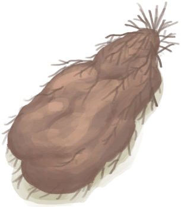

# 参薯  
> 要去皮、切块、煮熟后才能吃。  
  
<table class="table table-bordered" data-toggle="table"  data-show-header="false"><thead style="display:none"><tr ><th  style="width:50%;text-align:left;vertical-align:top;"  >title</th><th  style="width:50%;text-align:left;vertical-align:top;"  ></th></tr></thead><tr ><td  style="width:50%;text-align:left;vertical-align:top;"  >**重量：**200  **标签：**	[“杂食饲料”](tag_FeedOmnivorous.md), [“喂食（草食动物）”](tag_FeedHerb.md), [“饲料”](tag_Feed.md), [“强效食料”](tag_FeedRich.md)</td><td  style="width:50%;text-align:left;vertical-align:top;"  >

<a href="Yam.md" style="color:black">参薯</a>

这些有毒的块茎作物可以在岛上的<b>丛林</b>中找到。 它们可以通过切块并浸泡在任何水（盐、新鲜或不安全的水）中然后煮熟来食用。  如果未经任何加工可以存放更长时间。它营养丰富，可用于多种<b>烹饪食谱</b>中，是非常优秀的主食。</td></tr></tbody></table>  
  
## 获取来源  

刨参薯根

[野参薯](YamPlant.md)

** 使用**[“铲子”](tag_Shovel.md)刨参薯根

[野参薯](YamPlant.md)

  
  
## 可拖入  

<table style="margin-bottom:0px;"><tr><td style="width:40%;text-align:left; background-color:#FEFEFE"><b>拖入：</b>[“切割工具”](tag_Cutter.md)</td><td style="width:40%;font-size:1em;font-weight:bold;background-color:#FEFEFE">去皮并切开 (30分) [“手部动作(组)”](HandAction.md), [“制造动作(组)”](CraftAction.md)</td></tr><tr><td colspan="2"><b>需求：</b>[

[光亮](Light.md)](Light.md): <b>10-150</b></td></tr><tr style="background-color:#FFFFFF"><td style=""><b>使用物：</b>使用次数  <b>-1(-0.67%)</b></td><td style=""><b>自身：</b>→消失</td></tr><tr><td colspan="2">[

[参薯片](YamCut.md)](YamCut.md)(<b>+2</b>)</td></tr></table>
  
  
## 可拖至  

[猪食槽](BoarFeeder.md)

[猪食槽(空)](BoarFeederEmpty.md)

[堆肥箱](CompostBin.md)

[未栽种的农田(空)](CropPlotEmpty.md)

[羊食槽](GoatFeeder.md)

[羊食槽(空)](GoatFeederEmpty.md)

[灰山鹑喂食器](PartridgeFeeder.md)

[灰山鹑喂食器(空)](PartridgeFeederEmpty.md)

[中陷阱的猕猴](CageTrapMacaque.md)

[母猪](BoarEnclosureFemale.md)

[公猪](BoarEnclosureMale.md)

[小猪](BoarEnclosurePiglet.md)

[母猪](BoarTiedFemale.md)

[公猪](BoarTiedMale.md)

[小猪](BoarTiedPiglet.md)

[母山羊](GoatEnclosureFemale.md)

[小羊](GoatEnclosureKid.md)

[哺乳期山羊](GoatEnclosureLactating.md)

[公山羊](GoatEnclosureMale.md)

[母山羊](GoatTiedFemale.md)

[哺乳期山羊](GoatTiedFemaleLactating.md)

[小羊](GoatTiedKid.md)

[公山羊](GoatTiedMale.md)

[猕猴朋友](MacaqueFriend.md)

[受伤的猕猴](MacaqueWounded.md)

[小灰山鹑](PartridgeChick.md)

[雌灰山鹑](PartridgeFemaleEnclosure.md)

[雌灰山鹑](PartridgeFemaleLive.md)

[雄灰山鹑](PartridgeMaleEnclosure.md)

[雄灰山鹑](PartridgeMaleLive.md)

  
  
## 可用于蓝图  

<a href="Bp_FeedBoar.md" style="color:black">猪食</a>

  
  
  
## 属性   

<table style="margin-bottom:0px;"><tr><td style="width:30%;text-align:left; background-color:#FEFEFE;font-size:1.3em;font-weight:bold;">耐久</td><td style="font-size:1em;background-color:#FEFEFE">初始：672 每15分钟-1 , 最多需要：7天</td></tr><tr style="background-color:#FFFFFF"><td colspan=2>** 到达0时： ** 自身: → [

[腐烂物](RottenRemains.md)](RottenRemains.md)</td></tr></table>
  

