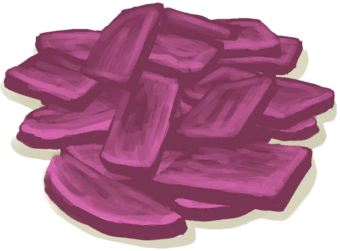

# 参薯片  
> 我想如果不先浸泡在水中并煮沸，它可能会有毒。  
   
> 这些有毒的块茎作物可以在岛上的<b>丛林</b>中找到。 它们可以通过切块并浸泡在任何水（盐、新鲜或不安全的水）中然后煮熟来食用。  如果未经任何加工可以存放更长时间。它营养丰富，可用于多种<b>烹饪食谱</b>中，是非常优秀的主食。  
  
  参薯片  |   图片   
 ----  |  ----:   
 **重量：**100  **标签：**	[“杂食饲料”](tag_FeedOmnivorous.md), [“饲料”](tag_Feed.md), [“强效食料”](tag_FeedRich.md), [“喂食（草食动物）”](tag_FeedHerb.md)  |     
  
## 获取来源  
来源  |  操作  
----  |  ----  
[参薯](Yam.md) , [“切割工具”](tag_Cutter.md)  |  去皮并切开  
## 动作  
动作  |  耗时  |  条件  |  变化  |  状态  
----  |  ----  |  ----  |  ----  |  ----  
食用 [食用蔬菜类动作](VegetarianAction.md) [进食动作](EatingAction.md)  |  15分  |    |  ** 自身：** 消失  |  [饱食](Satiation.md)+25 [胃](Stomach.md)+25 [水分](Hydration.md)+5 [情绪](Morale.md)-10 [蔬菜<nobr>厌倦度</nobr>](SaturationVegetables.md)+35 [食物中毒](FoodPoisoning.md)+24 [污垢](Filth.md)+2  
## 可拖入  
使用  |  动作  |  耗时  |  条件  |  变化  |  玩家状态  
----  |  ----  |  ----  |  ----  |  ----  |  ----  
[盐水](LQ_WaterSalt.md)  |  浸泡   |  -  |    |  ** 自身: ** 消失  ** 使用物: ** → [浸泡的参薯](LQ_SoakedYam.md)  |    
## 可拖至  
[猪食槽](BoarFeeder.md) | [猪食槽](BoarFeeder.md) | [猪食槽(空)](BoarFeederEmpty.md) | [猪食槽(空)](BoarFeederEmpty.md) | [堆肥箱](CompostBin.md) | [羊食槽](GoatFeeder.md) | [羊食槽(空)](GoatFeederEmpty.md) | [灰山鹑喂食器](PartridgeFeeder.md) | [灰山鹑喂食器(空)](PartridgeFeederEmpty.md) | [中陷阱的猕猴](CageTrapMacaque.md) | [母猪](BoarEnclosureFemale.md) | [公猪](BoarEnclosureMale.md) | [小猪](BoarEnclosurePiglet.md) | [母猪](BoarTiedFemale.md) | [公猪](BoarTiedMale.md) | [小猪](BoarTiedPiglet.md) | [母山羊](GoatEnclosureFemale.md) | [小羊](GoatEnclosureKid.md) | [哺乳期山羊](GoatEnclosureLactating.md) | [公山羊](GoatEnclosureMale.md) | [母山羊](GoatTiedFemale.md) | [哺乳期山羊](GoatTiedFemaleLactating.md) | [小羊](GoatTiedKid.md) | [公山羊](GoatTiedMale.md) | [猕猴朋友](MacaqueFriend.md) | [受伤的猕猴](MacaqueWounded.md) | [小灰山鹑](PartridgeChick.md) | [雌灰山鹑](PartridgeFemaleEnclosure.md) | [雌灰山鹑](PartridgeFemaleLive.md) | [雄灰山鹑](PartridgeMaleEnclosure.md) | [雄灰山鹑](PartridgeMaleLive.md)  
## 可用于蓝图  
- [猪食(蓝图)](Bp_FeedBoar.md)  
  
  
## 属性   
属性  |  值  |  耗时  |  变化  
----  |  ----  |  ----  |  ----  
耐久  |  初始：672  |  每15分钟-1 最多需要：7天  |  ** 到达0时： **  → [腐烂物(猕猴窝)](RottenRemains.md)  
## 被动效果  
名称  |  条件  |  变化(每15分钟)  |  玩家状态  
----  |  ----  |  ----  |  ----  
Drying  |  ** 需要存在卡牌：** [“干燥环境”](tag_EnvDry.md)  |  进度+1  |    

