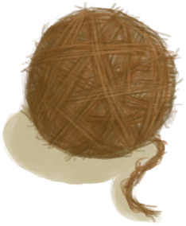

# 线团  
> 可以把它和更多的线团结合起来编成绳子，或者用织布机把它变成布料。  
  
<table class="table table-bordered" data-toggle="table"  data-show-header="false"><thead style="display:none"><tr ><th  style="width:50%;text-align:left;vertical-align:top;"  >title</th><th  style="width:50%;text-align:left;vertical-align:top;"  ></th></tr></thead><tr ><td  style="width:50%;text-align:left;vertical-align:top;"  >**重量：**50  **标签：**	[“细线”](tag_Cord.md)</td><td  style="width:50%;text-align:left;vertical-align:top;"  >

<a href="YarnFiber.md" style="color:black">线团</a>

细线是将从<b>椰子皮和蛇草</b>中提取的<b>纤维</b>编织在一起制成的。  将细线纺在一起会产生<b>线团</b>，这些线团可以再次纺在一起制成<b>绳子</b>或在<b>织布机上织布</b>。  细线本身也能用于<b>制作</b>许多东西，比如工具和建筑。 它也是在<b>木筏</b>上进行<b>维修</b>的必要资源。</td></tr></tbody></table>  
  
## 获取来源  

** 使用**[细线](CordFiber.md)制作线团

[细线](CordFiber.md)

拆开

[绳子](Rope.md)

纺线团

[缠好的纺锤](SpindleFiber.md)

  
  
## 动作  

<table><tr><td rowspan="2" style="width:200px;text-align:center;font-size:1.3em;font-weight:bold">

拆成细线

15分

</td><td>[“手部动作(组)”](HandAction.md)</td></tr><tr><td><b>自身：</b>→消失</td></tr><tr><td colspan="2"><b>需求：</b>[

[光亮](Light.md)](Light.md): <b>10-100</b></td></tr><tr><td colspan="2">[

[细线](CordFiber.md)](CordFiber.md)(<b>+2</b>)</td></tr></table>
  
  
  
## 可拖入  

<table style="margin-bottom:0px;"><tr><td style="width:40%;text-align:left; background-color:#FEFEFE"><b>拖入：</b>[

[线团](YarnFiber.md)](YarnFiber.md)</td><td style="width:40%;font-size:1em;font-weight:bold;background-color:#FEFEFE">制作绳子 (15分) [“手部动作(组)”](HandAction.md)</td></tr><tr><td colspan="2"><b>需求：</b>[

[光亮](Light.md)](Light.md): <b>10-100</b></td></tr><tr style="background-color:#FFFFFF"><td style=""><b>使用物：</b>→消失</td><td style=""><b>自身：</b>→ [

[绳子](Rope.md)](Rope.md)</td></tr><tr><td colspan="2"><b>状态变化：</b>[

[纺织(技能)](Skill_Tailoring.md)](Skill_Tailoring.md)<b>+0.25</b></td></tr></table>
  
  
## 可拖至  

[织布机（空）](LoomEmpty.md)

[纺锤](Spindle.md)

[线团](YarnFiber.md)

  
  

